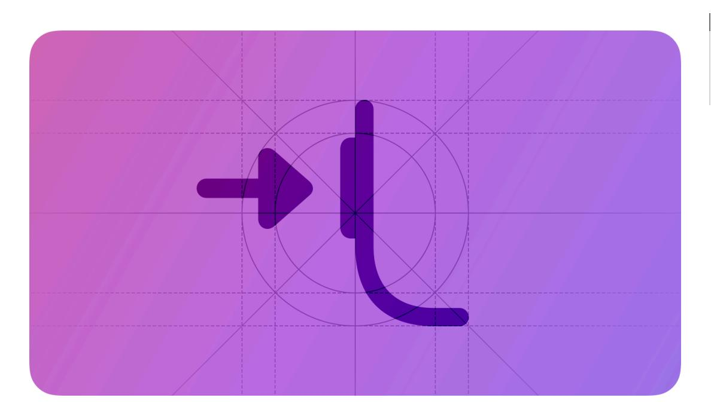
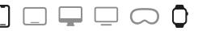

# **Action button**

The Action button gives people quick access to their favorite features on supported iPhone and Apple Watch models.

**Supported platforms**

Action [button](#page-0-1) Best [practices](#page-0-0) Platform [considerations](#page-1-0) [Resources](#page-2-0) [Change](#page-2-1) log

On a supported device, people can use the Action button to run App [Shortcuts](https://developer.apple.com/design/human-interface-guidelines/app-shortcuts) or access system-provided functionality, like turning the flashlight on or off. On Apple Watch Ultra, the Action button supports activity-related actions, including workouts and dives.

A person chooses a function for the Action button when they set up their device; later, they can adjust this choice in Settings. When someone associates an App Shortcut with the Action button, pressing the button runs the App Shortcut similarly to using their voice with Siri or tapping it in Spotlight.

When designing your app or game, think of the Action button as another way for someone to quickly access a function that they use on a regular basis.

## **Best [practices](#page-0-0)**

**Support the Action button with a set of your app's essential functions.** For example, if your cooking app includes an egg timer, a "Start Egg Timer" action might be one that people want to initiate when they press the Action button. You don't need to offer an App Shortcut that opens your app, because the system provides this function already. Your app icon, widgets, and Apple Watch complications give people other quick ways to open your app. For additional guidance, see App [Shortcuts.](https://developer.apple.com/design/human-interface-guidelines/app-shortcuts)

**For each action you support, write a short label that succinctly describes it.** People see your labels when they visit Settings to configure the Action button's behavior. Create labels that use title-style [capitalization](https://support.apple.com/guide/applestyleguide/c-apsgb744e4a3/web#apdca93e113f1d64), begin with a verb, use present tense, and exclude articles and

prepositions. Keep labels as short as possible, with a maximum of three words. For example, use "Start Race" instead of "Started Race" or "Start the Race."

**Prefer letting the system show people how to use the Action button with your app.** When you support the Action button, the system automatically helps people configure it to initiate one of your app's functions. Avoid creating content that repeats the guidance offered in Settings for the Action button, or other usage tips the system provides.

## **Platform [considerations](#page-1-0)**

*Not supported in iPadOS, macOS, tvOS, or visionOS.*

### **[iOS](#page-1-1)**

**Let people use your actions without leaving their current context.** When possible, make use of lightweight multitasking capabilities like Live [Activities](https://developer.apple.com/design/human-interface-guidelines/live-activities) and custom snippets to provide functionality without opening your app. For example, the "Set Timer" action doesn't launch the Clock app; it prompts people to set a duration for the timer, and then launches a Live Activity with the countdown.

### **[watchOS](#page-1-2)**

In watchOS, a person can assign the Action button's first press to drop a waypoint, start a dive, or begin a specific workout. Beyond a single button press, the Action button also supports secondary actions like marking a segment or transitioning to the next modality during a multipart workout.

**Consider offering a secondary function that supports or advances the primary action people choose.** People often use the Action button without looking at the screen, so a subsequent button press needs to flow logically from the first press, while also making sense in the current context. If your app supports workout or dive actions, consider designing a simple, intuitive secondary function that people can easily learn and remember. Consider carefully before you offer more than one secondary function, because doing so can increase people's cognitive load and make your app seem harder to use.

**Prefer using subsequent button presses to support additional functionality rather than to stop or conclude a function.** If you need to let people stop their main task — as opposed to pausing the current function — offer this option within your interface instead.

**Pause the current function when people press the Action button and side button together.** The exception is in a diving app where pausing a dive may be dangerous to the diver, causing them to lose track of their depth or not understand how long they've been underwater. Unless pausing the current function results in a negative experience, be sure to meet people's expectations by letting them pause their current activity when they press both buttons at the same time.

## **[Resources](#page-2-0)**

#### **[Related](#page-2-2)**

[Workouts](https://developer.apple.com/design/human-interface-guidelines/workouts)

Digital [Crown](https://developer.apple.com/design/human-interface-guidelines/digital-crown)

App [Shortcuts](https://developer.apple.com/design/human-interface-guidelines/app-shortcuts)

Live [Activities](https://developer.apple.com/design/human-interface-guidelines/live-activities)

## **[Change](#page-2-1) log**

| Date               | Changes                              |
|--------------------|--------------------------------------|
| September 12, 2023 | Updated to include guidance for iOS. |
| September 14, 2022 | New page.                            |