# **Controls**

In iOS and iPadOS, a control provides quick access to a feature of your app from Control Center, the Lock Screen, or the Action button.

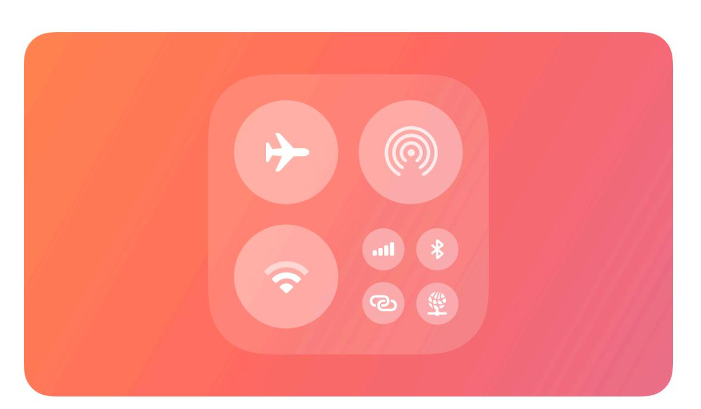

**Supported platforms**

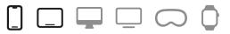

[Controls](#page-0-1)

[Anatomy](#page-0-0)

Best [practices](#page-1-0)

Camera [experiences](#page-3-0) on a locked device

Platform [considerations](#page-3-1)

[Resources](#page-4-0)

[Change](#page-4-1) log

A control is a button or toggle that provides quick access to your app's features from other areas of the system. Control buttons perform an action, link to a specific area of your app, or launch a camera [experience](#page-3-0) on a locked device. Control toggles switch between two states, such as on and off.

People can add controls to Control Center by pressing and holding in an empty area of Control Center, to the Lock Screen by customizing their Lock Screen, and to the Action button by configuring the Action button in the Settings app.

# **[Anatomy](#page-0-0)**

Controls contain a symbol image, a title, and, optionally, a value. The symbol visually represents what the control does and can be a symbol from SF [Symbols](https://developer.apple.com/design/human-interface-guidelines/sf-symbols) or a custom symbol. The title describes what the control relates to, and the value represents the state of the control. For example, the title can display the name of a light in a room, while the value can display whether it's on or off.

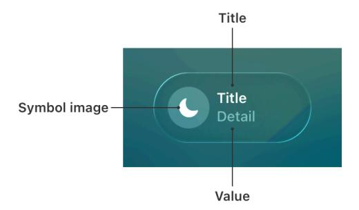

Controls display their information differently depending on where they appear:

- In Control Center, a control displays its symbol and, at larger sizes, its title and value.
- On the Lock Screen, a control displays its symbol.
- On iPhone devices with a control assigned to the Action button, pressing and holding it displays the control's symbol in the Dynamic Island, as well as its value (if present).

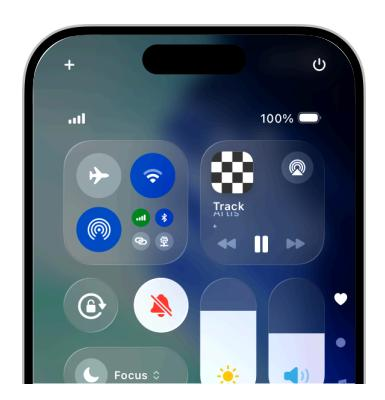

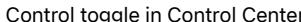

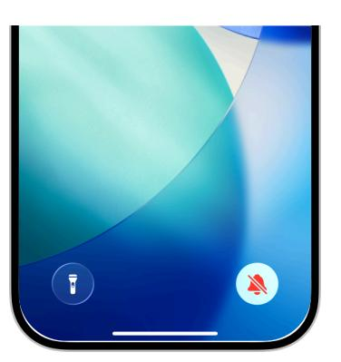

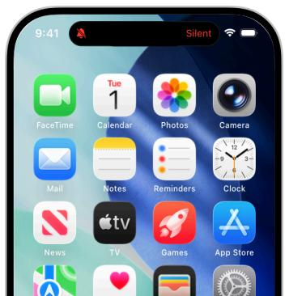

Control toggle in Control Center Control toggle on the Lock Screen Control toggle in the Dynamic Island performed from the Action button

# **Best [practices](#page-1-0)**

**Offer controls for actions that provide the most benefit without having to launch your app.** For example, launching a Live Activity from a control creates an easy and seamless experience that informs someone about progress without having to navigate to your app to stay up to date. For guidance, see Live [Activities.](https://developer.apple.com/design/human-interface-guidelines/live-activities)

**Update controls when someone interacts with them, when an action completes, or remotely with a push notification.** Update the contents of a control to accurately reflect the state and show if an action is still in progress.

**Choose a descriptive symbol that suggests the behavior of the control.** Depending on where a person adds a control, it may not display the title and value, so the symbol needs to convey enough information about the control's action. For control toggles, provide a symbol for both the on and off states. For example, use the SF Symbols *door.garage.open* and *door.garage .closed* to represent a control that opens and closes a garage door. For guidance, see [SF](https://developer.apple.com/design/human-interface-guidelines/sf-symbols) [Symbols](https://developer.apple.com/design/human-interface-guidelines/sf-symbols).

**Use symbol animations to highlight state changes.** For control toggles, animate the transition between both on and off states. For control buttons with actions that have a duration, animate indefinitely while the action performs and stop animating when the action is complete. For developer guidance, see [Symbols](https://developer.apple.com/documentation/Symbols) and *[SymbolEffect](https://developer.apple.com/documentation/Symbols/SymbolEffect)*.

**Select a tint color that works with your app's brand.** The system applies this tint color to a control toggle's symbol in its on state. When a person performs the action of a control from the Action button, the system also uses this tint color to display the value and symbol in the Dynamic Island. For guidance, see [Branding.](https://developer.apple.com/design/human-interface-guidelines/branding)

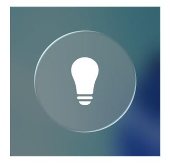

Nontinted control toggle in the off state Tinted control toggle in the on state

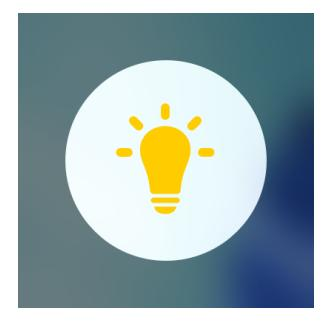

**Help people provide additional information the system needs to perform an action.** A person may need to configure a control to perform a desired action — for example, select a specific light in a house to turn on and off. If a control requires configuration, prompt people to complete this step when they first add it. People can reconfigure the control at any time. For developer guidance, see *[promptsForUserConfiguration\(\)](https://developer.apple.com/documentation/SwiftUI/ControlWidgetConfiguration/promptsForUserConfiguration())*.

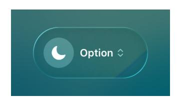

**Provide hint text for the Action button.** When a person presses the Action button, the system displays hint text to help them understand what happens when they press and hold. When someone presses and holds the Action button, the system performs the action configured to it. Use verbs to construct the hint text. For developer guidance, see *[controlWidgetAction](https://developer.apple.com/documentation/SwiftUI/View/controlWidgetActionHint(_:)-5yoyh) [Hint\(\\_:\)](https://developer.apple.com/documentation/SwiftUI/View/controlWidgetActionHint(_:)-5yoyh)*.

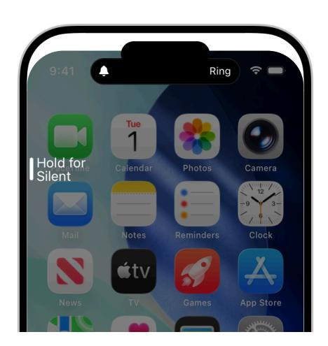

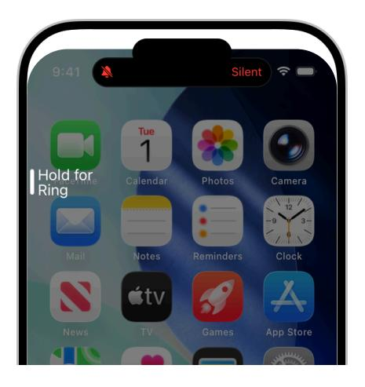

**If your control title or value can vary, include a placeholder.** Placeholder information tells people what your control does when the title and value are situational. The system displays this information when someone brings up the controls gallery in Control Center or the Lock Screen and chooses your control, or before they assign it to the Action button.

**Hide sensitive information when the device is locked.** When the device is locked, consider having the system redact the title and value to hide personal or security-related information. Specify if the system needs to redact the symbol state as well. If specified, the system redacts the title and value, and displays the symbol in its off state.

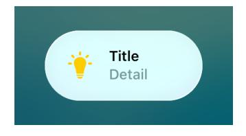

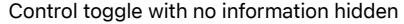

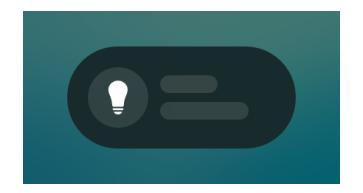

Control toggle with no information hidden Control toggle with information hidden on a locked device

**Require authentication for actions that affect security.** For example, require people to unlock their device to access controls to lock or unlock the door to their house or start their car. For developer guidance, see *[IntentAuthenticationPolicy](https://developer.apple.com/documentation/AppIntents/IntentAuthenticationPolicy)*.

# **Camera [experiences](#page-3-0) on a locked device**

If your app supports camera capture, starting with iOS 18 you can create a control that launches directly to your app's camera experience while the device is locked. For any task beyond capture, a person must authenticate and unlock their device to complete the task in your app. For developer guidance, see [LockedCameraCapture](https://developer.apple.com/documentation/LockedCameraCapture).

**Use the same camera UI in your app and your camera experience.** Sharing UI leverages people's familiarity with the app. By using the same UI, the transition to the app is seamless when someone captures content and taps a button to perform additional tasks, such as posting to a social network or editing a photo.

**Provide instructions for adding the control.** Help people understand how to add the control that launches this camera experience.

# **Platform [considerations](#page-3-1)**

*No additional considerations for iOS or iPadOS. Not supported in macOS, watchOS, tvOS, or visionOS.*

# **[Resources](#page-4-0)**

### **[Related](#page-4-2)**

[Widgets](https://developer.apple.com/design/human-interface-guidelines/widgets)

Action [button](https://developer.apple.com/design/human-interface-guidelines/action-button)

#### **Developer [documentation](#page-4-3)**

[LockedCameraCapture](https://developer.apple.com/documentation/LockedCameraCapture)

[WidgetKit](https://developer.apple.com/documentation/WidgetKit)

# **[Change](#page-4-1) log**

| Date | Changes |
|------|---------|
|      |         |

June 10, 2024 New page.