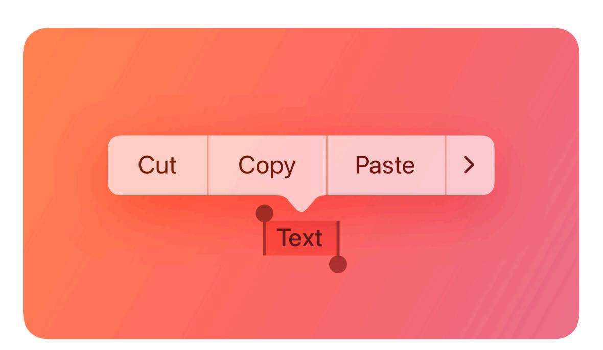

# **Edit menus**

An edit menu lets people make changes to selected content in the current view, in addition to offering related commands like Copy, Select, Translate, and Look Up.

**Supported platforms**

Edit [menus](#page-0-0)

Best [practices](#page-1-0)

[Content](#page-1-1)

Platform [considerations](#page-1-2)

[Resources](#page-3-0)

[Change](#page-3-1) log

In addition to text, an edit menu's commands can apply to many types of selectable content, such as images, files, and objects like contact cards, charts, or map locations. In iOS, iPadOS, and visionOS, the system automatically detects the data type of a selected item, which can result in the addition of a related action to the edit menu. For example, selecting an address can add an item like *Get directions* to the edit menu.

Edit menus can look and behave slightly differently in different platforms.

- In iOS, the edit menu displays commands in a compact, horizontal list that appears when people touch and hold or double-tap to select content in a view. People can tap a chevron on the trailing edge to expand it into a [context](https://developer.apple.com/design/human-interface-guidelines/context-menus) menu.
- In iPadOS, the edit menu looks different depending on how people reveal it. When people use touch interactions to reveal the menu, it uses the compact, horizontal appearance. In contrast, when people use a keyboard or pointing device to reveal it, the edit menu opens directly in a context menu.
- In macOS, people can access editing commands in a context menu they can reveal while in an editing task, as well as through the app's Edit [menu](https://developer.apple.com/design/human-interface-guidelines/the-menu-bar#Edit-menu) in the menu bar.
- In visionOS, people use the standard [pinch](https://developer.apple.com/design/human-interface-guidelines/gestures#Standard-gestures) and hold gesture to open the edit menu as a horizontal bar, or they can open it in a context menu.

Editing content is rare in tvOS and watchOS experiences, so the system doesn't provide an edit menu in these platforms.

## **Best [practices](#page-1-0)**

**Prefer the system-provided edit menu.** People are familiar with the contents and behavior of the system-provided component, so creating a custom menu that presents the same commands is redundant and likely to be confusing. For a list of standard edit menu commands, see *[UIResponderStandardEditActions](https://developer.apple.com/documentation/UIKit/UIResponderStandardEditActions)*.

**Let people reveal an edit menu using the system-defined interactions they already know.** For example, people expect to touch and hold on a touchscreen, pinch and hold in visionOS, or use a secondary click with an attached trackpad or keyboard. Although the interactions to reveal an edit menu can differ based on platform, people don't appreciate having to learn a custom interaction to perform a standard task.

**Offer commands that are relevant in the current context, removing or dimming commands that don't apply.** For example, if nothing is selected, avoid showing options that require a selection, such as Copy or Cut. Similarly, avoid showing a Paste option when there's nothing to paste.

**List custom commands near relevant system-provided ones.** For example, if you offer custom formatting commands, you can help maintain the ordering people expect by listing them after the system-provided commands in the format section. Avoid overwhelming people with too many custom commands.

**When it makes sense, let people select and copy noneditable text.** People appreciate being able to paste static content — such as an image caption or social media status — into a message, note, or web search. In general, let people copy content text, but not control labels.

**Support undo and redo when possible.** Like all menus, an edit menu doesn't require confirmation before performing its actions, so people can easily use undo and redo to recover a previous state. For guidance, see [Undo](https://developer.apple.com/design/human-interface-guidelines/undo-and-redo) and redo.

**In general, avoid implementing other controls that perform the same functions as edit menu items.** People typically expect to choose familiar edit commands in an edit menu, or use standard keyboard shortcuts. Offering redundant controls can crowd your interface, giving you less space for presenting actions that people might not already know about.

**Differentiate different types of deletion commands when necessary.** For example, a Delete menu item behaves the same as pressing a Delete key, but a Cut menu item copies the selected content to the system pasteboard before deleting it.

## **[Content](#page-1-1)**

**Create short labels for custom commands.** Use verbs or short verb phrases that succinctly describe the action your command performs. For guidance, see [Labels](https://developer.apple.com/design/human-interface-guidelines/labels).

# **Platform [considerations](#page-1-2)**

*No additional considerations for visionOS. Not supported in tvOS or watchOS.*

## **iOS, [iPadOS](#page-1-3)**

**Ensure your edit menu works well in both styles.** The system displays the compact, horizontal style when people use Multi-Touch gestures to reveal the edit menu, and the vertical style when people use a keyboard or pointing device to reveal it. For guidance using the vertical menu layout, see Menus > iOS, [iPadOS.](https://developer.apple.com/design/human-interface-guidelines/menus#iOS-iPadOS)

**Adjust an edit menu's placement, if necessary.** Depending on available space, the default menu position is above or below the insertion point or selection. The system also displays a visual indicator that points to the targeted content. Although you can't change the shape of the menu or its pointer, you can change the menu's position. For example, you might need to move the menu to prevent it from covering important content or parts of your interface.

## **[macOS](#page-2-0)**

To learn about the order of items in a macOS app's Edit menu, see Edit [menu.](https://developer.apple.com/design/human-interface-guidelines/the-menu-bar#Edit-menu)

## **[Resources](#page-3-0)**

### **[Related](#page-3-2)**

[Menus](https://developer.apple.com/design/human-interface-guidelines/menus)

[Context](https://developer.apple.com/design/human-interface-guidelines/context-menus) menus

The [menu](https://developer.apple.com/design/human-interface-guidelines/the-menu-bar) bar

[Undo](https://developer.apple.com/design/human-interface-guidelines/undo-and-redo) and redo

#### **Developer [documentation](#page-3-3)**

*[UIEditMenuInteraction](https://developer.apple.com/documentation/UIKit/UIEditMenuInteraction)* — UIKit

*[NSMenu](https://developer.apple.com/documentation/AppKit/NSMenu)* — AppKit

## **[Change](#page-3-1) log**

| Date               | Changes                                                          |
|--------------------|------------------------------------------------------------------|
| June 21, 2023      | Updated to include guidance for visionOS.                        |
| September 14, 2022 | Added guidance on supporting both edit-menu styles in iPadOS. |