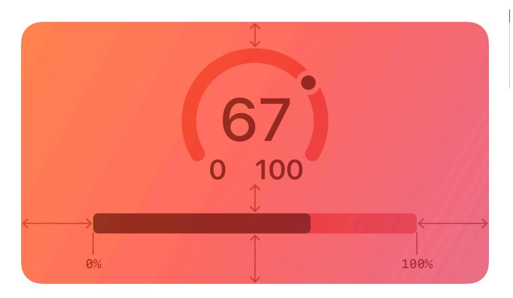
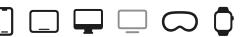
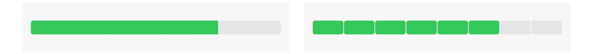
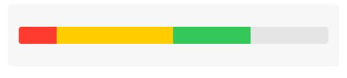

**[Design](https://developer.apple.com/design/)** [Overview](https://developer.apple.com/design/) [What's](https://developer.apple.com/design/whats-new/) New Get [Started](https://developer.apple.com/design/get-started/) [Guidelines](https://developer.apple.com/design/human-interface-guidelines) [Resources](https://developer.apple.com/design/resources/)

# **Gauges**

A gauge displays a specific numerical value within a range of values.

**Supported platforms**

[Gauges](#page-0-2) [Anatomy](#page-0-0) Best [practices](#page-0-1) Platform [considerations](#page-1-1) [Resources](#page-2-0) [Change](#page-2-1) log

In addition to indicating the current value in a range, a gauge can provide more context about the range itself. For example, a temperature gauge can use text to identify the highest and lowest temperatures in the range and display a spectrum of colors that visually reinforce the changing values.

# **[Anatomy](#page-0-0)**

A gauge uses a circular or linear path to represent a range of values, mapping the current value to a specific point on the path. A standard gauge displays an indicator that shows the current value's location; a gauge that uses the capacity style displays a fill that stops at the value's location on the path.

Circular and linear gauges in both standard and capacity styles are also available in a variant that's visually similar to watchOS complications. This variant — called accessory — works well in iOS Lock Screen widgets and anywhere you want to echo the appearance of complications.

#### **Note**

In addition to gauges, macOS also supports level indicators, some of which have visual styles that are similar to gauges. For guidance, see [macOS](#page-1-0).

# **Best [practices](#page-0-1)**

**Write succinct labels that describe the current value and both endpoints of the range.**

Although not every gauge style displays all labels, VoiceOver reads the visible labels to help people understand the gauge without seeing the screen.

**Consider filling the path with a gradient to help communicate the purpose of the gauge.** For example, a temperature gauge might use colors that range from red to blue to represent temperatures that range from hot to cold.

# **Platform [considerations](#page-1-1)**

*No additional considerations for iOS, iPadOS, visionOS, or watchOS. Not supported in tvOS.*

## **[macOS](#page-1-0)**

In addition to supporting gauges, macOS also defines a level indicator that displays a specific numerical value within a range. You can configure a level indicator to convey capacity, rating, or — rarely — relevance.

The capacity style can depict discrete or continuous values.

**Continuous.** A horizontal translucent track that fills with a solid bar to indicate the current value.

**Discrete.** A horizontal row of separate, equally sized, rectangular segments. The number of segments matches the total capacity, and the segments fill completely — never partially with color to indicate the current value.

**Consider using the continuous style for large ranges.** A large value range can make the segments of a discrete capacity indicator too small to be useful.

**Consider changing the fill color to inform people about significant parts of the range.** By default, the fill color for both capacity indicator styles is green. If it makes sense in your app, you can change the fill color when the current value reaches certain levels, such as very low, very high, or just past the middle. You can change the fill color of the entire indicator or you can use the tiered state to show a sequence of several colors in one indicator, as shown below.

Tiered level appearance

For guidance using the rating style to help people rank something, see Rating [indicators.](https://developer.apple.com/design/human-interface-guidelines/rating-indicators)

Although rarely used, the relevance style can communicate relevancy using a shaded horizontal bar. For example, a relevance indicator might appear in a list of search results, helping people visualize the relevancy of the results when sorting or comparing multiple items.

# **[Resources](#page-2-0)**

## **[Related](#page-2-2)**

Ratings and [reviews](https://developer.apple.com/design/human-interface-guidelines/ratings-and-reviews)

## **Developer [documentation](#page-2-3)**

*[Gauge](https://developer.apple.com/documentation/SwiftUI/Gauge)* — SwiftUI

*[NSLevelIndicator](https://developer.apple.com/documentation/AppKit/NSLevelIndicator)* — AppKit

# **[Change](#page-2-1) log**

| Date | Changes |
|------|---------|
|      |         |

September 23, 2022 New page.