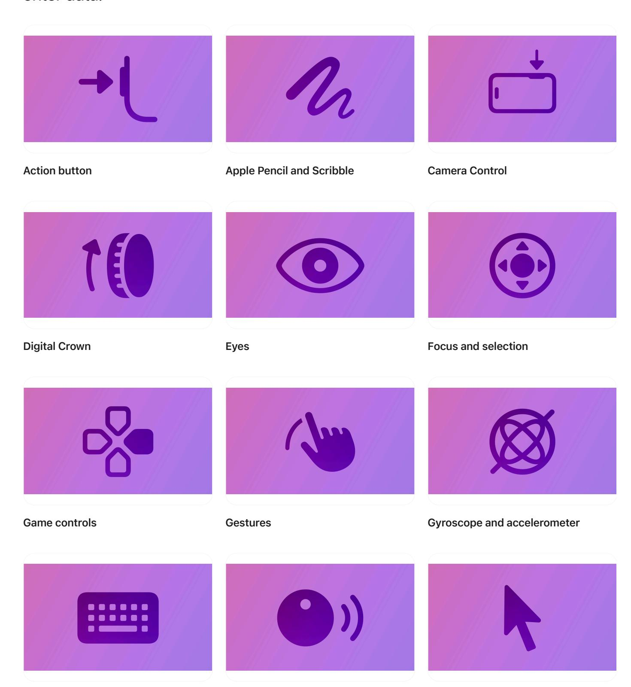
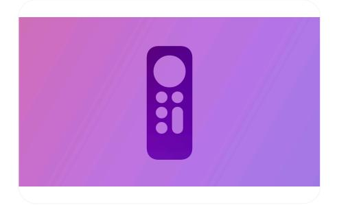

**[Design](https://developer.apple.com/design/)** [Overview](https://developer.apple.com/design/) [What's](https://developer.apple.com/design/whats-new/) New Get [Started](https://developer.apple.com/design/get-started/) [Guidelines](https://developer.apple.com/design/human-interface-guidelines) [Resources](https://developer.apple.com/design/resources/)

## **Inputs**

Learn about the various methods people use to control your app or game and enter data.

**[Keyboards](https://developer.apple.com/design/human-interface-guidelines/keyboards) Nearby [interactions](https://developer.apple.com/design/human-interface-guidelines/nearby-interactions) [Pointing](https://developer.apple.com/design/human-interface-guidelines/pointing-devices) devices**

**[Remotes](https://developer.apple.com/design/human-interface-guidelines/remotes)**