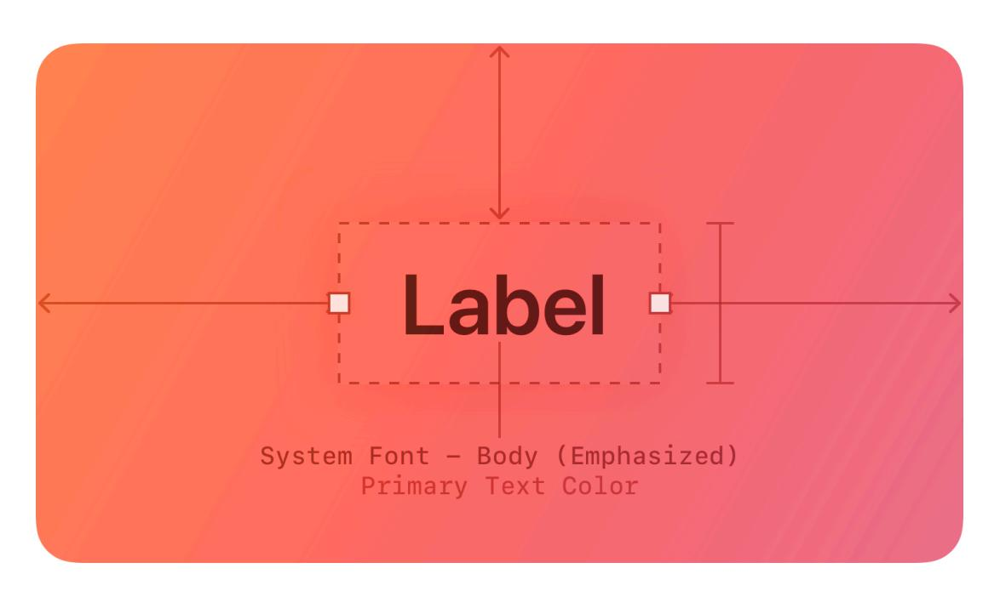
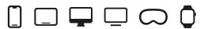
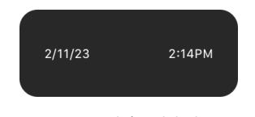

**[Design](https://developer.apple.com/design/)** [Overview](https://developer.apple.com/design/) [What's](https://developer.apple.com/design/whats-new/) New Get [Started](https://developer.apple.com/design/get-started/) [Guidelines](https://developer.apple.com/design/human-interface-guidelines) [Resources](https://developer.apple.com/design/resources/)

# **Labels**

A label is a static piece of text that people can read and often copy, but not edit.

**Supported platforms**

[Labels](#page-0-1) Best [practices](#page-0-0) Platform [considerations](#page-1-0) [Resources](#page-3-0)

[Change](#page-3-1) log

Labels display text throughout the interface, in buttons, menu items, and views, helping people understand the current context and what they can do next.

The term *label* refers to uneditable text that can appear in various places. For example:

- Within a button, a label generally conveys what the button does, such as Edit, Cancel, or Send.
- Within many lists, a label can describe each item, often accompanied by a symbol or an image.
- Within a view, a label might provide additional context by introducing a control or describing a common action or task that people can perform in the view.

**Developer note**

To display uneditable text, SwiftUI defines two components: *[Label](https://developer.apple.com/documentation/SwiftUI/Label)* and *[Text](https://developer.apple.com/documentation/SwiftUI/Text)*.

The guidance below can help you use a label to display text. In some cases, guidance for specific components — such as action [buttons](https://developer.apple.com/design/human-interface-guidelines/buttons), [menus,](https://developer.apple.com/design/human-interface-guidelines/menus) and lists and [tables](https://developer.apple.com/design/human-interface-guidelines/lists-and-tables) — includes additional recommendations for using text.

## **Best [practices](#page-0-0)**

**Use a label to display a small amount of text that people don't need to edit.** If you need to let people edit a small amount of text, use a text [field.](https://developer.apple.com/design/human-interface-guidelines/text-fields) If you need to display a large amount of text, and optionally let people edit it, use a text [view](https://developer.apple.com/design/human-interface-guidelines/text-views).

**Prefer system fonts.** A label can display plain or styled text, and it supports Dynamic Type (where available) by default. If you adjust the style of a label or use custom fonts, make sure the text remains legible.

**Use system-provided label colors to communicate relative importance.** The system defines four label colors that vary in appearance to help you give text different levels of visual importance. For additional guidance, see [Color](https://developer.apple.com/design/human-interface-guidelines/color).

| System color     | Example usage                                             | iOS, iPadOS, tvOS, visionOS | macOS                    |
|------------------|-----------------------------------------------------------|--------------------------------|--------------------------|
| Label            | Primary information                                       | label                          | labelColor               |
| Secondary label  | A subheading or supple‐ mental text                    | secondaryLabel                 | secondaryLabelColor      |
| Tertiary label   | Text that describes an unavailable item or behavior | tertiaryLabel                  | tertiaryLabelColor       |
| Quaternary label | Watermark text                                            | quaternaryLabel                | quaternaryLabel Color |

**Make useful label text selectable.** If a label contains useful information — like an error message, a location, or an IP address — consider letting people select and copy it for pasting elsewhere.

## **Platform [considerations](#page-1-0)**

*No additional considerations for iOS, iPadOS, tvOS, or visionOS.*

#### **[macOS](#page-1-1)**

**Developer note**

To display uneditable text in a label, use the *[isEditable](https://developer.apple.com/documentation/AppKit/NSTextField/isEditable)* property of *[NSTextField](https://developer.apple.com/documentation/AppKit/NSTextField)*.

#### **[watchOS](#page-1-2)**

Date and time text components (shown below on the left) display the current date, the current time, or a combination of both. You can configure a date text component to use a variety of formats, calendars, and time zones. A countdown timer text component (shown below on the right) displays a precise countdown or count-up timer. You can configure a timer text component to display its count value in a variety of formats.

Date and time labels Timer label

When you use the system-provided date and timer text components, watchOS automatically adjusts the label's presentation to fit the available space. The system also updates the content without further input from your app.

Consider using date and timer components in complications. For design guidance, see [Complications](https://developer.apple.com/design/human-interface-guidelines/components/system-experiences/complications); for developer guidance, see *[Text](https://developer.apple.com/documentation/SwiftUI/Text)*.

## **[Resources](#page-3-0)**

#### **[Related](#page-3-2)**

Text [fields](https://developer.apple.com/design/human-interface-guidelines/text-fields)

Text [views](https://developer.apple.com/design/human-interface-guidelines/text-views)

#### **Developer [documentation](#page-3-3)**

*[Label](https://developer.apple.com/documentation/SwiftUI/Label)* — SwiftUI

*[Text](https://developer.apple.com/documentation/SwiftUI/Text)* — SwiftUI

*[UILabel](https://developer.apple.com/documentation/UIKit/UILabel)* — UIKit

*[NSTextField](https://developer.apple.com/documentation/AppKit/NSTextField)* — AppKit

## **[Change](#page-3-1) log**

**Date Changes**

June 5, 2023 Updated guidance to reflect changes in watchOS 10.