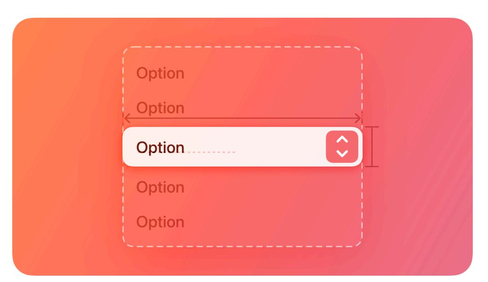
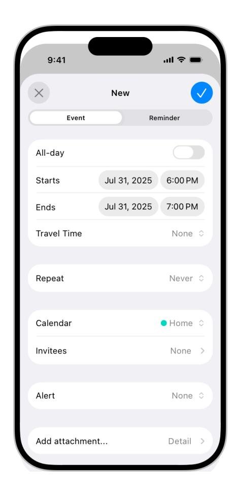
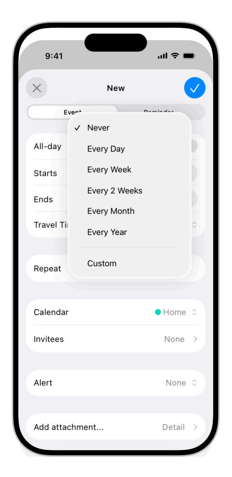

**[Design](https://developer.apple.com/design/)** [Overview](https://developer.apple.com/design/) [What's](https://developer.apple.com/design/whats-new/) New Get [Started](https://developer.apple.com/design/get-started/) [Guidelines](https://developer.apple.com/design/human-interface-guidelines) [Resources](https://developer.apple.com/design/resources/)

# **Pop-up buttons**

update its content to indicate the current selection.

A pop-up button displays a menu of mutually exclusive options.

After people choose an item from a pop-up button's menu, the menu closes, and the button can

#### **Supported platforms**

#### Pop-up [buttons](#page-0-0)

Best [practices](#page-1-0) Platform [considerations](#page-1-1) [Resources](#page-3-0) [Change](#page-3-1) log

### **Best [practices](#page-1-0)**

**Use a pop-up button to present a flat list of mutually exclusive options or states.** A pop-up button helps people make a choice that affects their content or the surrounding view. Use a [pull](https://developer.apple.com/design/human-interface-guidelines/pull-down-buttons)down [button](https://developer.apple.com/design/human-interface-guidelines/pull-down-buttons) instead if you need to:

- Offer a list of actions
- Let people select multiple items
- Include a submenu

**Provide a useful default selection.** A pop-up button can update its content to identify the current selection, but if people haven't made a selection yet, it shows the default item you specify. When possible, make the default selection an item that most people are likely to want.

**Give people a way to predict a pop-up button's options without opening it.** For example, you can use an introductory label or a button label that describes the button's effect, giving context to the options.

**Consider using a pop-up button when space is limited and you don't need to display all options all the time.** Pop-up buttons are a space-efficient way to present a wide array of choices.

**If necessary, include a Custom option in a pop-up button's menu to provide additional items that are useful in some situations.** Offering a Custom option can help you avoid cluttering the interface with items or controls that people need only occasionally. You can also display explanatory text below the list to help people understand how the options work.

## **Platform [considerations](#page-1-1)**

*No additional considerations for iOS, macOS, or visionOS. Not supported in tvOS or watchOS.*

#### **[iPadOS](#page-2-0)**

**Within a popover or modal view, consider using a pop-up button instead of a disclosure indicator to present multiple options for a list item.** For example, people can quickly choose an option from the pop-up button's menu without navigating to a detail view. Consider using a popup button in this scenario when you have a fairly small, well-defined set of options that work well in a menu.

### **[Resources](#page-3-0)**

#### **[Related](#page-3-2)**

[Pull-down](https://developer.apple.com/design/human-interface-guidelines/pull-down-buttons) buttons

[Buttons](https://developer.apple.com/design/human-interface-guidelines/buttons)

[Menus](https://developer.apple.com/design/human-interface-guidelines/menus)

#### **Developer [documentation](#page-3-3)**

*[MenuPickerStyle](https://developer.apple.com/documentation/SwiftUI/MenuPickerStyle)* — SwiftUI *[changesSelectionAsPrimaryAction](https://developer.apple.com/documentation/UIKit/UIButton/changesSelectionAsPrimaryAction)* — UIKit *[NSPopUpButton](https://developer.apple.com/documentation/AppKit/NSPopUpButton)* — AppKit

### **[Change](#page-3-1) log**

| Date               | Changes                                                                             |
|--------------------|-------------------------------------------------------------------------------------|
| October 24, 2023   | Added artwork.                                                                      |
| September 14, 2022 | Added a guideline on using a pop-up button in a popover or modal view in iPadOS. |