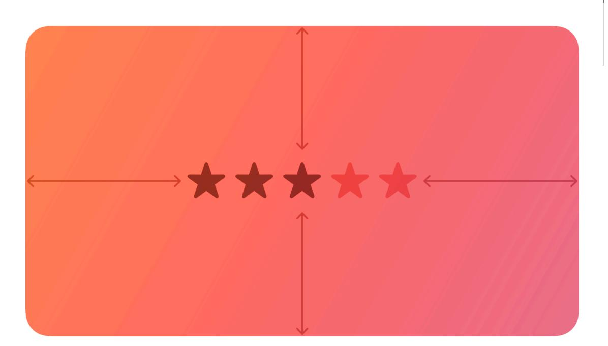

**[Design](https://developer.apple.com/design/)** [Overview](https://developer.apple.com/design/) [What's](https://developer.apple.com/design/whats-new/) New Get [Started](https://developer.apple.com/design/get-started/) [Guidelines](https://developer.apple.com/design/human-interface-guidelines) [Resources](https://developer.apple.com/design/resources/)

# **Rating indicators**

A rating indicator uses a series of horizontally arranged graphical symbols — by default, stars — to communicate a ranking level.

**Supported platforms**

Rating [indicators](#page-0-2) Best [practices](#page-0-0) Platform [considerations](#page-0-1) [Resources](#page-1-0) [Change](#page-1-1) log

A rating indicator doesn't display partial symbols; it rounds the value to display complete symbols only. Within a rating indicator, symbols are always the same distance apart and don't expand or shrink to fit the component's width.

## **Best [practices](#page-0-0)**

**Make it easy to change rankings.** When presenting a list of ranked items, let people adjust the rank of individual items inline without navigating to a separate editing screen.

**If you replace the star with a custom symbol, make sure that its purpose is clear.** The star is a very recognizable ranking symbol, and people may not associate other symbols with a rating scale.

## **Platform [considerations](#page-0-1)**

*No additional considerations for macOS. Not supported in iOS, iPadOS, tvOS, visionOS, or watchOS.*

### **[Resources](#page-1-0)**

#### **[Related](#page-1-2)**

Ratings and [reviews](https://developer.apple.com/design/human-interface-guidelines/ratings-and-reviews)

#### **Developer [documentation](#page-1-3)**

*[NSLevelIndicator.Style.rating](https://developer.apple.com/documentation/AppKit/NSLevelIndicator/Style/rating)* — AppKit

## **[Change](#page-1-1) log**

| Date | Changes |
|------|---------|
|      |         |

September 23, 2022 New page.