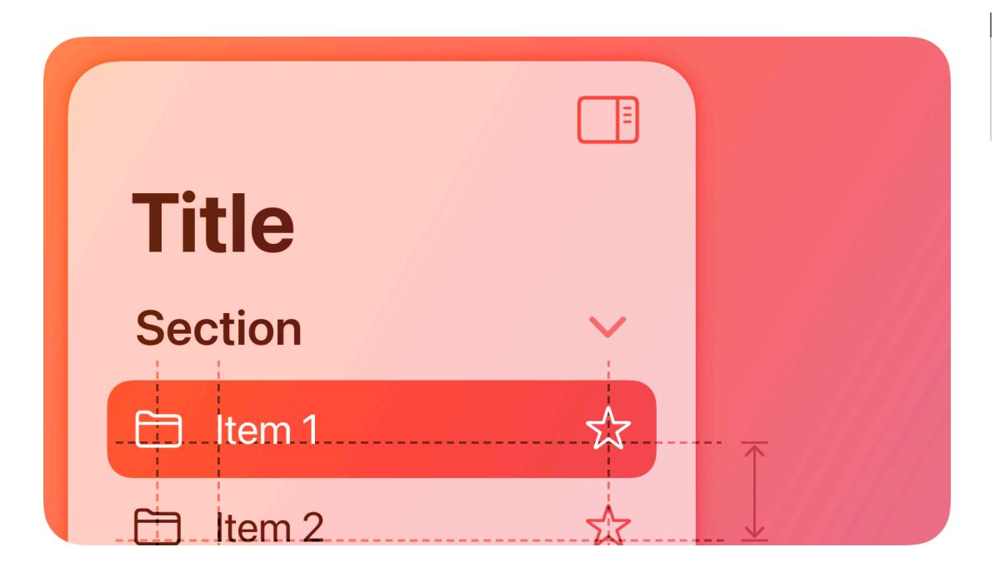
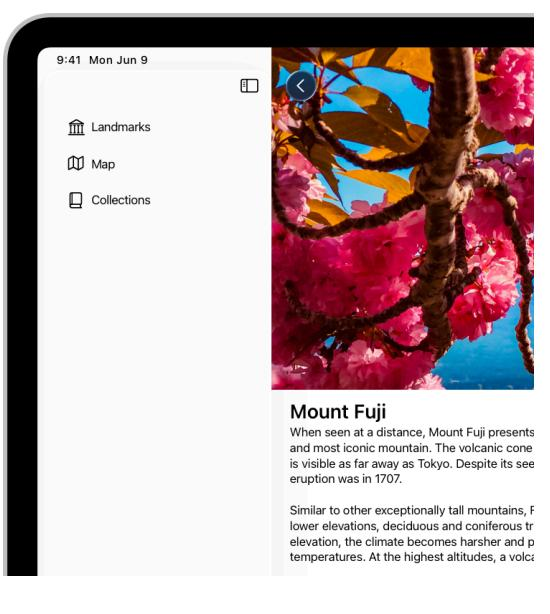
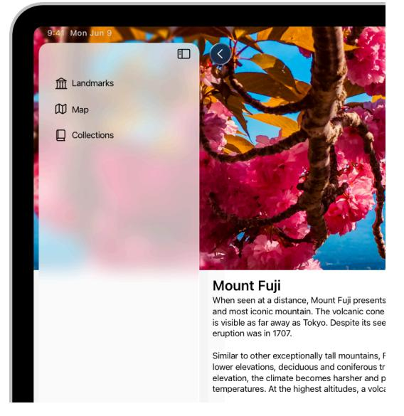
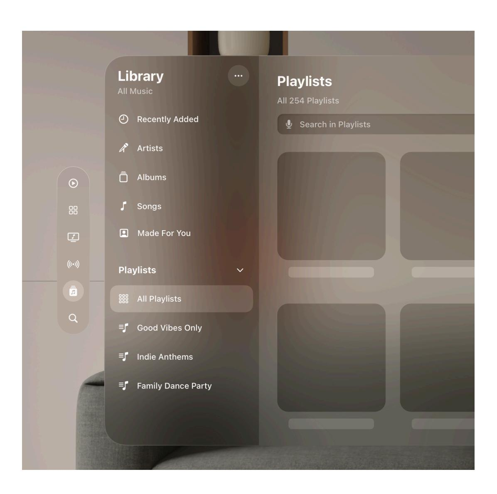

**[Design](https://developer.apple.com/design/)** [Overview](https://developer.apple.com/design/) [What's](https://developer.apple.com/design/whats-new/) New Get [Started](https://developer.apple.com/design/get-started/) [Guidelines](https://developer.apple.com/design/human-interface-guidelines) [Resources](https://developer.apple.com/design/resources/)

# **Sidebars**

A sidebar appears on the leading side of a view and lets people navigate between sections in your app or game.

**Supported platforms**

[Sidebars](#page-0-1) Best [practices](#page-0-0) Platform [considerations](#page-1-0) [Resources](#page-4-0)

[Change](#page-4-1) log

A sidebar floats above content without being anchored to the edges of the view. It provides a broad, flat view of an app's information hierarchy, giving people access to several peer content areas or modes at the same time.

A sidebar requires a large amount of vertical and horizontal space. When space is limited or you want to devote more of the screen to other information or functionality, a more compact control such as a [tab](https://developer.apple.com/design/human-interface-guidelines/tab-bars) bar may provide a better navigation experience. For guidance, see [Layout](https://developer.apple.com/design/human-interface-guidelines/layout).

# **Best [practices](#page-0-0)**

**Extend content beneath the sidebar.** In iOS, iPadOS, and macOS, as with other controls such as toolbars and tab bars, sidebars float above content in the [Liquid](https://developer.apple.com/design/human-interface-guidelines/materials#Liquid-Glass) Glass layer. To reinforce the separation and floating appearance of the sidebar, extend content beneath it either by letting it horizontally scroll or applying a background extension view, which mirrors adjacent content to give the impression of stretching it under the sidebar. For developer guidance, see *[background](https://developer.apple.com/documentation/SwiftUI/View/backgroundExtensionEffect()) [ExtensionEffect\(\)](https://developer.apple.com/documentation/SwiftUI/View/backgroundExtensionEffect())*.

**When possible, let people customize the contents of a sidebar.** A sidebar lets people navigate to important areas in your app, so it works well when people can decide which areas are most important and in what order they appear.

**Group hierarchy with disclosure controls if your app has a lot of content.** Using [disclosure](https://developer.apple.com/design/human-interface-guidelines/disclosure-controls) [controls](https://developer.apple.com/design/human-interface-guidelines/disclosure-controls) helps keep the sidebar's vertical space to a manageable level.

**Consider using familiar symbols to represent items in the sidebar.** SF [Symbols](https://developer.apple.com/design/human-interface-guidelines/sf-symbols) provides a wide range of customizable symbols you can use to represent items in your app. If you need to use a custom icon, consider creating a [custom](https://developer.apple.com/design/human-interface-guidelines/sf-symbols#Custom-symbols) symbol rather than using a bitmap image. Download the SF Symbols app from Apple Design [Resources](https://developer.apple.com/design/resources/#sf-symbols).

**Consider letting people hide the sidebar.** People sometimes want to hide the sidebar to create more room for content details or to reduce distraction. When possible, let people hide and show the sidebar using the platform-specific interactions they already know. For example, in iPadOS, people expect to use the built-in edge swipe gesture; in macOS, you can include a show/hide button or add Show Sidebar and Hide Sidebar commands to your app's View menu. In visionOS, a window typically expands to accommodate a sidebar, so people rarely need to hide it. Avoid hiding the sidebar by default to ensure that it remains discoverable.

**In general, show no more than two levels of hierarchy in a sidebar.** When a data hierarchy is deeper than two levels, consider using a split view interface that includes a content list between the sidebar items and detail view.

**If you need to include two levels of hierarchy in a sidebar, use succinct, descriptive labels to title each group.** To help keep labels short, omit unnecessary words.

# **Platform [considerations](#page-1-0)**

*No additional considerations for tvOS. Not supported in watchOS.*

#### **[iOS](#page-1-1)**

**Avoid using a sidebar.** A sidebar takes up a lot of space in landscape orientation and isn't available in portrait orientation. Instead, consider using a [tab](https://developer.apple.com/design/human-interface-guidelines/tab-bars) bar, which takes less space and remains visible in both orientations.

### **[iPadOS](#page-2-0)**

When you use the *[sidebarAdaptable](https://developer.apple.com/documentation/SwiftUI/TabViewStyle/sidebarAdaptable)* style of tab view to present a sidebar, you choose whether to display a sidebar or a tab bar when your app opens. Both variations include a button that people can use to switch between them. This style also responds automatically to rotation and window resizing, providing a version of the control that's appropriate to the width of the view.

#### **Developer note**

To display a sidebar only, use *[NavigationSplitView](https://developer.apple.com/documentation/SwiftUI/NavigationSplitView)* to present a sidebar in the primary pane of a split view, or use *[UISplitViewController](https://developer.apple.com/documentation/UIKit/UISplitViewController)*.

**Consider using a tab bar first.** A tab bar provides more space to feature content, and offers enough flexibility to navigate between many apps' main areas. If you need to expose more areas than fit in a tab bar, the tab bar's convertible sidebar-style appearance can provide access to content that people use less frequently. For guidance, see Tab [bars.](https://developer.apple.com/design/human-interface-guidelines/tab-bars)

**If necessary, apply the correct appearance to a sidebar.** If you're not using SwiftUI to create a sidebar, you can use the *[UICollectionLayoutListConfiguration.Appearance](https://developer.apple.com/documentation/UIKit/UICollectionLayoutListConfiguration-swift.struct/Appearance-swift.enum/sidebar) [.sidebar](https://developer.apple.com/documentation/UIKit/UICollectionLayoutListConfiguration-swift.struct/Appearance-swift.enum/sidebar)* appearance of a collection view list layout. For developer guidance, see *[UICollectionLayoutListConfiguration.Appearance](https://developer.apple.com/documentation/UIKit/UICollectionLayoutListConfiguration-swift.struct/Appearance-swift.enum)*.

#### **[macOS](#page-2-1)**

A sidebar's row height, text, and glyph size depend on its overall size, which can be small, medium, or large. You can set the size programmatically, but people can also change it by selecting a different sidebar icon size in General settings.

**Avoid stylizing your app by specifying a fixed color for all sidebar icons.** By default, sidebar icons use the current [accent](https://developer.apple.com/design/human-interface-guidelines/color#App-accent-colors) color and people expect to see their chosen accent color throughout all the apps they use. Although a fixed color can help clarify the meaning of an icon, you want to make sure that most sidebar icons display the color people choose.

**Consider automatically hiding and revealing a sidebar when its container window resizes.** For example, reducing the size of a Mail viewer window can automatically collapse its sidebar, making more room for message content.

**Avoid putting critical information or actions at the bottom of a sidebar.** People often relocate a window in a way that hides its bottom edge.

#### **[visionOS](#page-2-2)**

**If your app's hierarchy is deep, consider using a sidebar within a tab in a tab bar.** In this situation, a sidebar can support secondary navigation within the tab. If you do this, be sure to prevent selections in the sidebar from changing which tab is currently open.

## **[Resources](#page-4-0)**

#### **[Related](#page-4-2)**

Split [views](https://developer.apple.com/design/human-interface-guidelines/split-views)

Tab [bars](https://developer.apple.com/design/human-interface-guidelines/tab-bars)

[Layout](https://developer.apple.com/design/human-interface-guidelines/layout)

#### **Developer [documentation](#page-4-3)**

*[sidebarAdaptable](https://developer.apple.com/documentation/SwiftUI/TabViewStyle/sidebarAdaptable)* — SwiftUI

*[NavigationSplitView](https://developer.apple.com/documentation/SwiftUI/NavigationSplitView)* — SwiftUI

*[sidebar](https://developer.apple.com/documentation/SwiftUI/ListStyle/sidebar)* — SwiftUI

*[UICollectionLayoutListConfiguration](https://developer.apple.com/documentation/UIKit/UICollectionLayoutListConfiguration-swift.struct)* — UIKit

*[NSSplitViewController](https://developer.apple.com/documentation/AppKit/NSSplitViewController)* — AppKit

#### **[Videos](#page-4-4)**

**[Elevate](https://developer.apple.com/videos/play/wwdc2025/208) the design of your iPad app**

# **[Change](#page-4-1) log**

| Date             | Changes                                                             |
|------------------|---------------------------------------------------------------------|
| June 9, 2025     | Added guidance for extending content beneath the sidebar.        |
| August 6, 2024   | Updated guidance to include the SwiftUI adaptable sidebar style. |
| December 5, 2023 | Added artwork for iPadOS.                                           |
| June 21, 2023    | Updated to include guidance for visionOS.                           |