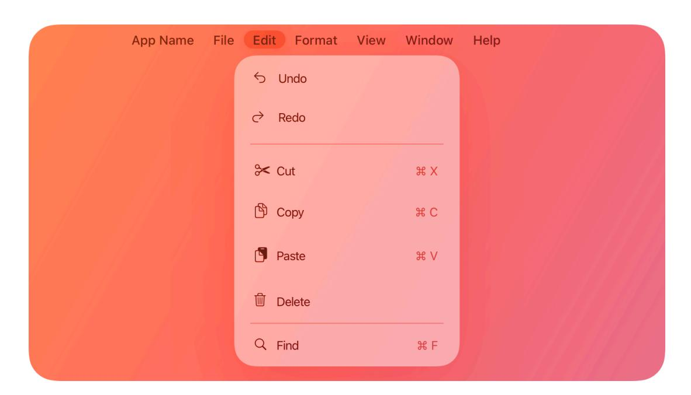
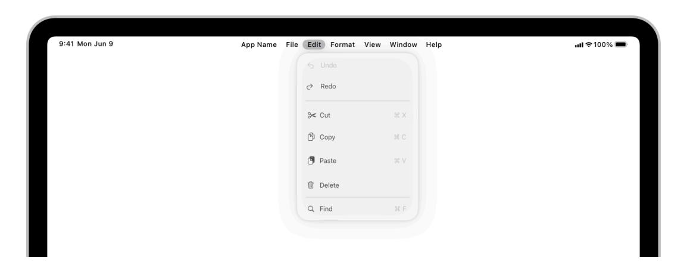

# **The menu bar**

On a Mac or an iPad, the menu bar at the top of the screen displays the top-level menus in your app or game.

**Supported platforms**

The [menu](#page-0-0) bar [Anatomy](#page-1-0) Best [practices](#page-1-1) App [menu](#page-1-2) File [menu](#page-2-0) Edit [menu](#page-4-0) [Format](#page-5-0) menu View [menu](#page-6-0) [App-specific](#page-6-1) menus [Window](#page-7-0) menu Help [menu](#page-8-0) [Dynamic](#page-8-1) menu items Platform [considerations](#page-9-0) [Resources](#page-12-0) [Change](#page-12-1) log

Mac users are very familiar with the macOS menu bar, and they rely on it to help them learn what an app does and find the commands they need. To help your app or game feel at home in macOS, it's essential to provide a consistent menu bar experience.

Menu bar menus on iPad are similar to those on Mac, appearing in the same order and with familiar sets of menu items. When you adopt the menu structure that people expect from their experience on Mac, it helps them immediately understand and take advantage of the menu bar on iPad as well.

Keyboard shortcuts in iPadOS use the same patterns as in macOS. For guidance, see [Standard](https://developer.apple.com/design/human-interface-guidelines/keyboards#Standard-keyboard-shortcuts) keyboard [shortcuts](https://developer.apple.com/design/human-interface-guidelines/keyboards#Standard-keyboard-shortcuts).

Menus in the menu bar share most of the appearance and behavior characteristics that all menu types have. To learn about menus in general — and how to organize and label menu items — see

### **[Anatomy](#page-1-0)**

When present in the menu bar, the following menus appear in the order listed below.

- *YourAppName* (you supply a short version of your app's name for this menu's title)
- File
- Edit
- Format
- View
- App-specific menus, if any
- Window
- Help

In addition, the macOS menu bar includes the Apple menu on the leading side and menu bar extras on the trailing side. See macOS Platform [considerations](#page-10-0) for guidance.

### **Best [practices](#page-1-1)**

**Support the default system-defined menus and their ordering.** People expect to find menus and menu items in an order they're familiar with. In many cases, the system implements the functionality of standard menu items so you don't have to. For example, when people select text in a standard text field, the system makes the Edit > Copy menu item available.

**Always show the same set of menu items.** Keeping menu items visible helps people learn what actions your app supports, even if they're unavailable in the current context. If a menu bar item isn't actionable, disable the action instead of hiding it from the menu.

**Represent menu item actions with familiar icons.** Icons help people recognize common actions throughout your app. Use the same icons as the system to represent actions such as Copy, Share, and Delete, wherever they appear. For a list of icons that represent common actions, see [Standard](https://developer.apple.com/design/human-interface-guidelines/icons#Standard-icons) icons. For additional guidance, see [Menus.](https://developer.apple.com/design/human-interface-guidelines/menus)

**Support the keyboard shortcuts defined for the standard menu items you include.** People expect to use the keyboard shortcuts they already know for standard menu items, like Copy, Cut, Paste, Save, and Print. Define custom keyboard shortcuts only when necessary. For guidance, see Standard keyboard [shortcuts.](https://developer.apple.com/design/human-interface-guidelines/keyboards#Standard-keyboard-shortcuts)

**Prefer short, one-word menu titles.** Various factors — like different display sizes and the presence of menu bar extras — can affect the spacing and appearance of your menus. Oneword menu titles work especially well in the menu bar because they take little space and are easy for people to scan. If you need to use more than one word in the menu title, use title-style capitalization.

### **App [menu](#page-1-2)**

The app menu lists items that apply to your app or game as a whole, rather than to a specific task, document, or window. To help people quickly identify the active app, the menu bar displays your app name in bold.

The app menu typically contains the following menu items listed in the following order.

| Menu item                     | Action                                                                                                 | Guidance                                                                                                        |
|-------------------------------|--------------------------------------------------------------------------------------------------------|-----------------------------------------------------------------------------------------------------------------|
| About YourAppName             | Displays the About window for your app, which includes copyright and version information.        | Prefer a short name of 16 charac‐ ters or fewer. Don't include a ver‐ sion number.                        |
| Settings…                     | Opens your settings window, or your app's page in iPadOS Settings.                               | Use only for app-level settings. If you also offer document-specific settings, put them in the File menu. |
| Optional app-specific items   | Performs custom app-level setting or configuration actions.                                         | List custom app-configuration items after the Settings item and within the same group.                    |
| Services (macOS only)         | Displays a submenu of services from the system and other apps that apply to the current context. |                                                                                                                 |
| Hide YourAppName (macOS only) | Hides your app and all of its win‐ dows, and then activates the most recently used app.          | Use the same short app name you supply for the About item.                                                   |
| Hide Others (macOS only)      | Hides all other open apps and their windows.                                                        |                                                                                                                 |
| Show All (macOS only)         | Shows all other open apps and their windows behind your app's windows.                           |                                                                                                                 |
| Quit YourAppName              | Quits your app. Pressing Option changes Quit YourAppName to Quit and Keep Windows.               | Use the same short app name you supply for the About item.                                                   |

**Display the About menu item first.** Include a separator after the About menu item so that it appears by itself in a group.

# **File [menu](#page-2-0)**

The File menu contains commands that help people manage the files or documents an app supports. If your app doesn't handle any types of files, you can rename or eliminate this menu.

The File menu typically contains the following menu items listed in the following order.

| Menu item   | Action                                                                                                                                           | Guidance                                                                                                                                                                                                            |
|-------------|--------------------------------------------------------------------------------------------------------------------------------------------------|---------------------------------------------------------------------------------------------------------------------------------------------------------------------------------------------------------------------|
| New Item    | Creates a new document, file, or window.                                                                                                      | For Item, use a term that names the type of item your app creates. For example, Calendar uses Event and Calendar.                                                                                          |
| Open        | Can open the selected item or present an interface in which peo‐ ple select an item to open.                                               | If people need to select an item in a separate interface, an ellipsis fol‐ lows the command to indicate that more input is required.                                                                       |
| Open Recent | Displays a submenu that lists re‐ cently opened documents and files that people can select, and typical‐ ly includes a Clear Menu item. | List document and filenames that people recognize in the submenu; don't display file paths. List the documents in the order people last opened them, with the most re‐ cently opened document first. |

| Menu item   | Action                                                                                                                                                                                                                               | Guidance                                                                                                                                                                                                                                                                                                                         |
|-------------|--------------------------------------------------------------------------------------------------------------------------------------------------------------------------------------------------------------------------------------|----------------------------------------------------------------------------------------------------------------------------------------------------------------------------------------------------------------------------------------------------------------------------------------------------------------------------------|
| Close       | Closes the current window or doc‐ ument. Pressing Option changes Close to Close All. For a tab-based window, Close Tab replaces Close.                                                                                      | In a tab-based window, consider adding a Close Window item to let people close the entire window with one click or tap.                                                                                                                                                                                                 |
| Close Tab   | Closes the current tab in a tab based window. Pressing Option changes Close Tab to Close Other Tabs.                                                                                                                        |                                                                                                                                                                                                                                                                                                                                  |
| Close File  | Closes the current file and all its associated windows.                                                                                                                                                                           | Consider supporting this menu item if your app can open multiple views of the same file.                                                                                                                                                                                                                                   |
| Save        | Saves the current document or file.                                                                                                                                                                                                  | Automatically save changes peri‐ odically as people work so they don't need to keep choosing File > Save. For a new document, prompt people for a name and location. If you need to let people save a file in multiple formats, prefer a pop-up menu that lets people choose a format in the Save sheet. |
| Save All    | Saves all open documents.                                                                                                                                                                                                            |                                                                                                                                                                                                                                                                                                                                  |
| Duplicate   | Duplicates the current document, leaving both documents open. Pressing Option changes Duplicate to Save As.                                                                                                                 | Prefer Duplicate to menu items like Save As, Export, Copy To, and Save To because these items don't clari‐ fy the relationship between the original file and the new one.                                                                                                                                            |
| Rename…     | Lets people change the name of the current document.                                                                                                                                                                              |                                                                                                                                                                                                                                                                                                                                  |
| Move To…    | Prompts people to choose a new location for the document.                                                                                                                                                                         |                                                                                                                                                                                                                                                                                                                                  |
| Export As…  | Prompts people for a name, output location, and export file format. After exporting the file, the current document remains open; the ex‐ ported file doesn't open.                                                       | Reserve the Export As item for when you need to let people export content in a format your app doesn't typically handle.                                                                                                                                                                                                |
| Revert To   | When people turn on autosaving, displays a submenu that lists re‐ cent document versions and an option to display the version browser. After people choose a version to restore, it replaces the current document. |                                                                                                                                                                                                                                                                                                                                  |
| Page Setup… | Opens a panel for specifying print‐ ing parameters like paper size and printing orientation. A document can save the printing parameters that people specify.                                                            | Include the Page Setup item if you need to support printing parame‐ ters that apply to a specific docu‐ ment. Parameters that are global in nature, like a printer's name, or that people change frequently, like the number of copies to print, be‐ long in the Print panel.                               |
| Print…      | Opens the standard Print panel, which lets people print to a printer, send a fax, or save as a PDF.                                                                                                                            |                                                                                                                                                                                                                                                                                                                                  |

## **Edit [menu](#page-4-0)**

The Edit menu lets people make changes to content in the current document or text container, and provides commands for interacting with the Clipboard. Because many editing commands apply to any editable content, the Edit menu is useful even in apps that aren't document-based.

**Determine whether Find menu items belong in the Edit menu.** For example, if your app lets people search for files or other types of objects, Find menu items might be more appropriate in the File menu.

The Edit menu typically contains the following top-level menu items, listed in the following order.

| Menu item             | Action                                                                                                                                                                                                             | Guidance                                                                                                                                                                                                                                                                  |
|-----------------------|--------------------------------------------------------------------------------------------------------------------------------------------------------------------------------------------------------------------|---------------------------------------------------------------------------------------------------------------------------------------------------------------------------------------------------------------------------------------------------------------------------|
| Undo                  | Reverses the effect of the previous user operation.                                                                                                                                                             | Clarify the target of the undo. For example, if people just selected a menu item, you can append the item's title, such as Undo Paste and Match Style. For a text entry operation, you might append the word Typing to give Undo Typing.                |
| Redo                  | Reverses the effect of the previous Undo operation.                                                                                                                                                             | Clarify the target of the redo. For example, if people just reversed a menu item selection, you can ap‐ pend the item's title, such as Redo Paste and Match Style. For a text entry operation, you might append the word Typing to give Redo Typing. |
| Cut                   | Removes the selected data and stores it on the Clipboard, replac‐ ing the previous contents of the Clipboard.                                                                                             |                                                                                                                                                                                                                                                                           |
| Copy                  | Duplicates the selected data and stores it on the Clipboard.                                                                                                                                                    |                                                                                                                                                                                                                                                                           |
| Paste                 | Inserts the contents of the Clipboard at the current insertion point. The Clipboard contents re‐ main unchanged, permitting peo‐ ple to choose Paste multiple times.                                   |                                                                                                                                                                                                                                                                           |
| Paste and Match Style | Inserts the contents of the Clipboard at the current insertion point, matching the style of the in‐ serted text to the surrounding text.                                                                  |                                                                                                                                                                                                                                                                           |
| Delete                | Removes the selected data, but doesn't place it on the Clipboard.                                                                                                                                               | Provide a Delete menu item instead of an Erase or Clear menu item. Choosing Delete is the equivalent of pressing the Delete key, so it's important for the naming to be consistent.                                                                        |
| Select All            | Highlights all selectable content in the current document or text container.                                                                                                                                 |                                                                                                                                                                                                                                                                           |
| Find                  | Displays a submenu containing menu items for performing search operations in the current document or text container. Standard sub‐ menus include: Find, Find and Replace, Find Next, Find Previous, |                                                                                                                                                                                                                                                                           |

| Menu item            | Action                                                                                                                                                                                                                                                                                                                                        | Guidance |
|----------------------|-----------------------------------------------------------------------------------------------------------------------------------------------------------------------------------------------------------------------------------------------------------------------------------------------------------------------------------------------|----------|
|                      | Use Selection for Find, and Jump to Selection.                                                                                                                                                                                                                                                                                             |          |
| Spelling and Grammar | Displays a submenu containing menu items for checking for and correcting spelling and grammar in the current document or text con‐ tainer. Standard submenus include: Show Spelling and Grammar, Check Document Now, Check Spelling While Typing, Check Grammar With Spelling, and Correct Spelling Automatically. |          |
| Substitutions        | Displays a submenu containing items that let people toggle auto‐ matic substitutions while they type in a document or text container. Standard submenus include: Show Substitutions, Smart Copy/Paste, Smart Quotes, Smart Dashes, Smart Links, Data Detectors, and Text Replacement.                                 |          |
| Transformations      | Displays a submenu containing items that transform selected text. Standard submenus include: Make Uppercase, Make Lowercase, and Capitalize.                                                                                                                                                                                      |          |
| Speech               | Displays a submenu containing Start Speaking and Stop Speaking items, which control when the sys‐ tem audibly reads selected text.                                                                                                                                                                                                   |          |
| Start Dictation      | Opens the dictation window and converts spoken words into text that's added at the current inser‐ tion point. The system automatical‐ ly adds the Start Dictation menu item at the bottom of the Edit menu.                                                                                                                 |          |
| Emoji & Symbols      | Displays a Character Viewer, which includes emoji, symbols, and other characters people can insert at the current insertion point. The system automatically adds the Emoji & Symbols menu item at the bottom of the Edit menu.                                                                                              |          |

### **[Format](#page-5-0) menu**

The Format menu lets people adjust text formatting attributes in the current document or text container. You can exclude this menu if your app doesn't support formatted text editing.

The Format menu typically contains the following top-level menu items, listed in the following order.

| Menu item | Action                                                 |
|-----------|--------------------------------------------------------|
| Font      | Displays a submenu containing items for adjusting font |
|           | attributes of the selected text. Standard submenus in‐ |

| Menu item | Action                                                                                                                                                                                                                                       |  |
|-----------|----------------------------------------------------------------------------------------------------------------------------------------------------------------------------------------------------------------------------------------------|--|
|           | clude: Show Fonts, Bold, Italic, Underline, Bigger,                                                                                                                                                                                          |  |
|           | Smaller, Show Colors, Copy Style, and Paste Style.                                                                                                                                                                                           |  |
| Text      | Displays a submenu containing items for adjusting text attributes of the selected text. Standard submenus in‐ clude: Align Left, Align Center, Justify, Align Right, Writing Direction, Show Ruler, Copy Ruler, and Paste Ruler. |  |

### **View [menu](#page-6-0)**

The View menu lets people customize the appearance of all an app's windows, regardless of type.

#### **Important**

The View menu doesn't include items for navigating between or managing specific windows; the [Window](#page-7-0) menu provides these commands.

**Provide a View menu even if your app supports only a subset of the standard view functions.** For example, if your app doesn't include a tab bar, toolbar, or sidebar, but does support fullscreen mode, provide a View menu that includes only the Enter/Exit Full Screen menu item.

**Ensure that each show/hide item title reflects the current state of the corresponding view.** For example, when the toolbar is hidden, provide a Show Toolbar menu item; when the toolbar is visible, provide a Hide Toolbar menu item.

The View menu typically contains the following top-level menu items, listed in the following order.

| Menu item                       | Action                                                                                                                      |  |
|---------------------------------|-----------------------------------------------------------------------------------------------------------------------------|--|
| Show/Hide Tab Bar               | Toggles the visibility of the tab bar above the body area in a tab-based window                                          |  |
| Show All Tabs/Exit Tab Overview | Enters and exits a view (similar to Mission Control) that provides an overview of all open tabs in a tab-based window |  |
| Show/Hide Toolbar               | In a window that includes a toolbar, toggles the tool‐ bar's visibility                                                  |  |
| Customize Toolbar               | In a window that includes a toolbar, opens a view that lets people customize toolbar items                               |  |
| Show/Hide Sidebar               | In a window that includes a sidebar, toggles the side‐ bar's visibility                                                  |  |
| Enter/Exit Full Screen          | In an app that supports a full-screen experience, opens the window at full-screen size in a new space                    |  |

# **[App-specific](#page-6-1) menus**

Your app's custom menus appear in the menu bar between the View menu and the Window menu. For example, Safari's menu bar includes app-specific History and Bookmarks menus.

**Provide app-specific menus for custom commands.** People look in the menu bar when searching for app-specific commands, especially when using an app for the first time. Even when commands are available elsewhere in your app, it's important to list them in the menu bar. Putting commands in the menu bar makes them easier for people to find, lets you assign keyboard shortcuts to them, and makes them more accessible to people using Full Keyboard Access. Excluding commands from the menu bar — even infrequently used or advanced commands — risks making them difficult for everyone to find.

**As much as possible, reflect your app's hierarchy in app-specific menus.** For example, Mail lists the Mailbox, Message, and Format menus in an order that mirrors the relationships of these items: mailboxes contain messages, and messages contain formatting.

**Aim to list app-specific menus in order from most to least general or commonly used.** People tend to expect menus in the leading end of a list to be more specialized than menus in the trailing end.

# **[Window](#page-7-0) menu**

The Window menu lets people navigate, organize, and manage an app's windows.

#### **Important**

The Window menu doesn't help people customize the appearance of windows or close them. To customize a window, people use commands in the View [menu;](#page-6-0) to close a window, people choose Close in the File [menu](#page-2-0).

**Provide a Window menu even if your app has only one window.** Include the Minimize and Zoom menu items so people using Full Keyboard Access can use the keyboard to invoke these functions.

**Consider including menu items for showing and hiding panels.** A [panel](https://developer.apple.com/design/human-interface-guidelines/panels) provides information, configuration options, or tools for interacting with content in a primary window, and typically appears only when people need it. There's no need to provide access to the font panel or text color panel because the Format menu lists these panels.

The Window menu typically contains the following top-level menu items, listed in the following order.

| Action                                                                                                                                                                     | Guidance                                                                                          |
|----------------------------------------------------------------------------------------------------------------------------------------------------------------------------|---------------------------------------------------------------------------------------------------|
| Minimizes the active window to the Dock. Pressing the Option key changes this item to Minimize All.                                                                  |                                                                                                   |
| Toggles between a predefined size appropriate to the window's con‐ tent and the window size people set. Pressing the Option key changes this item to Zoom All. | Avoid using Zoom to enter or exit full-screen mode. The View menu supports these functions. |
| Shows the tab before the current tab in a tab-based window.                                                                                                             |                                                                                                   |
| Shows the tab after the current tab in a tab-based window.                                                                                                              |                                                                                                   |
| Opens the current tab in a new window.                                                                                                                                  |                                                                                                   |
|                                                                                                                                                                            |                                                                                                   |

| Menu item                              | Action                                                                                                                                                                                                                                                                                                                                    | Guidance                                                                                                                                                                   |
|----------------------------------------|-------------------------------------------------------------------------------------------------------------------------------------------------------------------------------------------------------------------------------------------------------------------------------------------------------------------------------------------|----------------------------------------------------------------------------------------------------------------------------------------------------------------------------|
| Merge All Windows                      | Combines all open windows into a single tabbed window.                                                                                                                                                                                                                                                                                 |                                                                                                                                                                            |
| Enter/Exit Full Screen                 | In an app that supports a full screen experience, opens the win‐ dow at full-screen size in a new space.                                                                                                                                                                                                                         | Include this item in the Window menu only if your app doesn't have a View menu. In this scenario, con‐ tinue to provide separate Minimize and Zoom menu items. |
| Bring All to Front                     | Brings all an app's open windows to the front, maintaining their on‐ screen location, size, and layering order. (Clicking the app icon in the Dock has the same effect.) Pressing the Option key changes this item to Arrange in Front, which brings an app's windows to the front in a neatly tiled arrangement. |                                                                                                                                                                            |
| Name of an open app-specific window | Brings the selected window to the front.                                                                                                                                                                                                                                                                                               | List the currently open windows in alphabetical order for easy scan‐ ning. Avoid listing panels or other modal views.                                             |

# **Help [menu](#page-8-0)**

The Help menu — located at the trailing end of the menu bar — provides access to an app's help documentation. When you use the Help Book format for this documentation, macOS automatically includes a search field at the top of the Help menu.

| Menu item                             | Action                                                                                           | Guidance                                                                                                                                                                                                                                                                                                                                                                                                                  |
|---------------------------------------|--------------------------------------------------------------------------------------------------|---------------------------------------------------------------------------------------------------------------------------------------------------------------------------------------------------------------------------------------------------------------------------------------------------------------------------------------------------------------------------------------------------------------------------|
| Send YourAppName Feedback to Apple | Opens the Feedback Assistant, in which people can provide feedback.                        |                                                                                                                                                                                                                                                                                                                                                                                                                           |
| YourAppName Help                      | When the content uses the Help Book format, opens the content in the built-in Help Viewer. |                                                                                                                                                                                                                                                                                                                                                                                                                           |
| Additional Item                       |                                                                                                  | Use a separator between your pri‐ mary help documentation and ad‐ ditional items, which might include registration information or release notes. Keep the total the number of items you list in the Help menu small to avoid overwhelming peo‐ ple with too many choices when they need help. Alternatively, con‐ sider linking to additional items from within your help documentation. |

For guidance, see [Offering](https://developer.apple.com/design/human-interface-guidelines/offering-help) help; for developer guidance, see *[NSHelpManager](https://developer.apple.com/documentation/AppKit/NSHelpManager)*.

# **[Dynamic](#page-8-1) menu items**

In rare cases, it can make sense to present a *dynamic menu item*, which is a menu item that changes its behavior when people choose it while pressing a modifier key (Control, Option, Shift, or Command). For example, the *Minimize* item in the Window menu changes to *Minimize All* when people press the Option key.

**Avoid making a dynamic menu item the only way to accomplish a task.** Dynamic menu items are hidden by default, so they're best suited to offer shortcuts to advanced actions that people can accomplish in other ways. For example, if someone hasn't discovered the *Minimize All* dynamic menu item in the Window menu, they can still minimize each open window.

**Use dynamic menu items primarily in menu bar menus.** Adding a dynamic menu item to contextual or Dock menus can make the item even harder for people to discover.

**Require only a single modifier key to reveal a dynamic menu item.** It can be physically awkward to press more than one key while simultaneously opening a menu and choosing a menu item, in addition to reducing the discoverability of the dynamic behavior. For developer guidance, see *[isAlternate](https://developer.apple.com/documentation/AppKit/NSMenuItem/isAlternate)*.

#### **Tip**

macOS automatically sets the width of a menu to hold the widest item, including dynamic menu items.

### **Platform [considerations](#page-9-0)**

*Not supported in iOS, tvOS, visionOS, or watchOS.*

#### **[iPadOS](#page-9-1)**

The menu bar displays the top-level menus for your app or game, including both systemprovided menus and any custom ones you choose to add. People reveal the menu bar by moving the pointer to the top edge of the screen, or swiping down from it. When visible, the menu bar occupies the same vertical space as the [status](https://developer.apple.com/design/human-interface-guidelines/status-bars) bar at the top edge of the screen.

As with the macOS menu bar, the iPadOS menu bar provides a familiar way for people to learn what an app does, find the commands they need, and discover keyboard shortcuts. While they are similar in most respects, there are a few key differences between the menu bars on each platform.

|                      | iPadOS                                                             | macOS                     |
|----------------------|--------------------------------------------------------------------|---------------------------|
| Menu bar visibility  | Hidden until revealed                                              | Visible by default        |
| Horizontal alignment | Centered                                                           | Leading side              |
| Menu bar extras      | Not available                                                      | System default and custom |
| Window controls      | In the menu bar when the app is full screen                     | Never in the menu bar     |
| Apple menu           | Not available                                                      | Always available          |
| App menu             | About, Services, and app visibility related items not available | Always available          |

**Because the menu bar is often hidden when running an app full screen, ensure that people can access all of your app's functions through its UI.** In particular, always offer other ways to accomplish tasks assigned to dynamic menu items, since these are only available when a hardware keyboard is connected. Avoid using the menu bar as a catch-all location for functionality that doesn't fit in elsewhere.

**Reserve the YourAppName > Settings menu item for opening your app's page in iPadOS Settings.** If your app includes its own internal preferences area, link to it with a separate menu item beneath Settings in the same group. Place any other custom app-wide configuration options in this section as well.

**For apps with tab-style navigation, consider adding each tab as a menu item in the View menu.** Since each tab is a different view of the app, the View menu is a natural place to offer an additional way to navigate between tabs. If you do this, consider assigning key bindings to each tab to make navigation even more convenient.

**Consider grouping menu items into submenus to conserve vertical space.** Menu item rows on iPad use more space than on Mac to make them easier to tap. Because of this, and the smaller screen sizes of some iPads, it can be helpful to group related items into submenus more frequently than in the menu bar on Mac.

#### **[macOS](#page-10-0)**

The menu bar in macOS includes the Apple menu, which is always the first item on the leading side of the menu bar. The Apple menu includes system-defined menu items that are always available, and you can't modify or remove it. Space permitting, the system can also display menu bar extras in the trailing end of the menu bar. For guidance, see Menu bar [extras.](#page-10-1)

When menu bar space is constrained, the system prioritizes the display of menus and essential menu bar extras. To ensure that menus remain readable, the system may decrease the space between the titles, truncating them if necessary.

When people enter full-screen mode, the menu bar typically hides until they reveal it by moving the pointer to the top of the screen. For guidance, see Going full [screen](https://developer.apple.com/design/human-interface-guidelines/going-full-screen).

#### **Menu bar [extras](#page-10-1)**

A menu bar extra exposes app-specific functionality using an icon that appears in the menu bar when your app is running, even when it's not the frontmost app. Menu bar extras are on the opposite side of the menu bar from your app's menus. For developer guidance, see *[MenuBar](https://developer.apple.com/documentation/SwiftUI/MenuBarExtra) [Extra](https://developer.apple.com/documentation/SwiftUI/MenuBarExtra)*.

When necessary, the system hides menu bar extras to make room for app menus. Similarly, if there are too many menu bar extras, the system may hide some to avoid crowding app menus.

**Consider using a symbol to represent your menu bar extra.** You can create an [icon](https://developer.apple.com/design/human-interface-guidelines/icons) or you can choose one of the SF [Symbols](https://developer.apple.com/design/human-interface-guidelines/sf-symbols), using it as-is or customizing it to suit your needs. Both interface icons and symbols use black and clear colors to define their shapes; the system can apply other colors to the black areas in each image so it looks good on both dark and light menu bars, and when your menu bar extra is selected. The menu bar's height is 24 pt.

**Display a menu — not a popover — when people click your menu bar extra.** Unless the app functionality you want to expose is too complex for a menu, avoid presenting it in a [popover.](https://developer.apple.com/design/human-interface-guidelines/popovers)

**Let people — not your app — decide whether to put your menu bar extra in the menu bar.** Typically, people add a menu bar extra to the menu bar by changing a setting in an app's

settings window. To ensure discoverability, however, consider giving people the option of doing so during setup.

**Avoid relying on the presence of menu bar extras.** The system hides and shows menu bar extras regularly, and you can't be sure which other menu bar extras people have chosen to display or predict the location of your menu bar extra.

**Consider exposing app-specific functionality in other ways, too.** For example, you can provide a Dock [menu](https://developer.apple.com/design/human-interface-guidelines/dock-menus) that appears when people Control-click your app's Dock icon. People can hide or choose not to use your menu bar extra, but a Dock menu is aways available when your app is running.

### **[Resources](#page-12-0)**

| Related |
|---------|
|         |

[Menus](https://developer.apple.com/design/human-interface-guidelines/menus)

Dock [menus](https://developer.apple.com/design/human-interface-guidelines/dock-menus)

Standard keyboard [shortcuts](https://developer.apple.com/design/human-interface-guidelines/keyboards#Standard-keyboard-shortcuts)

#### **Developer [documentation](#page-12-3)**

*[CommandMenu](https://developer.apple.com/documentation/SwiftUI/CommandMenu)* — SwiftUI

Adding menus and [shortcuts](https://developer.apple.com/documentation/UIKit/adding-menus-and-shortcuts-to-the-menu-bar-and-user-interface) to the menu bar and user interface — UIKit

*[NSStatusBar](https://developer.apple.com/documentation/AppKit/NSStatusBar)* — AppKit

#### **[Videos](#page-12-4)**

**[Elevate](https://developer.apple.com/videos/play/wwdc2025/208) the design of your iPad app**

### **[Change](#page-12-1) log**

**Date Changes**

June 9, 2025 Added guidance for the menu bar in iPadOS.