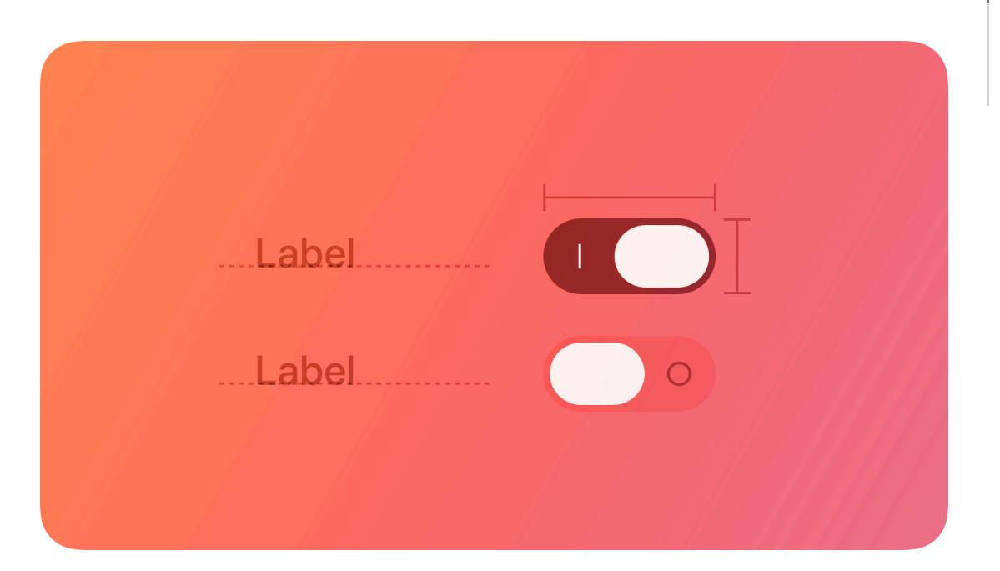
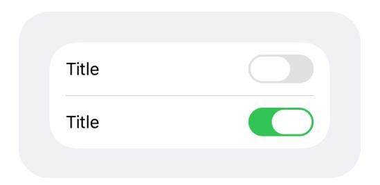
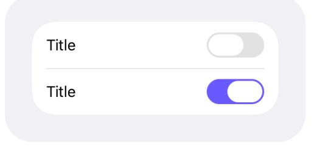
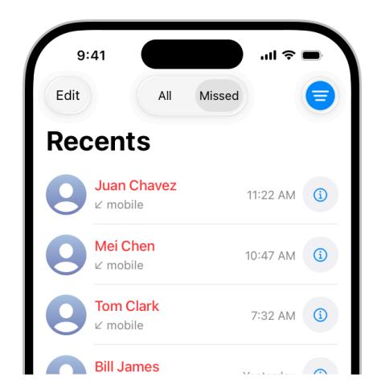
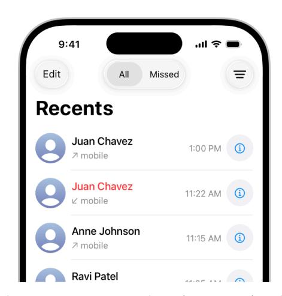
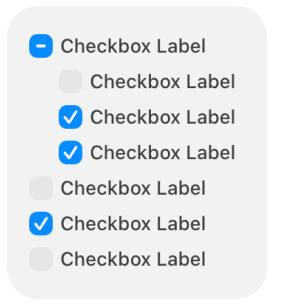

# **Toggles**

A toggle lets people choose between a pair of opposing states, like on and off, using a different appearance to indicate each state.

**Supported platforms**

[Toggles](#page-0-1)

[Change](#page-4-1) log

Best [practices](#page-0-0) Platform [considerations](#page-1-0) [Resources](#page-4-0)

A toggle can have various styles, such as switch and checkbox, and different platforms can use these styles in different ways. For guidance, see Platform [considerations.](#page-1-0)

In addition to toggles, all platforms also support buttons that behave like toggles by using a different appearance for each state. For developer guidance, see *[ToggleStyle](https://developer.apple.com/documentation/SwiftUI/ToggleStyle)*.

## **Best [practices](#page-0-0)**

**Use a toggle to help people choose between two opposing values that affect the state of content or a view.** A toggle always lets people manage the state of something, so if you need to support other types of actions — such as choosing from a list of items — use a different component, like a [pop-up](https://developer.apple.com/design/human-interface-guidelines/pop-up-buttons) button.

**Clearly identify the setting, view, or content the toggle affects.** In general, the surrounding context provides enough information for people to understand what they're turning on or off. In some cases, often in macOS apps, you can also supply a label to describe the state the toggle controls. If you use a button that behaves like a toggle, you generally use an interface icon that communicates its purpose, and you update its appearance — typically by changing the background — based on the current state.

**Make sure the visual differences in a toggle's state are obvious.** For example, you might add or remove a color fill, show or hide the background shape, or change the inner details you display — like a checkmark or dot — to show that a toggle is on or off. Avoid relying solely on different colors to communicate state, because not everyone can perceive the differences.

# **Platform [considerations](#page-1-0)**

*No additional considerations for tvOS, visionOS, or watchOS.*

### **iOS, [iPadOS](#page-1-1)**

**Use the switch toggle style only in a list row.** You don't need to supply a label in this situation because the content in the row provides the context for the state the switch controls.

**Change the default color of a switch only if necessary.** The default green color tends to work well in most cases, but you might want to use your app's accent color instead. Be sure to use a color that provides enough contrast with the uncolored appearance to be perceptible.

Standard switch color Custom switch color

**Outside of a list, use a button that behaves like a toggle, not a switch.** For example, the Phone app uses a toggle on the filter button to let users filter their recent calls. The app adds a blue highlight to indicate when the toggle is active, and removes it when the toggle is inactive.

The Phone app uses a toggle to switch between all recent calls and various filter options. When someone chooses a filter, the toggle appears with a custom background drawn behind the symbol.

When someone returns to the main Recents view, the toggle appears without anything behind the symbol.

**Avoid supplying a label that explains the button's purpose.** The interface icon you create combined with the alternative background appearances you supply — help people understand what the button does. For developer guidance, see *[changesSelectionAsPrimaryAction](https://developer.apple.com/documentation/UIKit/UIButton/changesSelectionAsPrimaryAction)*.

### **[macOS](#page-1-2)**

In addition to the switch toggle style, macOS supports the checkbox style and also defines radio buttons that can provide similar behaviors.

**Use switches, checkboxes, and radio buttons in the window body, not the window frame.** In particular, avoid using these components in a toolbar or status bar.

#### **[Switches](#page-2-0)**

**Prefer a switch for settings that you want to emphasize.** A switch has more visual weight than a checkbox, so it looks better when it controls more functionality than a checkbox typically does. For example, you might use a switch to let people turn on or off a group of settings, instead of just one setting. For developer guidance, see *[switch](https://developer.apple.com/documentation/SwiftUI/ToggleStyle/switch)*.

**Within a grouped form, consider using a mini switch to control the setting in a single row.** The height of a mini switch is similar to the height of buttons and other controls, resulting in rows that have a consistent height. If you need to present a hierarchy of settings within a grouped form, you can use a regular switch for the primary setting and mini switches for the subordinate settings. For developer guidance, see *[GroupedFormStyle](https://developer.apple.com/documentation/SwiftUI/GroupedFormStyle)* and *[ControlSize](https://developer.apple.com/documentation/SwiftUI/ControlSize)*.

**In general, don't replace a checkbox with a switch.** If you're already using a checkbox in your interface, it's probably best to keep using it.

#### **[Checkboxes](#page-2-1)**

A checkbox is a small, square button that's empty when the button is off, contains a checkmark when the button is on, and can contain a dash when the button's state is mixed. Typically, a checkbox includes a title on its trailing side. In an editable checklist, a checkbox can appear without a title or any additional content.

**Use a checkbox instead of a switch if you need to present a hierarchy of settings.** The visual style of checkboxes helps them align well and communicate grouping. By using alignment generally along the leading edge of the checkboxes — and indentation, you can show dependencies, such as when the state of a checkbox governs the state of subordinate checkboxes.

**Consider using radio buttons if you need to present a set of more than two mutually exclusive options.** When people need to choose from options in addition to just "on" or "off," using multiple radio buttons can help you clarify each option with a unique label.

**Consider using a label to introduce a group of checkboxes if their relationship isn't clear.** Describe the set of options, and align the label's baseline with the first checkbox in the group.

**Accurately reflect a checkbox's state in its appearance.** A checkbox's state can be on, off, or mixed. If you use a checkbox to globally turn on and off multiple subordinate checkboxes, show a mixed state when the subordinate checkboxes have different states. For example, you might need to present a text-style setting that turns all styles on or off, but also lets people choose a subset of individual style settings like bold, italic, or underline. For developer guidance, see *[allowsMixedState](https://developer.apple.com/documentation/AppKit/NSButton/allowsMixedState)*.

On Off Mixed

#### **Radio [buttons](#page-3-0)**

A radio button is a small, circular button followed by a label. Typically displayed in groups of two to five, radio buttons present a set of mutually exclusive choices.

A radio button's state is either selected (a filled circle) or deselected (an empty circle). Although a radio button can also display a mixed state (indicated by a dash), this state is rarely useful because you can communicate multiple states by using additional radio buttons. If you need to show that a setting or item has a mixed state, consider using a checkbox instead.

Selected Deselected

**Prefer a set of radio buttons to present mutually exclusive options.** If you need to let people choose multiple options in a set, use checkboxes instead.

**Avoid listing too many radio buttons in a set.** A long list of radio buttons takes up a lot of space in the interface and can be overwhelming. If you need to present more than about five options, consider using a component like a [pop-up](https://developer.apple.com/design/human-interface-guidelines/pop-up-buttons) button instead.

**To present a single setting that can be on or off, prefer a checkbox.** Although a single radio button can also turn something on or off, the presence or absence of the checkmark in a checkbox can make the current state easier to understand at a glance. In rare cases where a single checkbox doesn't clearly communicate the opposing states, you can use a pair of radio buttons, each with a label that specifies the state it controls.

**Use consistent spacing when you display radio buttons horizontally.** Measure the space needed to accommodate the longest button label, and use that measurement consistently.

### **[Resources](#page-4-0)**

#### **[Related](#page-4-2)**

[Layout](https://developer.apple.com/design/human-interface-guidelines/layout)

#### **Developer [documentation](#page-4-3)**

*[Toggle](https://developer.apple.com/documentation/SwiftUI/Toggle)* — SwiftUI

*[UISwitch](https://developer.apple.com/documentation/UIKit/UISwitch)* — UIKit

*[NSButton.ButtonType.toggle](https://developer.apple.com/documentation/AppKit/NSButton/ButtonType/toggle)* — AppKit

*[NSSwitch](https://developer.apple.com/documentation/AppKit/NSSwitch)* — AppKit

### **[Change](#page-4-1) log**

| Date               | Changes                                                                                                                                 |
|--------------------|-----------------------------------------------------------------------------------------------------------------------------------------|
| March 29, 2024     | Enhanced guidance for using switches in macOS apps, clarified when a checkbox has a title, and added art‐ work for radio buttons. |
| September 12, 2023 | Updated artwork.                                                                                                                        |