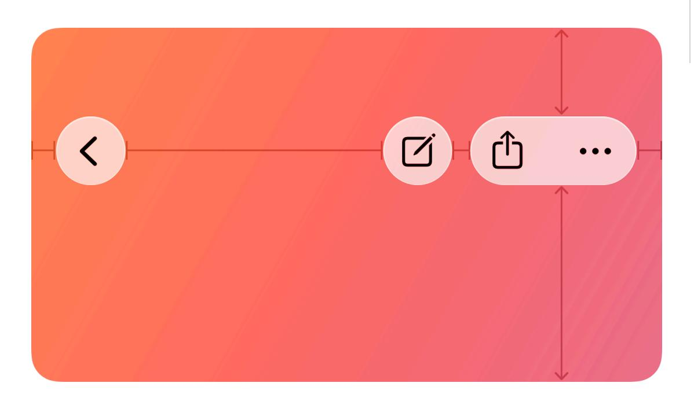
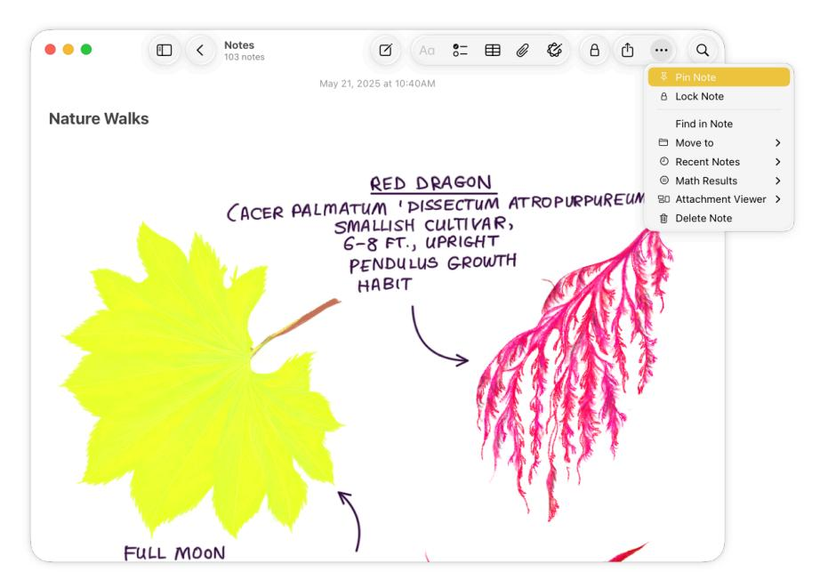
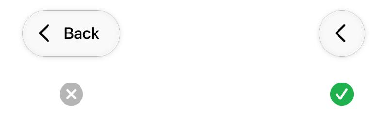
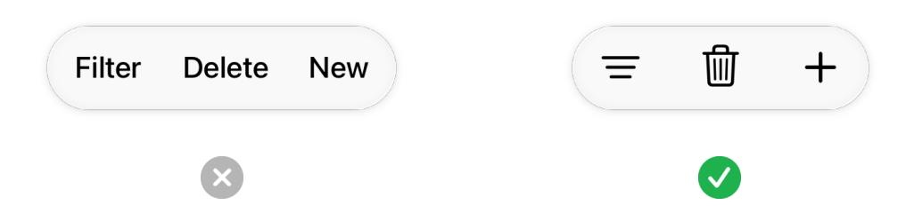
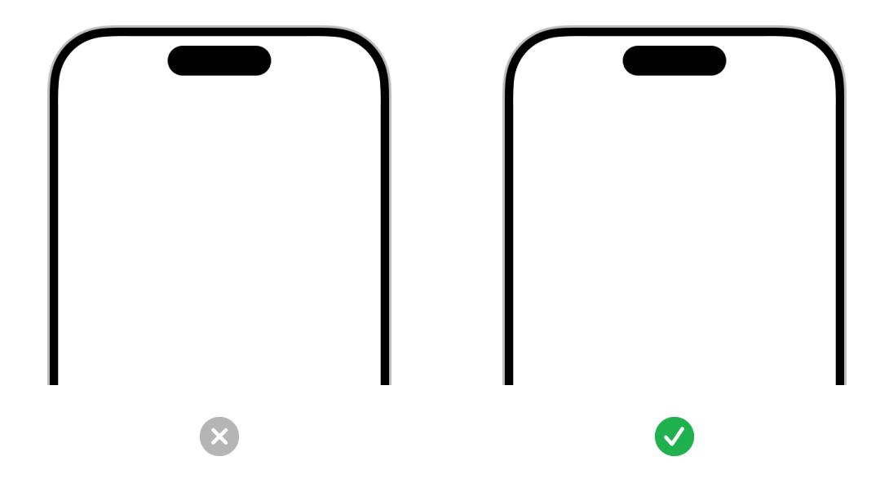
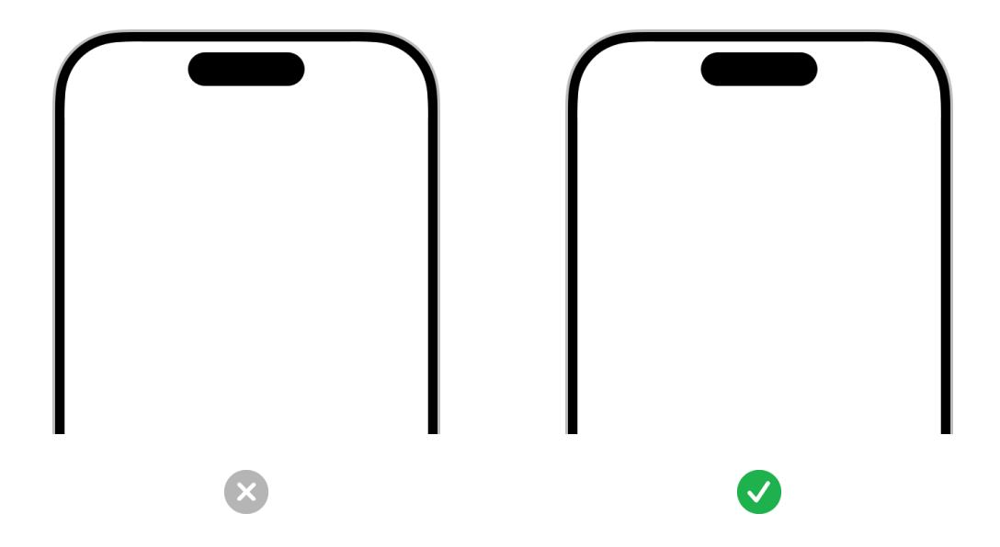
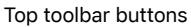
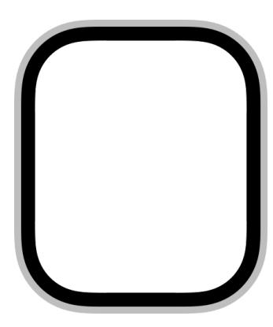
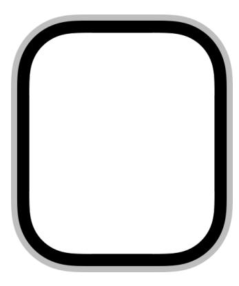
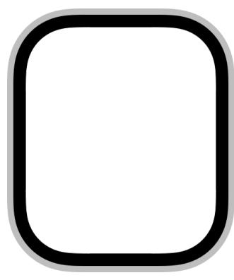

**December 16, 2025** Updated guidance for Liquid Glass.

# **Toolbars**

A toolbar provides convenient access to frequently used commands, controls, navigation, and search.

A toolbar consists of one or more sets of controls arranged horizontally along the top or bottom edge of the view, grouped into logical sections.

Toolbars act on content in the view, facilitate navigation, and help orient people in the app. They include three types of content:

- The title of the current view
- Navigation controls, like back and forward, and [search](https://developer.apple.com/design/human-interface-guidelines/search-fields) fields
- Actions, or bar items, like [buttons](https://developer.apple.com/design/human-interface-guidelines/buttons) and [menus](https://developer.apple.com/design/human-interface-guidelines/menus)

In contrast to a toolbar, a [tab](https://developer.apple.com/design/human-interface-guidelines/tab-bars) bar is specifically for navigating between areas of an app.

## **Best [practices](#page-0-0)**

**Choose items deliberately to avoid overcrowding.** People need to be able to distinguish and activate each item, so you don't want to put too many items in the toolbar. To accommodate variable view widths, define which items move to the overflow menu as the toolbar becomes narrower.

#### **Supported platforms**

#### [Toolbars](#page-0-1)

Best [practices](#page-0-0)

[Titles](#page-2-0)

[Navigation](#page-2-1)

[Actions](#page-2-2)

Item [groupings](#page-3-0)

Platform [considerations](#page-4-0)

[Resources](#page-8-0)

[Change](#page-8-1) log

#### **Note**

The system automatically adds an overflow menu in macOS or iPadOS when items no longer fit. Don't add an overflow menu manually, and avoid layouts that cause toolbar items to overflow by default.

**Add a More menu to contain additional actions.** Prioritize less important actions for inclusion in the More menu. Try to include all actions in the toolbar if possible, and only add this menu if you really need it.

Compact Standard

The standard toolbar in macOS Notes includes a More menu with extra commands.

**In iPadOS and macOS apps, consider letting people customize the toolbar to include their most common items.** Toolbar customization is especially useful in apps that provide a lot of items — or that include advanced functionality that not everyone needs — and in apps that people tend to use for long periods of time. For example, it works well to make a range of editing actions available for toolbar customization, because people often use different types of editing commands based on their work style and their current project.

**Reduce the use of toolbar backgrounds and tinted controls.** Any custom backgrounds and appearances you use might overlay or interfere with background effects that the system provides. Instead, use the content layer to inform the color and appearance of the toolbar, and use a *[ScrollEdgeEffectStyle](https://developer.apple.com/documentation/SwiftUI/ScrollEdgeEffectStyle)* when necessary to distinguish the toolbar area from the content area. This approach helps your app express its unique personality without distracting from content.

**Avoid applying a similar color to toolbar item labels and content layer backgrounds.** If your app already has bright, colorful content in the content layer, prefer using the default monochromatic appearance of toolbars. For more guidance, see [Liquid](https://developer.apple.com/design/human-interface-guidelines/color#Liquid-Glass-color) Glass color.

**Prefer using standard components in a toolbar.** By default, standard buttons, text fields, headers, and footers have corner radii that are concentric with bar corners. If you need to create a custom component, ensure that its corner radius is also concentric with the bar's corners.

**Consider temporarily hiding toolbars for a distraction-free experience.** Sometimes people appreciate a minimal interface to reduce distractions or reveal more content. If you support this, do so contextually when it makes the most sense, and offer ways to reliably restore hidden

interface elements. For guidance, see Going full [screen](https://developer.apple.com/design/human-interface-guidelines/going-full-screen). For guidance specific to visionOS, see Immersive [experiences.](https://developer.apple.com/design/human-interface-guidelines/immersive-experiences)

## **[Titles](#page-2-0)**

**Provide a useful title for each window.** A title helps people confirm their location as they navigate your app, and differentiates between the content of multiple open windows. If titling a toolbar seems redundant, you can leave the title area empty. For example, Notes doesn't title the current note when a single window is open, because the first line of content typically supplies sufficient context. However, when opening notes in separate windows, the system titles them with the first line of content so people can tell them apart.

**Don't title windows with your app name.** Your app's name doesn't provide useful information about your content hierarchy or any window or area in your app, so it doesn't work well as a title.

**Write a concise title.** Aim for a word or short phrase that distills the purpose of the window or view, and keep the title under 15 characters long so you leave enough room for other controls.

## **[Navigation](#page-2-1)**

A toolbar with navigation controls appears at the top of a window, helping people move through a hierarchy of content. A toolbar also often contains a [search](https://developer.apple.com/design/human-interface-guidelines/search-fields) field for quick navigation between areas or pieces of content. In iOS, a navigation-specific toolbar is sometimes called a navigation bar.

**Use the standard Back and Close buttons.** People know that the standard Back button lets them retrace their steps through a hierarchy of information, and the standard Close button closes a modal view. Prefer the standard symbols for each, and don't use a text label that says *Back* or *Close*. If you create a custom version of either, make sure it still looks the same, behaves as people expect, and matches the rest of your interface, and ensure you consistently implement it throughout your app or game. For guidance, see [Icons](https://developer.apple.com/design/human-interface-guidelines/icons).

## **[Actions](#page-2-2)**

**Provide actions that support the main tasks people perform.** In general, prioritize the commands that people are most likely to want. These commands are often the ones people use most frequently, but in some apps it might make sense to prioritize commands that map to the highest level or most important objects people work with.

**Make sure the meaning of each control is clear.** Don't make people guess or experiment to figure out what a toolbar item does. Prefer simple, recognizable symbols for items instead of text, except for actions like *edit* that aren't well-represented by symbols. For guidance on symbols that represent common actions, see [Standard](https://developer.apple.com/design/human-interface-guidelines/icons#Standard-icons) icons.

**Prefer system-provided symbols without borders.** System-provided symbols are familiar, automatically receive appropriate coloring and vibrancy, and respond consistently to user interactions. Borders (like outlined circle symbols) aren't necessary because the section provides a visible container, and the system defines hover and selection state appearances automatically. For guidance, see SF [Symbols](https://developer.apple.com/design/human-interface-guidelines/sf-symbols).

**Use the** *.prominent* **style for key actions such as Done or Submit.** This separates and tints the action so there's a clear focal point. Only specify one primary action, and put it on the trailing side of the toolbar.

## **Item [groupings](#page-3-0)**

You can position toolbar items in three locations: the leading edge, center area, and trailing edge of the toolbar. These areas provide familiar homes for navigation controls, window or document titles, common actions, and search.

- **Leading edge.** Elements that let people return to the previous document and show or hide a sidebar appear at the far leading edge, followed by the view title. Next to the title, the toolbar can include a document menu that contains standard and app-specific commands that affect the document as a whole, such as Duplicate, Rename, Move, and Export. To ensure that these items are always available, items on the toolbar's leading edge aren't customizable.
- **Center area.** Common, useful controls appear in the center area, and the view title can appear here if it's not on the leading edge. In macOS and iPadOS, people can add, remove, and rearrange items here if you let them customize the toolbar, and items in this section automatically collapse into the system-managed overflow menu when the window shrinks enough in size.
- **Trailing edge.** The trailing edge contains important items that need to remain available, buttons that open nearby inspectors, an optional search field, and the More menu that contains additional items and supports toolbar customization. It also includes a primary action like Done when one exists. Items on the trailing edge remain visible at all window sizes.

To position items in the groupings you want, pin them to the leading edge, center, or trailing edge, and insert space between buttons or other items where appropriate.

**Group toolbar items logically by function and frequency of use.** For example, Keynote includes several sections that are based on functionality, including one for presentation-level commands, one for playback commands, and one for object insertion.

**Group navigation controls and critical actions like Done, Close, or Save in dedicated, familiar, and visually distinct sections.** This reflects their importance and helps people discover and

understand these actions.

**Keep consistent groupings and placement across platforms.** This helps people develop familiarity with your app and trust that it behaves similarly regardless of where they use it.

**Minimize the number of groups.** Too many groups of controls can make a toolbar feel cluttered and confusing, even with the added space on iPad and Mac. In general, aim for a maximum of three.

**Keep actions with text labels separate.** Placing an action with a text label next to an action with a symbol can create the illusion of a single action with a combined text and symbol, leading to confusion and misinterpretation. If your toolbar includes multiple text-labeled buttons, the text of those buttons may appear to run together, making the buttons indistinguishable. Add separation by inserting fixed space between the buttons. For developer guidance, see *[UIBar](https://developer.apple.com/documentation/UIKit/UIBarButtonItem/SystemItem/fixedSpace) [ButtonItem.SystemItem.fixedSpace](https://developer.apple.com/documentation/UIKit/UIBarButtonItem/SystemItem/fixedSpace)*.

## **Platform [considerations](#page-4-0)**

*No additional considerations for tvOS.*

**Prioritize only the most important items for inclusion in the main toolbar area.** Because space is so limited, carefully consider which actions are essential to your app and include those first. Create a More menu to include additional items.

**Use a large title to help people stay oriented as they navigate and scroll.** By default, a large title transitions to a standard title as people begin scrolling the content, and transitions back to large when people scroll to the top, reminding them of their current location. For developer guidance, see *[prefersLargeTitles](https://developer.apple.com/documentation/UIKit/UINavigationBar/prefersLargeTitles)*.

### **[iPadOS](#page-5-0)**

**Consider combining a toolbar with a tab bar.** In iPadOS, a toolbar and a tab [bar](https://developer.apple.com/design/human-interface-guidelines/tab-bars) can coexist in the same horizontal space at the top of the view. This is particularly useful for layouts where you want to navigate between a few main app areas while keeping the full width of the window available for content. For guidance, see [Layout](https://developer.apple.com/design/human-interface-guidelines/layout) and [Windows.](https://developer.apple.com/design/human-interface-guidelines/windows)

### **[macOS](#page-5-1)**

In a macOS app, the toolbar resides in the frame at the top of a window, either below or integrated with the title bar. Note that window titles can display inline with controls, and toolbar items don't include a bezel.

**Make every toolbar item available as a command in the menu bar.** Because people can customize the toolbar or hide it, it can't be the only place that presents a command. In contrast, it doesn't make sense to provide a toolbar item for every menu item, because not all menu commands are important enough or used often enough to warrant space in the toolbar.

### **[visionOS](#page-5-2)**

In visionOS, the system-provided toolbar appears along the bottom edge of a window, above the window-management controls, and in a parallel plane that's slightly in front of the window along the z-axis.

To maintain the legibility of toolbar items as content scrolls behind them, visionOS uses a variable blur in the bar background. The variable blur anchors the bar above the scrolling content while letting the view's glass material remain uniform and undivided.

In visionOS, you can supply either a symbol or a text label for each toolbar item. When people look at a toolbar item that contains a symbol, visionOS reveals the text label, providing additional information.

**Prefer using a system-provided toolbar.** The standard toolbar has a consistent and familiar appearance and is optimized to work well with eye and hand input. In addition, the system automatically places a standard toolbar in the correct position in relation to its window.

**Avoid creating a vertical toolbar.** In visionOS, tab [bars](https://developer.apple.com/design/human-interface-guidelines/tab-bars) are vertical, so presenting a vertical toolbar could confuse people.

**Try to prevent windows from resizing below the width of the toolbar.** visionOS doesn't include a menu bar where each app lists all its actions, so it's important for the toolbar to provide reliable access to essential controls regardless of a window's size.

**If your app can enter a modal state, consider offering contextually relevant toolbar controls.**

For example, a photo-editing app might enter a modal state to help people perform a multistep editing task. In this scenario, the controls in the modal editing view are different from the controls in the main window. Be sure to reinstate the window's standard toolbar controls when the app exits the modal state.

**Avoid using a pull-down menu in a toolbar.** A pull-down menu lets you offer additional actions related to a toolbar item, but can be difficult for people to discover and may clutter your interface. Because a toolbar is located at the bottom edge of a window in visionOS, a pull-down menu might obscure the standard window controls that appear below the bottom edge. For guidance, see [Pull-down](https://developer.apple.com/design/human-interface-guidelines/pull-down-buttons) buttons.

### **[watchOS](#page-6-0)**

A toolbar button lets you offer important app functionality in a view that displays related content. You can place toolbar buttons in the top corners or along the bottom. If you place these buttons above scrolling content, the buttons always remain visible, as the content scrolls under them.

Top toolbar buttons Bottom toolbar buttons

For developer guidance, see *[topBarLeading](https://developer.apple.com/documentation/SwiftUI/ToolbarItemPlacement/topBarLeading)*, *[topBarTrailing](https://developer.apple.com/documentation/SwiftUI/ToolbarItemPlacement/topBarTrailing)*, or *[bottomBar](https://developer.apple.com/documentation/SwiftUI/ToolbarItemPlacement/bottomBar)*.

You can also place a button in the scrolling view. By default, a scrolling toolbar button remains hidden until people reveal it by scrolling up. People frequently scroll to the top of a scrolling view, so discovering a toolbar button is automatic.

Toolbar button hidden Toolbar button shown

For developer guidance, see *[primaryAction](https://developer.apple.com/documentation/SwiftUI/ToolbarItemPlacement/primaryAction)*.

**Use a scrolling toolbar button for an important action that isn't a primary app function.** A toolbar button gives you the flexibility to offer important functionality in a view whose primary purpose is related to that functionality, but may not be the same. For example, Mail provides the essential New Message action in a toolbar button at the top of the Inbox view. The primary purpose of the Inbox is to display a scrollable list of email messages, so it makes sense to offer the closely related compose action in a toolbar button at the top of the view.

## **[Resources](#page-8-0)**

#### **[Related](#page-8-2)**

[Sidebars](https://developer.apple.com/design/human-interface-guidelines/sidebars)

Tab [bars](https://developer.apple.com/design/human-interface-guidelines/tab-bars)

[Layout](https://developer.apple.com/design/human-interface-guidelines/layout)

[Buttons](https://developer.apple.com/design/human-interface-guidelines/buttons)

[Search](https://developer.apple.com/design/human-interface-guidelines/search-fields) fields

Apple Design [Resources](https://developer.apple.com/design/resources/)

#### **Developer [documentation](#page-8-3)**

[Toolbars](https://developer.apple.com/documentation/SwiftUI/Toolbars) — SwiftUI

*[UIToolbar](https://developer.apple.com/documentation/UIKit/UIToolbar)* — UIKit

*[NSToolbar](https://developer.apple.com/documentation/AppKit/NSToolbar)* — AppKit

#### **[Videos](#page-8-4)**

**Get to know the new design [system](https://developer.apple.com/videos/play/wwdc2025/356)**

## **[Change](#page-8-1) log**

| Date              | Changes                                                                                                                      |
|-------------------|------------------------------------------------------------------------------------------------------------------------------|
| December 16, 2025 | Updated guidance for Liquid Glass.                                                                                           |
| June 9, 2025      | Added guidance for grouping bar items, updated guid‐ ance for using symbols, and incorporated navigation bar guidance. |
| June 21, 2023     | Updated to include guidance for visionOS.                                                                                    |
| June 5, 2023      | Updated guidance for using toolbars in watchOS.                                                                              |