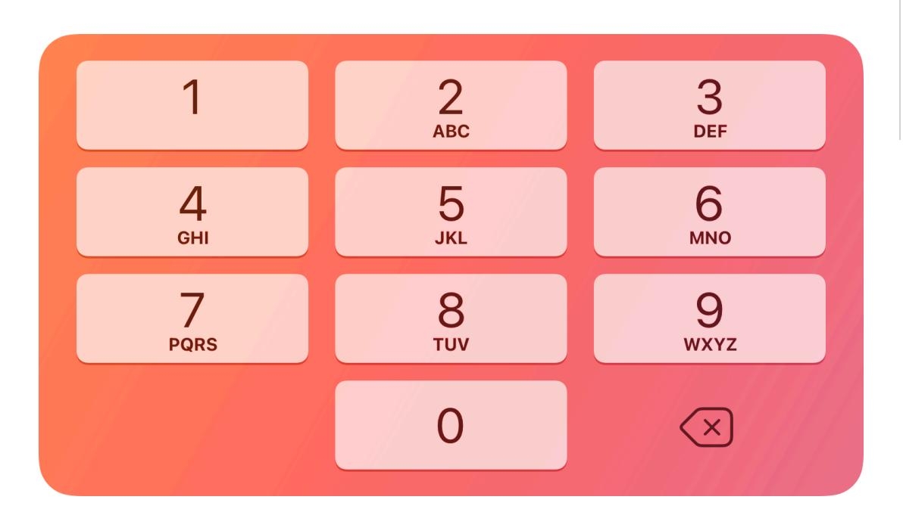
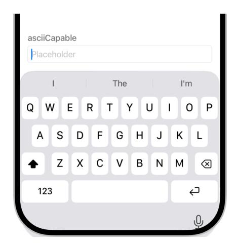
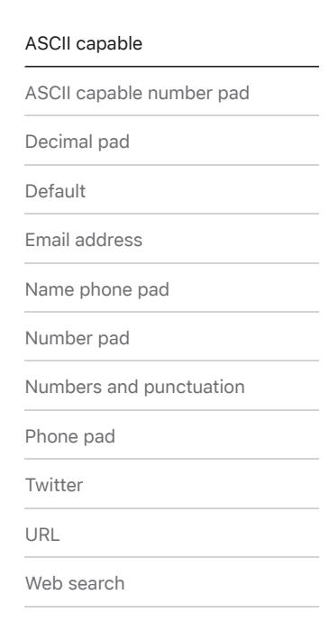
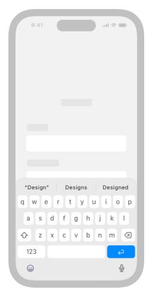
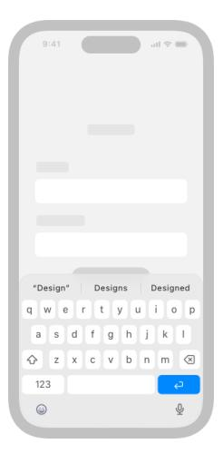
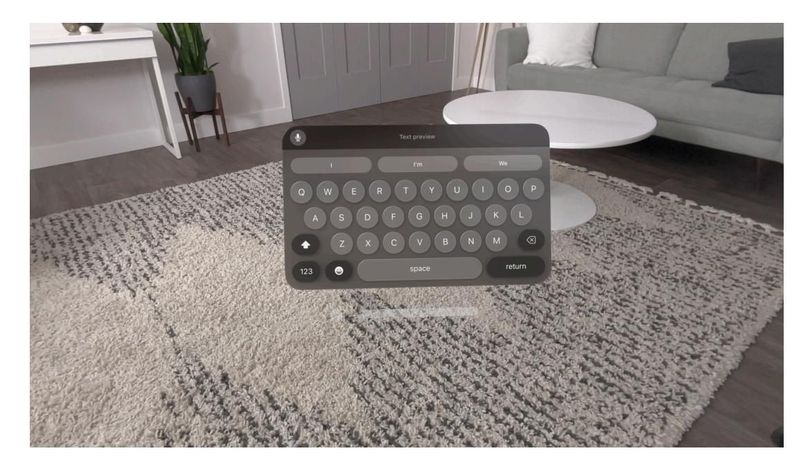

# **Virtual keyboards**

On devices without physical keyboards, the system offers various types of virtual keyboards people can use to enter data.

**Supported platforms**

Virtual [keyboards](#page-0-1) Best [practices](#page-0-0) [Custom](#page-1-0) input views Custom [keyboards](#page-1-1) Platform [considerations](#page-2-0) [Resources](#page-5-0) [Change](#page-5-1) log

A virtual keyboard can provide a specific set of keys that are optimized for the current task; for example, a keyboard that supports entering email addresses can include the "@" character and a period or even ".com". A virtual keyboard doesn't support keyboard shortcuts.

When it makes sense in your app, you can replace the system-provided keyboard with a custom view that supports app-specific data entry. In iOS, iPadOS, and tvOS, you can also create an app extension that offers a custom keyboard people can install and use in place of the standard keyboard.

## **Best [practices](#page-0-0)**

**Choose a keyboard that matches the type of content people are editing.** For example, you can help people enter numeric data by providing the numbers and punctuation keyboard. When you specify a semantic meaning for a text input area, the system can automatically provide a keyboard that matches the type of input you expect, potentially using this information to refine the keyboard corrections it offers. For developer guidance, see *[keyboardType\(\\_:\)](https://developer.apple.com/documentation/SwiftUI/View/keyboardType(_:))* (SwiftUI), *[textContentType\(\\_:\)](https://developer.apple.com/documentation/SwiftUI/View/textContentType(_:))*(SwiftUI), *[UIKeyboardType](https://developer.apple.com/documentation/UIKit/UIKeyboardType)* (UIKit), and *[UITextContentType](https://developer.apple.com/documentation/UIKit/UITextContentType)* (UIKit).

**Consider customizing the Return key type if it helps clarify the text-entry experience.** The Return key type is based on the keyboard type you choose, but you can change this if it makes sense in your app. For example, if your app initiates a search, you can use a search Return key type rather than the standard one so the experience is consistent with other places people initiate search. For developer guidance, see *[submitLabel\(\\_:\)](https://developer.apple.com/documentation/SwiftUI/View/submitLabel(_:))* (SwiftUI) and *[UIReturnKey](https://developer.apple.com/documentation/UIKit/UIReturnKeyType) [Type](https://developer.apple.com/documentation/UIKit/UIReturnKeyType)* (UIKit).

## **[Custom](#page-1-0) input views**

In some cases, you can create an *input view* if you want to provide custom functionality that enhances data-entry tasks in your app. For example, Numbers provides a custom input view for entering numeric values while editing a spreadsheet. A custom input view replaces the systemprovided keyboard while people are in your app. For developer guidance, see *[ToolbarItem](https://developer.apple.com/documentation/SwiftUI/ToolbarItemPlacement) [Placement](https://developer.apple.com/documentation/SwiftUI/ToolbarItemPlacement)* (SwiftUI) and *[inputViewController](https://developer.apple.com/documentation/UIKit/UIResponder/inputViewController)* (UIKit).

**Make sure your custom input view makes sense in the context of your app.** In addition to making data entry simple and intuitive, you want people to understand the benefits of using your custom input view. Otherwise, they may wonder why they can't regain the system keyboard while in your app.

**Play the standard keyboard sound while people type.** The keyboard sound provides familiar feedback when people tap a key on the system keyboard, so they're likely to expect the same sound when they tap keys in your custom input view. People can turn keyboard sounds off for all keyboard interactions in Settings > Sounds. For developer guidance, see *[playInputClick\(\)](https://developer.apple.com/documentation/UIKit/UIDevice/playInputClick())* (UIKit).

## **Custom [keyboards](#page-1-1)**

In iOS, iPadOS, and tvOS, you can provide a custom keyboard that replaces the system keyboard by creating an app extension. An *app extension* is code you provide that people can install and use to extend the functionality of a specific area of the system; to learn more, see App [extensions.](https://developer.apple.com/app-extensions/)

After people choose your custom keyboard in Settings, they can use it for text entry within any app, except when editing secure text fields and phone number fields. People can choose

multiple custom keyboards and switch between them at any time. For developer guidance, see Creating a custom [keyboard](https://developer.apple.com/documentation/UIKit/creating-a-custom-keyboard).

Custom keyboards make sense when you want to expose unique keyboard functionality systemwide, such as a novel way of inputting text or the ability to type in a language the system doesn't support. If you want to provide a custom keyboard for people to use only while they're in your app, consider creating a custom input view instead.

**Provide an obvious and easy way to switch between keyboards.** People know that the Globe key on the standard keyboard — which replaces the dedicated Emoji key when multiple keyboards are available — quickly switches to other keyboards, and they expect a similarly intuitive experience in your keyboard.

**Avoid duplicating system-provided keyboard features.** On some devices, the Emoji/Globe key and Dictation key automatically appear beneath the keyboard, even when people are using custom keyboards. Your app can't affect these keys, and it's likely to be confusing if you repeat them in your keyboard.

**Consider providing a keyboard tutorial in your app.** People are used to the standard keyboard, and learning how to use a new keyboard can take time. You can help make the process easier by providing usage instructions in your app — for example, you might tell people how to choose your keyboard, activate it during text entry, use it, and switch back to the standard keyboard. Avoid displaying help content within the keyboard itself.

## **Platform [considerations](#page-2-0)**

*Not supported in macOS.*

### **iOS, [iPadOS](#page-2-1)**

**Use the keyboard layout guide to make the keyboard feel like an integrated part of your interface.** Using the layout guide also helps you keep important parts of your interface visible while the virtual keyboard is onscreen. For developer guidance, see [Adjusting](https://developer.apple.com/documentation/UIKit/adjusting-your-layout-with-keyboard-layout-guide) your layout with [keyboard](https://developer.apple.com/documentation/UIKit/adjusting-your-layout-with-keyboard-layout-guide) layout guide.

The keyboard layout guide helps ensure that app UI and the keyboard work well together.

Without the layout guide, the keyboard could make entering text more difficult.

Without the layout guide, the keyboard could make tapping a button more difficult.

**Place custom controls above the keyboard thoughtfully.** Some apps position an input accessory view containing custom controls above the keyboard to offer app-specific functionality related to the data people are working with. For example, Numbers displays controls that help people apply standard or custom calculations to spreadsheet data. If your app offers custom controls that augment the keyboard, make sure they're relevant to the current task. If other views in your app use Liquid Glass, or if your view looks out of place above the keyboard, apply Liquid Glass to the view that contains your controls to maintain consistency. If you use a standard toolbar to contain your controls, it automatically adopts Liquid Glass. Use the keyboard layout guide and standard padding to ensure the system positions your controls as expected within the view. For developer guidance, see *[ToolbarItemPlacement](https://developer.apple.com/documentation/SwiftUI/ToolbarItemPlacement)* (SwiftUI), *[inputAccessoryView](https://developer.apple.com/documentation/UIKit/UIResponder/inputAccessoryView)* (UIKit), and *[UIKeyboardLayoutGuide](https://developer.apple.com/documentation/UIKit/UIKeyboardLayoutGuide)* (UIKit).

### **[tvOS](#page-3-0)**

tvOS displays a linear virtual keyboard when people select a text field using the Siri Remote.

#### **Note**

A grid keyboard screen appears when people use devices other than the Siri Remote, and the layout of content automatically adapts to the keyboard.

When people activate a digit entry view, tvOS displays a digit-specific keyboard. For guidance, see Digit entry [views.](https://developer.apple.com/design/human-interface-guidelines/digit-entry-views)

### **[visionOS](#page-3-1)**

In visionOS, the system-provided virtual keyboard supports both direct and indirect gestures and appears in a separate window that people can move where they want. You don't need to account for the location of the keyboard in your layouts.

Play

On Apple Watch, a text field can show a keyboard if the device screen is large enough. Otherwise, the system lets people use dictation or Scribble to enter information. You can't change the keyboard type in watchOS, but you can set the content type of the text field. The system uses this information to make text entry easier, such as by offering suggestions. For developer guidance, see *[textContentType\(\\_:\)](https://developer.apple.com/documentation/SwiftUI/View/textContentType(_:))* (SwiftUI).

People can also use a nearby paired iPhone to enter text on Apple Watch.

## **[Resources](#page-5-0)**

### **[Related](#page-5-2)**

[Entering](https://developer.apple.com/design/human-interface-guidelines/entering-data) data

[Keyboards](https://developer.apple.com/design/human-interface-guidelines/keyboards)

[Layout](https://developer.apple.com/design/human-interface-guidelines/layout)

### **Developer [documentation](#page-5-3)**

*[keyboardType\(\\_:\)](https://developer.apple.com/documentation/SwiftUI/View/keyboardType(_:))* — SwiftUI

*[textContentType\(\\_:\)](https://developer.apple.com/documentation/SwiftUI/View/textContentType(_:))* — SwiftUI

*[UIKeyboardType](https://developer.apple.com/documentation/UIKit/UIKeyboardType)* — UIKit

## **[Change](#page-5-1) log**

| Date             | Changes                                                                                                                                  |
|------------------|------------------------------------------------------------------------------------------------------------------------------------------|
| June 9, 2025     | Added guidance for displaying custom controls above the keyboard, and updated to reflect virtual keyboard availability in watchOS. |
| February 2, 2024 | Clarified the virtual keyboard's support for direct and indirect gestures in visionOS.                                                |
| December 5, 2023 | Added artwork for visionOS.                                                                                                              |
| June 21, 2023    | Changed page title from Onscreen keyboards and up‐ dated to include guidance for visionOS.                                            |