### **Apple Design [Awards](https://developer.apple.com/design/awards/)**

# **2023 winners and finalists**

The Apple Design Awards honor excellence in innovation, ingenuity, and technical achievement in app and game design.

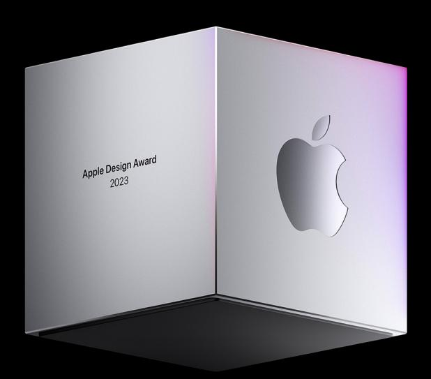

0:00

### **Inclusivity Winners**

Winners in this category provide a great experience for all by supporting people from a diversity of backgrounds, abilities, and languages.

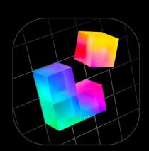

**APP**

# **Universe — Website Builder**

**Universe Exploration Company**

*Universe - Website Builder* champions the idea of making website building accessible to everyone. With its innovative block-centric design system and support for creating websites on all Apple platforms, the app empowers people to create their perfect online storefront, artist home, community group page, personal web presence, and anything in between. The app has integrated many of Apple's accessibility features, including a fantastic implementation of Dynamic Type and VoiceOver, and supports building websites in more than 17 languages. By consistently reducing complexity and removing barriers to entry, *Universe - Website Builder* enables people to create their own space on the web through inclusive, thoughtful design.

Available on iPhone, iPad, and Mac

View on the App [Store](https://apps.apple.com/us/app/universe-website-builder/id1211437633)

Behind the Design: [Universe](https://developer.apple.com/news/?id=nzd48pl9) — Website Builder

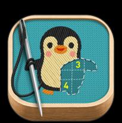

**GAME**

## **stitch.**

#### **Lykke Studios**

The warm and approachable *stitch.* is more than a casual game — it's a relaxing exercise with cross-generational appeal. A puzzle game, relaxation technique, and afternoon craft project in one, *stitch.* encourages players to proceed at their own pace with lovingly crafted puzzles, soothing music, and a gentle vibe. And with its fun onboarding, support for multiple languages, and custom accessibility options for those with color blindness, low vision, and motion sensitivities, it's designed for as many people as possible.

Available on iPhone, iPad, Mac, and Apple TV

View on the App [Store](https://apps.apple.com/us/app/stitch/id1581052096)

Behind the [Design:](https://developer.apple.com/news/?id=mc4d1ufa) stitch.

### **Finalists**

**Anne**

[Alessandro](https://apps.apple.com/us/app/anne/id1628657638) Di Maio

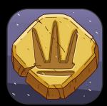

**Ancient Board Game [Collection](https://apps.apple.com/us/app/ancient-board-game-collection/id1510226148)**

Klemens Strasser

**Passenger Assistance**

[TRANSREPORT](https://apps.apple.com/gb/app/id1542190496) Available only in the UK

**Finding [Hannah](https://apps.apple.com/us/app/finding-hannah/id1617252957)**

Fein Games GmbH

### **Delight and Fun Winners**

Winners in this category provide memorable, engaging, and satisfying experiences that are enhanced by Apple technologies.

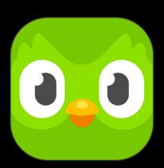

**APP**

## **Duolingo**

#### **Duolingo, Inc.**

As anyone who's crossed paths with *Duolingo*'s endearingly tenacious mascot can attest, delight and fun have always been central to the app's success. This past year, the *Duolingo* team embarked on a comprehensive redesign of both interface and content, making it even easier and more enjoyable to start learning a new language. Quests, challenges, and leaderboards help gamify an already fantastic experience, and a consistent stream of app updates and new language programs — including courses for endangered and indigenous languages — help keep people engaged, exploring, and committed to their learning streak.

Available on iPhone and iPad

View on the App [Store](https://apps.apple.com/us/app/duolingo-language-lessons/id570060128)

Behind the Design: [Duolingo](https://developer.apple.com/news/?id=jhkvppla)

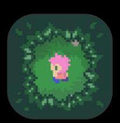

**GAME**

## **Afterplace**

#### **Evan Kice**

A vintage pixel adventure with a contemporary twist, Evan Kice's Afterplace is a warm and welcoming RPG set in a fabulously expansive open world. A beautifully crafted environment greets players at every turn, balancing winks to the past with a wry, modern personality. *Afterplace*'s dark forest is a place of adventure, full of quirky mysteries, hidden rewards, and sarcastic vending machines — yet it's designed to be accessible. The game's clever onboarding grounds players in the world, and its intuitive one-handed control system makes it easy and fun to discover *Afterplace*'s many surprises.

Available on iPhone and iPad

View on the App [Store](https://apps.apple.com/us/app/afterplace/id1539778232)

Behind the Design: [Afterplace](https://developer.apple.com/news/?id=3exkgv43)

#### **Finalists**

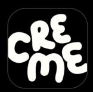

### **[CREME](https://apps.apple.com/app/creme-its-time-to-cook/id1638361026)**

The CREME Group Inc.

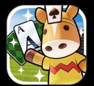

**Pocket Card [Jockey:](https://apps.apple.com/us/app/pocket-card-jockey-ride-on/id1604577143) Ride On!**

GAME FREAK Inc.

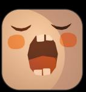

#### **[Chantlings](https://apps.apple.com/us/app/chantlings/id1560632579)**

IORAMA

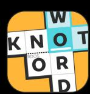

#### **[Knotwords](https://apps.apple.com/us/app/knotwords/id1598756238)**

Zach Gage and Jack Schlesinger

### **Interaction Winners**

Winners in this category deliver intuitive interfaces and effortless controls that are perfectly tailored to their platform.

**APP**

## **Flighty**

#### **Flighty LLC**

*Flighty* is a beautifully designed flight tracker, travel planner, airport navigator, and concierge. And with incredible Live Activities and Dynamic Island integration, it's a friendly companion for every leg of your journey. With key information where you need it most, an intuitive interface, comprehensive live maps, and a look that mirrors timehonored airport design conventions, *Flighty* might be the easiest part of your whole trip. It's an incredible example of thorough and thoughtful use of Apple technologies, with best-in-class support for widgets, Siri shortcuts, Apple Maps, and Calendar integration. iCloud sync means it's available on every device in your carry-on, and you can liveshare your flight path and ETA with anyone, whether they have the app installed or not.

Available on iPhone, iPad, and Mac

View on the App [Store](https://apps.apple.com/us/app/flighty-live-flight-tracker/id1358823008)

Behind the [Design:](https://developer.apple.com/news/?id=970ncww4) Flighty

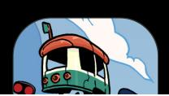

**GAME**

# **Railbound**

#### **Afterburn**

*Railbound* may feel drawn and designed for kids, but this puzzler — in which you work to arrange train cars in their proper order — is for conductors of all ages. The tap-and-drag mechanic for laying track is so simple you could almost discover it by accident, and the game makes it incredibly easy to change direction, add switches, or undo your mistakes. And it's full of clever design flourishes, like the scribbled frustration cloud that appears over a misplaced car and adorable characters that pop up along the way. With pristine animation and colorful visuals, *Railbound* is a polished puzzler that's easy to pick up and difficult to put down — especially once you're going full steam.

Available on iPhone and iPad

View on the App [Store](https://apps.apple.com/app/railbound/id1636439801)

Behind the Design: [Railbound](https://developer.apple.com/news/?id=0x08hncy)

#### **Finalists**

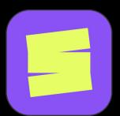

**Shuffles by [Pinterest](https://apps.apple.com/us/app/shuffles-by-pinterest/id1573869498)**

Pinterest, Inc.

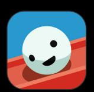

**[Automatoys](https://apps.apple.com/app/automatoys/id1580281448)**

Idle Friday LTD

The gorgeous gadgets of [Automatoys](https://developer.apple.com/news/?id=goqmr9xs)

The "sweet, [creative"](https://developer.apple.com/news/?id=g0x5mvvz) world of [Kimono](https://developer.apple.com/news/?id=g0x5mvvz) Cats

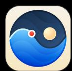

**Tide Guide: [Charts](https://apps.apple.com/us/app/tide-guide-charts-tables/id1406371071) & Tables**

Condor Digital LLC

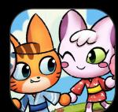

**Kimono Cats**

[HumaNature](https://apps.apple.com/us/app/kimono-cats/id1623684333) Studios Inc.

## **Social Impact Winners**

Winners in this category improve lives in a meaningful way and shine a light on crucial issues.

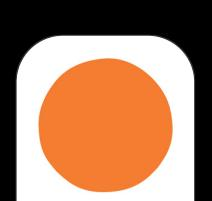

## **Headspace**

### **Headspace**

Few apps have brought mindfulness to the masses more successfully than *Headspace*. More than a decade into its tenure, the app continues to set the standard for meditation and mental health apps through thoughtful design decisions, an incredible UI, and a recognizable, comfortable illustration style. *Headspace* is remarkably easy to navigate (collections are clearly labeled with understandable purposes), whether you're looking for lengthy guided sessions or a five-minute clarity break. Wonderful Apple Watch integration brings a moment of mindfulness to your wrist at any time. And the app's ever-growing number of diverse contributors and staff help ensure a focus on representing everyone.

Available on iPhone, iPad, and Apple Watch

View on the App [Store](https://apps.apple.com/us/app/headspace-mindful-meditation/id493145008)

Behind the Design: [Headspace](https://developer.apple.com/news/?id=fkfnhq8u)

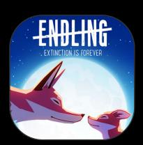

**GAME**

## **Endling**

#### **HandyGames**

In the gorgeous side-scroller *Endling*, you play as a fox fighting to navigate a land charred by environmental disaster and human impact. *Endling* casts you as the animal lead to build an immediate sense of empathy and connection one that only grows when you're forced to begin defending your tiny offspring against all manner of man-made dangers. And the game's simple controls ensure that you focus on the powerful storyline rather than the interactions. *Endling* isn't always an easy story to experience, but its mix of medium and message has never felt more timely.

Available on iPhone and iPad

View on the App [Store](https://apps.apple.com/us/app/endling/id1625083646)

Behind the [Design:](https://developer.apple.com/news/?id=c8l2zi89) Endling

### **Finalists**

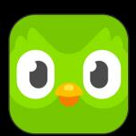

**[Duolingo](https://apps.apple.com/us/app/duolingo-language-lessons/id570060128)**

Duolingo, Inc.

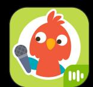

**Sago Mini First [Words](https://apps.apple.com/us/app/sago-mini-first-words-kids-1/id1592702367)**

Sago Mini

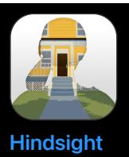

Team Hindsight

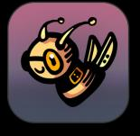

**[Beecarbonize](https://apps.apple.com/app/id1664426101)**

Charles Games s.r.o.

### **Visuals and Graphics Winners**

Winners in this category feature stunning imagery, skillfully drawn interfaces, and high-quality animations that lend to a distinctive and cohesive theme.

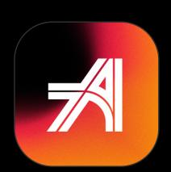

**APP**

# **Any Distance**

#### **Any Distance Inc.**

*Any Distance* is a design-forward fitness tracker that delivers workout stats in a variety of eye-popping and easily shareable formats: dynamic charts and graphs, rotating 3D maps complete with elevation reports, even AR. *Any Distance* takes full advantage of Live Activities and Apple Watch integration to collect and present data, which can include traditional workouts like running and cycling, as well as wheelchair exercise, stroller runs and walks, and recumbent bike rides. And its in-app collectibles provide a fun incentive to go that extra mile. *Any Distance* raises the bar for the fitness-tracking genre.

Available on iPhone and Apple Watch

View on the App [Store](https://apps.apple.com/us/app/any-distance-workout-tracker/id1545233932)

Behind the Design: Any [Distance](https://developer.apple.com/news/?id=uiiopcl8)

**GAME**

## **Resident Evil Village**

**CAPCOM Co., Ltd.**

*Resident Evil Village* is an absolute powerhouse and the new standard of Mac gaming. This horror adventure takes full advantage of the combined powers of Apple silicon, ProMotion, and Metal 3 to serve up all the character, lighting, and motion achievements that fans of the series could hope for. From its creepy castle to its decrepit factories to its magnificently hideous villains, *Resident Evil Village* offers some of the most realistic graphics ever seen on Apple

devices. (Players can enable the MetalFX Upscaling feature to make being hunted by monsters extra terrifying.) It's an incredible example of what Mac games can be.

Available on Mac

View on the App [Store](https://apps.apple.com/us/app/resident-evil-village/id1640627334?mt=12)

Behind the Design: [Resident](https://developer.apple.com/news/?id=ngi52ptu) Evil Village

#### **Finalists**

**[Gentler](https://apps.apple.com/us/app/gentler-streak-workout-tracker/id1576857102) Streak Health Fitness**

Gentler Stories LLC

**Diablo Immortal**

[Blizzard/NetEase](https://apps.apple.com/us/app/diablo-immortal/id1492005122)

**[Riveo](https://apps.apple.com/us/app/riveo/id1546053158)**

Forge and Form GmbH

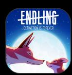

**Endling**

[HandyGames](https://apps.apple.com/us/app/endling/id1625083646)

### **Innovation Winners**

Winners in this category provide a state-of-the-art experience through novel use of Apple technologies that set them apart in their genre.

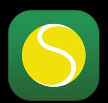

**APP**

## **SwingVision: A.I. Tennis App**

#### **SwingVision Inc.**

By using the combined powers of AI and Neural Engine, *SwingVision* serves as a tennis coach that can help with every aspect of your game. Point your camera at the court, and *SwingVision*'s advanced video-tracking capabilities evaluate your form, highlight your strengths, and suggest areas of improvement. Data is drawn from the camera and through best-in-class Apple Watch integration. Remarkably, all this technical achievement came from humble beginnings; *SwingVision* was built by two developers who taught themselves Swift.

Available on iPhone, iPad, Mac, and Apple Watch

View on the App [Store](https://apps.apple.com/us/app/swingvision-a-i-tennis-app/id989461317)

Behind the Design: [SwingVision:](https://developer.apple.com/news/?id=0pg4dthn) A.I. Tennis App

**GAME**

## **MARVEL SNAP**

#### **Second Dinner**

*MARVEL SNAP* has it all: brisk gameplay, unbelievable artwork, and an incredible stickiness that keeps you coming back — and rewards you for doing so. But the game's true innovation is its "snap" mechanic, which instantly doubles the stakes and introduces whole new layers of strategy and good old-fashioned psychological warfare. The game is a visual feast, awash in 3D parallax graphics, astonishing animations (just watch Hulk smash in 60 fps), and delightfully deployed haptics. True Marvel believers will be rewarded by a bottomless array of variants and deep-cut characters, while newbies will pick it up in no time at all. *MARVEL SNAP* is an incredible achievement that's redefined the collectible-card-game genre.

Available on iPhone and iPad

View on the App [Store](https://apps.apple.com/us/app/marvel-snap/id1592081003)

Behind the Design: [MARVEL](https://developer.apple.com/news/?id=sosm2p7q) SNAP

#### **Finalists**

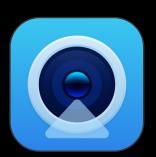

**Camo Studio**

[Reincubate](https://reincubate.com/camo/) Ltd.

**[Resident](https://apps.apple.com/us/app/resident-evil-village/id1640627334?mt=12) Evil Village**

CAPCOM Co., Ltd.

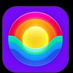

**Rise: Energy & Sleep [Tracker](https://apps.apple.com/de/app/rise-energy-sleep-tracker/id1453884781)**

Rise Science Inc.

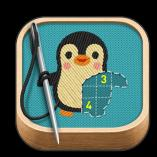

**[stitch.](https://apps.apple.com/us/app/stitch/id1581052096)**

Lykke Studios

**View last year's [winners](https://developer.apple.com/design/awards/2022/)**

[iOS](https://developer.apple.com/ios/)

[Accessibility](https://developer.apple.com/accessibility/)

[iPadOS](https://developer.apple.com/ipados/) [macOS](https://developer.apple.com/macos/) [tvOS](https://developer.apple.com/tvos/) [visionOS](https://developer.apple.com/visionos/) [watchOS](https://developer.apple.com/watchos/) [Accessories](https://developer.apple.com/accessories/) Apple [Intelligence](https://developer.apple.com/apple-intelligence/) App [Store](https://developer.apple.com/app-store/) Audio & [Video](https://developer.apple.com/audio/) [Augmented](https://developer.apple.com/augmented-reality/) Reality

**Tools** [Swift](https://developer.apple.com/swift/) [SwiftUI](https://developer.apple.com/swiftui/) Swift [Playground](https://developer.apple.com/swift-playground/) [TestFlight](https://developer.apple.com/testflight/) [Business](https://developer.apple.com/business/) [Design](https://developer.apple.com/design/) [Distribution](https://developer.apple.com/distribute/) [Education](https://developer.apple.com/education/) [Fonts](https://developer.apple.com/fonts/) [Games](https://developer.apple.com/games/)

[Xcode](https://developer.apple.com/xcode/) [Xcode](https://developer.apple.com/xcode-cloud/) Cloud Icon [Composer](https://developer.apple.com/icon-composer/) SF [Symbols](https://developer.apple.com/sf-symbols/) Health & [Fitness](https://developer.apple.com/health-fitness/) In-App [Purchase](https://developer.apple.com/in-app-purchase/) [Localization](https://developer.apple.com/localization/) Maps & [Location](https://developer.apple.com/maps/)

> Machine [Learning](https://developer.apple.com/machine-learning/) & AI Open [Source](https://opensource.apple.com/) [Security](https://developer.apple.com/security/) [Safari](https://developer.apple.com/safari/) & Web

[Sample](https://developer.apple.com/documentation/samplecode) Code [Tutorials](https://developer.apple.com/learn/) [Downloads](https://developer.apple.com/download/) [Forums](https://developer.apple.com/forums/) Apple Developer [Enterprise](https://developer.apple.com/programs/enterprise/) Program App Store Small [Business](https://developer.apple.com/app-store/small-business-program/) Program MFi [Program](https://mfi.apple.com/) Mini Apps Partner [Program](https://developer.apple.com/programs/mini-apps-partner/)

**Support** [Support](https://developer.apple.com/support/articles/) Articles [Contact](https://developer.apple.com/contact/) Us Bug [Reporting](https://developer.apple.com/bug-reporting/) [System](https://developer.apple.com/system-status/) Status

[Videos](https://developer.apple.com/videos/)

**Account**

Apple [Developer](https://developer.apple.com/account/) App Store [Connect](https://appstoreconnect.apple.com/) [Certificates,](https://developer.apple.com/account/ios/certificate/) IDs, & Profiles

[Feedback](https://feedbackassistant.apple.com/) Assistant

Apple [Developer](https://developer.apple.com/events/developer-centers/) Centers App Store [Awards](https://developer.apple.com/app-store/app-store-awards/) Apple Design [Awards](https://developer.apple.com/design/awards/) Apple Developer [Academies](https://developer.apple.com/academies/)

[WWDC](https://developer.apple.com/wwdc/)

**Events** Meet with [Apple](https://developer.apple.com/events/)

News Partner [Program](https://developer.apple.com/programs/news-partner/) Video Partner [Program](https://developer.apple.com/programs/video-partner/) Security Bounty [Program](https://developer.apple.com/security-bounty/) Security [Research](https://developer.apple.com/programs/security-research-device/) Device Program

Get the Apple [Developer](https://apps.apple.com/us/app/apple-developer/id640199958) app.

Copyright © 2026 [Apple](https://www.apple.com/) Inc. All rights reserved. [Terms](https://www.apple.com/legal/internet-services/terms/site.html) of Use [Privacy](https://www.apple.com/legal/privacy/) Policy [Agreements](https://developer.apple.com/support/terms/) and Guidelines **English**