**[Design](https://developer.apple.com/design/)** [News](https://developer.apple.com/news/) [Discover](https://developer.apple.com/discover/) [Design](https://developer.apple.com/design/) [Develop](https://developer.apple.com/develop/) [Distribute](https://developer.apple.com/distribute/) [Support](https://developer.apple.com/support/) [Account](https://developer.apple.com/account/)

## **Apple Design Resources**

Design apps accurately and quickly using official Apple design templates, icon production templates, color guides, and more.

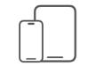

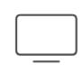

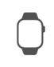

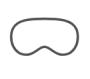

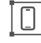

iOS & [iPadOS](#page-1-0) [macOS](#page-2-0) [tvOS](#page-3-0) [watchOS](#page-3-1) [visionOS](#page-3-2) [Technologies](#page-4-0) [Fonts](#page-5-0) [Tools](#page-5-1) [Product](#page-8-0) Bezel

## **iOS and iPadOS**

#### **iOS 26 and iPadOS 26**

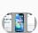

**UI Kit App Icon**

**Template**

**[Figma](https://www.figma.com/community/file/1527721578857867021/ios-and-ipados-26)**

**[Sketch](https://sketch.com/s/0ee52d20-8daf-49ef-b335-14020af3b060)**

**[Sketch](https://sketch.com/s/f63aa308-1f82-498c-8019-530f3b846db9)**

> **[Photoshop,](https://devimages-cdn.apple.com/design/resources/download/iOS-26-Icon-Templates-Photoshop-Illustrator.dmg) [Illustrator](https://devimages-cdn.apple.com/design/resources/download/iOS-26-Icon-Templates-Photoshop-Illustrator.dmg)**

**[Figma](https://www.figma.com/community/file/1514335373494164156/app-icon-template)**

### **iOS 18 and iPadOS 18**

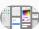

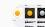

**UI Kit** **Templates Production Templates**

**[Sketch](https://devimages-cdn.apple.com/design/resources/download/iOS-18-Design-Templates-Sketch.dmg)**

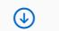

**[Sketch](https://sketch.com/s/bb57439f-19da-4c7a-bfd2-a196cf51f766)**

**[Sketch](https://devimages-cdn.apple.com/design/resources/download/iOS-18-Production-Templates-Sketch.dmg)**

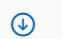

**[Photoshop](https://devimages-cdn.apple.com/design/resources/download/iOS-18-Production-Templates-Photoshop.dmg)**

**[Figma](https://www.figma.com/community/file/1387687009990313744/ios-18-and-ipados-18-app-icon-production-templates)**

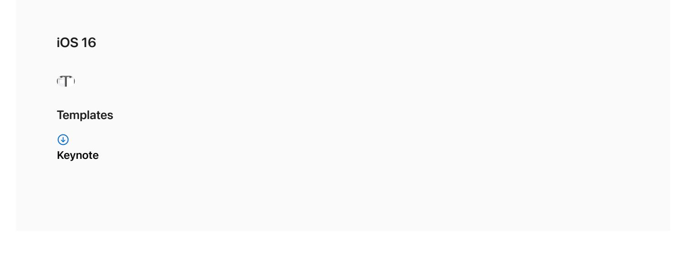

### **macOS**

**macOS 26**

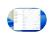

**UI Kit**

**[Figma](https://www.figma.com/community/file/1543337041090580818/apple-design-resources-macos-26)**

**[Sketch](https://sketch.com/s/7e5d41a8-dbde-4372-abf1-59792d73bc7c)**

#### **macOS Sequoia**

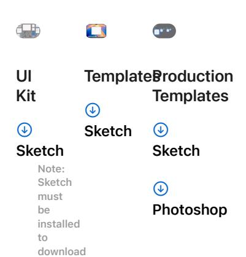

**[Figma](https://www.figma.com/community/file/1251588934545918753/apple-design-resources-macos)**

## **tvOS**

#### **tvOS 18**

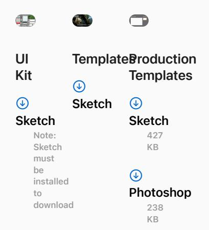

### **watchOS**

#### **watchOS 26**

**UI Kit**

**[Figma](https://www.figma.com/community/file/1540060090060216489/watchos-26)**

**[Sketch](https://sketch.com/s/2b12618d-596c-41fd-8488-132bff9535e7)**

### **visionOS**

**visionOS 26**

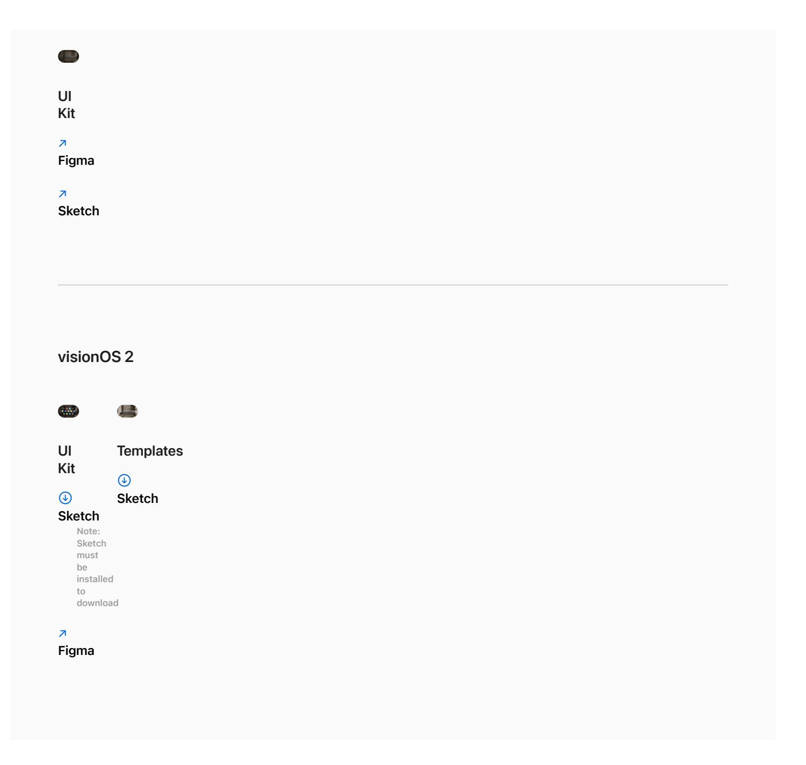

## **Technologies**

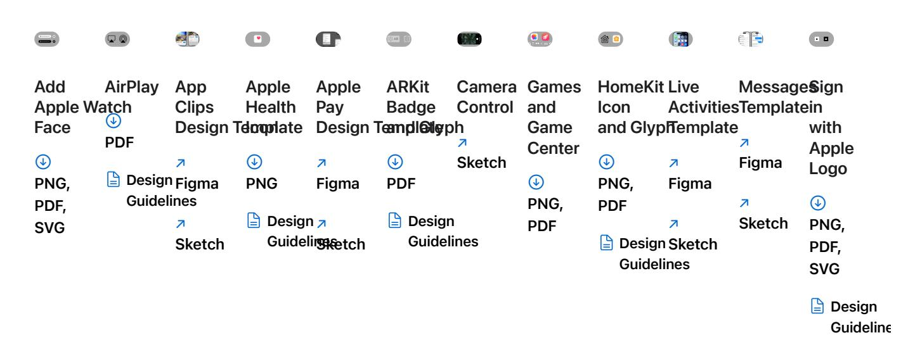

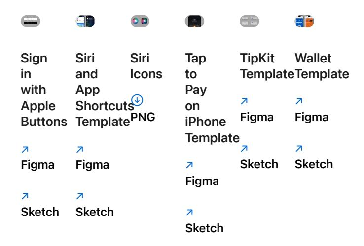

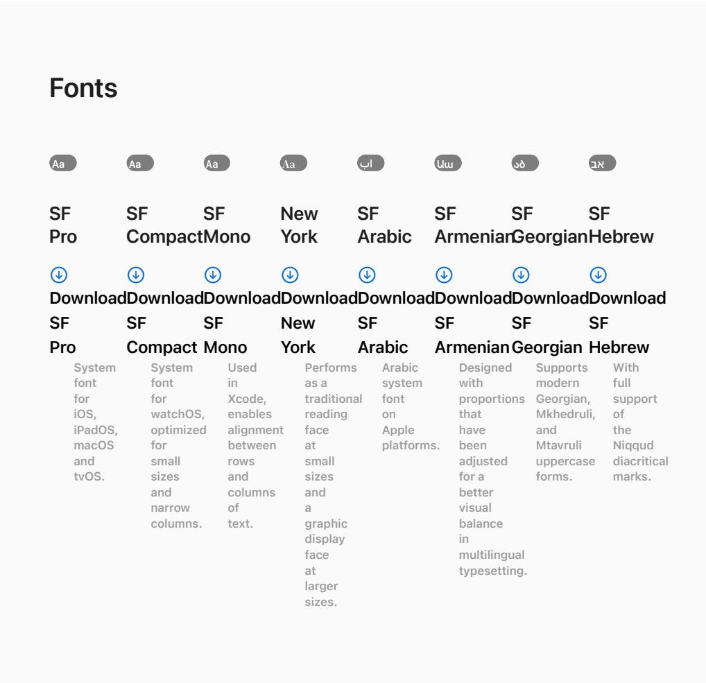

# SF Symbols

SF Symbols 7 is a library of over 6,900 symbols designed to integrate seamlessly with San Francisco, the system font for Apple platforms. Symbols come in nine weights and three scales, automatically align with text, and can be exported and edited using vector graphics tools to create custom symbols with shared design characteristics and accessibility features. SF Symbols 7 introduces Draw animations and variable rendering, enhanced Magic Replace, gradients, and hundreds of new symbols.

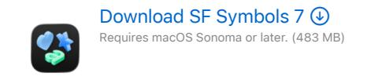

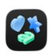

#### [Download](https://devimages-cdn.apple.com/design/resources/download/SF-Symbols-6.dmg) SF Symbols 6 Requires macOS Ventura or later. (385.4 MB)

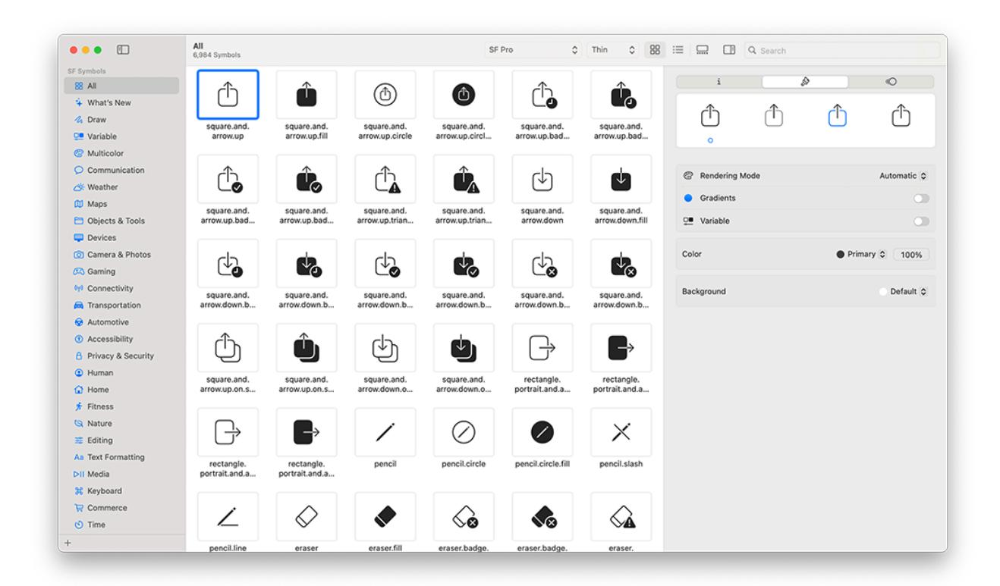

## **Icon Composer**

Icon Composer lets you create layered icons out of Liquid Glass from a single design for iPhone, iPad, Mac, and Apple Watch. With a new multi-layer icon format, you can easily adjust Liquid Glass properties, preview with dynamic lighting effects, and annotate across appearance modes. Icon Composer is designed to work seamlessly with Xcode, and also provides the option to export a flattened version of your icon for marketing and communication needs.

[Learn](https://developer.apple.com/icon-composer/) more 

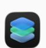

Download Icon [Composer](https://developer.apple.com/download/all/?q=Icon%20Composer) Requires macOS Sequoia or later. 

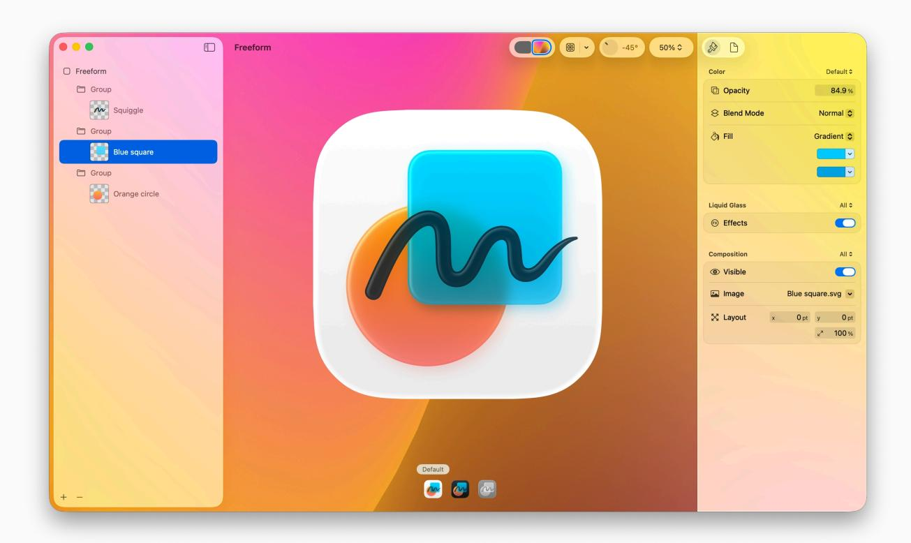

## **Parallax image tools**

Use Parallax Previewer and Parallax Exporter Plug-In for Adobe Photoshop to deliver parallax visual effects that transform static images into dynamic and immersive experiences on tvOS and visionOS.

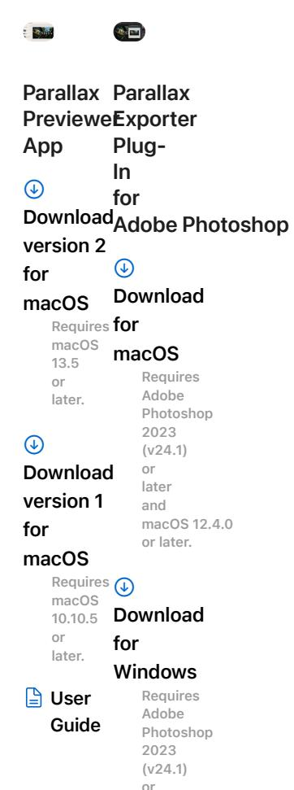

later and Microsoft Windows 10 64bit (version 22H2) or later.

## **Product Bezels**

When using product bezels in your marketing materials, be sure to review these Marketing Resources and Identity Guidelines.

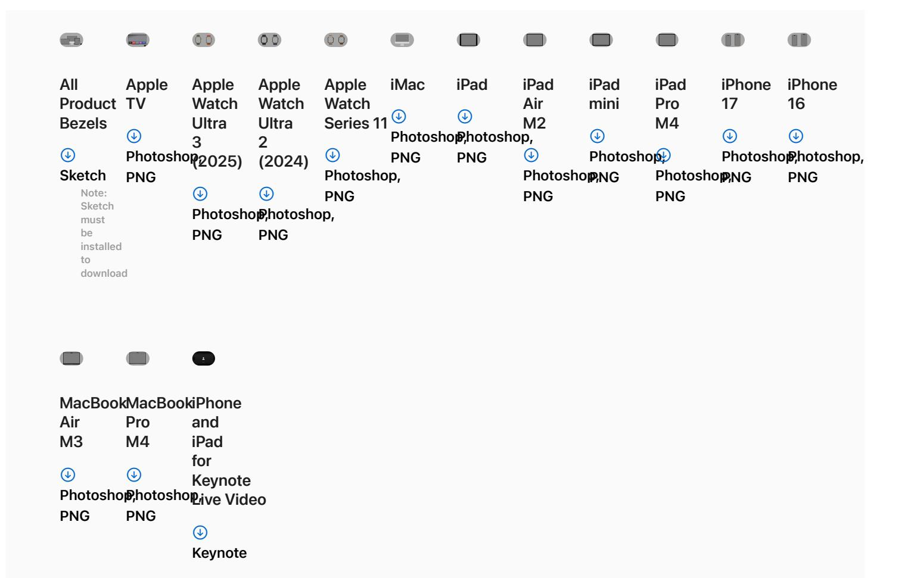

## **Badges and Logos**

Find badges and logos for Apple technologies, such as Apple Health, Apple Wallet, Apple Music, and Apple Pay, that can be used in your app's marketing material.

View Apple Badges and Logos >

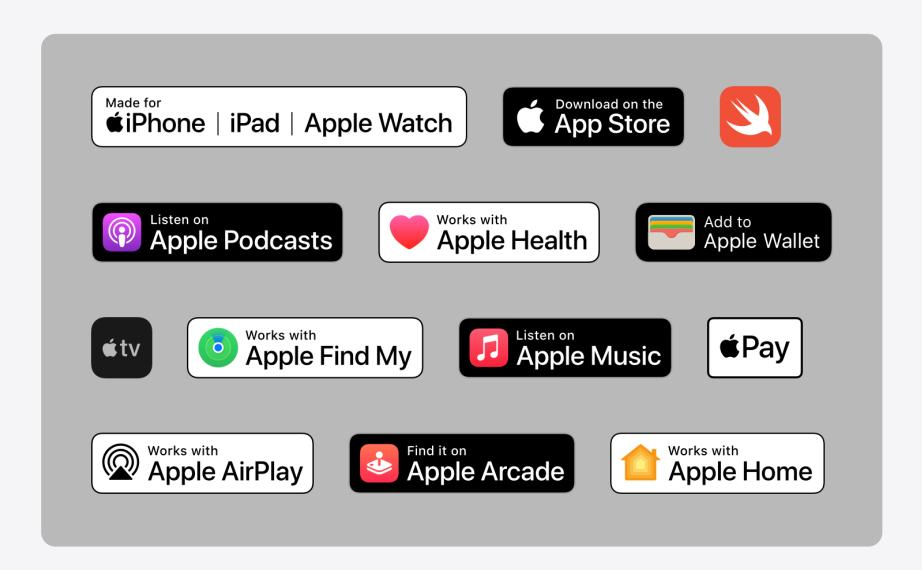

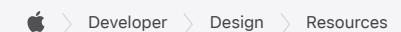

**Platforms** [iOS](https://developer.apple.com/ios/) [iPadOS](https://developer.apple.com/ipados/) [macOS](https://developer.apple.com/macos/) [tvOS](https://developer.apple.com/tvos/) [visionOS](https://developer.apple.com/visionos/) [watchOS](https://developer.apple.com/watchos/) **Tools** [Swift](https://developer.apple.com/swift/) [SwiftUI](https://developer.apple.com/swiftui/) Swift [Playground](https://developer.apple.com/swift-playground/) [TestFlight](https://developer.apple.com/testflight/) [Xcode](https://developer.apple.com/xcode/) **Topics & Technologies** [Accessibility](https://developer.apple.com/accessibility/) [Accessories](https://developer.apple.com/accessories/) Apple [Intelligence](https://developer.apple.com/apple-intelligence/) App [Store](https://developer.apple.com/app-store/) Audio & [Video](https://developer.apple.com/audio/) [Augmented](https://developer.apple.com/augmented-reality/) Reality [Business](https://developer.apple.com/business/) [Design](https://developer.apple.com/design/) [Distribution](https://developer.apple.com/distribute/) [Education](https://developer.apple.com/education/) [Fonts](https://developer.apple.com/fonts/) [Games](https://developer.apple.com/games/) Health & [Fitness](https://developer.apple.com/health-fitness/)

SF [Symbols](https://developer.apple.com/sf-symbols/) [Localization](https://developer.apple.com/localization/) Maps & [Location](https://developer.apple.com/maps/) Machine [Learning](https://developer.apple.com/machine-learning/) & AI Open [Source](https://opensource.apple.com/) [Security](https://developer.apple.com/security/) [Safari](https://developer.apple.com/safari/) & Web

**Resources** [Documentation](https://developer.apple.com/documentation/)

[Sample](https://developer.apple.com/documentation/samplecode) Code [Tutorials](https://developer.apple.com/learn/) [Downloads](https://developer.apple.com/download/) [Forums](https://developer.apple.com/forums/) [Videos](https://developer.apple.com/videos/)

**Support**

[Support](https://developer.apple.com/support/articles/) Articles [Contact](https://developer.apple.com/contact/) Us Bug [Reporting](https://developer.apple.com/bug-reporting/) [System](https://developer.apple.com/system-status/) Status

**Account**

Apple [Developer](https://developer.apple.com/account/) App Store [Connect](https://appstoreconnect.apple.com/) [Certificates,](https://developer.apple.com/account/ios/certificate/) IDs, & Profiles [Feedback](https://feedbackassistant.apple.com/) Assistant

**Programs**

Apple Developer [Enterprise](https://developer.apple.com/programs/enterprise/) Program App Store Small [Business](https://developer.apple.com/app-store/small-business-program/) Program

Apple [Developer](https://developer.apple.com/programs/) Program

MFi [Program](https://mfi.apple.com/)

Mini Apps Partner [Program](https://developer.apple.com/programs/mini-apps-partner/) News Partner [Program](https://developer.apple.com/programs/news-partner/) Video Partner [Program](https://developer.apple.com/programs/video-partner/) Security Bounty [Program](https://developer.apple.com/security-bounty/)

Security [Research](https://developer.apple.com/programs/security-research-device/) Device Program

**Events**

Meet with [Apple](https://developer.apple.com/events/)

Apple [Developer](https://developer.apple.com/events/developer-centers/) Centers App Store [Awards](https://developer.apple.com/app-store/app-store-awards/) Apple Design [Awards](https://developer.apple.com/design/awards/)

Apple Developer [Academies](https://developer.apple.com/academies/)

[WWDC](https://developer.apple.com/wwdc/)

[Xcode](https://developer.apple.com/xcode-cloud/) Cloud Icon [Composer](https://developer.apple.com/icon-composer/)

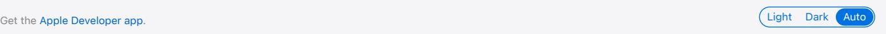

In-App [Purchase](https://developer.apple.com/in-app-purchase/)