# **Design Pathway**

Get started with this easy-to-navigate collection of videos, documentation, and tools to build great apps and games.

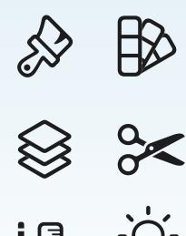

**Learn the [building](#page-0-0) blocks of design [Interface](#page-1-0) with the HIG [Assemble](#page-4-0) your toolbox Produce your [prototypes](#page-4-1) Get inspiration from the developer [community](#page-5-0) Go [further](#page-6-0)**

## **Learn the building blocks of design**

Design is where everything starts. It's not just how people view your app, but also how they interact with it. Design drives people's experiences, impressions, and feelings. And it can express core truths about how we process information, make decisions, and interact with the world around us.

Start your design path by peeking behind the curtain of Apple's design principles in these video sessions from Apple designers and evangelists. You'll find out how Apple team members and the developer community get inspired, learn how to create welcoming, empowering, and gratifying user experiences, and find ways to simplify your navigation without compromising personality.

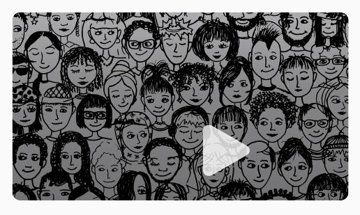

**The [qualities](https://developer.apple.com/videos/play/wwdc2018/801/) of great design Essential design [principles](https://developer.apple.com/videos/play/wwdc2017/802/)**

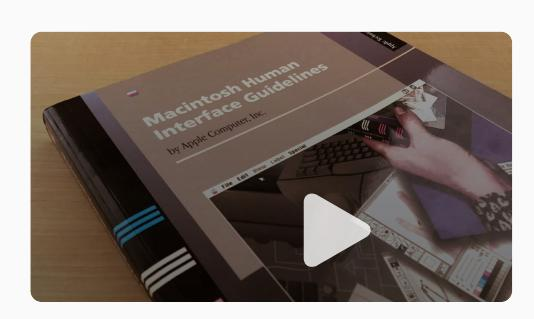

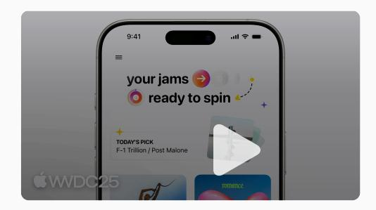

**Design [foundations](https://developer.apple.com/videos/play/wwdc2025/359/) from idea to interface**

## **Interface with the HIG**

When you're ready to dive deeper into design, the Human Interface [Guidelines](https://developer.apple.com/design/human-interface-guidelines/) (HIG) will be your best friend. The HIG is the home for guidance and best practices for Apple platforms, a comprehensive resource that you'll rely on from first sketch to final pixel. We'll be honest: It's pretty big. But we encourage you to get started by exploring these introductory pages. From there, you can gradually begin to branch out and see where your work takes you.

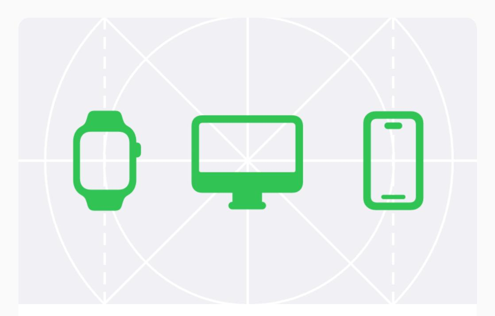

## **Getting started**

Begin work on an app or game that feels at home on every platform you support.

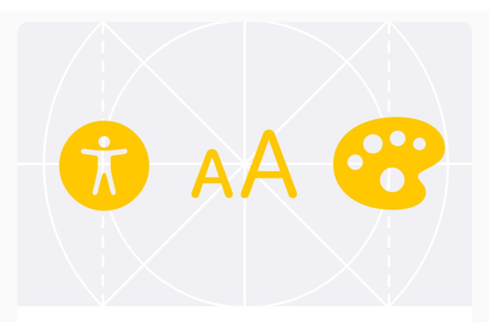

### **Foundations**

Learn to understand fundamental design elements.

[Learn](https://developer.apple.com/design/human-interface-guidelines/foundations) more 

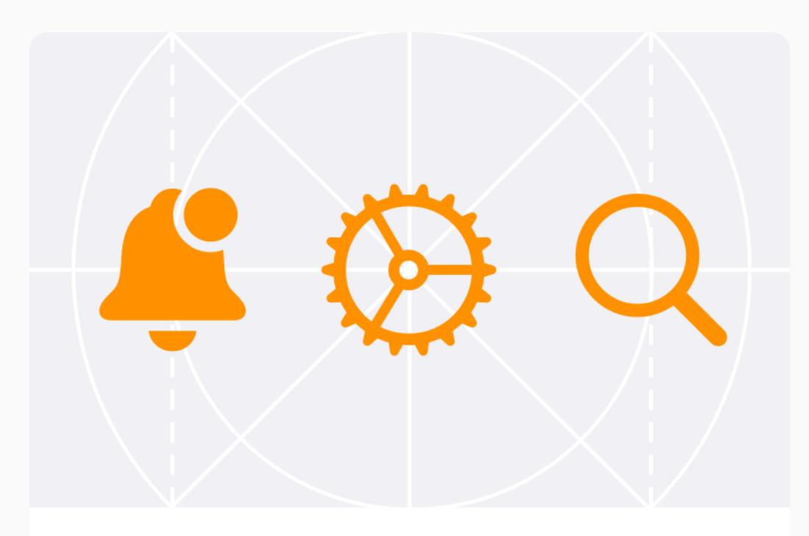

### **Patterns**

Get guidance on common actions, tasks, and experiences.

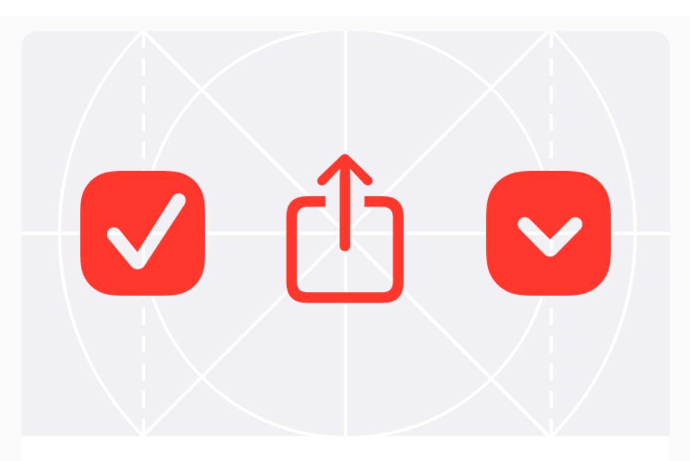

#### **Components**

Explore the system-defined components that give people a familiar and consistent experience.

[Learn](https://developer.apple.com/design/human-interface-guidelines/components) more 

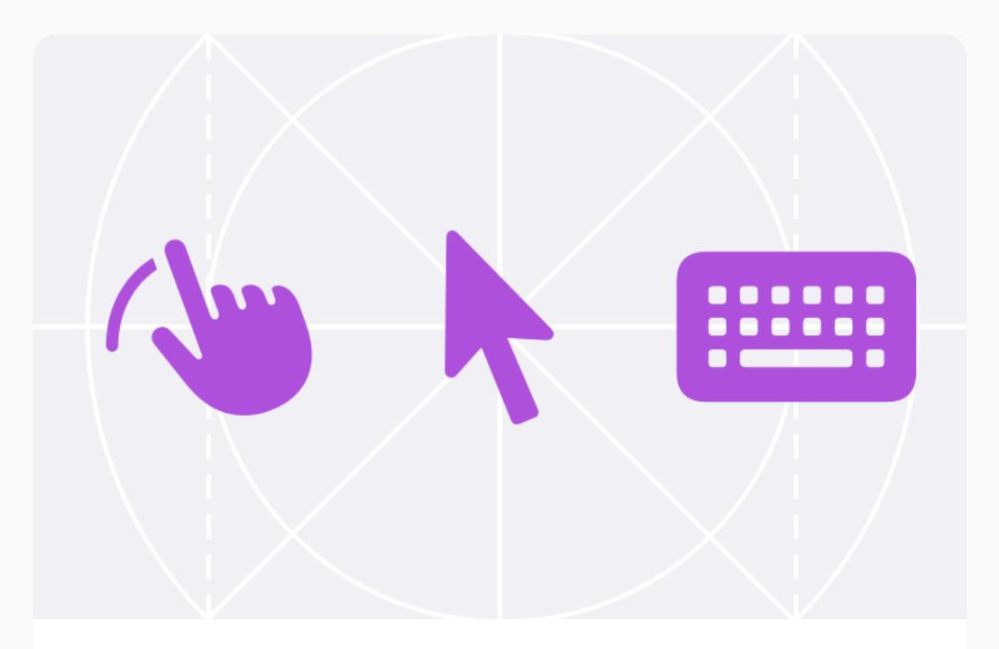

### **Inputs**

Learn about the various methods people use to control your app or game and enter data.

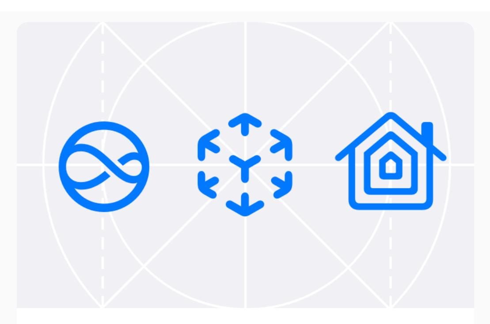

## **Technologies**

Discover the Apple technologies, features, and services you can integrate into your app or game.

[Learn](https://developer.apple.com/design/human-interface-guidelines/technologies) more

## **Assemble your toolbox**

Like all craftspeople, good designers need proper tools. Your list of equipment begins with the Apple Design Resources, the building blocks of Apple design. The Apple Design Resources include the fonts, icons, product bezels, and other materials you'll need to get started, as well as design templates for Figma, Sketch, Photoshop, and Keynote. You'll also want to explore SF Symbols, a library of more than 6,000 symbols that integrate seamlessly with Apple platforms.

Browse the Apple Design [Resources](https://developer.apple.com/design/resources/)

Prototyping is the art of generating, testing, and validating new ideas. Start by setting aside a few hours for a tutorial that walks you through the basics of the prototyping process. To get a little more insight into the process — and travel back in time — check out a vintage but timeless video about what prototyping can mean in practice.

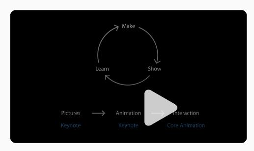

**[Prototyping:](https://developer.apple.com/videos/play/wwdc2014/223/) Fake it till you make it 60-second [prototyping](https://developer.apple.com/videos/play/wwdc2017/818/)**

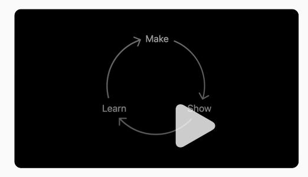

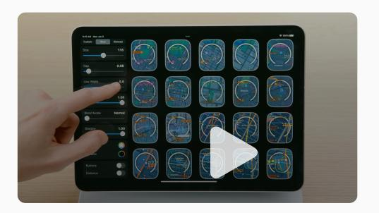

**Design with [SwiftUI](https://developer.apple.com/videos/play/wwdc2023/10115/)**

## **Get inspiration from the developer community**

The Apple developer community is an incredible source of groundbreaking ideas. Find out how to get ideas, approach challenges, and solve problems.

Browse design articles and [developer](https://developer.apple.com/design/whats-new/) profiles Read the remarkable stories of Apple Design Award winners and finalists.

## Apple Design [Awards](https://developer.apple.com/design/awards/)

Check out the complete list of Apple Design Award winners and finalists.

#### 10 Questions with Design [Evangelism](https://developer.apple.com/news/?id=s8sl4tpa)

Get insights from Apple designers on everything from philosophy to simplification to what you can do when something just doesn't feel right.

## Meet the [prototypers](https://developer.apple.com/news/?id=97dgimaa)

Find out how members of the Apple Prototyping team create useful prototypes, get external feedback, and bring a little sparkle to their work.

## **Go further**

The tools and links above are enough to get you started — but they're only the beginning. The links below will help you explore the community, keep up with the latest news, and get access to Apple tools and documentation. Don't worry about plunging into all this at once. Just keep in mind that all great designers started on Day 1 with a basic set of tools, a blank canvas, and their imagination. We can't wait to see what you come up with.

## Find out [what's](https://developer.apple.com/design/whats-new/) new in design

Discover the latest inspirational designs, videos, articles, resources, and updates to design guidance.

## [Browse](https://developer.apple.com/videos/design) videos

Explore the full collection of WWDC design videos.

### Browse [developer](https://developer.apple.com/events/) activities

Join us in person and online for design workshops, labs, and appointments — tailored for you.

## **Discover more**

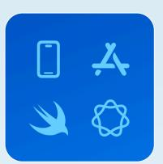

#### **[Pathways](https://developer.apple.com/pathways/)**

Explore more Apple platforms and technologies.

Learn more 

#### **Meet with Apple**

Join us for sessions, workshops, labs, and [appointments](https://developer.apple.com/events/) — tailored for you.

Learn more 

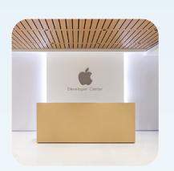

### **Apple [Developer](https://developer.apple.com/events/developer-centers/) Centers**

The home for in-person events and activities around the world.

#### **WWDC [highlights](https://developer.apple.com/wwdc/)**

Apple's biggest event of the year for developers.

Learn more

[Developer](https://developer.apple.com/) [Design](https://developer.apple.com/design/) Get started

**Platforms** [iOS](https://developer.apple.com/ios/) [iPadOS](https://developer.apple.com/ipados/) [macOS](https://developer.apple.com/macos/) [tvOS](https://developer.apple.com/tvos/) [visionOS](https://developer.apple.com/visionos/) [watchOS](https://developer.apple.com/watchos/) **Tools** [Swift](https://developer.apple.com/swift/)

[SwiftUI](https://developer.apple.com/swiftui/) Swift [Playground](https://developer.apple.com/swift-playground/) [TestFlight](https://developer.apple.com/testflight/) [Xcode](https://developer.apple.com/xcode/) [Xcode](https://developer.apple.com/xcode-cloud/) Cloud Icon [Composer](https://developer.apple.com/icon-composer/) SF [Symbols](https://developer.apple.com/sf-symbols/)

[Accessibility](https://developer.apple.com/accessibility/) [Accessories](https://developer.apple.com/accessories/) Apple [Intelligence](https://developer.apple.com/apple-intelligence/) App [Store](https://developer.apple.com/app-store/) Audio & [Video](https://developer.apple.com/audio/) [Augmented](https://developer.apple.com/augmented-reality/) Reality [Business](https://developer.apple.com/business/) [Design](https://developer.apple.com/design/) [Distribution](https://developer.apple.com/distribute/) [Education](https://developer.apple.com/education/) [Fonts](https://developer.apple.com/fonts/) [Games](https://developer.apple.com/games/) Health & [Fitness](https://developer.apple.com/health-fitness/) In-App [Purchase](https://developer.apple.com/in-app-purchase/) [Localization](https://developer.apple.com/localization/) Maps & [Location](https://developer.apple.com/maps/) Machine [Learning](https://developer.apple.com/machine-learning/) & AI Open [Source](https://opensource.apple.com/)

[Security](https://developer.apple.com/security/) [Safari](https://developer.apple.com/safari/) & Web

**Topics & Technologies**

**Resources**

[Documentation](https://developer.apple.com/documentation/) [Sample](https://developer.apple.com/documentation/samplecode) Code [Tutorials](https://developer.apple.com/learn/) [Downloads](https://developer.apple.com/download/) [Forums](https://developer.apple.com/forums/) [Videos](https://developer.apple.com/videos/)

**Support**

[Support](https://developer.apple.com/support/articles/) Articles [Contact](https://developer.apple.com/contact/) Us Bug [Reporting](https://developer.apple.com/bug-reporting/) [System](https://developer.apple.com/system-status/) Status

**Account**

Apple [Developer](https://developer.apple.com/account/) App Store [Connect](https://appstoreconnect.apple.com/) [Certificates,](https://developer.apple.com/account/ios/certificate/) IDs, & Profiles [Feedback](https://feedbackassistant.apple.com/) Assistant

**Programs**

Apple [Developer](https://developer.apple.com/programs/) Program

Apple Developer [Enterprise](https://developer.apple.com/programs/enterprise/) Program App Store Small [Business](https://developer.apple.com/app-store/small-business-program/) Program

MFi [Program](https://mfi.apple.com/)

Mini Apps Partner [Program](https://developer.apple.com/programs/mini-apps-partner/) News Partner [Program](https://developer.apple.com/programs/news-partner/) Video Partner [Program](https://developer.apple.com/programs/video-partner/) Security Bounty [Program](https://developer.apple.com/security-bounty/)

Security [Research](https://developer.apple.com/programs/security-research-device/) Device Program

**Events**

Meet with [Apple](https://developer.apple.com/events/)

Apple [Developer](https://developer.apple.com/events/developer-centers/) Centers App Store [Awards](https://developer.apple.com/app-store/app-store-awards/) Apple Design [Awards](https://developer.apple.com/design/awards/) Apple Developer [Academies](https://developer.apple.com/academies/)

[WWDC](https://developer.apple.com/wwdc/)

Get the Apple [Developer](https://apps.apple.com/us/app/apple-developer/id640199958) app. Light Dark Auto

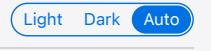