# **Human Interface Guidelines**

The HIG contains guidance and best practices that can help you design a great experience for any Apple platform.

As you design interfaces for Apple platforms, keep these principles in mind:

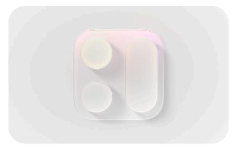

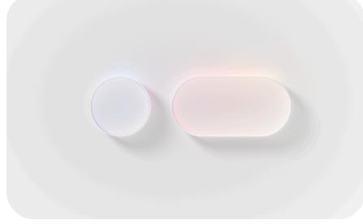

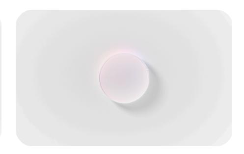

Establish a clear visual hierarchy where controls and interface elements elevate and distinguish the content beneath them.

Align with the concentric design of the hardware and software to create harmony between interface elements, system experiences, and devices.

### **[Hierarchy](#page-0-0) [Harmony](#page-0-1) [Consistency](#page-0-2)**

Adopt platform conventions to maintain a consistent design that continuously adapts across window sizes and displays.

For developer guidance, see [Adopting](https://developer.apple.com/documentation/TechnologyOverviews/adopting-liquid-glass) Liquid Glass.

# **Design [fundamentals](#page-0-3)**

**App [icons](https://developer.apple.com/design/human-interface-guidelines/app-icons) [Color](https://developer.apple.com/design/human-interface-guidelines/color) [Materials](https://developer.apple.com/design/human-interface-guidelines/materials)**

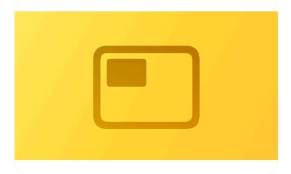

**[Layout](https://developer.apple.com/design/human-interface-guidelines/layout) [Icons](https://developer.apple.com/design/human-interface-guidelines/icons) [Accessibility](https://developer.apple.com/design/human-interface-guidelines/accessibility)**

# **New and [updated](#page-1-0)**

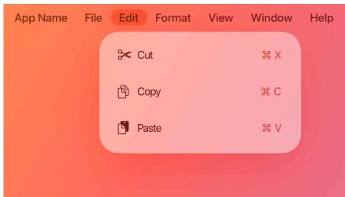

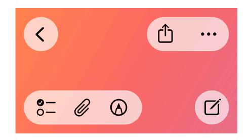

**[Multitasking](https://developer.apple.com/design/human-interface-guidelines/multitasking) The [menu](https://developer.apple.com/design/human-interface-guidelines/the-menu-bar) bar [Toolbars](https://developer.apple.com/design/human-interface-guidelines/toolbars)**

**[Search](https://developer.apple.com/design/human-interface-guidelines/search-fields) fields Game [Center](https://developer.apple.com/design/human-interface-guidelines/game-center) [Generative](https://developer.apple.com/design/human-interface-guidelines/generative-ai) AI**

# **[Topics](#page-1-1)**

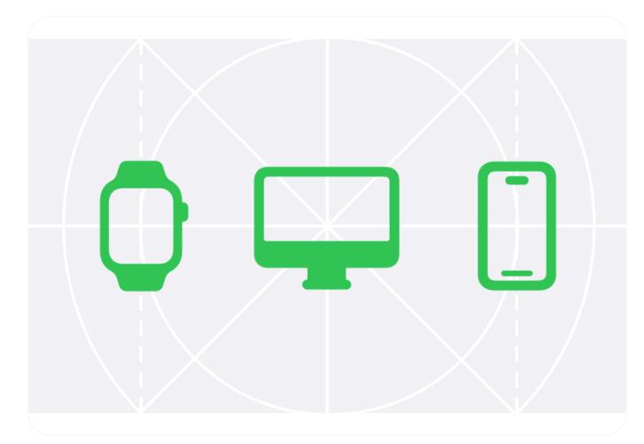

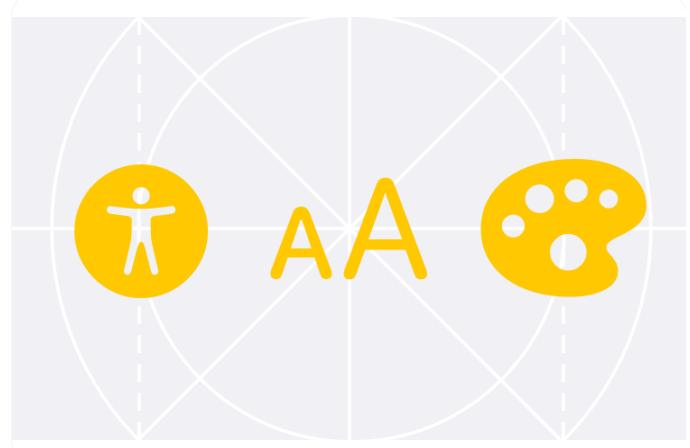

### **[Getting](https://developer.apple.com/design/human-interface-guidelines/getting-started) started**

Create an app or game that feels at home on every platform you support.

Learn More

### **[Foundations](https://developer.apple.com/design/human-interface-guidelines/foundations)**

Understand how fundamental design elements help you create rich experiences.

Learn More

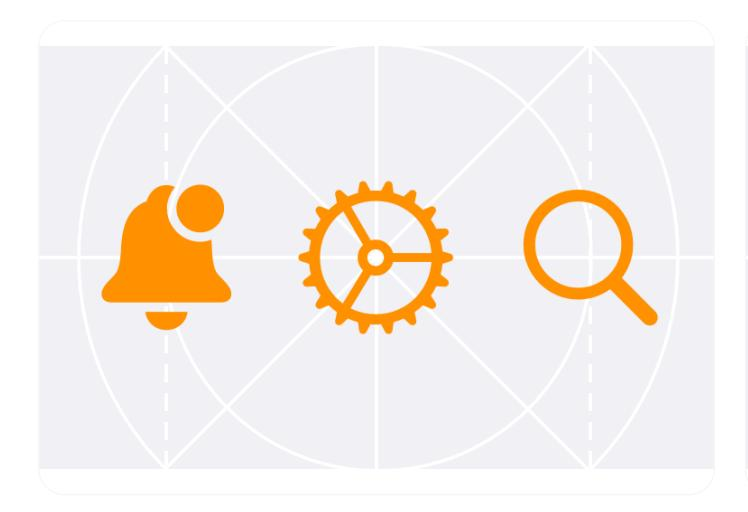

#### **Patterns**

Get design guidance for supporting common user actions, tasks, and [experiences.](https://developer.apple.com/design/human-interface-guidelines/patterns)

Learn More

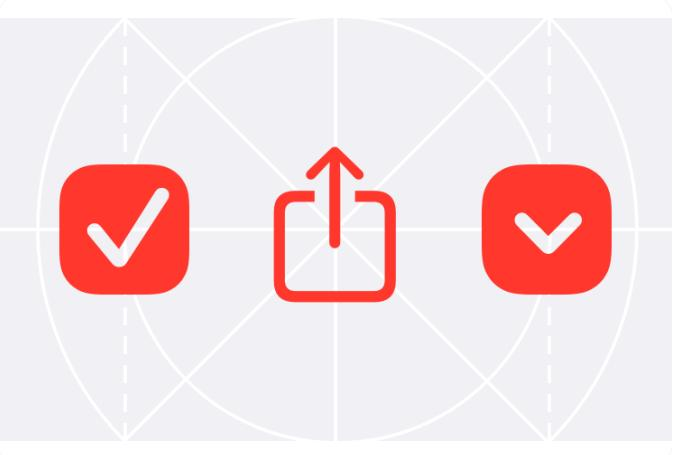

#### **[Components](https://developer.apple.com/design/human-interface-guidelines/components)**

Learn how to use and customize system-defined components to give people a familiar and consistent experience.

Learn More

#### **[Inputs](https://developer.apple.com/design/human-interface-guidelines/inputs)**

Learn about the various methods people use to control your app or game and enter data.

Learn More

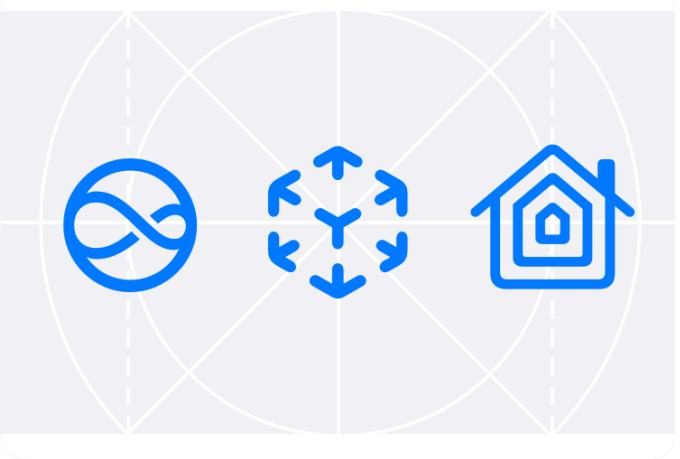

#### **[Technologies](https://developer.apple.com/design/human-interface-guidelines/technologies)**

Discover the Apple technologies, features, and services you can integrate into your app or game.

Learn More