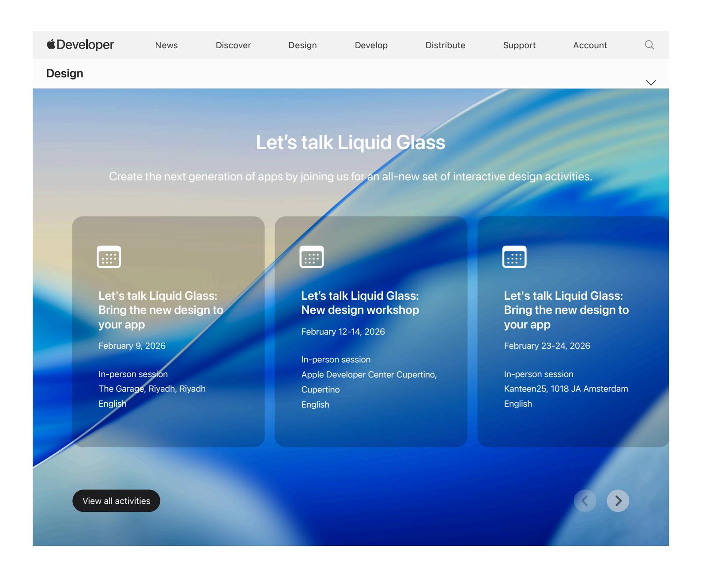

## **What's new**

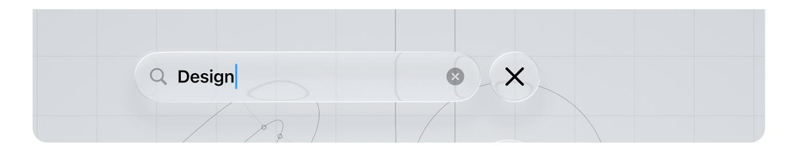

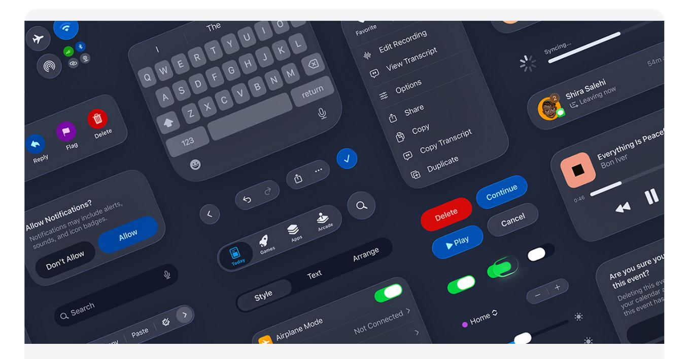

### **Apple Design [Resources](https://developer.apple.com/design/resources/)**

Design apps with official templates for Figma and Sketch, color guides, and more.

Dive into resources 

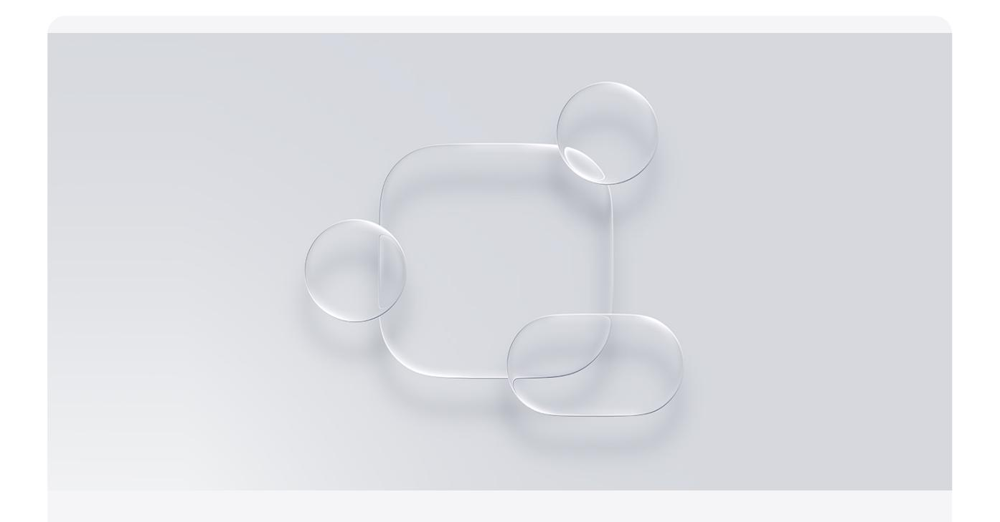

### **Adopt [Liquid](https://developer.apple.com/documentation/technologyoverviews/adopting-liquid-glass) Glass**

Find out how to bring the new material to your app.

### **[Explore](https://developer.apple.com/design/human-interface-guidelines/) the new design**

Dive into the incredible new design across Apple platforms.

Visit the Human Interface Guidelines 

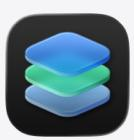

### **Create with Icon [Composer](https://developer.apple.com/icon-composer/)**

Build app icons for the new design, and apply real-time dynamic properties and other effects.

Find out more 

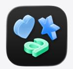

### **[Discover](https://developer.apple.com/sf-symbols/) SF Symbols 7**

Learn about new features like Draw, Variable Draw, New Annotation, and Enhanced Magic Replace.

# **Watch design videos**

Learn about designing great experiences from Apple experts.

[Browse](https://developer.apple.com/videos/design/) all design videos 

**Meet [Liquid](https://developer.apple.com/videos/play/wwdc2025/219/) Glass**

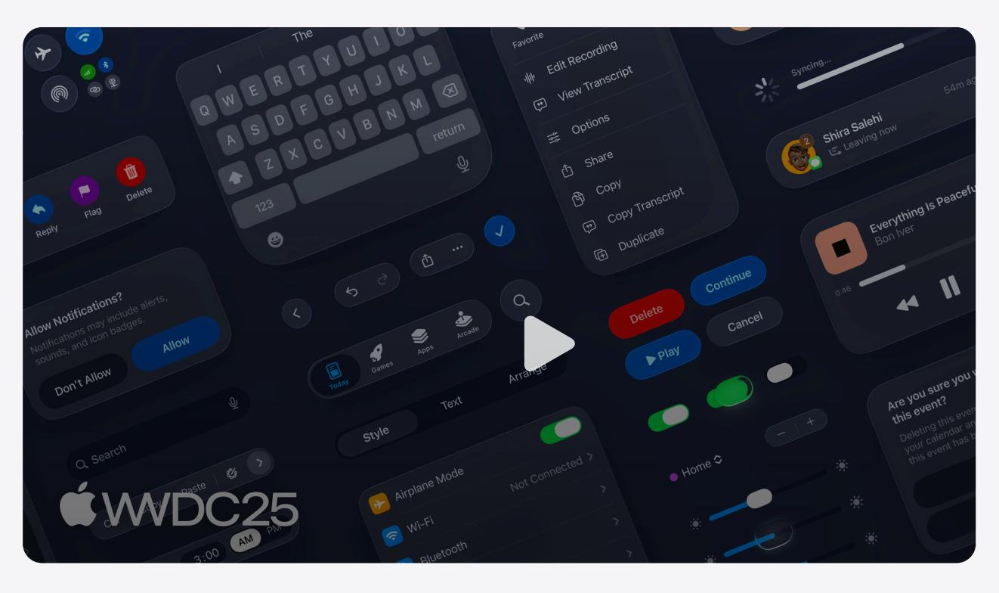

**Get to know the new design [system](https://developer.apple.com/videos/play/wwdc2025/356/)**

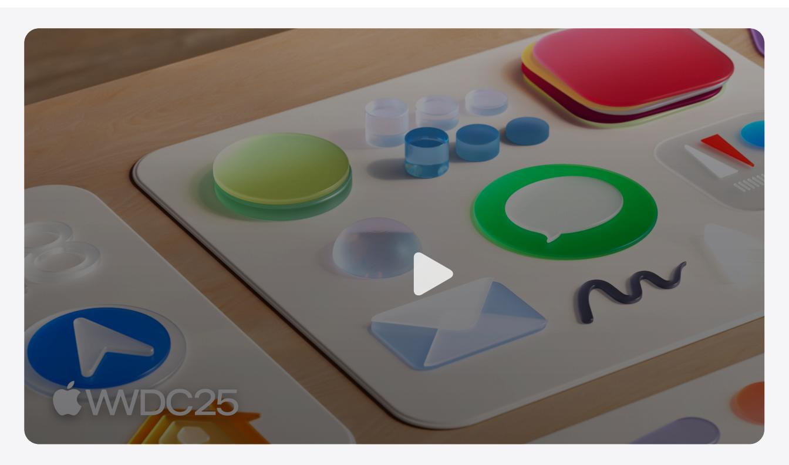

**Say hello to the new look of app [icons](https://developer.apple.com/videos/play/wwdc2025/220/)**

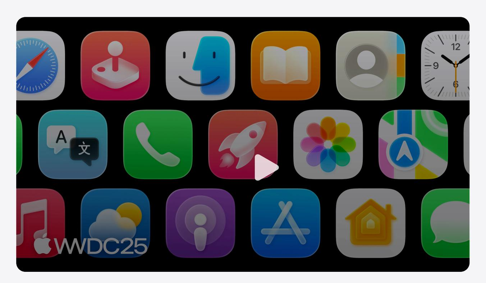

**Create icons with Icon [Composer](https://developer.apple.com/videos/play/wwdc2025/361/)**

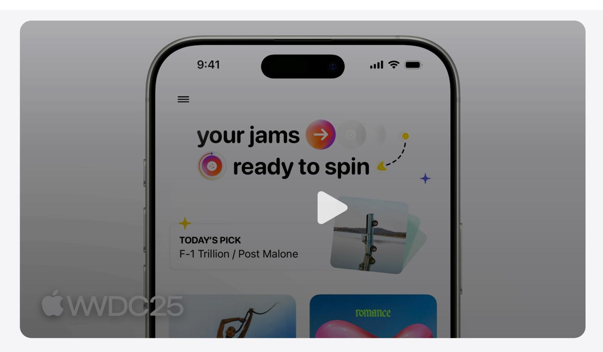

**Design [foundations](https://developer.apple.com/videos/play/wwdc2025/359/) from idea to interface**

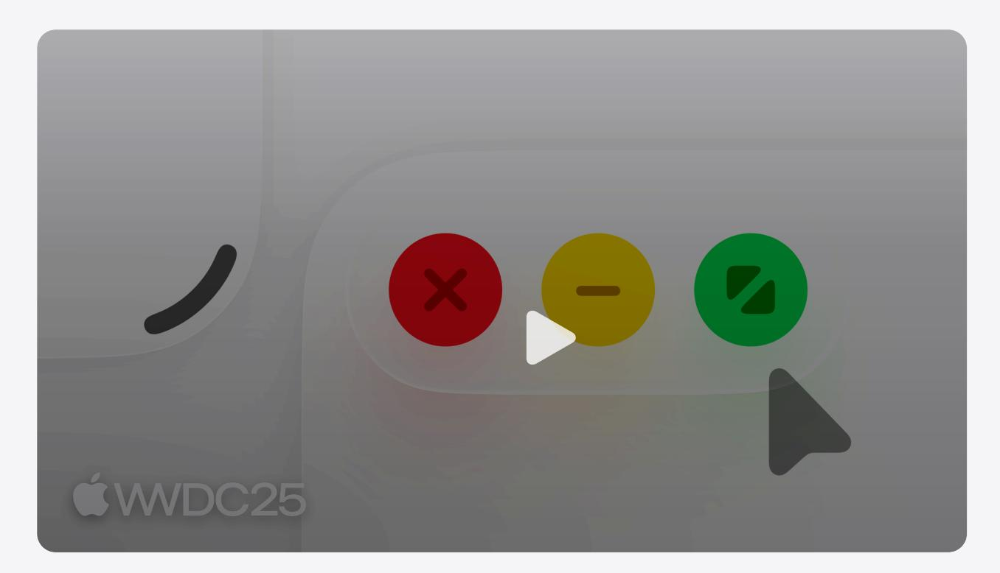

**[Elevate](https://developer.apple.com/videos/play/wwdc2025/208/) the design of your iPad app**

# **Developer stories**

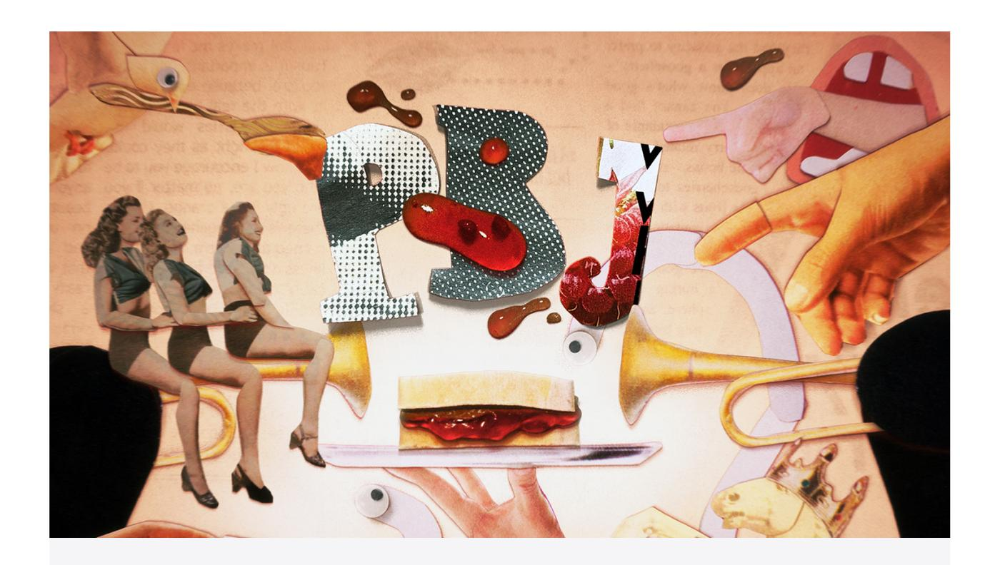

#### **[Spreading](https://developer.apple.com/articles/pbj-the-musical/) joy with PBJ**

Go behind the scenes with PBJ – The Musical, a charming Apple Design Award winner with impressive production values.

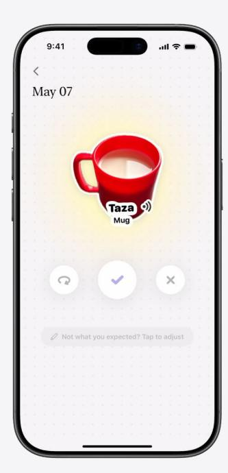

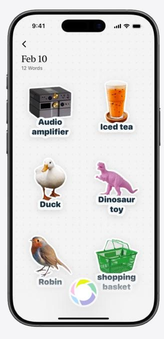

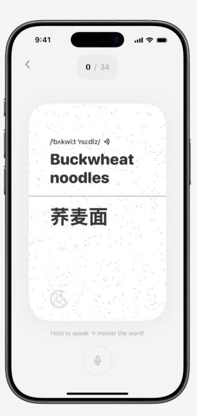

#### **The appealing design of CapWords**

The Apple Design Award winner leverages a lot of [cutting-edge](https://developer.apple.com/articles/capwords/) technology for an app that was partly invented by a 3-year-old.

Read more

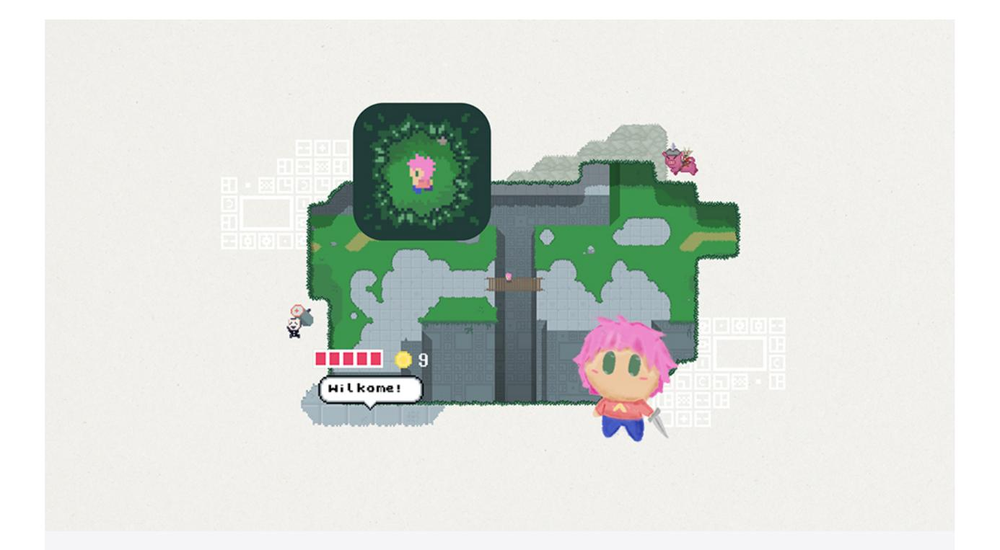

### **The retro wonder of [Afterplace](https://developer.apple.com/news/?id=3exkgv43)**

Embark on a retro adventure full of friendly rabbits, sarcastic vending machines, and vintage villains.

#### Read more

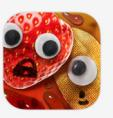

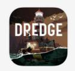

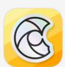

**Apple Design Awards**

Celebrate innovation, ingenuity, and technical [achievement](https://developer.apple.com/design/awards/) in app and game design.

Meet this year's winners and finalists 

### **New to design?**

Get started with our Design Pathway, a simple and [easy-to-navigate](https://developer.apple.com/design/get-started/) collection of the videos, documentation, and resources you'll need to start designing great apps and games.

Start the Pathway

| Platforms        | Topics & Technologies | Resources                     | Programs                           |
|------------------|-----------------------|-------------------------------|------------------------------------|
| iOS              | Accessibility         | Documentation                 | Apple Developer Program            |
| iPadOS           | Accessories           | Sample Code                   | Apple Developer Enterprise Program |
| macOS            | Apple Intelligence    | Tutorials                     | App Store Small Business Program   |
| tvOS             | App Store             | Downloads                     | MFi Program                        |
| visionOS         | Audio & Video         | Forums                        | Mini Apps Partner Program          |
| watchOS          | Augmented Reality     | Videos                        | News Partner Program               |
|                  | Business              |                               | Video Partner Program              |
| Tools            | Design                | Support                       | Security Bounty Program            |
| Swift            | Distribution          | Support Articles              | Security Research Device Program   |
| SwiftUI          | Education             | Contact Us                    |                                    |
| Swift Playground | Fonts                 | Bug Reporting                 | Events                             |
| TestFlight       | Games                 | System Status                 | Meet with Apple                    |
|                  |                       |                               |                                    |
| Xcode            |                       |                               | Apple Developer Centers            |
| Xcode Cloud      | Health & Fitness      | Account                       | App Store Awards                   |
| Icon Composer    | In-App Purchase       | Apple Developer               | Apple Design Awards                |
| SF Symbols       | Localization          | App Store Connect             | Apple Developer Academies          |
|                  | Maps & Location       | Certificates, IDs, & Profiles | WWDC                               |
|                  | Machine Learning & AI | Feedback Assistant            |                                    |
|                  | Open Source           |                               |                                    |
|                  | Security              |                               |                                    |
|                  | Safari & Web          |                               |                                    |

