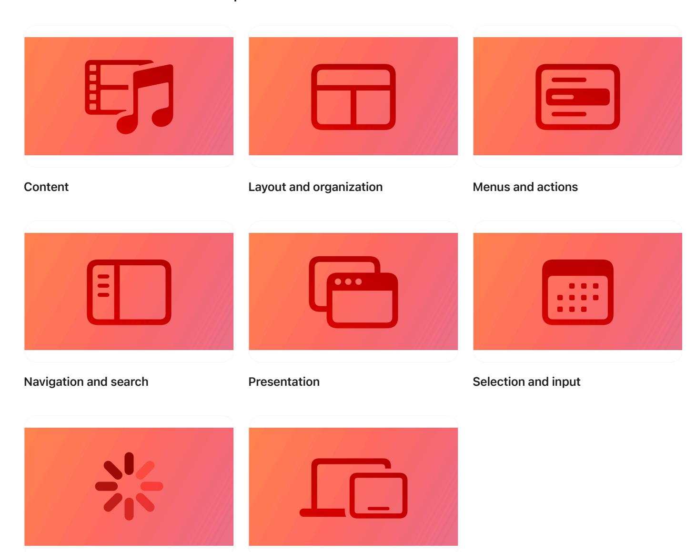

**[Design](https://developer.apple.com/design/)** [Overview](https://developer.apple.com/design/) [What's](https://developer.apple.com/design/whats-new/) New Get [Started](https://developer.apple.com/design/get-started/) [Guidelines](https://developer.apple.com/design/human-interface-guidelines) [Resources](https://developer.apple.com/design/resources/)

## **Components**

**[Status](https://developer.apple.com/design/human-interface-guidelines/status) System [experiences](https://developer.apple.com/design/human-interface-guidelines/system-experiences)**

Learn how to use and customize system-defined components to give people a familiar and consistent experience.

