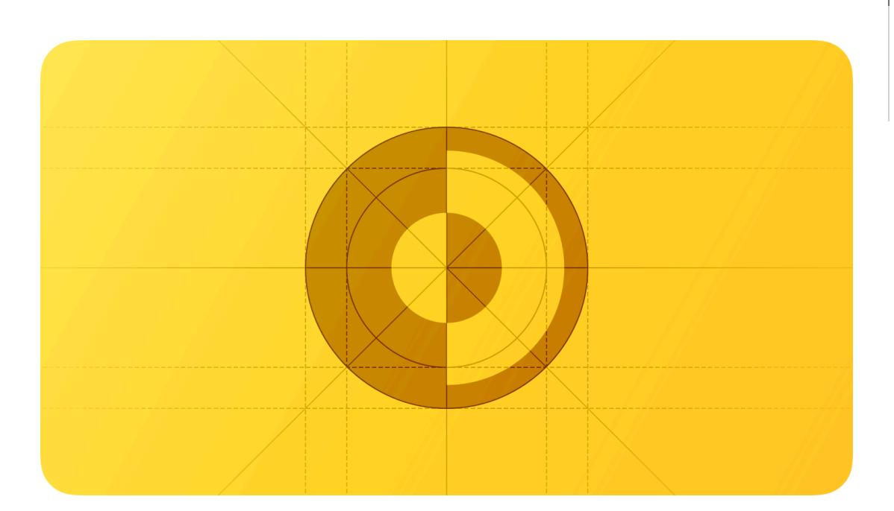
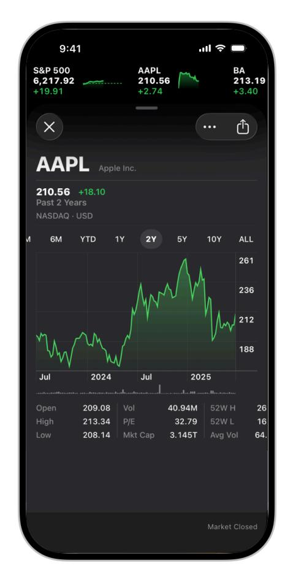
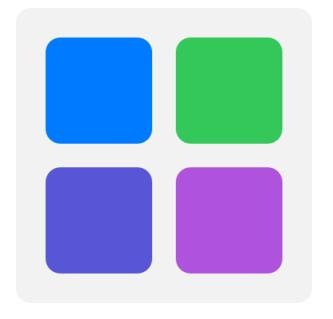
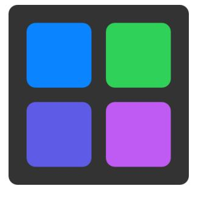
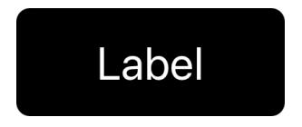

# **Dark Mode**

Dark Mode is a systemwide appearance setting that uses a dark color palette to provide a comfortable viewing experience tailored for low-light environments.

**Supported platforms**

Dark [Mode](#page-0-1) Best [practices](#page-0-0) Dark Mode [colors](#page-1-0) Platform [considerations](#page-3-0) [Resources](#page-5-0) [Change](#page-5-1) log

In iOS, iPadOS, macOS, and tvOS, people often choose Dark Mode as their default interface style, and they generally expect all apps and games to respect their preference. In Dark Mode, the system uses a dark color palette for all screens, views, menus, and controls, and may also use greater perceptual contrast to make foreground content stand out against the darker backgrounds.

## **Best [practices](#page-0-0)**

**Avoid offering an app-specific appearance setting.** An app-specific appearance mode option creates more work for people because they have to adjust more than one setting to get the appearance they want. Worse, they may think your app is broken because it doesn't respond to their systemwide appearance choice.

**Ensure that your app looks good in both appearance modes.** In addition to using one mode or the other, people can choose the Auto appearance setting, which switches between the light and dark appearances as conditions change throughout the day, potentially while your app is running.

**Test your content to make sure that it remains comfortably legible in both appearance modes.** For example, in Dark Mode with Increase Contrast and Reduce Transparency turned on (both separately and together), you may find places where dark text is less legible when it's on a dark background. You might also find that turning on Increase Contrast in Dark Mode can result in reduced visual contrast between dark text and a dark background. Although people with

strong vision might still be able to read lower contrast text, such text could be illegible for many. For guidance, see [Accessibility](https://developer.apple.com/design/human-interface-guidelines/accessibility).

**In rare cases, consider using only a dark appearance in the interface.** For example, it can make sense for an app that supports immersive media viewing to use a permanently dark appearance that lets the UI recede and helps people focus on the media.

The Stocks app uses a dark-only appearance

### **Dark Mode [colors](#page-1-0)**

The color palette in Dark Mode includes dimmer background colors and brighter foreground colors. It's important to realize that these colors aren't necessarily inversions of their light counterparts: while many colors are inverted, some are not. For more information, see [Specifications](https://developer.apple.com/design/human-interface-guidelines/color#Specifications).

**Embrace colors that adapt to the current appearance.** Semantic colors (like *[labelColor](https://developer.apple.com/documentation/AppKit/NSColor/labelColor)* and *[controlColor](https://developer.apple.com/documentation/AppKit/NSColor/controlColor)* in macOS or *[separator](https://developer.apple.com/documentation/UIKit/UIColor/separator)* in iOS and iPadOS) automatically adapt to the current appearance. When you need a custom color, add a Color Set asset to your app's asset catalog in Xcode, and specify the bright and dim variants of the color. Avoid using hard-coded color values or colors that don't adapt.

System colors in the light appearance System colors in the dark appearance

**Aim for sufficient color contrast in all appearances.** Using system-defined colors can help you achieve a good contrast ratio between your foreground and background content. At a minimum, make sure the contrast ratio between colors is no lower than 4.5:1. For custom foreground and background colors, strive for a contrast ratio of 7:1, especially in small text. This ratio ensures that your foreground content stands out from the background, and helps your content meet recommended accessibility guidelines.

**Soften the color of white backgrounds.** If you display a content image that includes a white background, consider slightly darkening the image to prevent the background from glowing in the surrounding Dark Mode context.

#### **Icons and [images](#page-2-0)**

The system uses SF [Symbols](https://developer.apple.com/design/human-interface-guidelines/sf-symbols) (which automatically adapt to Dark Mode) and full-color images that are optimized for both the light and dark appearances.

**Use SF Symbols wherever possible.** Symbols work well in both appearance modes when you use dynamic colors to tint them or when you add vibrancy. For guidance, see [Color.](https://developer.apple.com/design/human-interface-guidelines/color)

**Design separate interface icons for the light and dark appearances if necessary.** For example, an icon that depicts a full moon might need a subtle dark outline to contrast well with a light background, but need no outline when it displays on a dark background. Similarly, an icon that represents a drop of oil might need a slight border to make the edge visible against a dark background.

Icon in the light appearance with no border Icon in the dark appearance with border for better

contrast

**Make sure full-color images and icons look good in both appearances.** Use the same asset if it looks good in both the light and dark appearances. If an asset looks good in only one mode, modify the asset or create separate light and dark assets. Use asset catalogs to combine your assets into a single named image.

Illustration on a light background On a dark background, the same illustration has poor contrast and many details are lost

Illustration adjusted for better contrast on a dark background

#### **[Text](#page-3-1)**

The system uses vibrancy and increased contrast to maintain the legibility of text on darker backgrounds.

**Use the system-provided label colors for labels.** The primary, secondary, tertiary, and quaternary label colors adapt automatically to the light and dark appearances.

Primary label in the light appearance Secondary label in the dark appearance

**Use system views to draw text fields and text views.** System views and controls make your app's text look good on all backgrounds, adjusting automatically for the presence or absence of vibrancy. When possible, use a system-provided view to display text instead of drawing the text yourself.

#### **Platform [considerations](#page-3-0)**

*No additional considerations for tvOS. Dark Mode isn't supported in visionOS or watchOS.*

#### **iOS, [iPadOS](#page-3-2)**

In Dark Mode, the system uses two sets of background colors — called *base* and *elevated* — to enhance the perception of depth when one dark interface is layered above another. The base colors are dimmer, making background interfaces appear to recede, and the elevated colors are brighter, making foreground interfaces appear to advance.

Base Elevated Light

**Prefer the system background colors.** Dark Mode is dynamic, which means that the background color automatically changes from base to elevated when an interface is in the foreground, such as a popover or modal sheet. The system also uses the elevated background color to provide visual separation between apps in a multitasking environment and between windows in a multiple-window context. Using a custom background color can make it harder for people to perceive these system-provided visual distinctions.

#### **[macOS](#page-4-0)**

When people choose the graphite accent color in General settings, macOS causes window backgrounds to pick up color from the current desktop picture. The result — called *desktop tinting* — is a subtle effect that helps windows blend more harmoniously with their surrounding content.

#### **Include some transparency in custom component backgrounds when appropriate.**

Transparency lets your components pick up color from the window background when desktop tinting is active, creating a visual harmony that can persist even when the desktop picture changes. To help achieve this harmony, add transparency only to a custom component that has a visible background or bezel, and only when the component is in a neutral state, such as state that doesn't use color. You don't want to add transparency when the component is in a state that uses color, because doing so can cause the component's color to fluctuate when the window background adjusts to a different location on the desktop or when the desktop picture changes.

#### **[Resources](#page-5-0)**

#### **[Related](#page-5-2)**

[Color](https://developer.apple.com/design/human-interface-guidelines/color)

[Materials](https://developer.apple.com/design/human-interface-guidelines/materials)

[Typography](https://developer.apple.com/design/human-interface-guidelines/typography)

#### **[Videos](#page-5-3)**

**Meet [Liquid](https://developer.apple.com/videos/play/wwdc2025/219) Glass [Implementing](https://developer.apple.com/videos/play/wwdc2019/214) Dark Mode on iOS**

#### **[Change](#page-5-1) log**

**Date Changes**

August 6, 2024 Added art contrasting the light and dark appearances.