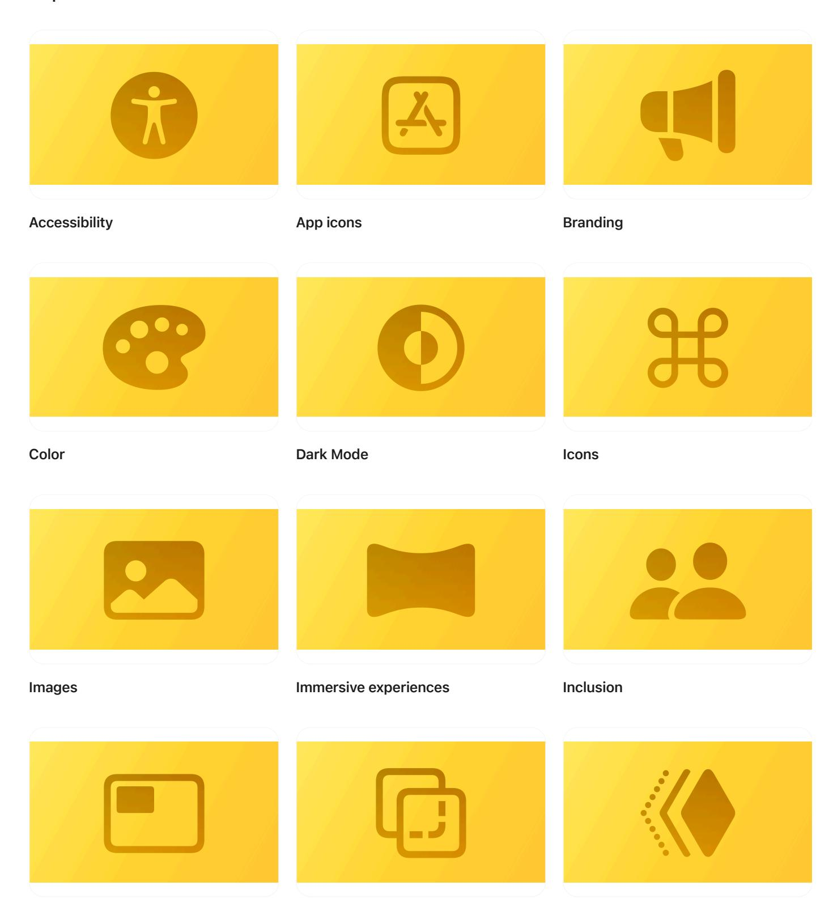
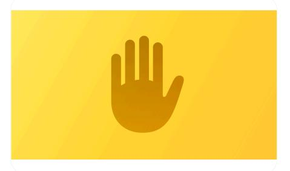
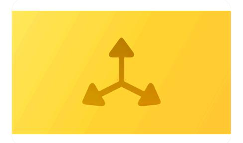

**[Design](https://developer.apple.com/design/)** [Overview](https://developer.apple.com/design/) [What's](https://developer.apple.com/design/whats-new/) New Get [Started](https://developer.apple.com/design/get-started/) [Guidelines](https://developer.apple.com/design/human-interface-guidelines) [Resources](https://developer.apple.com/design/resources/)

## **Foundations**

Understand how fundamental design elements help you create rich experiences.

**[Layout](https://developer.apple.com/design/human-interface-guidelines/layout) [Materials](https://developer.apple.com/design/human-interface-guidelines/materials) [Motion](https://developer.apple.com/design/human-interface-guidelines/motion)**

**[Privacy](https://developer.apple.com/design/human-interface-guidelines/privacy) [Right](https://developer.apple.com/design/human-interface-guidelines/right-to-left) to left SF [Symbols](https://developer.apple.com/design/human-interface-guidelines/sf-symbols)**

**[Spatial](https://developer.apple.com/design/human-interface-guidelines/spatial-layout) layout [Typography](https://developer.apple.com/design/human-interface-guidelines/typography) [Writing](https://developer.apple.com/design/human-interface-guidelines/writing)**