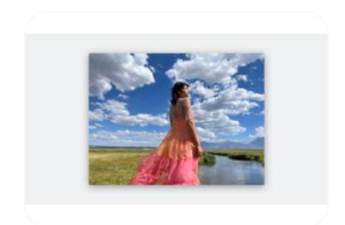
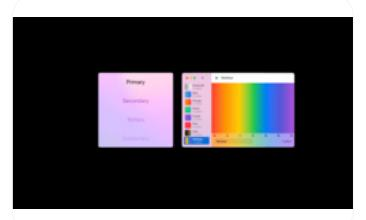

# **Image views**

An image view displays a single image — or in some cases, an animated sequence of images — on a transparent or opaque background.

**Supported platforms**

[Image](#page-0-2) views Best [practices](#page-0-0)

[Content](#page-0-1) Platform [considerations](#page-1-0)

[Resources](#page-2-0)

[Change](#page-2-1) log

Within an image view, you can stretch, scale, size to fit, or pin the image to a specific location. Image views are typically not interactive.

## **Best [practices](#page-0-0)**

**Use an image view when the primary purpose of the view is simply to display an image.** In rare cases where you might want an image to be interactive, configure a system-provided [button](https://developer.apple.com/design/human-interface-guidelines/buttons) to display the image instead of adding button behaviors to an image view.

**If you want to display an icon in your interface, consider using a symbol or interface icon instead of an image view.** SF [Symbols](https://developer.apple.com/design/human-interface-guidelines/sf-symbols) provides a large library of streamlined, vector-based images that you can render with various colors and opacities. An [icon](https://developer.apple.com/design/human-interface-guidelines/icons) (also called a glyph or template image) is typically a bitmap image in which the nontransparent pixels can receive color. Both symbols and interface icons can use the accent colors people choose.

## **[Content](#page-0-1)**

An image view can contain rich image data in various formats, like PNG, JPEG, and PDF. For more guidance, see [Images.](https://developer.apple.com/design/human-interface-guidelines/images)

**Take care when overlaying text on images.** Compositing text on top of images can decrease both the clarity of the image and the legibility of the text. To help improve the results, ensure the text contrasts well with the image, and consider ways to make the text object stand out, like adding a text shadow or background layer.

**Aim to use a consistent size for all images in an animated sequence.** When you prescale images to fit the view, the system doesn't have to perform any scaling. In cases where the system must do the scaling, performance is generally better when all images are the same size and shape.

## **Platform [considerations](#page-1-0)**

*No additional considerations for iOS or iPadOS.*

#### **[macOS](#page-1-1)**

**If your app needs an editable image view, use an image well.** An [image](https://developer.apple.com/design/human-interface-guidelines/image-wells) well is an image view that supports copying, pasting, dragging, and using the Delete key to clear its content.

**Use an image button instead of an image view to make a clickable image.** An image [button](https://developer.apple.com/design/human-interface-guidelines/buttons#Image-buttons) contains an image or icon, appears in a view, and initiates an instantaneous app-specific action.

#### **[tvOS](#page-1-2)**

Many tvOS images combine multiple layers with transparency to create a feeling of depth. For guidance, see [Layered](https://developer.apple.com/design/human-interface-guidelines/images#Layered-images) images.

### **[visionOS](#page-1-3)**

Windows in visionOS apps and games can use image views to display 2D and stereoscopic images, as well as spatial photos. If your app uses RealityKit, you can also display images of any type outside of image views next to 3D content, or generate a spatial scene from an existing 2D image. For design guidance, see Images > [visionOS](https://developer.apple.com/design/human-interface-guidelines/images#visionOS); for developer guidance, see *[Image](https://developer.apple.com/documentation/RealityKit/ImagePresentationComponent) [PresentationComponent](https://developer.apple.com/documentation/RealityKit/ImagePresentationComponent)*.

For guidance on presenting other 3D content in a window or volume, see [Windows](https://developer.apple.com/design/human-interface-guidelines/windows#visionOS) > visionOS.

#### **[watchOS](#page-1-4)**

**Use SwiftUI to create animations when possible.** Alternatively, you can use WatchKit to animate a sequence of images within an image element if necessary. For developer guidance, see *[WKImageAnimatable](https://developer.apple.com/documentation/WatchKit/WKImageAnimatable)*.

## **[Resources](#page-2-0)**

#### **[Related](#page-2-2)**

[Images](https://developer.apple.com/design/human-interface-guidelines/images)

[Image](https://developer.apple.com/design/human-interface-guidelines/image-wells) wells

Image [buttons](https://developer.apple.com/design/human-interface-guidelines/buttons#Image-buttons)

SF [Symbols](https://developer.apple.com/design/human-interface-guidelines/sf-symbols)

#### **Developer [documentation](#page-2-3)**

*[Image](https://developer.apple.com/documentation/SwiftUI/Image)* — SwiftUI

*[UIImageView](https://developer.apple.com/documentation/UIKit/UIImageView)* — UIKit

*[NSImageView](https://developer.apple.com/documentation/AppKit/NSImageView)* — AppKit

#### **[Videos](#page-2-4)**

**[Support](https://developer.apple.com/videos/play/wwdc2023/10181) HDR images in your app**

**Add rich [graphics](https://developer.apple.com/videos/play/wwdc2021/10021) to your SwiftUI app**

# **[Change](#page-2-1) log**

**Date Changes**

June 21, 2023 Updated to include guidance for visionOS.