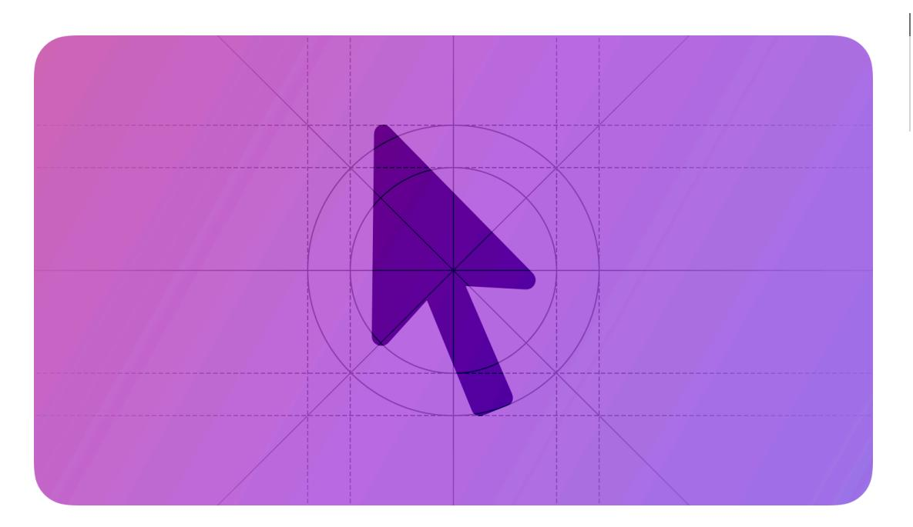
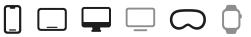
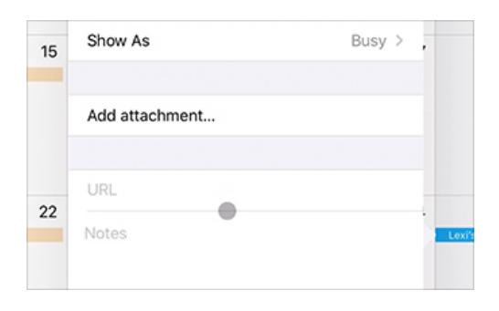
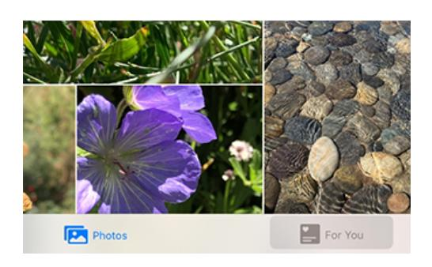
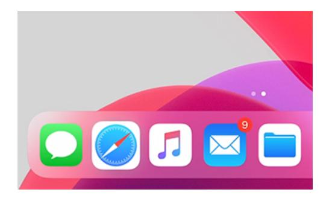
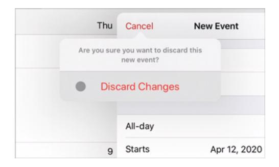
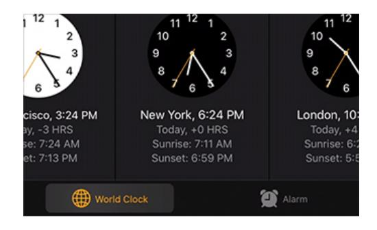
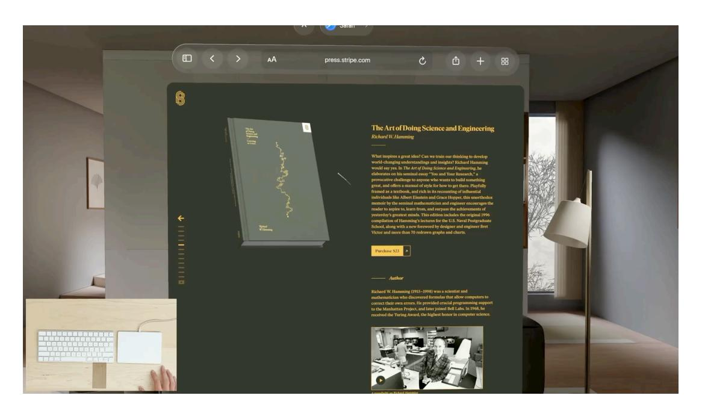

# **Pointing devices**

People can use a pointing device like a trackpad or mouse to navigate the interface and initiate actions.

**Supported platforms**

[Pointing](#page-0-1) devices Best [practices](#page-0-0) Platform [considerations](#page-1-0) [Resources](#page-9-0) [Change](#page-9-1) log

People appreciate the precision and flexibility that pointing devices offer. On a Mac, people typically expect to combine a pointing device with a keyboard as they navigate apps and the system. On iPad and Apple Vision Pro, a pointing device gives people an additional way to interact with apps and content, without replacing touch, eyes, or gestures.

# **Best [practices](#page-0-0)**

**Be consistent when responding to mouse and trackpad gestures.** People expect most gestures to work the same throughout the system, regardless of the app or game they're using. On a Mac, for example, people rely on the "Swipe between pages" gesture to behave the same way whether they're browsing individual document pages, webpages, or images.

**Avoid redefining systemwide trackpad gestures.** Even in a game that uses app-specific gestures in a custom way, people expect systemwide gestures to be available; for example, people expect to make familiar gestures to reveal the Dock or Mission Control in macOS. Remember that Mac users can customize the gestures for performing systemwide actions.

**Provide a consistent experience in your app, whether people are using gestures, eyes, a pointing device, or a keyboard.** People expect to move fluidly between multiple types of input, and they don't want to learn different interactions for each mode or for each app they use.

**Let people use the pointer to reveal and hide controls that automatically minimize or fade out.** In iPadOS, for example, people can reveal the minimized Safari toolbar by holding the pointer over it (the toolbar minimizes again when the pointer moves away). People can also move the pointer to reveal or hide playback controls while they watch a full-screen video.

**Provide a consistent experience when people press and hold a modifier key while interacting with objects in your app.** For example, if people can duplicate an object by pressing and holding the Option key while they drag that object, ensure the result is the same whether they drag using touch or the pointer.

# **Platform [considerations](#page-1-0)**

*No additional considerations for iOS. Not supported in tvOS or watchOS.*

## **[iPadOS](#page-1-1)**

iPadOS builds on the traditional pointer experience, automatically adapting the pointer to the current context and providing rich visual feedback at a level of precision that enhances productivity and simplifies common tasks on a touchscreen device. The iPadOS pointing system gives people an additional way to interact with apps and content — it doesn't replace touch.

**Allow multiple selection in custom views when necessary.** In iPadOS 15 and later, people can click and drag the pointer over multiple items to select them. As people use the pointer in this way, it expands into a visible rectangle that selects the items it encompasses. Standard nonlist collection views support this interaction by default; if you want to support multiple selection in custom views, you need to implement it yourself. For developer guidance, see *[UIBand](https://developer.apple.com/documentation/UIKit/UIBandSelectionInteraction) [SelectionInteraction](https://developer.apple.com/documentation/UIKit/UIBandSelectionInteraction)*.

**Distinguish between pointer and finger input only if it provides value.** For example, a scrubber can give people an additional way to target a location in a video when they're using the pointer. In this scenario, people can drag the playhead using either the pointer or touch, but they can use the pointer to click a precise seek destination.

#### **Pointer shape and [content](#page-1-2) effects**

iPadOS integrates the appearance and behavior of both the pointer and the element it moves over, bringing focus to the item the pointer is targeting. You can support the system-provided pointer effects or modify them to suit your experience.

By default, the pointer's shape is a circle, but it can display a system-defined or custom shape when people move it over specific elements or regions. For example, the pointer automatically uses the familiar I-beam shape when people move it over a text-entry area.

Play

With a *content effect*, the UI element or region beneath the pointer can also change its appearance when people hold the pointer over it. Depending on the type of content effect, the pointer can retain its current shape or transform into a shape that integrates with the element's new appearance.

iPadOS defines three content effects that bring focus to different types of interactive elements in your app: highlight, lift, and hover.

The *highlight* effect transforms the pointer into a translucent, rounded rectangle that acts as a background for a control and includes a gentle parallax. The subtle highlighting and movement bring focus to the control without distracting people from their task. By default, iPadOS applies the highlight effect to bar buttons, tab bars, segmented controls, and edit menus.

Play

The *lift* effect combines a subtle parallax with the appearance of elevation to make an element seem like it's floating above the screen. As the pointer fades out beneath the element, iPadOS creates the illusion of lift by scaling the element up while adding a shadow below it and a soft specular highlight on top of it. By default, iPadOS applies the lift effect to app icons and to buttons in Control Center.

Play

*Hover* is a generic effect that lets you apply custom scale, tint, or shadow values to an element as the pointer moves over it. The hover effect combines your custom values to bring focus to an item, but it doesn't transform the default pointer shape.

Play

#### **Pointer [accessories](#page-2-0)**

Pointer accessories are visual indicators that help people understand how they can use the pointer to interact with the current UI element. For example, a pointer approaching a resizable element might display small arrows to indicate that the element allows resizing along a certain axis.

Unlike pointer shapes and content effects, accessories are secondary items that can combine with any pointer to communicate additional information. For developer guidance, see *[UIPointerAccessory](https://developer.apple.com/documentation/UIKit/UIPointerAccessory)*.

**Use clear, simple images to create custom accessories.** A pointer accessory is small, so it's essential to create an image that communicates the pointer interaction without using too many details.

**Consider using the accessory transition to signal a change in an element's state or behavior.** In addition to animating the appearance and disappearance of pointer accessories, the system also animates the transitions among accessory shapes and positions that can accompany content effects. For example, you could communicate that an add action has become unavailable by transitioning the pointer accessory from the *plus* symbol to the *circle.slash* symbol.

### **Pointer [magnetism](#page-3-0)**

iPadOS helps people use the pointer to target an element by making the element appear to attract the pointer. People can experience this magnetic effect when they move the pointer close to an element and when they flick the pointer toward an element.

When people move the pointer close to an element, the system starts transforming the pointer's shape as soon as it reaches the element's hit region. Because an element's hit region typically extends beyond its visible boundaries, the pointer begins to transform before it appears to touch the element itself, creating the illusion that the element is pulling the pointer toward it.

Play

When people flick the pointer toward an element, iPadOS examines the pointer's trajectory to discover the element that's the most likely target. When there's an element in the pointer's path, the system uses magnetism to pull the pointer toward the element's center.

By default, iPadOS applies magnetism to elements that use the lift effect (like app icons) and the highlight effect (like bar buttons), but not to elements that use hover. Because an element that supports hover doesn't transform the default pointer shape, adding magnetism could be jarring and might make people feel that they've lost control of the pointer.

The system also applies magnetism to text-entry areas, where it can help people avoid skipping to another line if they make unintended vertical movements while they're selecting text.

#### **[Standard](#page-3-1) pointers and effects**

**When possible, support the system-provided content effects.** People quickly become accustomed to the content effects they see throughout the system and generally expect their experience to apply to every app they use. To provide a consistent user experience, align your interactions with the design intent of each effect. Specifically:

- Use highlight for a small element that has a transparent background.
- Use lift for a small element that has an opaque background.
- Use hover for large elements and customize the scale, tint, and shadow attributes as needed (for guidance, see [Customizing](#page-4-0) pointers).

**Prefer the system-provided pointer appearances for standard buttons and text-entry areas.** You can help people feel more comfortable with your app when the pointer behaves in ways they expect.

**Add padding around interactive elements to create comfortable hit regions.** You might need to experiment to determine the right size for an element's hit region. If the hit region is too small, it can make people feel that they have to be extra precise when interacting with the element. On the other hand, when an element's hit region is too large, people can feel that it takes a lot of effort to pull the pointer away from the element. In general, it works well to add about 12 points of padding around elements that include a bezel; for elements without a bezel, it works well to add about 24 points of padding around the element's visible edges.

**Create contiguous hit regions for custom bar buttons.** If there's space between the hit regions of adjacent buttons in a bar, people may experience a distracting motion when the pointer reverts briefly to its default shape as it moves between buttons.

**Specify the corner radius of a nonstandard element that receives the lift effect.** With the system-provided lift effect, the pointer transforms to match the element's shape as it fades out. By default, the pointer uses the system-defined corner radius to transform into a rounded rectangle. If your element is a different shape — if it's a circle, for example — you need to provide the radius so the pointer can animate seamlessly into the shape of the element. For developer guidance, see *[UIPointerShape.roundedRect\(\\_:radius:\)](https://developer.apple.com/documentation/UIKit/UIPointerShape-swift.enum/roundedRect(_:radius:))*.

#### **[Customizing](#page-4-0) pointers**

**Prefer system-provided pointer effects for custom elements that behave like standard elements.** When a custom element behaves like a standard one, people generally expect to interact with it using familiar pointer interactions. For example, if buttons in a custom toolbar don't use the standard highlight effect, people might think they're broken.

**Use pointer effects in consistent ways throughout your app.** For example, if your app helps people draw, provide a similar pointer experience for every drawing area in your app so that people can apply the knowledge they gain in one area to the others.

**Avoid creating gratuitous pointer and content effects.** People notice when the appearance of the pointer or the UI element beneath it changes, and they expect the changes to be useful. Creating a purely decorative pointer effect can distract and even irritate people without providing any practical value.

**Keep custom pointer shapes simple.** Ideally, the pointer's shape signals the action people can take in the current context without drawing too much attention to itself. If people don't instantly understand your custom pointer shape, they're likely to waste time trying to discover what the shape means.

**Consider enhancing the pointer experience by displaying custom annotations that provide useful information.** For example, you could display X and Y values when people hold the pointer over a graphing area in your app. Keynote uses annotations to display the current width and height of a resizable image.

**Avoid displaying instructional text with a pointer.** A pointer that displays instructional text can make an app seem complicated and difficult to use. Instead of providing instructions, prioritize clarity and simplicity in your interface, so that people can quickly grasp how to use your app whether they're using the pointer or touching the screen.

**Consider the interplay of shadow, scale, and element spacing when defining custom hover effects.** In general, reserve scaling for elements that can increase in size without crowding nearby elements. For example, scaling doesn't work well for a table row because a row can't expand without overlapping adjacent rows. For an element that has little space around it, consider using a hover effect that includes tint, but not scale and shadow. Note that it doesn't work well to use shadow without including scale, because an unscaled element doesn't appear to get closer to the viewer even when its shadow implies that it's elevated above the screen.

## **[macOS](#page-5-0)**

macOS supports a wide range of standard mouse and trackpad interactions that people can customize. For example, when a click or gesture isn't a primary way to interact with content, people can often turn it on or off based on their current workflow. People can also choose specific regions of a mouse or trackpad to invoke secondary clicks, and select specific finger combinations and movements for certain gestures.

| Click or gesture                                                                                                           | Expected behavior                                                                                          | Mouse | Trackpad |
|----------------------------------------------------------------------------------------------------------------------------|------------------------------------------------------------------------------------------------------------|-------|----------|
| Primary click                                                                                                              | Select or activate an item, such as a file or button.                                                | ●     | ●        |
| Secondary click                                                                                                            | Reveal contextual menus.                                                                                   | ●     | ●        |
| Scrolling                                                                                                                  | Move content up, down, left, or right within a view.                                                    | ●     | ●        |
| Smart zoom                                                                                                                 | Zoom in or out on con‐ tent, such as a web page or PDF.                                              | ●     | ●        |
| Swipe between pages                                                                                                        | Navigate forward or backward between indi‐ vidually displayed pages.                                 | ●     | ●        |
| Swipe between full screen apps                                                                                          | Navigate forward or backward between full screen apps and spaces.                                    | ●     | ●        |
| Mission Control (double tap the mouse with two fingers or swipe up on the trackpad with three or four fingers) | Activate Mission Control.                                                                                  | ●     | ●        |
| Lookup and data detec‐ tors (force click with one finger or tap with three fingers)                               | Display a lookup window above selected content.                                                         |       | ●        |
| Tap to click                                                                                                               | Perform the primary click action using a tap rather than a click.                                    |       | ●        |
| Force click                                                                                                                | Click then press firmly to display a Quick Look win‐ dow or lookup window above selected content. |       | ●        |

Apply a variable amount

| Click or gesture                                                | Expected behavior                                                                                    | Mouse | Trackpad |  |
|-----------------------------------------------------------------|------------------------------------------------------------------------------------------------------|-------|----------|--|
|                                                                 | of pressure to affect pressure-sensitive con‐ trols, such as variable speed media controls. |       |          |  |
| Zoom in or out (pinch with two fingers)                      | Zoom in or out.                                                                                      |       | ●        |  |
| Rotate (move two fingers in a circular motion)               | Rotate content, such as an image.                                                                 |       | ●        |  |
| Notification Center (swipe from the edge of the trackpad) | Display Notification Center.                                                                      |       | ●        |  |
| App Exposé (swipe down with three or four fingers)           | Display the current app's windows in Exposé.                                                      |       | ●        |  |
| Launchpad (pinch with thumb and three fingers)               | Display the Launchpad.                                                                               |       | ●        |  |
| Show Desktop (spread with thumb and three fingers)        | Slide all windows out of the way to reveal the desktop.                                        |       | ●        |  |

## **[Pointers](#page-6-0)**

macOS offers a variety of standard pointer styles, which your app can use to communicate the interactive state of an interface element or the result of a drag operation.

| Pointer | Name            | Meaning                                                                                                                                                | AppKit API     |
|---------|-----------------|--------------------------------------------------------------------------------------------------------------------------------------------------------|----------------|
|         | Arrow           | Standard pointer for se‐ lecting and interacting with content and inter‐ face elements.                                                       | arrow          |
|         | Closed hand     | Dragging to reposition the display of content within a view—for exam‐ ple, dragging a map around in Maps.                                  | closedHand     |
|         | Contextual menu | A contextual menu is available for the content below the pointer. This pointer is generally shown only when the Control key is pressed. | contextualMenu |
|         | Crosshair       | Precise rectangular se‐ lection is possible, such as when viewing an im‐ age in Preview.                                                      | crosshair      |

| Pointer | Name                  | Meaning                                                                                                                                                                                                                                                      | AppKit API          |
|---------|-----------------------|--------------------------------------------------------------------------------------------------------------------------------------------------------------------------------------------------------------------------------------------------------------|---------------------|
|         | Disappearing item     | A dragged item will dis‐ appear when dropped. If the item references an original item, the original is unaffected. For exam‐ ple, when dragging a mailbox out of the fa‐ vorites bar in Mail, the original mailbox isn't removed. | disappearingItem    |
|         | Drag copy             | Duplicates a dragged— not moved—item when dropped into the destina‐ tion. Appears when pressing the Option key during a drag operation.                                                                                                       | dragCopy            |
|         | Drag link             | During a drag and drop operation, creates an alias of the selected file when dropped. The alias points to the original file, which remains unmoved. Appears when pressing the Option and Command keys during a drag operation.    | dragLink            |
|         | Horizontal I beam     | Selection and insertion of text is possible in a hori‐ zontal layout, such as a TextEdit or Pages document.                                                                                                                                      | iBeam               |
|         | Open hand             | Dragging to reposition content within a view is possible.                                                                                                                                                                                              | openHand            |
|         | Operation not allowed | A dragged item can't be dropped in the current location.                                                                                                                                                                                               | operationNotAllowed |
|         | Pointing hand         | The content beneath the pointer is a URL link to a webpage, document, or other item.                                                                                                                                                                | pointingHand        |
|         | Resize down           | Resize or move a window, view, or element downward.                                                                                                                                                                                                    | resizeDown          |
|         | Resize left           | Resize or move a window, view, or element to the left.                                                                                                                                                                                                 | resizeLeft          |
|         | Resize left/right     | Resize or move a window, view, or element to the left or right.                                                                                                                                                                                        | resizeLeftRight     |
|         | Resize right          | Resize or move a window, view, or element to the right.                                                                                                                                                                                                | resizeRight         |
|         | Resize up             | Resize or move a window, view, or element upward.                                                                                                                                                                                                         | resizeUp            |

| Pointer | Name            | Meaning                                                                   | AppKit API                       |
|---------|-----------------|---------------------------------------------------------------------------|----------------------------------|
|         | Resize up/down  | Resize or move a window, view, or element upward or downward.       | resizeUpDown                     |
|         | Vertical I beam | Selection and insertion of text is possible in a verti‐ cal layout. | iBeamCursorFor VerticalLayout |

## **[visionOS](#page-8-0)**

In visionOS, people can attach an external pointing device or keyboard, and use both devices while they continue to use their eyes and hands. If people look at an element and then move the pointer, the system brings focus to the element under the pointer. Your app doesn't have to do anything to support this behavior.

When a pointing device is attached, the area people are looking at determines the pointer's context. For example, when people shift their eyes from one window to another, the pointer's context seamlessly transitions to the new window.

Play

When people use an attached pointing device that supports gestures, like a trackpad or mouse, the pointer hides while people are gesturing, minimizing visual distraction. In this scenario, the pointer remains hidden until people move it, when it reappears in the location they're looking at.

# **[Resources](#page-9-0)**

## **[Related](#page-9-2)**

[Entering](https://developer.apple.com/design/human-interface-guidelines/entering-data) data

[Keyboards](https://developer.apple.com/design/human-interface-guidelines/keyboards)

#### **Developer [documentation](#page-9-3)**

Input [events](https://developer.apple.com/documentation/SwiftUI/Input-events) — SwiftUI

Pointer [interactions](https://developer.apple.com/documentation/UIKit/pointer-interactions) — UIKit

Mouse, [Keyboard,](https://developer.apple.com/documentation/AppKit/mouse-keyboard-and-trackpad) and Trackpad — AppKit

## **[Videos](#page-9-4)**

**Design for the [iPadOS](https://developer.apple.com/videos/play/wwdc2020/10640) pointer**

# **[Change](#page-9-1) log**

**Date Changes**

June 21, 2023 Updated to include guidance for visionOS.