# Introducing the 2024 Apple Design Award winners

Delight and Fun | Inclusivity | Innovation | Interaction | Social Impact | Visuals and Graphics | Spatial Computing

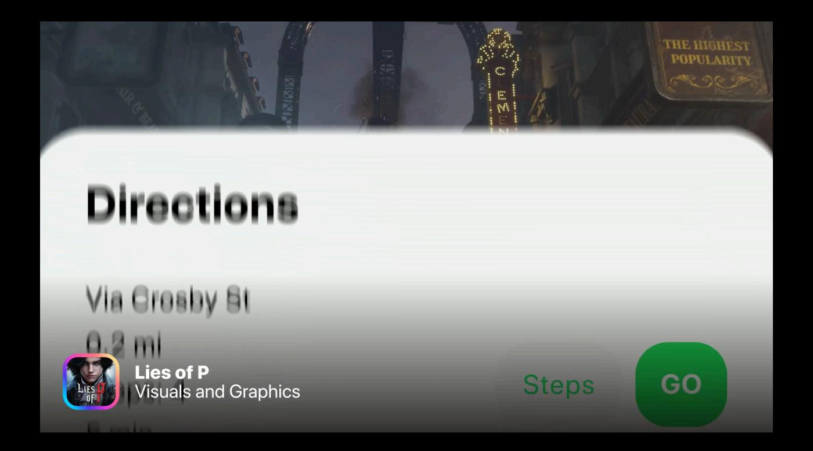

Every year, the Apple Design Awards recognize innovation, ingenuity, and technical achievement in app and game design. But they've also become something more: A moment to step back and celebrate the Apple developer community in its many forms.

# **Delight and Fun**

Winners in this category provide memorable, engaging, and satisfying experiences enhanced by Apple technologies.

Winners

App | iPhone, iPad, Mac

Journaling apps just don't get much cuter than *Bears Gratitude*, a warm and welcoming way to establish — and, just as crucially, maintain — a daily gratitude practice. Yes, the bears and other characters are superhuggable and turn up in delightfully unexpected places. But they also serve as a welcoming way into the content. And with its thoughtfully considered touchpoints, *Bears Gratitude* is a simple way to encourage and embrace honest self-reflection.

#### **NYT Games**

The New York Times Company, USA

Game | iPhone, iPad

An all-time great with a compelling mix of games and the source of the fierce debate, "What's the best Wordle starting word?" In the past year, NYT Games evolved well past its classic crosswords and breakout s-mas-h to redesign its navigation, expand its already diverse catalog of games, and introduce grabby new conversation starters like Connections — which, like Wordle, feels perfectly calibrated for maximum replayability.

### **Finalists**

Rooms

Things, Inc., USA iPhone, iPad

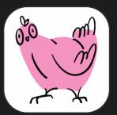

**Dudel Draw** 

Silly Little Apps LLC, USA

iPhone, iPad

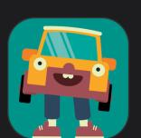

WHAT THE CAR?

Triband ApS, Denmark

iPhone, iPad, Mac, Apple TV, Apple Vision Pro

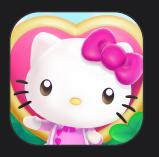

**Hello Kitty Island Adventure** 

Sunblink Entertainment LLC, USA

iPhone, iPad, Mac, Apple TV, Apple Vision Pro

# Inclusivity

Winners in this category provide a great experience for all by supporting people from a diversity of backgrounds, abilities, and languages.

### Winners

oko

AYES, Belgium

App | iPhone

oko alerts pedestrians to the state of lighted signals through haptic and audio feedback, an immediately impactful approach for those with low to no vision. It's a smart solution to a critical safety scenario that takes full advantage of flawless VoiceOver and Dynamic Type implementation.

Crayola Adventures
RED GAMES CO, LLC, USA

Game | iPhone, iPad, Mac, Apple TV, Apple Vision Pro

A colorful adventure that sets a new standard for inclusive and gender-neutral character-creation options, which include different skin tones, abilities, body types, pronouns, and more. *Crayola Adventures* offers inclusivity options across the board, including full narration for non-readers or those with reading challenges. And it's a delight to experience for a wide range of ages, with a mix of activities that includes making decorations, solving puzzles, and reading storybooks.

### **Finalists**

Complete Anatomy 2024 Elsevier, Ireland

.\_ . . .

iPad, Mac

Tiimo

tiimo ApS, Denmark

iPhone, iPad, Apple Watch

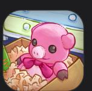

Unpacking

Humble Bundle, Inc, USA

iPhone, iPad

## **Innovation**

Winners in this category provide a state-of-the-art experience through novel use of Apple technologies that set them apart in their genre.

### Winners

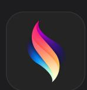

#### **Procreate Dreams**

Savage Interactive Pty Ltd, Australia

App | iPad

The new standard in creating 2D animations on iPad. *Procreate Dreams* is a marvelously designed tool that allows creatives of all kinds to animate using the extensive and familiar library of brushes, gestures, and PencilKit-enabled behaviors from the original *Procreate*. Its controls are effortlessly intuitive — multitouch interactions and Apple Pencil are both supported — so it's easy to jump right in, whether you're a career animator or brand new to the medium. As is the case with its predecessor, every interaction in *Procreate Dreams* feels polished, thoughtfully considered, and ready to use out of the box. If you're looking to explore animation, it's a dream come true.

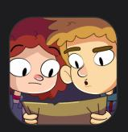

**Lost in Play** 

Happy Juice Games, Israel

Game | iPhone, iPad, Apple Vision Pro

Lost in Play feels like a graphic novel come to life. Every corner of its inventive world — from its spooky forest to its clifftop village — brims with visual imagination and handcrafted charm. And the game is filled with endearing characters (like a surprisingly snarky flock of sheep) and fun mini-games. Add in easy-to-learn interactions and compelling gameplay, and you've got a game worth getting lost in.

### **Finalists**

Copilot Money, Inc., USA iPhone, Mac

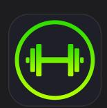

**SmartGym** 

Mateus Abras, Brazil

iPhone, iPad, Apple Watch, Mac, Apple Vision Pro

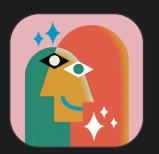

Wavelength
Palm Court LLC, USA
iPhone, iPad, Apple Vision Pro

Call of Duty: Warzone Mobile Activision Publishing, Inc., USA iPhone, iPad

# Interaction

Winners in this category deliver intuitive interfaces and effortless controls that are perfectly tailored to their platform.

### Winners

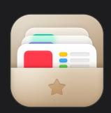

### Crouton

Devin Davies, New Zealand

App | iPhone, iPad, Mac, Apple Watch, Apple Vision Pro

Recipe apps rise and fall on their organization and information hierarchy, and *Crouton* serves up a clean, tasty interface for stashing away recipes, creating grocery lists, and presenting step-by-step instructions in the kitchen — even if you're not exactly a chef. Everything in *Crouton*, from the next recipe step to the name of that missing spice, is easy to find and right where you need it. And its effortless series of interactions mean people can keep their focus on the counter rather than their screen.

### Rytmos

Floppy Club ApS, Denmark

Game | iPhone, iPad

A world music-inspired rhythm game that looks as good as it sounds. *Rytmos* challenges players to solve puzzles by creating pathways using simple drag gestures, and every completed level adds a new element to an evolving song. The onboarding makes gameplay instantly clear, and the gestures are simple and fun, even when the game starts delivering more and more complexity.

### **Finalists**

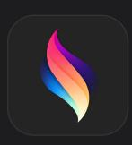

Procreate Dreams
Savage Interactive Pty Ltd, Australia
iPad

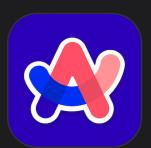

Arc Search
The Browser Company of New York Inc., USA
iPhone

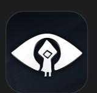

**Little Nightmares**Playdigious, France
iPhone, iPad

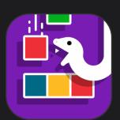

**finity.** Seabaa, Inc., USA iPhone, iPad, Mac, Apple TV

# **Social Impact**

Winners in this category improve lives in a meaningful way and shine a light on crucial issues.

### Winners

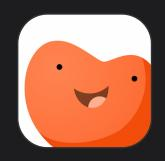

### **Gentler Streak Fitness Tracker**

Gentler Stories d.o.o., Slovenia

App | iPhone, iPad, Apple Watch

With its thoughtful focus on both physical and mental health, *Gentler Streak* is chasing the elusive goal of improving everyone's lifestyles, no

matter who or where they are. As its name suggests, the app is powered not by insistent reminders but an optimistic and encouraging vibe that takes into account not just physical fitness but mental wellbeing too. To make sure people focus on those goals, *Gentler Streak* relies on a subtle and consistently pleasing design language. Its health data is smartly organized, and its Monthly Summary view — which shows how you're doing in relation to your history — is less about hard comparisons and more about progress.

The Wreck
The Pixel Hunt, France

Game | iPhone, iPad

A lush visual novel about sisterhood, motherhood, grief, and survival. *The Wreck* tells the story of Junon, a writer who's abruptly called to a hospital to make a life-changing decision. The story is far from light, but it's beautifully written and eloquently told, especially through fleeting thought bubbles that reflect the swirl and scatter of stressful situations. *The Wreck* may be filed under games, but it's also a powerful, heartbreaking story, one that invites players to think about their own choices as well.

### **Finalists**

How We Feel
The How We Feel Project, Inc., USA
iPhone

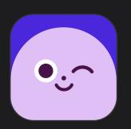

Ahead: Emotions Coach ahead solutions GmbH, Germany iPhone

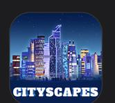

Cityscapes: Sim Builder
MagicFuel Games, USA
iPhone, iPad, Mac, Apple TV, Apple Vision Pro

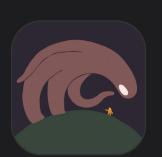

The Bear Mucks Games UG (haftungsbeschrnkt), Germany iPhone, iPad

# **Visuals and Graphics**

Winners in this category feature stunning imagery, skillfully drawn interfaces, and high-quality animations that lend to a distinctive and cohesive theme.

### Winners

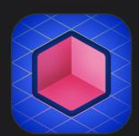

Rooms
Things Inc., USA

App | iPhone, iPad

An incredible canvas for creativity, set in a nostalgic 8-bit world. *Rooms* is tough to categorize: It's a blank slate for building imaginative scenes, a platform for cozy gaming, and a social space that lets you interact with thousands of other people's creations. Rooms in *Rooms* are lovingly rendered and sprinkled with tons of delightful detail, and the app's interactions, sounds, and throwback visuals strike the perfect balance between quirky and compelling. Quirky, compelling, and executed with a delightful retro twist.

Lies of P

NEOWIZ Corporation, South Korea

Game | Mac

A technical showpiece for Mac — and a dark, fascinating twist on a familiar tale. In this gorgeously rendered adventure, players control a robotic puppet created by Geppetto — yes, that Geppetto — who must survive a battle march through a burned-out city to find his maker. One look at the visuals reveals a world of beautiful textures, detailed lighting, and stunning effects — and visual customization options like MetalFX Upscaling and volumetric fog effects let you style the ruined city to your liking. Add a coldly beautiful soundtrack and the nostalgic shadow of the original story, and you get a complete, considered, and unique experience — and that's the truth.

### **Finalists**

Sunlit

Nicolas Mariniello, Italy iPhone, iPad, Apple Watch

#### Meditate

RhythmicWorks Software LLP, India

iPhone, Apple Watch

**DEATH STRANDING DIRECTOR'S CUT** 

505 Games, Inc., USA iPhone, iPad, Mac

Honkai: Star Rail COGNOSPHERE PTE. LTD., Singapore iPhone, iPad

# **Spatial Computing**

Winners in this category brought extraordinary craftsmanship to their exceptional spatial experiences.

### Winners

### djay

Algoriddim GmbH, Germany

App | Apple Vision Pro, iPhone, iPad, Mac, Apple Watch

djay pro isn't just a groundbreaking app; it's an entirely new way to interact with music. With incredible technical ingenuity and best-inclass immersion, it feels fresh and new and alive. The app spins up high-quality turntables that you can scratch to your heart's content, a cool interactive effects panel, and an array of magnificently considered environments, like the space lounge populated by dancing robots. djay pro set out to create the "flow state" sought by live DJs on the spatial canvas; they've come away with a smash hit.

#### **Blackbox**

Shapes and Stories, USA

Game | Apple Vision Pro

Blackbox on iOS challenged players to think outside the screen; Blackbox on visionOS challenges them to think about every (metaphorical) corner of the spatial canvas from its very first moments. Revealing too much about Blackbox would spoil its many surprises; suffice it to say that wonderful details abound — like the soapy floating bubbles that drive level selection.

Sky Guide Fifth Star Labs LLC, USA

Apple Vision Pro, iPhone, iPad

**NBA** 

NBA MEDIA VENTURES, LLC, USA

Apple Vision Pro, iPhone, iPad, Apple Watch

**Synth Riders** 

Kluge Strategic Inc., USA

Apple Vision Pro, iPhone, iPad

Loóna: Cozy Puzzle Games

Loona Inc., USA Apple Vision Pro

### View last year's winners >

Developer

Design Apple Design Awards

### **Platforms**

iPadOS macOS tvOS visionOS watchOS

### Tools

Swift SwiftUI

Swift Playground

TestFlight

Xcode

Xcode Cloud Icon Composer

SF Symbols

### Topics & Technologies

Accessibility Accessories Apple Intelligence App Store Audio & Video Augmented Reality

Business Design Distribution Education Fonts Games Health & Fitness

In-App Purchase Localization Maps & Location Machine Learning & Al

Open Source Security Safari & Web

### Resources

Documentation Sample Code Tutorials Downloads Forums Videos

### Support

Support Articles Contact Us **Bug Reporting** System Status

#### Account

Apple Developer App Store Connect Certificates, IDs, & Profiles Feedback Assistant

### Programs

Apple Developer Program

Apple Developer Enterprise Program App Store Small Business Program

MFi Program

Mini Apps Partner Program News Partner Program Video Partner Program Security Bounty Program

Security Research Device Program

### **Events**

Meet with Apple

Apple Developer Centers App Store Awards

Apple Design Awards

Apple Developer Academies

WWDC

Get the Apple [Developer](https://apps.apple.com/us/app/apple-developer/id640199958) app.

Copyright © 2026 [Apple](https://www.apple.com/) Inc. All rights reserved. [Terms](https://www.apple.com/legal/internet-services/terms/site.html) of Use [Privacy](https://www.apple.com/legal/privacy/) Policy [Agreements](https://developer.apple.com/support/terms/) and Guidelines **English**