# **Discover how apps are using the new design and Liquid Glass**

Explore a new visual gallery to find how teams of all sizes are taking advantage of the new design and Liquid Glass to create natural, responsive experiences across Apple platforms.

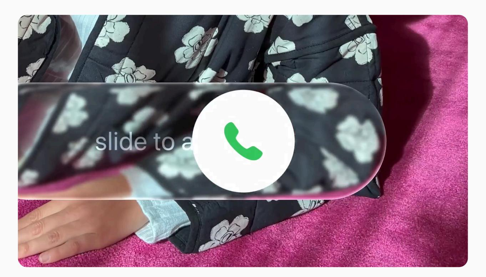

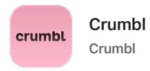

View on the App [Store](https://apps.apple.com/us/app/crumbl/id1438166219)

The Crumbl app takes advantage of the new design and Liquid Glass to put the focus squarely on its sweet brand photography. The app's familiar pink branding also moves from the top toolbar into the content layer, letting content shine through the controls.

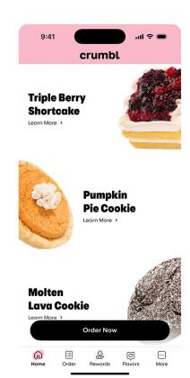

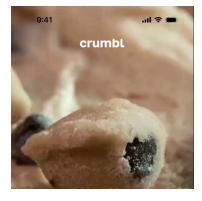

Play 

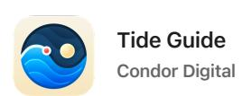

View on the App [Store](https://apps.apple.com/us/app/tide-guide-charts-tables/id1406371071)

This Apple Design Award finalist sees a beautiful implementation of the new design across platforms. The new design complements the app's rich blue color palette, while redesigned submenus and popovers move off the top toolbar. Check out the Liquid Glass effects as you interact with tide charts and graphs.

**iOS 18 iOS 26**

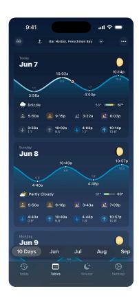

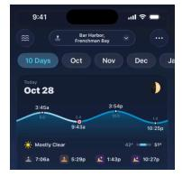

Play 

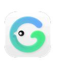

**GrowPal**

**Hangzhou Floating Island Technology Co**

View on the App [Store](https://apps.apple.com/us/app/growpal-health-fitness/id1560604814)

Native architecture, a sense of playfulness, and the new design combine to make this workout tracker feel cleaner and crisper. By making smart use of the toolbar and scroll-edge effects, GrowPal now offers much more space for data, while maintaining its sharp-yet-minimal identity.

**watchOS 11 watchOS 26**

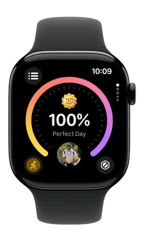

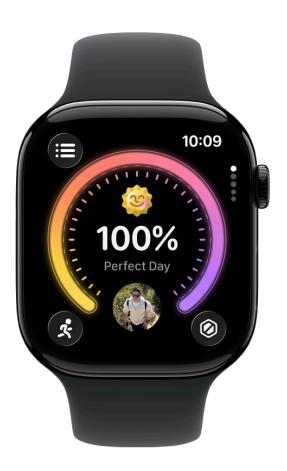

View on the App [Store](https://apps.apple.com/us/app/lumy/id908905093)

A shining example of thoughtful minimalism, this sun-tracking app uses the new design to keep all actions within easy reach, and focus on the data people care most about. Lumy also offers a Quick Access Menu, floating Peek Panel, and fluid sliders that make navigating feel easier.

**iOS 18 iOS 26**

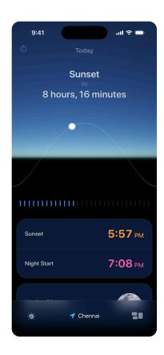

Play 

**Sky Guide Fifth Star Labs** View on the App [Store](https://apps.apple.com/us/app/sky-guide/id576588894)

Controls shift from the top to the bottom toolbar in this long-running stargazing app that changed its formerly modal submenus into popovers — a subtle change that helps stargazers.

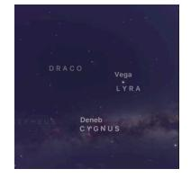

Play 

#### **Linearity Curve Graphic Design**

**Linearity**

View on the App [Store](https://apps.apple.com/us/app/linearity-curve-graphic-design/id1219074514)

This vector-graphics design app — now unified across iPhone, iPad, and Mac — boasts a stronger iPad experience that makes complex designs easier to understand. On iPad, the new two-column Inspector lets people browse and edit side-by-side, adapting dynamically to window size. And on iPhone, touch targets, spacing, and gestures have been refined for smoother and more comfortable interaction — even with one hand.

**iPadOS 18**

**iPadOS 26**

**LTK**

**rewardStyle**

View on the App [Store](https://apps.apple.com/us/app/ltk-shop-people-you-trust/id1154027990)

In this popular video shopping app, both the tab and nav bars move to allow for more edge-to-edge content a win for everyone involved. "It's a crowd-pleaser with our creators, brands, and consumers," says LTK lead engineer David Okun.

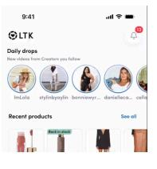

Play 

# **CardPointers**

**CardPointers**

View on the App [Store](https://apps.apple.com/us/app/cardpointers-for-credit-cards/id1472875808)

Subtle changes to color and branding in this credit card-tracking app make for a big impact. A purple gradient at the top of the view anchors the Liquid Glass controls, so people can focus on the data-packed interface.

**macOS 15**

**macOS 26**

## **American Airlines**

**American Airlines**

View on the App [Store](https://apps.apple.com/us/app/american-airlines/id382698565)

A scroll edge effect in the header allows people to see more results and options; the tab bar is updated; the seat map utilizes Liquid Glass buttons; and the interface leverages a more concentric design language, making that experience softer and friendlier.

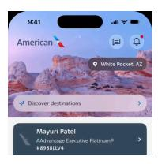

Play 

**Lowe's**

**Lowe's Companies, Inc.**

View on the App [Store](https://apps.apple.com/us/app/lowes-home-improvement/id457954781)

A great example of how the new design system allows apps to merchandise more products. The search experience moves to the tab bar and becomes more globally available. And Liquid Glass controls let the brand's familiar color scheme shine through. And the blue headers on the Shop tab scroll away, affording more real estate in the content view.

**iOS 18 iOS 26**

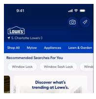

Play 

**Photoroom**

**Photoroom**

View on the App [Store](https://apps.apple.com/us/app/photoroom-ai-photo-editor/id1455009060)

A comprehensive redesign in which every action leverages the new design and Liquid Glass. Photoroom now offers more comfortable tap targets, increased UI size and spacing, and a bottom tab bar that makes it easy to see content behind.

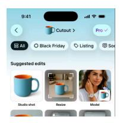

Play 

#### **OmniFocus 4**

**The Omni Group**

View on the App [Store](https://apps.apple.com/us/app/omnifocus-4/id1542143627)

Controls are at home in the top toolbar of this iPad productivity app; the design makes clear what's interactive at all times. Plus, OmniFocus leverages native frameworks to deliver simultaneous updates across Apple platforms.

**iPadOS 18**

**iPadOS 26**

**CNN**

**CNN Interactive Group**

View on the App [Store](https://apps.apple.com/us/app/cnn-live-breaking-news/id331786748)

The native CNN app features more edge-to-edge content that blends seamlessly with the UI. The updates are subtle, but its design tweaks and updated navigation combine to offer a more modern feel — and put the focus on CNN's all-important scrolling feed.

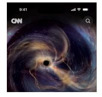

Play 

## **Essayist**

**Essayist Software**

View on the App [Store](https://apps.apple.com/us/app/essayist-academic-writing-app/id1537845384)

In this minimalist app for writers and academics, controls are compact, but float above the canvas to remain in reach at all times. Plus, actions are simplified across the app, with an emphasis on minimizing the number of tools that are exposed at any given time.

**macOS 15**

**macOS 26**

**Lucid Motors**

**Lucid USA**

View on the App [Store](https://apps.apple.com/us/app/lucid-motors/id1579793272)

The Lucid app integrates the new design in an organic, seamless way that makes it feel like Liquid Glass was always there. A redesigned tab bar focuses on the basics: unlocking the car, changing climate, and the like.

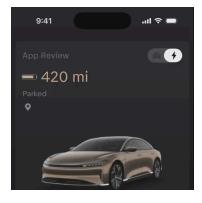

Play 

**Slack**

**Slack**

View on the App [Store](https://apps.apple.com/us/app/slack/id618783545)

A new Compose field introduces a rounded design that fits nicely with the keyboard and makes it easier to write a message, add an emoji, or upload an image. Plus, a breakout search tab makes it easier to dig through your messages.

**iOS 18 iOS 26**

Play 

| Developer Design Discover how apps are using the new design and Liquid Glass |                       |               |                                    |
|------------------------------------------------------------------------------------|-----------------------|---------------|------------------------------------|
| Platforms                                                                          | Topics & Technologies | Resources     | Programs                           |
| iOS                                                                                | Accessibility         | Documentation | Apple Developer Program            |
| iPadOS                                                                             | Accessories           | Sample Code   | Apple Developer Enterprise Program |
| macOS                                                                              | Apple Intelligence    | Tutorials     | App Store Small Business Program   |
| tvOS                                                                               | App Store             | Downloads     | MFi Program                        |
| visionOS                                                                           | Audio & Video         | Forums        | Mini Apps Partner Program          |
| watchOS                                                                            | Augmented Reality     | Videos        | News Partner Program               |
| Tools                                                                              | Business              | Support       | Video Partner Program              |
|                                                                                    | Design                |               | Security Bounty Program            |

[Swift](https://developer.apple.com/swift/) [SwiftUI](https://developer.apple.com/swiftui/) [Distribution](https://developer.apple.com/distribute/) [Education](https://developer.apple.com/education/)

Swift [Playground](https://developer.apple.com/swift-playground/) [TestFlight](https://developer.apple.com/testflight/) [Fonts](https://developer.apple.com/fonts/) [Games](https://developer.apple.com/games/)

[Xcode](https://developer.apple.com/xcode/) [Xcode](https://developer.apple.com/xcode-cloud/) Cloud Icon [Composer](https://developer.apple.com/icon-composer/) SF [Symbols](https://developer.apple.com/sf-symbols/) Health & [Fitness](https://developer.apple.com/health-fitness/) In-App [Purchase](https://developer.apple.com/in-app-purchase/) [Localization](https://developer.apple.com/localization/) Maps & [Location](https://developer.apple.com/maps/)

Machine [Learning](https://developer.apple.com/machine-learning/) & AI

Open [Source](https://opensource.apple.com/) [Security](https://developer.apple.com/security/) [Safari](https://developer.apple.com/safari/) & Web [Support](https://developer.apple.com/support/articles/) Articles

[System](https://developer.apple.com/system-status/) Status

[Contact](https://developer.apple.com/contact/) Us Bug [Reporting](https://developer.apple.com/bug-reporting/)

**Account**

Apple [Developer](https://developer.apple.com/account/) App Store [Connect](https://appstoreconnect.apple.com/)

[Certificates,](https://developer.apple.com/account/ios/certificate/) IDs, & Profiles

[Feedback](https://feedbackassistant.apple.com/) Assistant

**Events**

Meet with [Apple](https://developer.apple.com/events/)

Apple [Developer](https://developer.apple.com/events/developer-centers/) Centers

Security [Research](https://developer.apple.com/programs/security-research-device/) Device Program

App Store [Awards](https://developer.apple.com/app-store/app-store-awards/) Apple Design [Awards](https://developer.apple.com/design/awards/)

Apple Developer [Academies](https://developer.apple.com/academies/)

[WWDC](https://developer.apple.com/wwdc/)

Get the Apple [Developer](https://apps.apple.com/us/app/apple-developer/id640199958) app. Light Dark Auto

Copyright © 2026 [Apple](https://www.apple.com/) Inc. All rights reserved. [Terms](https://www.apple.com/legal/internet-services/terms/site.html) of Use [Privacy](https://www.apple.com/legal/privacy/) Policy [Agreements](https://developer.apple.com/support/terms/) and Guidelines **English**