# **Apple Design [Awards](https://developer.apple.com/design/awards/)**

# **Introducing the 2025 Apple Design Award winners**

Every year, the Apple Design Awards recognize innovation, ingenuity, and technical achievement in app and game design. But they've also become something more: A moment to step back and celebrate the work of Apple developers across the community.

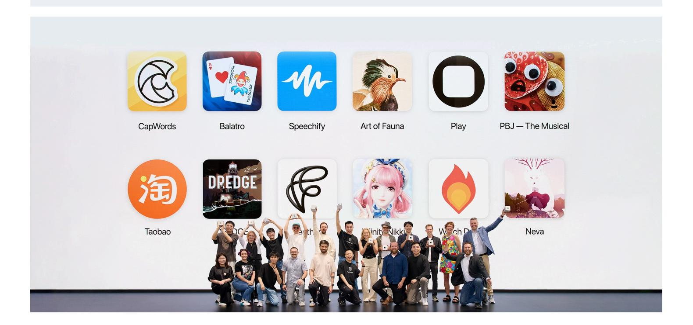

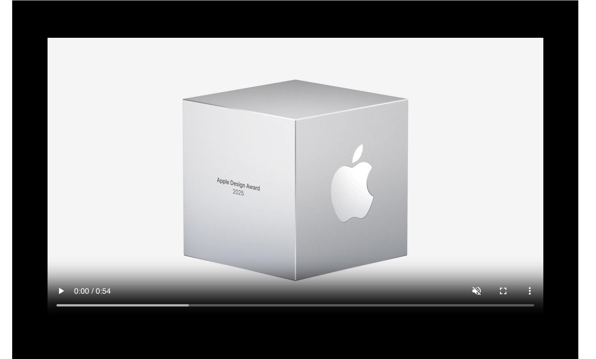

We're thrilled to announce this year's winners and finalists.

Delight and Fun | Inclusivity | Innovation | Interaction | Social Impact | Visuals and Graphics

# **Delight and Fun**

Winners and finalists in this category provide memorable, engaging, and satisfying experiences enhanced by Apple technologies.

# Apps

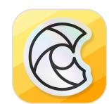

## **CapWords**

HappyPlan Tech, China

iPhone, iPad

The delightful language-learning app *CapWords* offers an idea that's as simple as it is revolutionary: Learn the name of a thing by taking a picture of it. With the snap of a camera and a fun animation, *CapWords* transforms everyday objects — coffee mugs, traffic cones, cupcakes — into interactive stickers. It's both a dynamic new path to learning

and a really fun thing to do; it's hard to stop snapping pictures of everything around you. And each flash card transition is accompanied by a real-world sound, a little tweak that enhances the sensory experience (and helps the word stick). Equal fun for kids and adults, *CapWords* makes the whole world a language playground.

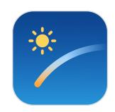

#### Lumy

Raja V, India

iPhone, iPad, Apple Watch

If you're a photographer looking to follow the sun, or an aspiring astronomer who wants to know what a little moonlight can do, this thoughtfully crafted sun and moon tracker can help. With a simple design, carefully curated color palette, and elegant widgets and Live Activities, *Lumy* offers a quick and intuitive way to get celestial information. Plus, it syncs beautifully with Apple Watch, a little universal insight right on your wrist.

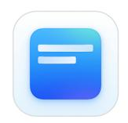

## **Denim - Playlist Cover Maker**

Feel Good Tech, India

iPhone

Denim creates brilliant new cover art for your playlists, but the app isn't just about aesthetics: This is a seamless SwiftUI-built experience, with smooth scroll transitions and elegant text and mesh gradients. It's also a joy to play with, thanks to custom haptics, intelligent cropping, and cool depth effects. *Denim* is a simple, well-executed idea that adds an extra dimension to the art of playlist creation.

#### **Games**

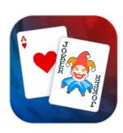

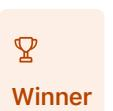

### **Balatro**

LocalThunk, Canada

iPhone, iPad, Mac, Apple TV, Apple Vision Pro

No game captured the community this past year quite like *Balatro*, a precisely calibrated mix of poker, solitaire, deck-building, and chaos. Crafted by a solo developer working under a pseudonym and delivered with a tinge of rakish audacity, this captivatingly innovative card game challenges players to beat a score by building unique decks while navigating an ever-shifting array of variables, such as power-up jokers and "Boss Blinds" that can reduce the most lovingly crafted deck to a pile of rubble. *Balatro* re-emphasizes the boundless potential of indie games and the idea that a simple and powerful concept can grow into a phenomenon.

Thank Goodness You're Here!

Panic, USA

Мас

It's safe to say Thank Goodness You're Here! is the best wildly unhinged slap-happy pie-obsessed flower-punching cartoon musical comedy game you'll play all year. Deliriously giddy, surprisingly polished, and the inventor and probably pinnacle of the slapformer genre, this profoundly bonkers production practically flings itself from scene to scene, churning out absurdities — one level takes place inside a slab of meat, maybe? — and a madcap cast of fishmongers, bad gardeners, and chimney sweeps that somehow add up to a cohesively built world. Here's the craziest part: Hiding inside the lost threepences and large hams is a delightful game that keeps bubbling up compelling quests and backstories. It's a credit to the entire creative team that *Thank Goodness You're Here!* isn't just genuinely funny from beginning to end; it's also a real artistic achievement and a rewarding play experience.

#### Prince of Persia: The Lost Crown

Ubisoft Montpellier, France

iPhone, iPad, Mac

This masterful franchise revival delivers a stylish, time-bending adventure with deep roots in mythological legend. A snappy attack/dodge/parry loop that players can enhance with an array of special moves (air dashes!) and supernatural abilities (teleportation!) lends acrobatic flair to the combat. But while the action is the star of *Prince of Persia: The Lost Crown*, it's the brilliantly conceived, labyrinthine world that keeps people coming back. Packed with secrets, shortcuts, and surprises, the beautifully interconnected levels form a platforming playground that brings this beloved series up to speed — and offers a glimpse into its bright future.

# Inclusivity

Winners and finalists in this category provide a great experience for all by reflecting a variety of backgrounds, abilities, and languages.

## **Apps**

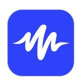

**Speechify** Speechify, USA iPhone, iPad With hundreds of voices and more than 50 available languages, *Speechify* turns any written text into audio — everything from websites, documents, scans, PDFs, and more. The app offers an approachable UI with a variety of accessibility features — Dynamic Type and VoiceOver among them — that make it an instantly helpful tool for everyone: students, professionals, and leisure readers, as well as auditory learners and people with low vision. The design team clearly worked to reduce cognitive load all throughout the app too. *Speechify* is more than a great app; it's a critical resource that helps people live their lives.

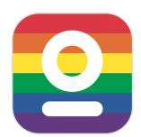

### **Evolve: Daily Self-Care Coach**

GTA Solutions, India

iPhone, iPad

A beautifully designed health and fitness app that's uniquely focused on the LGBTQ+ community. *Evolve* offers thoughtfully conceived and well-designed breathing exercises, affirmations, and daily journaling. With a friendly and straightforward tone, inclusive language, and a variety of diverse voices, it's clearly intended to be a safe space for all, and it's nicely integrated with features like Image Playground and the State of Mind API. A welcome and comfortable resource that's been brought to life with thought and care.

#### **Train Fitness**

Train Fitness, Canada

iPhone, iPad

Train Fitness logs workouts by using CoreMotion and CoreML to track the motion of a user's Apple Watch and AirPods, eliminating the need for interaction with a screen or UI. This thoughtful approach makes Train Fitness particularly useful for people who are blind or low vision, or anyone who may face challenges interacting with screens. With specific modes designed for workouts in wheelchairs and for users with limb differences, Train Fitness proves a dedication to both platform and audience.

#### Games

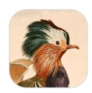

## **Art of Fauna**

Klemens Strasser, Austria

iPhone, iPad

A uniquely drawn puzzle game that prioritizes inclusivity and ecology in equal measure. Inspired by an encounter with 18th and 19th century science texts, *Art of Fauna's* throwback-style wildlife puzzles can be solved by either re-arranging the image on the front of the cards, or re-ordering the text description on the back. As in his previous Apple Design Award finalists, *Letter Rooms* and *Ancient Board Game Collection*, Strasser designed with accessibility in mind, adding color

themes, full VoiceOver support, and phobia settings that let players opt out of seeing potentially upsetting imagery. Plus, proceeds from every purchase support wildlife conservation organizations.

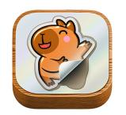

## puffies.

Lykke Studios, Thailand and Cyprus iPhone, iPad, Mac, Apple TV, Apple Vision Pro

Lykke Studios returns to the Apple Design Awards with a nostalgic puzzler built for everyone. Players assemble puzzles made of '80s-era puffy stickers — more than 2,500 of them, all drawn by local artists from Bangkok and Bali. As in their 2023 Apple Design Award winner *Stitch* and 2022 finalist *Tint*, the studio prioritized accessibility from Day 1, integrating features like Reduce Motion, a high-contrast mode, and a series of "outline settings" that add focus to certain parts of the board.

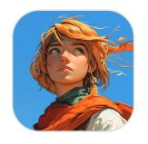

### Land of Livia

Split Atom Labs, Australia iPhone, iPad, Mac, Apple Vision Pro

A low-key fantasy adventure you can play at your own speed. Battle oversized rodents, recruit companions, discover magical swords, and turn your zero into a hero by undertaking text-based quests that unfold while you're away from the game. With support for VoiceOver, Dynamic Type, and Haptics, *Land of Livia* is specifically designed for players who are blind or low vision. And it takes advantage of App Intents to let players carry out complex actions.

# **Innovation**

Winners and finalists in this category provide a state-of-the-art experience through novel use of Apple technologies that set them apart in their genre.

# Apps

### **Play**

Rabbit 3 Times, USA

iPhone, Mac

For such a sophisticated tool, *Play* offers incredibly approachable prototyping capabilities that make design and development easier for everyone. *Play* helps designers create interactive prototypes using native SwiftUI frameworks, which can then be sent to Xcode and used for shipping finished apps. The well-designed UI is nicely organized, visually pleasing, and cleverly integrated with App Clips. Plus, everything you create in *Play* — including logic and interactions — matches perfectly with Xcode.

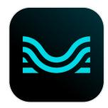

#### Moises

Music.Al, Brazil

iPhone, iPad

This musical marvel isolates the instruments in a recorded song, using machine learning models to separate out the vocals, guitar, bass, drums, and more into individual tracks. The effect is absolutely mindbending. You can remove a guitar solo and supply your own, turn any song into an a cappella, or play around with pitch and tempo, all of which can make it feel like you're hearing a favorite song for the first time. But for all its technical magic, *Moises* is remarkably easy to understand and navigate, which leaves you not just astounded at its powers, but compelled to rediscover your music.

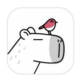

### **Capybara Al Meeting Translator**

Digital Workroom Ltd., United Kingdom

iPhone, iPad

An impressive transcription, translation, and summarization tool that offers an astonishing level of accuracy — and an adorable aesthetic. A relaxed little *capybara* hangs out on the screen while the app is doing its thing, and the results are delivered right away, all powered by the Apple Intelligence Translate API. A simple and endearing interface for a complex task.

# Games

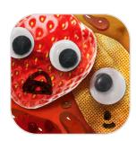

#### PBJ — The Musical

Philipp Stollenmayer, Germany

iPhone, iPad

A charming story game with polished execution and impressive production values — and did we mention it's a snack-based musical reboot of "Romeo and Juliet"? Created by Philipp Stollenmayer and sandwiched somewhere between narrative and game, *PBJ* tells the story of star-crossed condiments through paper cutouts animated by hand and a soundtrack full of sticky earworms (complete with a karaoke mode) — and it even jams in a few puns. With delightful controls, creative camera angles, cool haptics, and countless clever moments, *PBJ* never stops spreading joy.

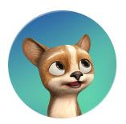

#### **Pawz**

Bootloader Studio Holdings, Singapore

Apple Vision Pro

A clever example of ambient gaming on Vision Pro, *Pawz* leverages passthrough technology to integrate virtual pets into real-world environments — or, put another way, to let you play with (or meditate alongside) an animated furry friend that evolves with your interaction and reacts to the environments you customize. It's all good fun, full of charming moments, meaningful progressions, and a playful personality.

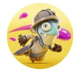

#### Gears & Goo

Resolution Games AB, Sweden

Apple Vision Pro

A fresh take on tower defense, *Gears & Goo* on Apple Vision Pro is a polished experience that makes expert use of spatial audio, hand tracking, and eye tracking. *Gears & Goo* is dripping with fun; it's fluid, responsive, and smartly uses the 3D space to create a deep strategic experience. It's easy to pick up and enjoy — who doesn't love throwing goo around? — and the cartoon steampunk style really pops, making the experience feel like a miniature world floating in your space.

# Interaction

Winners and finalists in this category deliver intuitive interfaces and effortless controls that are perfectly tailored to their platform.

#### **Apps**

## **Taobao**

Zhejiang Taobao Network, China

Apple Vision Pro

An exceptional example of how to render, interact with, and design for 3D elements on Apple Vision Pro. *Taobao* provides incredible 3D models that are comparable to their physical counterparts, each with smooth interactions, transitions, and intuitive controls. For each 3D product, *Taobao* takes into consideration placement, position, controls, size, and function, and offers the super-useful ability to compare items side-by-side.

#### iA Writer

Information Architects AG, Switzerland

iPhone, iPad, Mac

A smart solution for distraction-free writing. Substantially updated since its initial release, *iA Writer* offers useful features like a customizable keyboard, selective text highlighting, and iCloud sync. It's got an array of intuitive interactions — like swiping right to access your library and left to preview a document — that emphasize its goal of helping people tune out interruptions and focus on the words.

## Mela - Recipe Manager

Silvio Rizzi, Switzerland

iPhone, iPad, Mac

Like a perfectly prepared dish, this recipe app is all about getting the details right. When the app's sharp-looking cooking mode is activated, recipe steps, measurements, and timing details are subtly dimmed and highlighted at the proper time. Timers integrate with the Dynamic Island, recipe scanning is powered by the Vision framework, and ingredients plug right into the Reminders app. And for the cherry on top, *Mela* lets you subscribe to RSS feeds from cooking sites and can extract recipes from social media video descriptions.

## **Games**

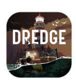

### **DREDGE**

Black Salt Games, New Zealand

iPhone, iPad, Mac

A two-word idea — "Lovecraftian fishing" — inspired this appealingly creepy debut from Black Salt Games, whose creative team all admits to spending more time fishing in video games than in real life. *DREDGE* is a slow-paced horror adventure set in a maritime town where dark and large secrets lurk below the surface. The game's submerged monsters may be unsettling, but its interactions are smooth sailing across touch and controller, both in its main narrative and fun minigames. And it's a seamless experience across iPhone, iPad, and Mac.

## Gears & Goo

Resolution Games AB, Sweden

Apple Vision Pro

What's more fun than defending your tower by throwing around blobs of goo? This polished and sticky spatial game features top-of-the-line integration of eye tracking and hand control. The experience of picking up and plopping down your units on the battlefield feels tactile (and awfully fun). And the game is easy to pick up, understand, and enjoy.

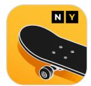

## **Skate City: New York**

Snowman, Canada

iPhone, iPad, Mac, Apple TV

Packed with cool combos to perform and obstacles to navigate, *Skate City: New York* plays equally well with touch and controller. Its patient onboarding affords plenty of time to learn its wealth of kickflips, manuals, and grinds, which you can then upgrade through smartly spaced-out lessons. The result is easy to pick up, but with enough challenge to keep even expert digital skaters glued to its virtual boards.

# **Social Impact**

Winners and finalists in this category improve lives in a meaningful way and shine a light on crucial issues.

# **Apps**

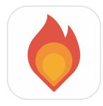

## Watch Duty: Wildfire Maps

Sherwood Forestry Service, USA

iPhone, iPad

When wildfires tore through southern California in January, *Watch Duty* served as a primary source for essential, ever-changing, and sometimes life-saving information. A non-commercial operation run by volunteers, *Watch Duty* once again proved itself the go-to app for a community impacted by wildfires, clearly and reliably offering updates, resources, and real-time guidance. *Watch Duty's* core functions and integrations are certainly impressive in their own right. But the best thing that can be said is that the app continued to step up when it needed to.

### **Ground News**

Snapwise, Canada

iPhone, iPad

A news aggregator that helps people view how media outlets across the political spectrum are covering or downplaying a topic. *Ground News* presents news coverage from thousands of publications worldwide alongside a graph that evaluates the political bent of an article or outlet (which is ranked by a third-party service and users).

Every design element, from color-coded bias markers to user-friendly layouts, has been carefully crafted to inspire trust, transparency, and a desire to explore multiple viewpoints.

**Opal** 

Opal OS, USA

iPhone, iPad

Opal helps people establish a more intentional relationship with technology by encouraging less time on devices. And it's a delightful experience in its own right, full of helpful tools like widgets, Shortcuts, and easy-to-set-up customizations. And fun touches like haptics when unlocking "gems" deliver a charming way to create focus.

#### **Games**

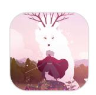

#### Neva

Devolver Digital, USA

Mac

A powerful, sometimes somber, and richly illustrated story about the emotional effects of environmental decline. Created by the team behind the gorgeous *Gris*, *Neva* follows a girl and her wolf as they make their way through a decaying world, using the changing of the seasons to illustrate not just the challenges of their reality but the evolution of their relationship. Players are charged with escorting the pair safely through the game's breathtakingly realized world, which shines in every season. But the game's true heart is the connection between the pair, which reminds us what it means to care for something — or someplace.

## **Ahoy! From Picardy**

Daniel Jones, USA

Apple Vision Pro

A whimsical experience that's part redemption arc and part environmental warning. This inventive game features a character named Picardy, a man who's desperate to make up for past mistakes and bring beauty into his part of the world. The game maximizes the potential of the spatial canvas, offering many compelling ways for players to interact with the richly drawn world (and take in its wonderful soundscapes), all in service of a message about environmental stewardship — and the difficulty in changing institutions.

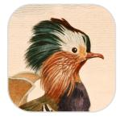

**Art of Fauna** Klemens Strausser, Austria

iPhone, iPad

A uniquely drawn puzzle game that prioritizes inclusivity and ecology in equal measure. Inspired by an encounter with 18th and 19th-century science texts, *Art of Fauna's* classical wildlife puzzles can be solved by either re-arranging the image on the front of the cards or re-ordering the text description on the back. It's a warm, serene way to bring awareness to the plight of endangered species, and a bit of a love letter to science. And it backs up its message: Proceeds from every purchase support conservation organizations.

# Visuals and Graphics

Winners and finalists in this category feature stunning imagery, skillfully drawn interfaces, and high-quality animations with a distinctive and cohesive theme.

# **Apps**

#### Feather: Draw in 3D

Sketchsoft, South Korea

iPad

An incredible modeling tool that allows artists to easily transform their 2D designs into fully immersive 3D creations. *Feather* is designed from the ground up with user experience and creativity in mind, packing powerful and advanced 3D modeling features inside a minimalist interface that's accessible to all skill levels. The iPad-only app makes full use of touch and Apple Pencil interactions.

## Vocabulary - Learn words daily

Monkey Taps, USA

iPhone, iPad, Apple Watch

A subtle example of excellence. *Vocabulary* is powered by charming, consistent illustrations that create a clean visual style and rhythm throughout. Typography and iconography feel modern and balanced, themes are nicely varied, and the use of haptics is a nice touch. A lovely instance of an app that quietly does everything right.

#### CellWalk

Timothy Davison, Canada

Apple Vision Pro

CellWalk is a biology class like none other. This highly evolved visionOS app allows organisms to explore a 3D cell model delivered with incredible fidelity and detail. It's a revelation to regard a 300 million-atom bacterial cell through this kind of beautiful, real-time Metal-powered rendering — which has been optimized for Apple Vision Pro — and by simulating the effect of looking into a microscope, it offers a neat twist on the expected experience.

#### **Games**

# **Infinity Nikki**

Infold Games, Singapore

iPhone, iPad

A wonderland of texture, light, and animation, *Infinity Nikki* is one of the best-looking games of the year. This open-world game — which challenges players to collect clothes instead of weapons — is awash in wildly detailed fabrics, beautifully realized lighting, and effects from advanced shading techniques like Global Illumination. Notice how Nikki's dress sways and waves, and marvel at the sparkle on every last piece of fabric in every world. Lavish yet cozy at the same time, *Infinity Nikki* is an often literally glowing example of what mobile graphics can be.

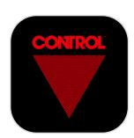

#### **Control Ultimate Edition**

Remedy Entertainment PLC, Finland

Мас

Twisting hallways, looming cityscapes, creepy stone-white heads — they're all part of the visual masterpiece that is *Control*. The game is a visual feast, making remarkable use of hardware-accelerated ray tracing to conjure up battlegrounds like the ominously clean offices of the Federal Bureau of Control. Every detail — from the reflections in the boardroom windows to the characters' subtle eye darts while speaking — is expertly drawn and choreographed. Take a moment to marvel at the particle, smoke, and 3D effects as you're busting up environments.

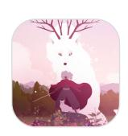

#### Neva

Devolver Digital, USA

Mac

Created by the team behind the gorgeous adventure *Gris*, *Neva* is a masterful connection of visual language and emotion. The game follows a girl and her wolf as they make their way through a decaying world, using the changing of the seasons to illustrate not just the challenges of their reality but the evolution of their relationship. Each *Neva* level has its own color palette, and the camera skillfully zooms in and out to showcase extended horizons or sumptuously animated

combat. *Neva* is an artistic achievement and an emotional powerhouse.

# View last year's winners >

| Platforms                                                        | Topics & Technologies                                                                                                       | Resources                                                                                      | Programs                                                                                                    |
|------------------------------------------------------------------|-----------------------------------------------------------------------------------------------------------------------------|------------------------------------------------------------------------------------------------|-------------------------------------------------------------------------------------------------------------|
| OS                                                               | Accessibility                                                                                                               | Documentation                                                                                  | Apple Developer Program                                                                                     |
| PadOS                                                            | Accessories                                                                                                                 | Sample Code                                                                                    | Apple Developer Enterprise Program                                                                          |
| macOS                                                            | Apple Intelligence                                                                                                          | Tutorials                                                                                      | App Store Small Business Program                                                                            |
| rvOS                                                             | App Store                                                                                                                   | Downloads                                                                                      | MFi Program                                                                                                 |
| visionOS                                                         | Audio & Video                                                                                                               | Forums                                                                                         | Mini Apps Partner Program                                                                                   |
| watchOS                                                          | Augmented Reality                                                                                                           | Videos                                                                                         | News Partner Program                                                                                        |
| <b>Fools</b> Swift SwiftUI Swift Playground             | Business  Design  Distribution  Education  Fonts                                                                            | Support Support Articles Contact Us Bug Reporting                                              | Video Partner Program Security Bounty Program Security Research Device Program Events                       |
| TestFlight Kcode Kcode Cloud con Composer SF Symbols | Games Health & Fitness In-App Purchase Localization Maps & Location Machine Learning & Al Open Source Security Safari & Web | Account  Apple Developer  App Store Connect  Certificates, IDs, & Profiles  Feedback Assistant | Meet with Apple Apple Developer Centers App Store Awards Apple Design Awards Apple Developer Academies WWDC |
| Get the Apple Developer app.                                     |                                                                                                                             |                                                                                                |                                                                                                             |