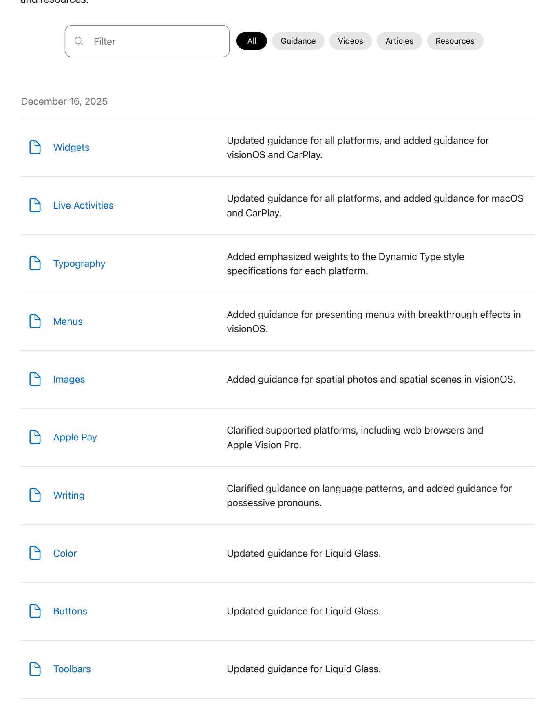
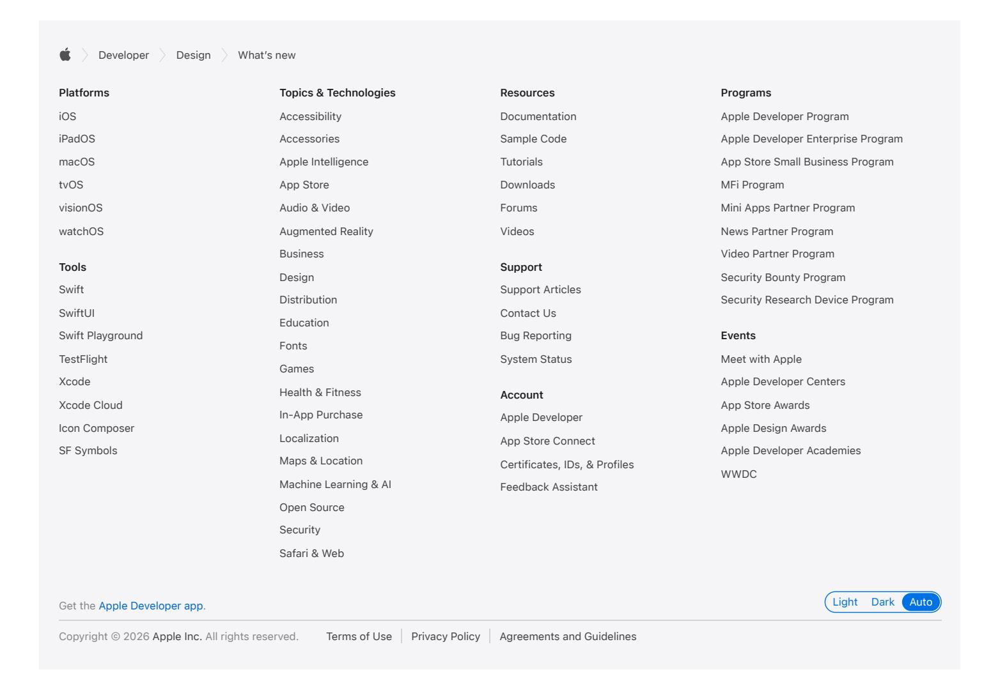

## **What's new**

Discover the latest additions and updates to design guidance. Explore inspirational designs, videos, articles, and resources.

| Tab bars                                   | Updated guidance for Liquid Glass.                                                                                                                        |
|--------------------------------------------|-----------------------------------------------------------------------------------------------------------------------------------------------------------|
|                                            |                                                                                                                                                           |
| December 4, 2025                           |                                                                                                                                                           |
| Behind the appealing design of CapWords | Discover how Ace Lee's CapWords uses AI, VisionKit, and Apple frameworks to transform everyday photos into language learning stickers.        |
| September 12, 2025                         |                                                                                                                                                           |
| New product bezels                      | New product bezels for Apple Watch Series 11, Apple Watch Ultra 3, and all the new iPhone 17 models.                                             |
| September 9, 2025                          |                                                                                                                                                           |
| Materials                                  | Updated guidance for Liquid Glass.                                                                                                                        |
| Motion                                     | Added guidance for Liquid Glass.                                                                                                                          |
| Layout                                     | Added specifications for iPhone 17, iPhone Air, iPhone 17 Pro, iPhone 17 Pro Max, Apple Watch SE 3, Apple Watch Series 11, and Apple Watch Ultra 3. |
| August 20, 2025                            |                                                                                                                                                           |
| Design kit                                 | Added visionOS design kit for Figma.                                                                                                                      |
| Design kit                                 | Added watchOS design kit for Figma.                                                                                                                       |

July 28, 2025

| Scroll views                                    | Added guidance for scroll edge effects.                                                                                                                                                                                                                                                             |
|-------------------------------------------------|-----------------------------------------------------------------------------------------------------------------------------------------------------------------------------------------------------------------------------------------------------------------------------------------------------|
| Menus                                           | Added guidance for representing menu items with icons.                                                                                                                                                                                                                                              |
| SF Symbols                                      | Updated with guidance for Draw animations and gradient rendering in SF Symbols 7.                                                                                                                                                                                                             |
| June 9, 2025                                    |                                                                                                                                                                                                                                                                                                     |
| New iOS and iPadOS 26 UI Kit for Sketch   | Rebuilt from the ground up, the new iOS and iPadOS design kit includes liquid glass materials, app icons, updated system colors and a comprehensive set of app UI components and system experiences like Home Screen, Lock Screen, Control Center, Widgets, and Notifications. |
| New macOS 26 UI Kit for Sketch               | Rebuilt from the ground up, the new macOS design kit includes liquid glass materials, app icons, updated system colors and a comprehensive set of app UI components and system experiences.                                                                                       |
| Download Icon Composer                          | Icon Composer lets you create layered icons out of Liquid Glass from a single design for iPhone, iPad, Mac, and Apple Watch.                                                                                                                                                                  |
| Download SF Symbols 7 beta                      | SF Symbols 7 is a library of over 6,900 symbols designed to integrate seamlessly with San Francisco, the system font for Apple Watch.                                                                                                                                                      |
| Meet Liquid Glass                               | Get to know the design principles of Liquid Glass, explore its core optical and physical properties, and learn where to use it and why.                                                                                                                                                       |
| Get to know the new design system         | Dive deeper into the new design system to explore key changes to visual design, information architecture, and core system components.                                                                                                                                                   |
| Say hello to the new look of app icons    | Get an overview of the new app icon appearances for iOS, iPadOS, and macOS, including light and dark tints, and clear options.                                                                                                                                                             |
| Create icons with Icon Composer                 | Learn how to use Icon Composer to make updated app icons for iOS, iPadOS, macOS, and watchOS.                                                                                                                                                                                                 |
| Design foundations from idea to interface | Discover how app design can elevate functionality, communicate purpose, guide people through your content, and use components                                                                                                                                                                 |

|        |                                     | thoughtfully to keep the experience simple without losing impact.                                                                            |
|--------|-------------------------------------|----------------------------------------------------------------------------------------------------------------------------------------------|
|        | Elevate the design of your iPad app | Make your app look and feel great on iPadOS.                                                                                                 |
|        | App icons                           | Updated guidance to reflect layered icons, consistency across platforms, and best practices for Liquid Glass.                             |
|        | Materials                           | Added guidance for Liquid Glass.                                                                                                             |
| Color  |                                     | Updated system color values, and added guidance for Liquid Glass.                                                                         |
| Layout |                                     | Added guidance for Liquid Glass.                                                                                                             |
|        | Toolbars                            | Added guidance for grouping bar items, updated guidance for using symbols, and incorporated navigation bar guidance.                      |
| Icons  |                                     | Added a table of SF Symbols that represent common actions.                                                                                   |
|        | Buttons                             | Updated guidance for button styles and content.                                                                                              |
|        | Search fields                       | Updated guidance for search placement in iOS, consolidated iPadOS and macOS platform considerations, and added guidance for tokens. |
|        | Searching                           | Updated best practices with general guidance from Search fields, and reorganized guidance for systemwide search.                       |
|        | Virtual keyboards                   | Added guidance for displaying custom controls above the keyboard, and updated to reflect virtual keyboard availability in watchOS.  |
|        | Sidebars                            | Added guidance for extending content beneath the sidebar, and updated iPadOS and macOS platform considerations.                        |
|        | Split views                         | Added iOS and iPadOS platform considerations.                                                                                             |

| The menu bar          | Added guidance for the menu bar in iPadOS.                                                                                                                                                              |
|-----------------------|---------------------------------------------------------------------------------------------------------------------------------------------------------------------------------------------------------|
| Multitasking          | Reorganized guidance in platform considerations, and added guidance for multitasking with multiple windows in iPadOS.                                                                             |
| Windows               | Added best practices, and updated with guidance for resizable windows in iPadOS.                                                                                                                     |
| Designing for games   | Updated guidance for touch-based controls and Game Center.                                                                                                                                              |
| Game Center           | Added guidance for new challenges and multiplayer activities, and considerations for the Apple Games app and Game Overlay. Updated guidance and specifications for activity preview images. |
| Game controls         | Updated touch control best practices, updated game controller mapping for UI, and added guidance for spatial game controller support in visionOS.                                                 |
| Keyboards             | Moved game-specific key bindings guidance to the Game controls page.                                                                                                                                 |
| Going full screen     | Updated guidance for hiding toolbars and navigation controls, and deferring Home Screen indicator gestures in full-screen iOS and iPadOS apps and games.                                          |
| Loading               | Revised guidance for storing downloads to reflect downloading large assets in the background.                                                                                                        |
| iCloud                | Added guidance for synchronizing game data through iCloud.                                                                                                                                              |
| Accessibility         | Added guidance and links for Assistive Access, Switch Control, and Accessibility Nutrition Labels.                                                                                                   |
| Generative AI         | New page.                                                                                                                                                                                            |
| Immersive experiences | Clarified guidance and noted the availability of portrait-oriented progressive immersion.                                                                                                            |
| App Clips             | Updated guidance to include demo App Clips.                                                                                                                                                             |

| Behind the Design: The Wreck       | Random access memories: Inside the time-shifting narrative of The Wreck                                                                      |
|------------------------------------|----------------------------------------------------------------------------------------------------------------------------------------------------|
| April 9, 2025                      |                                                                                                                                                    |
| Behind the Design: Rooms           | Rooms at the top: How this ADA-winning team built a title that defies description                                                         |
| March 7, 2025                      |                                                                                                                                                    |
| Accessibility                      | Expanded and refined all guidance. Moved Dynamic Type guidance to the Typography page, and moved VoiceOver guidance to a new VoiceOver page. |
| Typography                         | Expanded guidance for Dynamic Type.                                                                                                                |
| VoiceOver                          | New page.                                                                                                                                       |
| Layout                             | Added specifications for iPhone 16e, iPad 11-inch, iPad Air 11-inch, and iPad Air 13-inch.                                                      |
| February 4, 2025                   |                                                                                                                                                    |
| Behind the Design: Bears Gratitude | The good news bears: Inside the adorably unorthodox design of Bears Gratitude.                                                                  |
| January 17, 2025                   |                                                                                                                                                    |
| Tap to Pay on iPhone               | Updated merchant education guidance.                                                                                                               |
| Wallet                             | Added specifications for pass image dimensions.                                                                                                    |

| Widgets                      | Corrected watchOS widget dimensions.                                                                                                                                                                                                                 |
|------------------------------|------------------------------------------------------------------------------------------------------------------------------------------------------------------------------------------------------------------------------------------------------|
| App Shortcuts                | Updated and streamlined guidance.                                                                                                                                                                                                                    |
| January 7, 2025              |                                                                                                                                                                                                                                                      |
| Behind the Design: Oko       | Walk this way: How Oko leverages AI to make street crossings more accessible.                                                                                                                                                                  |
| December 18, 2024            |                                                                                                                                                                                                                                                      |
| Wallet                       | Added guidance for the poster event ticket style.                                                                                                                                                                                                    |
| Maps                         | Added guidance for place cards and included additional artwork.                                                                                                                                                                                      |
| November 19, 2024            |                                                                                                                                                                                                                                                      |
| Immersive experiences        | Refined immersion style guidance and added artwork.                                                                                                                                                                                                  |
| November 4, 2024             |                                                                                                                                                                                                                                                      |
| Behind the Design: Crouton   | Coding in the kitchen: How Devin Davies whipped up the tasty recipe app Crouton.                                                                                                                                                               |
| October 17, 2024             |                                                                                                                                                                                                                                                      |
| Updated iOS UI Kit for Figma | Added modes for Increased Contrast color values Fixed incorrectly sized and positioned home indicators Fixed incorrectly sized iPhone keyboards Renamed several button styles Changed iPad home indicators from portrait to landscape |

| Behind the Design: Lies of P             | Meet the team pulling the strings behind Lies of P.                                                                                                                                                                                                                                                                                                                                                                                                                                                                                                                                                                                       |
|------------------------------------------|----------------------------------------------------------------------------------------------------------------------------------------------------------------------------------------------------------------------------------------------------------------------------------------------------------------------------------------------------------------------------------------------------------------------------------------------------------------------------------------------------------------------------------------------------------------------------------------------------------------------------------------------|
| September 9, 2024                        |                                                                                                                                                                                                                                                                                                                                                                                                                                                                                                                                                                                                                                              |
| New product bezels                    | New product bezels for Apple Watch Series 10, Apple Watch Ultra 2, and all the new iPhone 16 models.                                                                                                                                                                                                                                                                                                                                                                                                                                                                                                                                |
| Updated Sketch iOS UI Kit for Sketch     | Supports iPhone 16 Pro screen size Resolved the linking issues between components and archived libraries which significantly improved the file's performance Updated the alphabetic keyboards to match the iPad Pro 11- inch (M4) and iPad Pro 13-inch (M4) and added a numeric keyboards for these models Updated the background color for the iPad activity view controller (share sheet) Updated the separator color across all components Added table row styling to support icons Corrected the background color of context menus Updated the background color of tab bars Other minor bug fixes |
| Updated macOS UI Kit for Sketch          | Added dark theme wallpaper Resolved linking issues between components and archived libraries                                                                                                                                                                                                                                                                                                                                                                                                                                                                                                                                           |
| Updated visionOS 2 UI kits for Sketch | Fixed Segmented Control label wrapping issue                                                                                                                                                                                                                                                                                                                                                                                                                                                                                                                                                                                                 |
| New tvOS 18 UI Kit                    | Every component and template has been rebuilt from ground up to match latest design system for tvOS                                                                                                                                                                                                                                                                                                                                                                                                                                                                                                                                 |
| Design Template - Camera Control         | New Camera Control design template for Sketch                                                                                                                                                                                                                                                                                                                                                                                                                                                                                                                                                                                             |

Resolved linking issues between components and archived Every component and template has been rebuilt from ground up to Design [Template](https://developer.apple.com/design/resources/#technologies) - Camera Control New Camera Control design template for Sketch [Camera](https://developer.apple.com/design/human-interface-guidelines/camera-control) Control New page. [Gestures](https://developer.apple.com/design/human-interface-guidelines/gestures) Added guidance for working with system overlays in visionOS and made organizational updates. [Layout](https://developer.apple.com/design/human-interface-guidelines/layout) Added specifications for iPhone 16, iPhone 16 Plus, iPhone 16 Pro, iPhone 16 Pro Max, and Apple Watch Series 10.

Apple [platforms](https://developer.apple.com/videos/play/wwdc2024/10085/)

| Tab bars                                    | Added art representing the tab bar in iPadOS 18.                                                                                                                             |
|---------------------------------------------|------------------------------------------------------------------------------------------------------------------------------------------------------------------------------|
| September 3, 2024                           |                                                                                                                                                                              |
| Behind the Design: The rhythms of Rytmos | Find out how Floppy Club built an Apple Design Award winner that sounds as good as it looks.                                                                           |
| August 6, 2024                              |                                                                                                                                                                              |
| Behind the Design: Lost in Play             | Discover how the developers of this Apple Design Award-winning game conjured up an imaginative world of oversized frogs, mischievous gnomes, and occasional pizzas. |
| Sidebars                                    | Updated guidance to include the SwiftUI adaptable sidebar style.                                                                                                             |
| Tab bars                                    | Updated with guidance for the tab bar in iPadOS 18.                                                                                                                          |
| Materials                                   | Added platform-specific art.                                                                                                                                                 |
| Dark Mode                                   | Added art contrasting the light and dark appearances.                                                                                                                        |
| July 11, 2024                               |                                                                                                                                                                              |
| Behind the Design: Gentler Streak           | Find out why the team behind this Apple Design Award-winning lifestyle app believes success is about more than stats.                                                  |
| June 10, 2024                               |                                                                                                                                                                              |
| Design advanced games for                   | Learn how to adapt your high-end game so it feels at home on Mac,                                                                                                         |

iPad, and iPhone.

| Elevate your tab and sidebar experience in iPadOS                 | Explore the new navigation system in iPadOS 18, which gives people the flexibility to choose between using a tab bar or sidebar.                                |
|----------------------------------------------------------------------|--------------------------------------------------------------------------------------------------------------------------------------------------------------------------|
| Design great visionOS apps                                           | Find out how to create compelling spatial computing apps by embracing immersion, designing for eyes and hands, and taking advantage of depth, scale, and space. |
| Explore multiview video playback in visionOS                   | Learn how AVExperienceController can enable playback of multiple videos on Apple Vision Pro.                                                                       |
| Design Live Activities for Apple Watch                            | Learn how to optimize the layout of your Live Activity for the wrist, and provide the right level of information and interactivity at the right time.           |
| Say hello to the next generation of CarPlay design system         | Explore the design system at the heart of the next generation of CarPlay that allows each automaker to express their vehicle's character and brand.             |
| Enhance your UI animations and transitions                        | Explore how to adopt the zoom transition in navigation and presentations to increase the sense of continuity in your app.                                       |
| Explore game input in visionOS                                       | Discover how to design and implement great input for your game in visionOS.                                                                                        |
| Design App Intents for system experiences                         | Find out how to identify the functionality that's best for App Intents, and how to use parameters to make these intents flexible.                               |
| Create custom environments for your immersive apps in visionOS | Discover how to create visually rich and performant customized app environments for Apple Vision Pro.                                                              |
| Design interactive experiences for visionOS                       | Learn how you can design a compelling interactive narrative experience for Apple Vision Pro from the designers of Encounter Dinosaurs.                       |
| What's new in SF Symbols 6                                        | Explore the latest updates to SF Symbols, and learn how the new Wiggle, Rotate, and Breathe animation presets can bring vitality to your interface.             |
| Create custom hover effects in visionOS                        | Learn how to develop custom hover effects that update views when people look at them.                                                                           |

| Create custom visual effects with SwiftUI   | Discover how to create unique scroll effects, rich color treatments, and custom transitions.                                                                |
|---------------------------------------------------|----------------------------------------------------------------------------------------------------------------------------------------------------------------------|
| Add personality to your app through UX writing | Learn how to define your app's voice and modulate your tone for every situation, from celebratory notifications to error messages.                          |
| Designing for games                               | New page.                                                                                                                                                         |
| Controls                                          | New page.                                                                                                                                                         |
| App icons                                         | Added guidance for creating dark and tinted app icon variants for iOS and iPadOS.                                                                                 |
| SF Symbols                                        | Updated with guidance for new animations and features of SF Symbols 6.                                                                                         |
| Widgets                                           | Updated to include guidance for accented widgets in iOS 18 and iPadOS 18.                                                                                         |
| Live Activities                                   | Added guidance for Live Activities in watchOS.                                                                                                                       |
| Gestures                                          | Added guidance for the updated double-tap gesture in watchOS.                                                                                                        |
| Immersive experiences                             | Added guidance for tinting passthrough and specifying initial, minimum, and maximum immersion levels.                                                          |
| File management                                   | Added guidelines for using the document launcher in iOS and iPadOS.                                                                                               |
| Typography                                        | Added guidance for using Apple's Unity plug-ins to support Dynamic Type in a Unity-based game and enhanced guidance on billboarding in a visionOS app or game. |
| Eyes                                              | Added guidance for custom hover effects.                                                                                                                          |

| Menus             | Added guidance for in-game menus and included game-specific examples.                             |
|-------------------|------------------------------------------------------------------------------------------------------|
| Motion            | Added game-specific examples and enhanced guidance for using motion in games.                     |
| Settings          | Reorganized some guidance into new topics and added game specific examples.                    |
| Game controls     | Added guidance for supporting touch controls and changed title from Game controllers.          |
| Windows           | Updated to include guidance for using volumes in visionOS 2 and added game-specific examples.     |
| Keyboards         | Added game-specific guidance and made organizational updates.                                        |
| Onboarding        | Clarified different approaches to onboarding and added a guideline on displaying a splash screen. |
| Layout            | Made minor corrections and organizational updates.                                                   |
| Going full screen | Enhanced guidance for playing a game in full-screen mode.                                            |
| Launching         | Added guidance on displaying a splash screen.                                                        |
| Loading           | Added guidelines for showing progress and storing downloads, and enhanced guidance for games.     |
| Accessibility     | Added a link to Apple's Unity plug-ins for supporting Dynamic Type.                                  |
| Apple Pay         | Updated links to developer guidance for offering Apple Pay on the web.                            |

| May 9, 2024                                                       |                                                                                                                                              |
|-------------------------------------------------------------------|----------------------------------------------------------------------------------------------------------------------------------------------|
| "I taught myself": Tucker MacDonald and the rise of Tide Guide | Lots of apps have great origin stories, but the tale of Tucker MacDonald and Tide Guide seems tailor-made for the Hollywood treatment. |
| May 7, 2024                                                       |                                                                                                                                              |
| Apple Pencil and Scribble                                         | Added guidance for handling squeeze and barrel roll on Apple Pencil Pro.                                                                  |
| Playing haptics                                                   | Added guidance for playing haptics on Apple Pencil Pro.                                                                                      |
| Immersive experiences                                             | Added guidance for creating an environment.                                                                                                  |
| Tap to Pay on iPhone                                              | Updated to include guidance on enabling the feature and educating merchants.                                                              |
| April 4, 2024                                                     |                                                                                                                                              |
| Knotwords: Gage and Schlesinger at the crossroads              | Zach Gage and Jack Schlesinger created Knotwords not to revolutionize the humble crossword but to learn it.                               |
| March 29, 2024                                                    |                                                                                                                                              |
| Immersive experiences                                             | Added guidance for displaying virtual hands.                                                                                                 |
|                                                                   |                                                                                                                                              |

| Immersive experiences | Added guidance for displaying virtual hands.                                                                  |
|-----------------------|---------------------------------------------------------------------------------------------------------------|
| Activity rings        | Enhanced guidance for displaying Activity rings and listed specific colors for displaying related content. |
| Sheets                | Added guidance to use form or page sheet styles in iPadOS apps.                                            |
| Eyes                  | Added artwork showing the visionOS hover effect.                                                              |
| Spatial layout        | Emphasized the importance of keeping interactive elements from                                                |

overlapping each other.

| Toggles                                         | Enhanced guidance for using switches in macOS apps, clarified when a checkbox has a title, and added artwork for radio buttons.                |
|-------------------------------------------------|---------------------------------------------------------------------------------------------------------------------------------------------------|
| March 7, 2024                                   |                                                                                                                                                   |
| Uncovering the hidden joys of Finding Hannah | On its surface, Finding Hannah is a bright and playful hidden-object game — but dig a little deeper and you'll find something much more. |
| February 8, 2024                                |                                                                                                                                                   |
| "The best version we've ever made"              | Michael Simmons discusses bringing Fantastical to visionOS.                                                                                       |
| February 5, 2024                                |                                                                                                                                                   |
| Design kit                                      | Updated visionOS design kits for Figma and Sketch.                                                                                                |
| February 2, 2024                                |                                                                                                                                                   |
| Designing for visionOS                          | Included a link to Apple Vision Pro User Guide.                                                                                                   |
| Immersive experiences                           | Clarified guidance for choosing an immersion style that matches the experience your app provides.                                              |
| Virtual keyboards                               | Clarified the virtual keyboard's support for direct and indirect gestures in visionOS.                                                         |
| Buttons                                         | Noted that visionOS buttons don't support custom hover effects.                                                                                |
| Ornaments                                       | Added guidance on using multiple ornaments.                                                                                                       |
|                                                 |                                                                                                                                                   |

|                  | Game Center                                                                            | Added links to developer guidance on using the access point and dashboard in a visionOS game.                                                        |
|------------------|----------------------------------------------------------------------------------------|---------------------------------------------------------------------------------------------------------------------------------------------------------|
|                  | Alerts                                                                                 | Enhanced guidance for using default and Cancel buttons.                                                                                                 |
|                  | Layout                                                                                 | Enhanced guidance for avoiding system controls in iPadOS app layouts, and added specifications for 10.9-inch iPad Air and 8.3- inch iPad mini. |
|                  | Scroll views                                                                           | Added artwork showing the behavior of the visionOS scroll indicator.                                                                                 |
|                  | Color                                                                                  | Distinguished UI Kit and SwiftUI gray colors in iOS and iPadOS, and added guidance for balancing brightness levels in visionOS apps.                 |
|                  | Motion                                                                                 | Enhanced guidance for minimizing peripheral motion in visionOS apps.                                                                                 |
|                  | January 31, 2024                                                                       |                                                                                                                                                         |
|                  | App icons                                                                              | Clarified platform availability for alternate app icons.                                                                                             |
|                  | January 30, 2024                                                                       |                                                                                                                                                         |
|                  | "So much possibility": How Ryan McLeod rebooted Blackbox for Apple Vision Pro | The inventive game comes to the infinite canvas.                                                                                                        |
| January 16, 2024 |                                                                                        |                                                                                                                                                         |
|                  | SF Symbols 5.1                                                                         | Version 5.1 adds over 400 localized symbols and minor bug fixes.                                                                                        |
|                  | January 11, 2024                                                                       |                                                                                                                                                         |
|                  |                                                                                        |                                                                                                                                                         |

| Realizing their vision: How djay designed for visionOS              | The team behind djay reveals why Apple Vision Pro represents "the culmination of everything" for their app. |
|---------------------------------------------------------------------------|-------------------------------------------------------------------------------------------------------------------|
| Q&A: Building apps for visionOS                                           | Get advice directly from Apple experts on creating incredible apps and games for Apple Vision Pro.          |
| December 7, 2023                                                          |                                                                                                                   |
| With Ancient Board Game Collection, Klemens Strasser goes back in time | Discover how the title blends the new and the (very) old.                                                   |
| Q&A: Spatial design for visionOS                                          | Get expert advice from the Apple design team on creating experiences for Apple Vision Pro.               |
| December 5, 2023                                                          |                                                                                                                   |
| Offering help                                                             | Included visionOS in guidance for creating tooltips.                                                              |
| Layout                                                                    | Clarified guidance on centering content in a visionOS window.                                                     |
| Images                                                                    | Clarified guidance on choosing a resolution for a rasterized image in a visionOS app.                          |
| Scroll views                                                              | Described the visionOS scroll indicator and added guidance for integrating it with window layout.           |
| Modality                                                                  | Enhanced guidance for in-depth modal experiences and clarified guidance on multiple modal views.               |
| Activity rings                                                            | Added artwork representing Activity rings in iOS.                                                                 |
| Touch Bar                                                                 | Updated Dark Mode artwork.                                                                                        |
|                                                                           |                                                                                                                   |

| Multitasking              | Added artwork for primary and auxiliary windows in iPadOS.                                                                                             |
|---------------------------|--------------------------------------------------------------------------------------------------------------------------------------------------------|
| Digital Crown             | Added artwork for Apple Vision Pro and Apple Watch, and clarified that visionOS apps don't receive direct information from the Digital Crown. |
| Sidebars                  | Added artwork for iPadOS.                                                                                                                              |
| Virtual keyboards         | Added artwork for visionOS.                                                                                                                            |
| SharePlay                 | Added artwork for visionOS.                                                                                                                            |
| Accessibility             | Updated visionOS Zoom lens artwork.                                                                                                                 |
| Collaboration and sharing | Added artwork illustrating button placement and various types of collaboration permissions.                                                         |
| Buttons                   | Clarified some terminology and guidance for buttons in visionOS.                                                                                       |
| Materials                 | Updated descriptions of the various material types, and clarified terms related to vibrancy and material thickness.                                 |
| Split views               | Added guidance for split views in visionOS.                                                                                                            |
| Ornaments                 | Removed a statement about using ornaments to present supplementary items.                                                                           |
| Sheets                    | Recommended using a split view to offer supplementary items in a visionOS app.                                                                   |
| Context menus             | Added guidance on hiding unavailable menu items.                                                                                                       |
|                           |                                                                                                                                                        |

The "sweet, [creative"](https://developer.apple.com/news/?id=g0x5mvvz) world of [Kimono](https://developer.apple.com/news/?id=g0x5mvvz) Cats

How Greg Johnson and team created a cute cartoon adventure.

October 24, 2023

[Machine](https://developer.apple.com/design/human-interface-guidelines/machine-learning) learning Added art to Corrections section.

Focus and [selection](https://developer.apple.com/design/human-interface-guidelines/focus-and-selection)

Clarified the difference between focus effects and the visionOS hover effect.

[Eyes](https://developer.apple.com/design/human-interface-guidelines/eyes)

Clarified the difference between focus effects and the visionOS hover effect.

[Notifications](https://developer.apple.com/design/human-interface-guidelines/notifications)

Updated watchOS platform considerations with guidance for presenting notification responses to double tap.

[Complications](https://developer.apple.com/design/human-interface-guidelines/complications)

Replaced links to deprecated ClockKit documentation with links to WidgetKit documentation.

Pop-up [buttons](https://developer.apple.com/design/human-interface-guidelines/pop-up-buttons) Added artwork.

[Drag](https://developer.apple.com/design/human-interface-guidelines/drag-and-drop) and drop Added artwork.

Immersive [experiences](https://developer.apple.com/design/human-interface-guidelines/immersive-experiences) Updated artwork.

Live [Activities](https://developer.apple.com/design/human-interface-guidelines/live-activities) Expanded and updated guidance and added new artwork.

October 3, 2023

The [gorgeous](https://developer.apple.com/news/?id=goqmr9xs) gadgets of [Automatoys](https://developer.apple.com/news/?id=goqmr9xs)

Discover the wild inspirations behind Steffan Glynn's perfectly perplexing puzzler.

| Layout                    | Added specifications for iPhone 15 Pro Max, iPhone 15 Pro, iPhone 15 Plus, iPhone 15, Apple Watch Ultra 2, and Apple Watch SE. |
|---------------------------|-----------------------------------------------------------------------------------------------------------------------------------|
| Gestures                  | Updated specifications to include double tap in watchOS.                                                                          |
| September 12, 2023        |                                                                                                                                   |
| Color                     | Enhanced guidance for using background color in watchOS views, and added color swatches for tvOS.                              |
| Typography                | Added artwork illustrating system font weights, and clarified tvOS specification table descriptions.                        |
| Offering help             | Added guidance for creating tips.                                                                                                 |
| Playing video             | Corrected the recommended width for a thumbnail in visionOS.                                                                      |
| Ratings and reviews       | Added artwork.                                                                                                                    |
| Search fields             | Combined guidance common to all platforms.                                                                                        |
| Alerts                    | Added anatomy artwork for visionOS.                                                                                               |
| Toggles                   | Updated artwork.                                                                                                                  |
| Progress indicators       | Combined guidance common to all platforms.                                                                                        |
| Action button             | Updated to include guidance for iOS.                                                                                              |
| Apple Pencil and Scribble | Updated artwork.                                                                                                                  |

|               | Always On       | Updated intro image artwork.                                   |
|---------------|-----------------|----------------------------------------------------------------|
|               | Apple Pay       | Updated artwork.                                               |
|               | Game Center     | Added artwork for the iOS achievement layout.                  |
|               | ID Verifier     | New page.                                                   |
|               | In-app purchase | Updated artwork and guidance for redeeming offer codes.        |
|               | Maps            | Added artwork.                                                 |
|               | ResearchKit     | Updated artwork.                                               |
|               | Wallet          | Added guidance for helping people add orders to Wallet.        |
|               | July 19, 2023   |                                                                |
|               | Design kit      | Updated visionOS design kits for Figma and Sketch.             |
|               | July 12, 2023   |                                                                |
|               | Design kit      | Updated iOS 17 and iPadOS 17 design kits for Figma and Sketch. |
| June 23, 2023 |                 |                                                                |
|               | Design kit      | New visionOS design kit for Figma.                          |
|               |                 |                                                                |

| Designing for visionOS | New page.                                                     |
|------------------------|------------------------------------------------------------------|
| Immersive experiences  | New page.                                                     |
| Spatial layout         | New page.                                                     |
| Eyes                   | New page.                                                     |
| Ornaments              | New page.                                                     |
| Accessibility          | Updated to include guidance for visionOS.                        |
| App icons              | Updated to include guidance for visionOS.                        |
| Icons                  | Updated to include guidance for visionOS.                        |
| Images                 | Updated to include guidance for visionOS.                        |
| Layout                 | Updated to include guidance for visionOS.                        |
| Materials              | Updated to include guidance for visionOS.                        |
| Motion                 | Updated to include guidance for visionOS.                        |
| Privacy                | Consolidated guidance into new page and updated for visionOS. |
| Privacy                | Consolidated guidance into new page and updated for visionOS. |

| Typography                | Updated to include guidance for visionOS. |
|---------------------------|-------------------------------------------|
| Collaboration and sharing | Updated to include guidance for visionOS. |
| Drag and drop             | Updated to include guidance for visionOS. |
| Entering data             | Updated to include guidance for visionOS. |
| File management           | Updated to include guidance for visionOS. |
| Launching                 | Updated to include guidance for visionOS. |
| Modality                  | Updated to include guidance for visionOS. |
| Multitasking              | Updated to include guidance for visionOS. |
| Onboarding                | Updated to include guidance for visionOS. |
| Playing audio             | Updated to include guidance for visionOS. |
| Playing haptics           | Updated to include guidance for visionOS. |
| Playing video             | Updated to include guidance for visionOS. |
| Image views               | Updated to include guidance for visionOS. |
| Lists and tables          | Updated to include guidance for visionOS. |

| Buttons            | Updated to include guidance for visionOS. |
|--------------------|-------------------------------------------|
| Context menus      | Updated to include guidance for visionOS. |
| Edit menus         | Updated to include guidance for visionOS. |
| Menus              | Updated to include guidance for visionOS. |
| Toolbars           | Updated to include guidance for visionOS. |
| Navigation bars    | Updated to include guidance for visionOS. |
| Sidebars           | Updated to include guidance for visionOS. |
| Tab bars           | Updated to include guidance for visionOS. |
| Alerts             | Updated to include guidance for visionOS. |
| Page controls      | Updated to include guidance for visionOS. |
| Sheets             | Updated to include guidance for visionOS. |
| Windows            | Updated to include guidance for visionOS. |
| Segmented controls | Updated to include guidance for visionOS. |
| Sliders            | Updated to include guidance for visionOS. |

|              | Virtual keyboards   | Changed page title from Onscreen keyboards and updated to include guidance for visionOS.   |
|--------------|---------------------|--------------------------------------------------------------------------------------------------|
|              | Digital Crown       | Updated to include guidance for visionOS.                                                        |
|              | Focus and selection | Updated to include guidance for visionOS.                                                        |
|              | Gestures            | Changed page title from Touchscreen gestures and updated to include guidance for visionOS. |
|              | Keyboards           | Updated to include guidance for visionOS.                                                        |
|              | Nearby interactions | Changed page title from Spatial interactions.                                                 |
|              | Pointing devices    | Updated to include guidance for visionOS.                                                        |
|              | SharePlay           | Updated to include guidance for visionOS.                                                        |
|              | June 16, 2023       |                                                                                                  |
|              | Design kit          | New macOS Sonoma design kit for Figma and Sketch.                                             |
| June 7, 2023 |                     |                                                                                                  |
|              | Design kit          | New iOS 17 and iPadOS 17 design kits for Figma and Sketch.                                    |
| June 5, 2023 |                     |                                                                                                  |
|              | Meet watchOS 10     | Discover some of the most significant changes to Apple Watch since its introduction.          |

| Principles of spatial design                         | Discover the fundamentals of spatial design.                                                                                                                  |
|------------------------------------------------------|---------------------------------------------------------------------------------------------------------------------------------------------------------------|
| Design for spatial input                             | Learn how to design great interactions for eyes and hands.                                                                                                 |
| Design spatial SharePlay experiences              | Explore the types of shared activities you can create in your visionOS apps.                                                                               |
| Design for spatial user interfaces                   | Learn how to design great interfaces for spatial computing apps.                                                                                           |
| Design considerations for vision and motion       | Learn how to design engaging immersive experiences for visionOS that respect the limitations of human vision and motion perception.                     |
| Design with SwiftUI                                  | Discover how SwiftUI can help you quickly iterate and explore design ideas.                                                                             |
| Design and build apps for watchOS 10              | Dive into the details of watchOS design principles and learn how to apply them in your app using SwiftUI.                                            |
| Design Shortcuts for Spotlight                       | Learn about the latest updates to the visual language of App Shortcuts and find out how to design your shortcut to appear as a top hit in Spotlight. |
| Design dynamic Live Activities                       | Learn the best way to create graphically rich layouts that update seamlessly on the Lock Screen, in StandBy, and in the Dynamic Island.                 |
| What's new in SF Symbols 5                        | Explore the latest updates to SF Symbols.                                                                                                                     |
| Create animated symbols                              | Discover animation presets and learn how to use them with SF Symbols and custom symbols.                                                          |
| Explore immersive sound design                       | Discover how you can use sound to enhance the experience of your visionOS apps and games.                                                               |
| Design widgets for the Smart Stack on Apple Watch | Bring your widgets to watchOS with the new Smart Stack.                                                                                                    |

| Behind the Design: Afterplace               | Find out how Evan Kice created the throwback pixelated adventure game Afterplace.              |
|---------------------------------------------|------------------------------------------------------------------------------------------------------|
| Behind the Design: Any Distance             | Learn how Luke Beard and Daniel Kuntz created the design-forward fitness tracker Any Distance. |
| Behind the Design: Duolingo                 | Learn the design strategies behind the language app's incredible success.                         |
| Behind the Design: Endling                  | How the HandyGames team created this powerful mix of medium and message.                    |
| Behind the Design: Flighty                  | Find out how Ryan Jones created this best-in-class travel app.                                    |
| Behind the Design: Headspace                | Find out how the Headspace team made its app.                                                  |
| Behind the Design: MARVEL SNAP              | Find out how the SNAP team rebooted the entire collectible-card game universe.              |
|                                             |                                                                                                      |
| Behind the Design: Railbound                | Learn how the Afterburn game studio created this tricky track puzzler.                         |
| Behind the Design: Resident Evil Village | Learn how the stunningly beautiful horror adventure came to life on Mac.                       |
| Behind the Design: stitch.                  | Find out how Lykke Studios sewed up its embroidery-themed puzzle game.                         |
| Behind the Design: SwingVision              | Discover how the SwingVision team served up the definitive tennis app.                      |
| Behind the Design: Universe                 | Discover how Universe makes creating a website as easy as building with blocks.                |
| Materials                                   | Added guidance on using materials to provide context and orientation in watchOS apps.             |

| Color            | Updated guidance for using background color in watchOS.                                     |
|------------------|---------------------------------------------------------------------------------------------|
| SF Symbols       | Added a new section on animations. Included animation guidance for custom symbols. |
| Text views       | Updated guidance to reflect changes in watchOS 10.                                          |
| Labels           | Updated guidance to reflect changes in watchOS 10.                                          |
| Lists and tables | Updated guidance to reflect changes in watchOS 10.                                          |
| Split views      | Added guidance for split views in watchOS.                                                  |
| Tab views        | Added guidance for using tab views in watchOS.                                              |
| Buttons          | Updated guidance for using buttons in watchOS.                                              |
| Toolbars         | Updated guidance for using toolbars in watchOS.                                             |
| Navigation bars  | Updated guidance for using navigation bars in watchOS.                                      |
| Search fields    | Added guidance for using search fields in watchOS.                                          |
| Page controls    | Updated guidance for using page controls in watchOS.                                        |
| Scroll views     | Updated guidance for using scroll views in watchOS.                                         |
| Sheets           | Updated guidance for using sheets in watchOS.                                               |

| Pickers               | Updated guidance for using pickers in watchOS.                                                                                          |
|-----------------------|-----------------------------------------------------------------------------------------------------------------------------------------|
| Text fields           | Updated guidance to reflect changes in watchOS 10.                                                                                      |
| Progress indicators   | Updated guidance to reflect changes in watchOS 10.                                                                                      |
| App Shortcuts         | New page.                                                                                                                            |
| Complications         | Updated guidance for rectangular complications to support them as widgets in the Smart Stack.                                     |
| Live Activities       | Updated guidance to include features of iOS 17 and iPadOS 17.                                                                           |
| Widgets               | Updated guidance to include widgets in watchOS, widgets on the iPad Lock Screen, and updates for iOS 17, iPadOS 17, and macOS 14. |
| Digital Crown         | Added guidelines emphasizing the central role of the Digital Crown for navigation.                                                   |
| Siri                  | Removed Add to Siri guidance. Added references to the new App Shortcuts page.                                                     |
| May 2, 2023           |                                                                                                                                         |
| Siri                  | Consolidated guidance into one page.                                                                                                    |
| Messages for Business | Consolidated guidance into one page.                                                                                                    |
| Machine learning      | Consolidated guidance into one page.                                                                                                    |
| Mac Catalyst          | Consolidated guidance into one page.                                                                                                    |
|                       |                                                                                                                                         |

| iMessage apps and stickers | Consolidated guidance into one page.                                         |
|----------------------------|------------------------------------------------------------------------------|
| HomeKit                    | Consolidated guidance into one page.                                         |
| Game Center                | Consolidated guidance into one page.                                         |
| CarPlay                    | Consolidated guidance into one page.                                         |
| CareKit                    | Consolidated guidance into one page.                                         |
| Apple Pay                  | Consolidated guidance into one page.                                         |
| App Clips                  | Consolidated guidance into one page.                                         |
| AirPlay                    | Consolidated guidance into one page.                                         |
| March 21, 2023             |                                                                              |
| Design kit                 | Updated iOS 16 and iPadOS 16 design kits for Sketch and XD.                  |
| March 3, 2023              |                                                                              |
| Tap to Pay on iPhone       | Enhanced guidance for educating merchants and improving their experience. |
| February 27, 2023          |                                                                              |
| Writing                    | New page.                                                                 |

| Wallet                    | Enhanced guidance for presenting order-tracking information and added artwork.                                                                                                  |
|---------------------------|------------------------------------------------------------------------------------------------------------------------------------------------------------------------------------|
| January 19, 2023          |                                                                                                                                                                                    |
| Design kits               | Updated design kits for iOS 16, iPadOS 16, macOS Ventura, watchOS 9, and tvOS 16, in addition to technologies like App Clips, Live Activities, Sign in with Apple, and more. |
| January 2, 2023           |                                                                                                                                                                                    |
| Design kit                | Updated Keynote design kit for iOS 16.                                                                                                                                             |
| December 19, 2022         |                                                                                                                                                                                    |
| Color                     | Corrected RGB values for system mint color (dark) in iOS and iPadOS.                                                                                                         |
| SharePlay                 | Clarified guidance for helping nonsubscribers join a group activity.                                                                                                               |
| November 30, 2022         |                                                                                                                                                                                    |
| Wallet                    | Added guidance to include a carrier name in status information for a shipping fulfillment.                                                                                      |
| November 3, 2022          |                                                                                                                                                                                    |
| Widgets                   | Added guidance for widgets on the iPhone Lock Screen and updated design comprehensives for iPhone 14, iPhone 14 Pro, and iPhone 14 Pro Max.                                  |
| Apple Pencil and Scribble | Added guidelines for using hover to enhance your app.                                                                                                                              |
| Live Activities           | Updated artwork and specifications.                                                                                                                                                |

| In-app purchase October 6, 2022 Design kit | Added a guideline for displaying the total billing price for every in app purchase item and consolidated guidance into one page. |
|--------------------------------------------------|----------------------------------------------------------------------------------------------------------------------------------------|
|                                                  |                                                                                                                                        |
|                                                  |                                                                                                                                        |
|                                                  | Updated design kit for watchOS.                                                                                                        |
| September 23, 2022                               |                                                                                                                                        |
| Live Activities                                  | New page.                                                                                                                           |
| Charting data                                    | New page.                                                                                                                           |
| Charts                                           | New page.                                                                                                                           |
| Maps                                             | Added guidelines for presenting custom information, refined best practices, and consolidated guidance into one page.             |
| Gauges                                           | New page.                                                                                                                           |
| Rating indicators                                | New page.                                                                                                                           |
| Always On                                        | Expanded guidance to cover the Always On display on iPhone 14 Pro and iPhone 14 Pro Max.                                            |
| September 19, 2022                               |                                                                                                                                        |
| Design kits                                      | Updated design kits for iOS 16, iPadOS 16, and macOS Ventura.                                                                          |
|                                                  |                                                                                                                                        |

|                    | Behind the Design: Rebel Girls | Behind the Design: Rebel Girls                                                                                                                                                                             |  |
|--------------------|--------------------------------|------------------------------------------------------------------------------------------------------------------------------------------------------------------------------------------------------------|--|
| September 14, 2022 |                                |                                                                                                                                                                                                            |  |
|                    | Collaboration and sharing      | New page.                                                                                                                                                                                               |  |
|                    | Designing for tvOS             | Refined best practices for multiuser support.                                                                                                                                                              |  |
|                    | App icons                      | Added specifications for Apple Watch Ultra.                                                                                                                                                                |  |
|                    | Images                         | Added specifications for Apple Watch Ultra.                                                                                                                                                                |  |
|                    | Layout                         | Added specifications for iPhone 14 Pro Max, iPhone 14 Pro, iPhone 14 Plus, iPhone 14, and Apple Watch Ultra.                                                                                            |  |
|                    | SF Symbols                     | Added a new section on variable color. Removed instructions on creating custom symbol paths, exporting templates, and layering paths, deferring to developer articles that cover these topics. |  |
|                    | Context menus                  | Refined guidance on including a submenu and added a guideline on using a context menu to support object creation in an iPadOS app.                                                                      |  |
|                    | Edit menus                     | Added guidance on supporting both edit-menu styles in iPadOS.                                                                                                                                              |  |
|                    | Menus                          | Added guidelines for using the small, medium, and large menu layouts in iPadOS.                                                                                                                         |  |
|                    | Pop-up buttons                 | Added a guideline on using a pop-up button in a popover or modal view in iPadOS.                                                                                                                     |  |
|                    | Pull-down buttons              | Refined guidance on designing a useful menu length.                                                                                                                                                        |  |
|                    | Complications                  | Added specifications for Apple Watch Ultra.                                                                                                                                                                |  |

|                    | Action button                                   | New page.                                                                                                                                                                    |  |
|--------------------|-------------------------------------------------|---------------------------------------------------------------------------------------------------------------------------------------------------------------------------------|--|
|                    | Sign in with Apple                              | Refined guidance on supporting existing accounts, helping people set up a new account, and indicating the current sign-in status. Consolidated guidance into one page. |  |
|                    | Tap to Pay on iPhone                            | Refined guidance on preparing Tap to Pay on iPhone and helping merchants learn how to use the feature.                                                                    |  |
|                    | Wallet                                          | Added guidelines for using Verify with Wallet, updated guidance on providing shipping status values and descriptions, and consolidated guidance into one page.            |  |
| September 12, 2022 |                                                 |                                                                                                                                                                                 |  |
|                    | Behind the Design: Overboard!                   | Behind the Design: Overboard!                                                                                                                                                   |  |
| August 29, 2022    |                                                 |                                                                                                                                                                                 |  |
|                    | Behind the Design: (Not Boring) Habits       | Behind the Design: (Not Boring) Habits                                                                                                                                          |  |
| August 22, 2022    |                                                 |                                                                                                                                                                                 |  |
|                    | Behind the Design: Lego Star Wars: Castaways | Behind the Design: Lego Star Wars: Castaways                                                                                                                                    |  |
| August 15, 2022    |                                                 |                                                                                                                                                                                 |  |
|                    | 关于设计的幕后故事:Slopes                                | Behind the Design: Slopes                                                                                                                                                       |  |
|                    |                                                 |                                                                                                                                                                                 |  |

Behind the [Design:](https://developer.apple.com/news/?id=oytkda24) Marvel Future [Revolution](https://developer.apple.com/news/?id=oytkda24)

Behind the Design: Marvel Future Revolution

August 1, 2022

Behind the [Design:](https://developer.apple.com/news/?id=xkezgxfu) Odio Behind the Design: Odio

July 25, 2022

Behind the Design: Wylde [Flowers](https://developer.apple.com/news/?id=din5adp5) Behind the Design: Wylde Flowers

July 18, 2022

Behind the Design: [Procreate](https://developer.apple.com/news/?id=e409h6ja) Behind the Design: Procreate

July 11, 2022

Behind the Design: A [Musical](https://developer.apple.com/news/?id=k4gkh1dx) Story Behind the Design: A Musical Story

July 5, 2022

Behind the [Design:](https://developer.apple.com/news/?id=x6bv1a36) Halide Mark II Behind the Design: Halide Mark II

June 27, 2022

Behind the Design: [Gibbon:](https://developer.apple.com/news/?id=0yia4yw7) Beyond the [Trees](https://developer.apple.com/news/?id=0yia4yw7)

Behind the Design: Gibbon: Beyond the Trees

## Meet the [prototypers](https://developer.apple.com/news/?id=97dgimaa) Meet the prototypers

