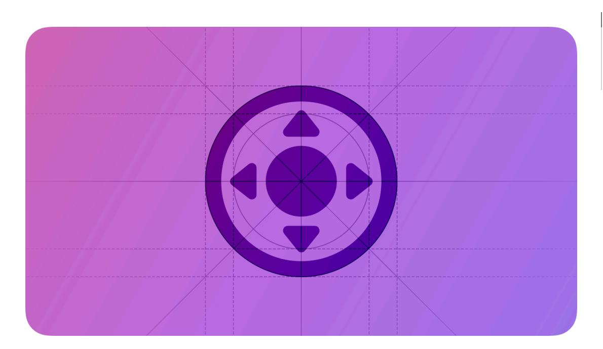
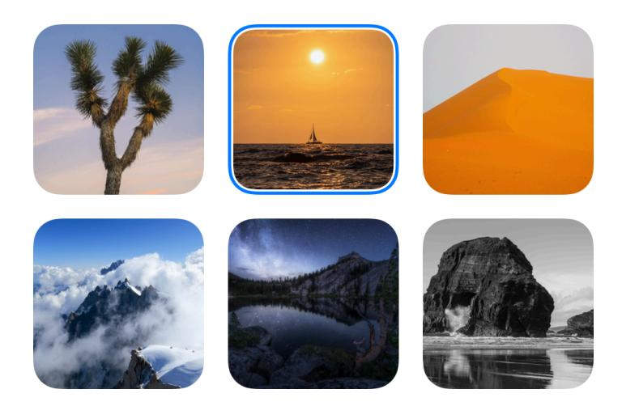
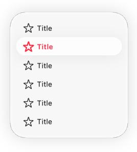
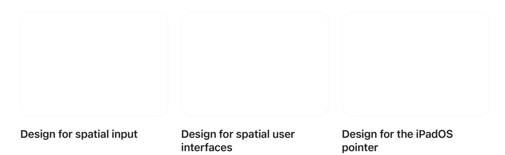

# **Focus and selection**

Focus helps people visually confirm the object that their interaction targets.

**Supported platforms**

Focus and [selection](#page-0-1) Best [practices](#page-0-0) Platform [considerations](#page-1-0) [Resources](#page-5-0) [Change](#page-5-1) log

Focus supports simplified, component-based navigation. Using inputs like a remote, game controller, or keyboard, people bring focus to the components they want to interact with.

In many cases, focusing an item also selects it. The exception is when automatic selection might cause a distracting context shift, like opening a new view. In tvOS, for example, people use the remote to move focus from item to item as they seek the one they want, but because selecting a focused item opens or activates it, selection requires a separate gesture.

Different platforms communicate focus in different ways. For example, iPadOS and macOS show focus by drawing a ring around an item or highlighting it; tvOS generally uses the [parallax](https://developer.apple.com/design/human-interface-guidelines/images#Parallax-effect) effect to give the focused item an appearance of depth and liveliness. The combination of focus effects and interactions is sometimes called a *focus system* or *focus model*.

# **Best [practices](#page-0-0)**

**Rely on system-provided focus effects.** System-defined focus effects are precisely tuned to complement interactions with Apple devices, providing experiences that feel responsive, fluid, and lifelike. Incorporating system-provided focus behaviors gives your app consistency and predictability, helping people understand it quickly. Consider creating custom focus effects only if it's absolutely necessary.

**Avoid changing focus without people's interaction.** People rely on the focus system to help them know where they are in your app. If you change focus without their interaction, people have to spend time finding the newly focused item, delaying their current task. The exception is when people are moving focus using an input device that lets them make discrete, directional

movements — like a keyboard, remote, or game controller — and a previously focused item disappears. In this scenario, there are only a small number of items within one discrete step of the previously focused item, so moving focus to one of these remaining items ensures that the focus indicator is in a location people can easily find. When people aren't moving focus by using such an input device, you can't predict the item they'll target next, so it's generally best to simply hide the focus indicator when the focused object disappears.

**Be consistent with the platform as you help people bring focus to items in your app.** For example, in iPadOS and macOS, a full keyboard access mode helps people use the keyboard to reach every control, so you only need to support focus for content elements like list items, text fields, and search fields, and not for controls like buttons, sliders, and toggles. In contrast, tvOS users rely on using directional gestures on a remote or game controller (or pressing the arrow keys on an attached keyboard) to reach every onscreen element, so you need to make sure that people can bring focus to every element in your app.

**Indicate focus using visual appearances that are consistent with the platform.** For example, consider a window that contains a list of items. In iPadOS and macOS, the system draws focused list items using white text and a background highlight that matches the app's accent color, drawing unfocused items using the standard text color and a gray background highlight (for developer guidance, see *[UICollectionView](https://developer.apple.com/documentation/UIKit/UICollectionView)* and *[NSTableView](https://developer.apple.com/documentation/AppKit/NSTableView)*).

**In general, use a focus ring for a text or search field, but use a highlight in a list or collection.** Although you can use a focus ring to draw attention to an item that fills a cell, like a photo, it's usually easier for people to view lists and collections when an entire row is highlighted.

# **Platform [considerations](#page-1-0)**

*Not supported in iOS or watchOS.*

# **[iPadOS](#page-1-1)**

iPadOS 15 and later defines a focus system that supports keyboard interactions for navigating text fields, text views, and sidebars, in addition to various types of collection views and other custom views in your app.

The iPadOS and tvOS focus systems are similar. People perform actions by moving a focus indicator to an item and then selecting it (for guidance, see [tvOS](#page-3-0)). Although the underlying system is the same, the user experiences are a little different. tvOS uses *directional focus*, which means people can use the same interaction — that is, swiping the Siri Remote or using only the arrow keys on a connected keyboard — to navigate to every onscreen component. In contrast, iPadOS defines *focus groups*, which represent specific areas within an app, like a sidebar, grid, or list. Using focus groups, iPadOS can support two different keyboard interactions.

- Pressing the Tab key moves focus among focus groups, letting people navigate to sidebars, grids, and other app areas.
- Pressing an arrow key supports a directional focus interaction that's similar to tvOS, but limited to navigation among items in the same focus group. For example, people can use an arrow key to move through the items in a list or a sidebar.

Onscreen components can indicate focus by using the halo effect or the highlighted appearance.

The *halo* focus effect — also known as the *focus ring* — displays a customizable outline around the component. You can apply the halo effect to custom views and to fully opaque content within a collection or list cell, such as an image.

**Customize the halo focus effect when necessary.** By default, the system uses an item's shape to infer the shape of its halo. If the system-provided halo doesn't give you the appearance you want, you can refine it to match contours like rounded corners or shapes defined by Bézier paths. You can also adjust a halo's position if another component occludes or clips it. For example, you might need to ensure that a badge appears above the halo or that a parent view doesn't clip it. For developer guidance, see *[UIFocusHaloEffect](https://developer.apple.com/documentation/UIKit/UIFocusHaloEffect)*.

The *highlighted* appearance — in which the component's text uses the app's accent color — also indicates focus, but it's not a focus effect. The highlight appearance occurs automatically when people select a collection view cell on which you've set content configurations (for developer guidance, see *[UICollectionViewCell](https://developer.apple.com/documentation/UIKit/UICollectionViewCell)*).

**Ensure that focus moves through your custom views in ways that make sense.** As people continue pressing the Tab key, focus moves through focus groups in reading order: leading to trailing, and top to bottom. Although focus moves through system-provided views in ways that people expect, you might need to adjust the order in which the focus system visits your custom views. For example, if you want focus to move down through a vertical stack of custom views before it moves in the trailing direction to the next view, you need to identify the stack container as a single focus group. For developer guidance, see *[focusGroupIdentifier](https://developer.apple.com/documentation/UIKit/UIFocusEnvironment/focusGroupIdentifier)*.

**Adjust the priority of an item to reflect its importance within a focus group.** When a group receives focus, its *primary item* automatically receives focus too, making it easy for people to select the item they're most likely to want. You can make an item primary by increasing its priority. For developer guidance, see *[UIFocusGroupPriority](https://developer.apple.com/documentation/UIKit/UIFocusGroupPriority)*.

## **[tvOS](#page-3-0)**

**In a full-screen experience, let people use gestures to interact with the content, not to move focus.** When an item displays in full screen, it doesn't show focus, so people naturally assume that their gestures will affect the object, and not its focus state.

**Avoid displaying a pointer.** People expect to navigate a fixed number of items by changing focus, not by trying to drag a tiny pointer around a huge screen. While free-form movement might make sense during gameplay, such as when looking for a hidden object or flying a plane, use the focus model when people navigate menus and other interface elements. If your app requires a pointer, make sure it's highly visible and feels integrated with your experience.

**Design your interface to accommodate components in various focus states.** In tvOS, focusable items can have up to five different states, each of which is visually distinct. Because focusing an item often increases its scale, you need to supply assets for the larger, focused size to ensure they always look sharp, and you need to make sure the larger item doesn't crowd the surrounding interface.

| State | Description                                                                                                                                                                                                                                 |
|-------|---------------------------------------------------------------------------------------------------------------------------------------------------------------------------------------------------------------------------------------------|
|       | The viewer hasn't brought focus to the item. Unfocused items appear less prominent than focused items.                                                                                                                                |
|       | The viewer brings focus to the item. A focused item vi‐ sually stands out from the other onscreen content through elevation to the foreground, illumination, and animation.                                                        |
|       | The viewer chooses the focused item. A focused item provides instant visual feedback when people choose it. For example, a button might briefly invert its colors and animate before it transitions to its selected appearance. |
|       | The viewer has chosen or activated the item in some way. For example, a heart-shaped button that people can use to favorite a photo might appear filled in the selected state and empty in the deselected state.                   |
|       | The viewer can't bring focus to the item or choose it. An unavailable item appears inactive.                                                                                                                                             |

For developer guidance, see Adding [user-focusable](https://developer.apple.com/documentation/UIKit/adding-user-focusable-elements-to-a-tvos-app) elements to a tvOS app.

## **[visionOS](#page-3-1)**

visionOS supports the same focus system as in iPadOS and tvOS, letting people use a connected input device like a keyboard or game controller to interact with apps and the system.

#### **Note**

When people look at a virtual object to identify it as the object they want to interact with, the system uses the *hover effect*, not a focus effect, to provide visual feedback (for guidance, see [Eyes](https://developer.apple.com/design/human-interface-guidelines/eyes)). The hover effect isn't related to the focus system.

# **[Resources](#page-5-0)**

### **[Related](#page-5-2)**

[Eyes](https://developer.apple.com/design/human-interface-guidelines/eyes)

[Keyboards](https://developer.apple.com/design/human-interface-guidelines/keyboards)

### **Developer [documentation](#page-5-3)**

Focus [Attributes](https://developer.apple.com/documentation/TVML/focus-attributes) — TVML

[Focus-based](https://developer.apple.com/documentation/UIKit/focus-based-navigation) navigation — UIKit

About focus [interactions](https://developer.apple.com/documentation/UIKit/about-focus-interactions-for-apple-tv) for Apple TV — UIKit

### **[Videos](#page-5-4)**

# **[Change](#page-5-1) log**

| Date             | Changes                                                                          |
|------------------|----------------------------------------------------------------------------------|
| October 24, 2023 | Clarified the difference between focus effects and the visionOS hover effect. |
| June 21, 2023    | Updated to include guidance for visionOS.                                        |