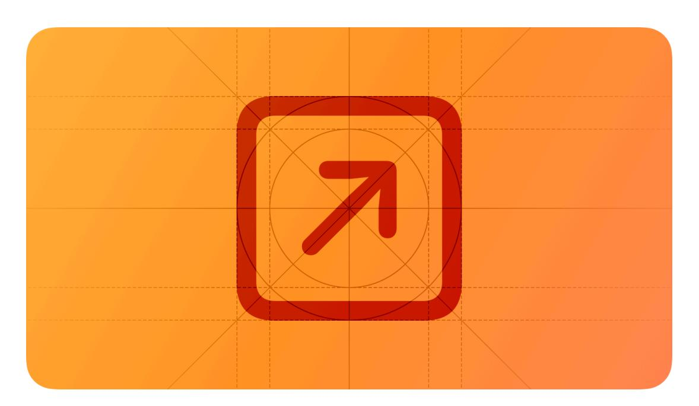
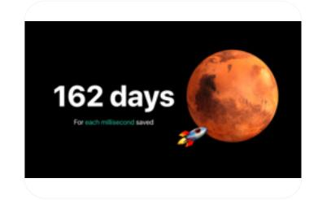

# **Launching**

A streamlined launch experience helps people start using your app or game immediately.

**Supported platforms**

[Launching](#page-0-1) Best [practices](#page-0-0) Launch [screens](#page-1-0) Platform [considerations](#page-1-1) [Resources](#page-3-0) [Change](#page-3-1) log

Launching begins when someone opens your app or game, includes an initial download, and ends when the first screen is ready. After launching completes, you might offer an [onboarding](https://developer.apple.com/design/human-interface-guidelines/onboarding) experience, which can give people a high-level view of your app or game.

# **Best [practices](#page-0-0)**

**Launch instantly.** People want to start interacting with your app or game right away, and sometimes they don't want to wait more than a couple of seconds.

**If the platform requires it, provide a launch screen.** In iOS, iPadOS, and tvOS, the system displays your launch screen the moment your app or game starts and quickly replaces it with your first screen, giving people the impression that your experience is fast and responsive. For guidance, see Launch [screens.](#page-1-0) macOS, visionOS, and watchOS don't require launch screens.

**If you need a splash screen, consider displaying it at the beginning of your onboarding flow.** A splash screen is a beautiful graphic that succinctly communicates branding and other information you need to provide. If you don't provide an onboarding experience, you might display your splash screen as soon as launching completes.

**Restore the previous state when your app restarts so people can continue where they left off.** Avoid making people retrace steps to reach their previous location in your app or game. Restore granular details of the previous state as much as possible. For example, scroll the view to people's most recent position, and display windows in the same state and location in which people left them.

# **Launch [screens](#page-1-0)**

*Not applicable for macOS, visionOS, or watchOS.*

**Downplay the launch experience.** A launch screen isn't part of an onboarding experience or a splash screen, and it isn't an opportunity for artistic expression. A launch screen's sole function is to enhance the perception of your experience as quick to launch and immediately ready to use.

**Design a launch screen that's nearly identical to the first screen of your app or game.** If you include elements that look different when launching completes, people may experience an unpleasant flash between the launch screen and your first screen. If your app or game displays a solid color before transitioning to the first screen, create a launch screen that displays only that solid color. Also make sure that your launch screen matches the device's current orientation and appearance mode.

**Avoid including text on your launch screen, even if your first screen displays text.** Because the content in a launch screen doesn't change, any text you display won't be localized.

**Don't advertise.** The launch screen isn't a branding opportunity. Avoid creating a screen that looks like a splash screen or an "About" window, and don't include logos or other branding elements unless they're a fixed part of your app's first screen.

# **Platform [considerations](#page-1-1)**

*No additional considerations for macOS or watchOS.*

## **iOS, [iPadOS](#page-1-2)**

**Launch in the appropriate orientation.** If your app or game supports both portrait and landscape modes, launch using the device's current orientation. If your interface only runs in one orientation, launch in that orientation and let people rotate the device if necessary. Ensure a landscape-only interface responds correctly, regardless of whether people enter landscape orientation by rotating the device left or right. For guidance, see [Layout](https://developer.apple.com/design/human-interface-guidelines/layout).

## **[tvOS](#page-1-3)**

**Note**

Unlike the [layered](https://developer.apple.com/design/human-interface-guidelines/images#Layered-images) images throughout much of a tvOS app, the launch screen is static.

**In a live-viewing app, consider automatically starting playback soon after people start the app.** People come to your app to watch TV, so you might want to start playing new or recently viewed live content after a few seconds of inactivity. For guidance, see [Live-viewing](https://developer.apple.com/design/human-interface-guidelines/live-viewing-apps) apps.

## **[visionOS](#page-1-4)**

**Consider launching in the Shared Space even if your app is fully immersive.** Opening a window in the Shared Space lets you provide more context about your app or game while giving it time to load, and it also lets you present a control that people can use to open your fully immersive experience. In general, people appreciate being able to choose when to transition to a

Full Space, especially if they're currently running other apps in the Shared Space. For guidance,

see  $\underline{\text{Immersive experiences}}.$ 

# **[Resources](#page-3-0)**

#### **[Related](#page-3-2)**

[Onboarding](https://developer.apple.com/design/human-interface-guidelines/onboarding)

[Loading](https://developer.apple.com/design/human-interface-guidelines/loading)

#### **Developer [documentation](#page-3-3)**

[Specifying](https://developer.apple.com/documentation/Xcode/specifying-your-apps-launch-screen) your app's launch screen — Xcode

[Responding](https://developer.apple.com/documentation/UIKit/responding-to-the-launch-of-your-app) to the launch of your app — UIKit

### **[Videos](#page-3-4)**

**[Optimizing](https://developer.apple.com/videos/play/wwdc2019/423) App Launch Love at First [Launch](https://developer.apple.com/videos/play/wwdc2017/816)**

# **[Change](#page-3-1) log**

| Date          | Changes                                       |  |  |
|---------------|-----------------------------------------------|--|--|
| June 10, 2024 | Added guidance on displaying a splash screen. |  |  |
| June 21, 2023 | Updated to include guidance for visionOS.     |  |  |