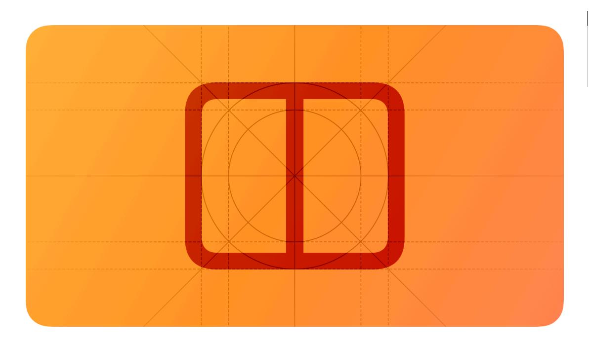
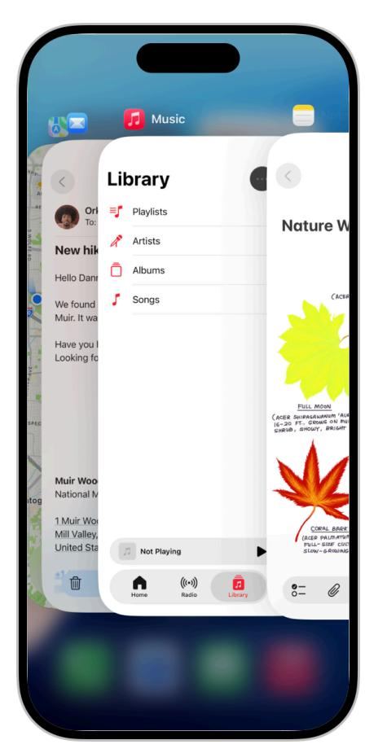
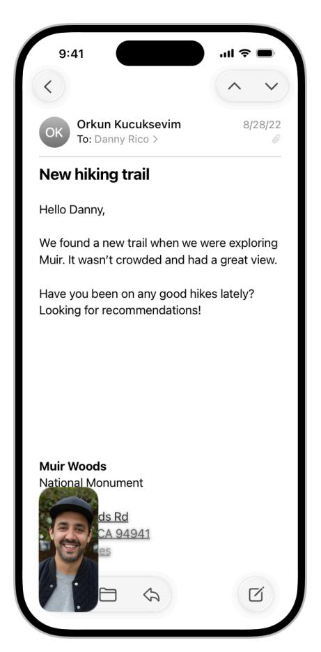
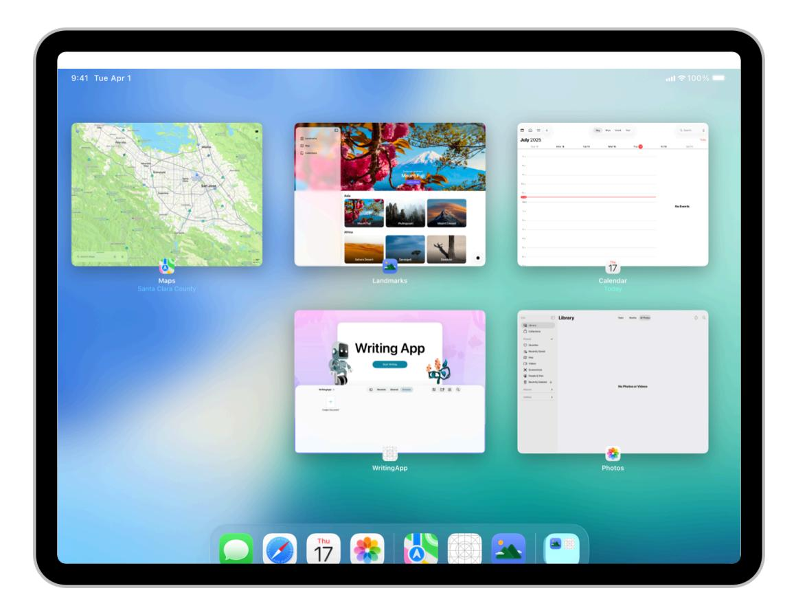
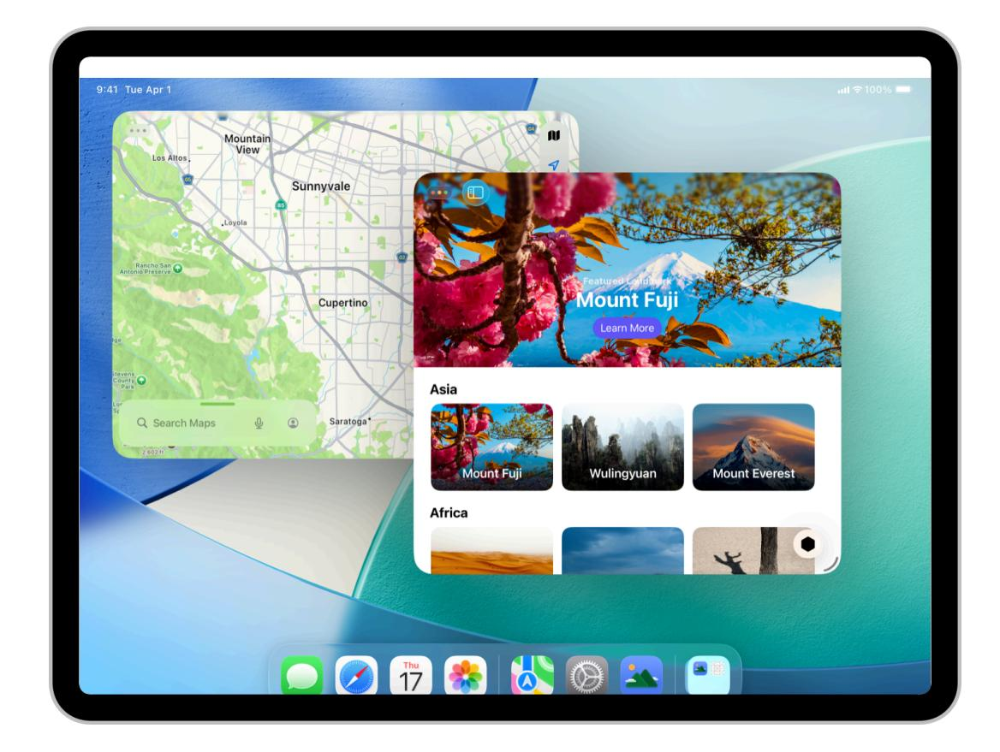
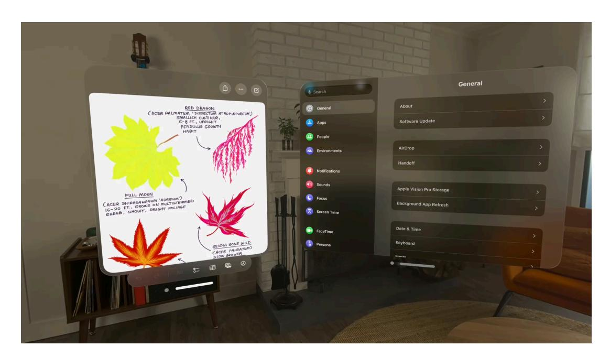

**[Design](https://developer.apple.com/design/)** [Overview](https://developer.apple.com/design/) [What's](https://developer.apple.com/design/whats-new/) New Get [Started](https://developer.apple.com/design/get-started/) [Guidelines](https://developer.apple.com/design/human-interface-guidelines) [Resources](https://developer.apple.com/design/resources/)

# **Multitasking**

Multitasking lets people switch quickly from one app to another, performing tasks in each.

**Supported platforms**

[Multitasking](#page-0-1)

Best [practices](#page-0-0) Platform [considerations](#page-1-0)

[Resources](#page-5-0) [Change](#page-5-1) log

People expect to use multitasking on their devices, and they may think something is wrong if your app doesn't allow it. With rare exceptions — such as some games, and Apple Vision Pro apps running in a Full Space — every app needs to work well with multitasking.

In addition to app switching, multitasking can present different experiences on different devices; see Platform [considerations.](#page-1-0)

# **Best [practices](#page-0-0)**

A great multitasking experience helps people accomplish tasks in multiple apps by managing content in a variety of simultaneous contexts. Because you don't know when people will initiate multitasking, your app or game always needs to be prepared to save and restore their context.

**Pause activities that require people's attention or active participation when they switch away.** If your app is a game or a media-viewing app, for example, make sure people don't miss anything when they switch to another app. When they switch back, let them continue as if they never left.

**Respond smoothly to audio interruptions.** Occasionally, audio from another app or the system itself may interrupt your app's audio. For example, an incoming phone call or a music playlist initiated by Siri might interrupt your app's audio. When situations like these occur, people expect your app to respond in the following ways:

Pause audio indefinitely for primary audio interruptions, such as playing music, podcasts, or audiobooks.

Temporarily lower the volume or pause the audio for shorter interruptions, such as GPS directional notifications, and resume the original volume or playback when the interruption ends.

For guidance, see [Playing](https://developer.apple.com/design/human-interface-guidelines/playing-audio) audio.

**Finish user-initiated tasks in the background.** When someone starts a task like downloading assets or processing a video file, they expect it to finish even if they switch away from your app. If your app is in the middle of performing a task that doesn't need additional input, complete it in the background before suspending.

**Use notifications sparingly.** Your app can send notifications when it's suspended or running in the background. If people start an important or time-sensitive task in your app, and then switch away from it, they might appreciate receiving a notification when the task completes so they can switch back to your app and take the next step. In contrast, people don't generally need to know the moment a routine or secondary task completes. In this scenario, avoid sending an unnecessary notification; instead, let people check on the task when they return to your app. For guidance, see Managing [notifications](https://developer.apple.com/design/human-interface-guidelines/managing-notifications).

# **Platform [considerations](#page-1-0)**

*Not supported in watchOS.*

## **[iOS](#page-1-1)**

On iPhone, multitasking lets people use FaceTime or watch a video in Picture in Picture while they also use a different app.

The app switcher displays all currently open apps. A current FaceTime call can continue while people use another app.

### **[iPadOS](#page-2-0)**

On iPad, people can view and interact with the [windows](https://developer.apple.com/design/human-interface-guidelines/windows) of several different apps at the same time. An individual app can also support multiple open windows, which lets people view and interact with more than one window in the same app at one time.

People can use iPad with either full-screen or windowed apps. When full screen, apps occupy the full screen, and people can switch between individual app windows using the app switcher.

When using windowed apps, app windows are resizable, and people can arrange them to suit their needs with behavior similar to macOS. The system provides window controls for common tiling configurations, entering full screen, minimizing, and closing windows. The system identifies the frontmost window by coloring its window controls and casting a drop shadow on windows behind it. For guidance, see [Windows](https://developer.apple.com/design/human-interface-guidelines/windows#iPadOS) > iPadOS.

Additionally, videos and FaceTime calls can also play in a Picture in Picture overlay above other content regardless of whether apps are full screen or windowed.

#### **Note**

Apps don't control multitasking configurations or receive any indication of the ones that people choose.

To help your app respond correctly when people open it while windowed, make sure it adapts gracefully to different screen sizes. For guidance, see [Layout](https://developer.apple.com/design/human-interface-guidelines/layout) and [Windows;](https://developer.apple.com/design/human-interface-guidelines/windows) for developer guidance, see [Multitasking](https://developer.apple.com/documentation/UIKit/multitasking-on-ipad-mac-and-apple-vision-pro) on iPad, Mac, and Apple Vision Pro. To learn more about how people use iPad multitasking features, see Use [multitasking](https://support.apple.com/en-us/HT207582) on your iPad.

### **[macOS](#page-3-0)**

On Mac, multitasking is the default experience because people typically run more than one app at a time, switching between windows and tasks as they work. When multiple app windows are open, macOS applies drop shadows that make the windows appear layered on the desktop, and applies other visual effects to help people distinguish different window states; for guidance, see macOS [window](https://developer.apple.com/design/human-interface-guidelines/windows#macOS-window-states) states.

### **[tvOS](#page-3-1)**

On Apple TV, people can play or browse content while also playing movies or TV shows in Picture in Picture (where supported).

### **[visionOS](#page-3-2)**

On Apple Vision Pro, people can run multiple apps at the same time in the Shared Space, viewing and switching between windows and volumes throughout the space.

Only one window is active at a time in the Shared Space. When people look from one window to another, the window they're currently looking at becomes active while the previous window becomes more translucent and appears to recede along the z-axis. Closing an app window in the Shared Space transitions the app to the background without quitting it.

#### **Note**

When an app is the Now Playing app, closing its window automatically pauses audio playback; if people want to resume playback, they can do so in Control Center without opening the window.

**Avoid interfering with the system-provided multitasking behavior.** When people look from one window to another, visionOS applies a feathered mask to the window they look away from to clarify its changed state. To avoid interfering with this visual feedback, don't change the appearance of a window's edges.

Play

**Don't pause a window's video playback when people look away from it.** In visionOS, as in macOS, people expect the playback they start in one window to continue while they view or perform a task in another window.

**Be prepared for situations where your audio can duck.** Unless an app is currently the Now Playing app, its audio can duck when people look away from it to another app.

# **[Resources](#page-5-0)**

#### **[Related](#page-5-2)**

[Layout](https://developer.apple.com/design/human-interface-guidelines/layout)

[Windows](https://developer.apple.com/design/human-interface-guidelines/windows)

[Playing](https://developer.apple.com/design/human-interface-guidelines/playing-video) video

#### **Developer [documentation](#page-5-3)**

[Responding](https://developer.apple.com/documentation/UIKit/responding-to-the-launch-of-your-app) to the launch of your app — UIKit

[Multitasking](https://developer.apple.com/documentation/UIKit/multitasking-on-ipad-mac-and-apple-vision-pro) on iPad, Mac, and Apple Vision Pro — UIKit

#### **[Videos](#page-5-4)**

**[Elevate](https://developer.apple.com/videos/play/wwdc2025/208) the design of your iPad app**

**Make your UIKit app more [flexible](https://developer.apple.com/videos/play/wwdc2025/282)**

# **[Change](#page-5-1) log**

| Date             | Changes                                                                                                                       |
|------------------|-------------------------------------------------------------------------------------------------------------------------------|
| June 9, 2025     | Reorganized guidance in platform considerations, and added guidance for multitasking with multiple win‐ dows in iPadOS. |
| December 5, 2023 | Added artwork for primary and auxiliary windows in iPadOS.                                                                 |
| June 21, 2023    | Updated to include guidance for visionOS.                                                                                     |