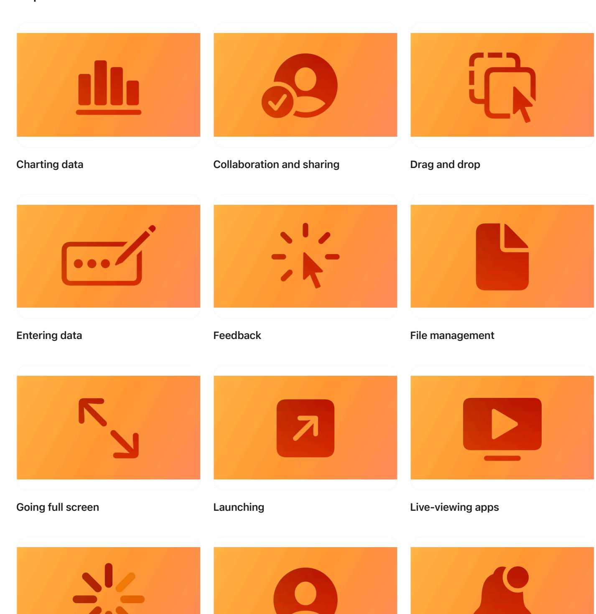
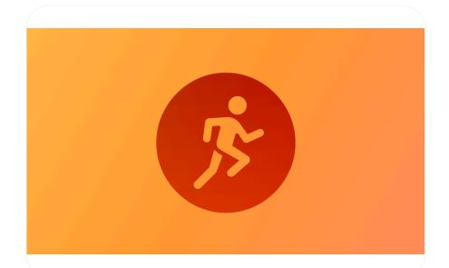

**[Design](https://developer.apple.com/design/)** [Overview](https://developer.apple.com/design/) [What's](https://developer.apple.com/design/whats-new/) New Get [Started](https://developer.apple.com/design/get-started/) [Guidelines](https://developer.apple.com/design/human-interface-guidelines) [Resources](https://developer.apple.com/design/resources/)

## **Patterns**

Get design guidance for supporting common user actions, tasks, and experiences.

**[Loading](https://developer.apple.com/design/human-interface-guidelines/loading) [Managing](https://developer.apple.com/design/human-interface-guidelines/managing-accounts) accounts Managing [notifications](https://developer.apple.com/design/human-interface-guidelines/managing-notifications)**

**[Modality](https://developer.apple.com/design/human-interface-guidelines/modality) [Multitasking](https://developer.apple.com/design/human-interface-guidelines/multitasking) [Offering](https://developer.apple.com/design/human-interface-guidelines/offering-help) help**

**[Onboarding](https://developer.apple.com/design/human-interface-guidelines/onboarding) [Playing](https://developer.apple.com/design/human-interface-guidelines/playing-audio) audio Playing [haptics](https://developer.apple.com/design/human-interface-guidelines/playing-haptics)**

**[Playing](https://developer.apple.com/design/human-interface-guidelines/playing-video) video [Printing](https://developer.apple.com/design/human-interface-guidelines/printing) Ratings and [reviews](https://developer.apple.com/design/human-interface-guidelines/ratings-and-reviews)**

**[Searching](https://developer.apple.com/design/human-interface-guidelines/searching) [Settings](https://developer.apple.com/design/human-interface-guidelines/settings) [Undo](https://developer.apple.com/design/human-interface-guidelines/undo-and-redo) and redo**

**[Workouts](https://developer.apple.com/design/human-interface-guidelines/workouts)**