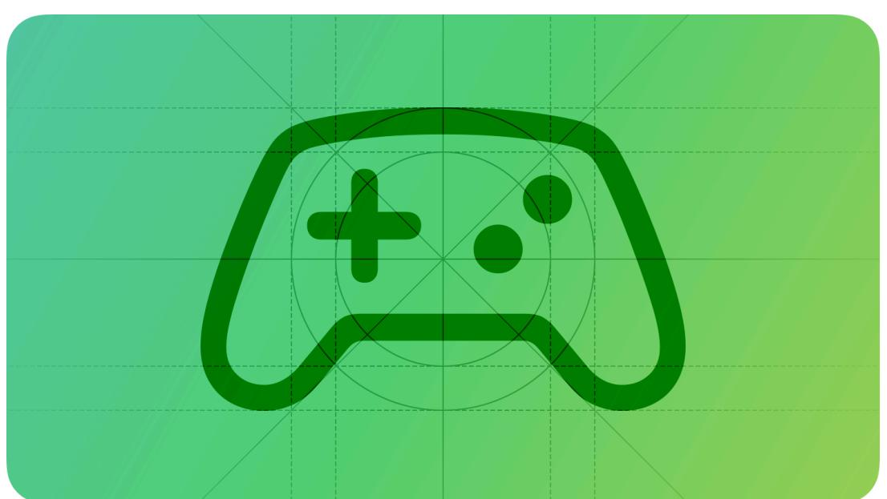
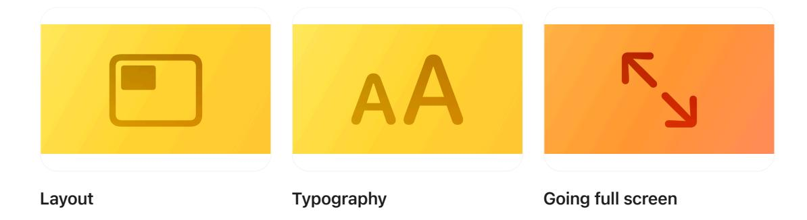
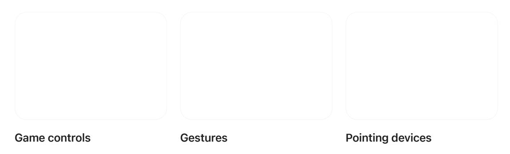

**[Design](https://developer.apple.com/design/)** [Overview](https://developer.apple.com/design/) [What's](https://developer.apple.com/design/whats-new/) New Get [Started](https://developer.apple.com/design/get-started/) [Guidelines](https://developer.apple.com/design/human-interface-guidelines) [Resources](https://developer.apple.com/design/resources/)

# **Designing for games**

When people play your game on an Apple device, they dive into the world you designed while relying on the platform features they love.

As you create or adapt a game for Apple platforms, learn how to integrate the fundamental platform characteristics and patterns that help your game feel at home on all Apple devices. To learn what makes each platform unique, see [Designing](https://developer.apple.com/design/human-interface-guidelines/designing-for-ios) for iOS, [Designing](https://developer.apple.com/design/human-interface-guidelines/designing-for-ipados) for iPadOS, [Designing](https://developer.apple.com/design/human-interface-guidelines/designing-for-macos)

for [macOS,](https://developer.apple.com/design/human-interface-guidelines/designing-for-macos) [Designing](https://developer.apple.com/design/human-interface-guidelines/designing-for-tvos) for tvOS, [Designing](https://developer.apple.com/design/human-interface-guidelines/designing-for-visionos) for visionOS, and [Designing](https://developer.apple.com/design/human-interface-guidelines/designing-for-watchos) for watchOS. For

# **Jump into [gameplay](#page-0-0)**

developer guidance, see Games [Pathway.](https://developer.apple.com/games/pathway/)

**Let people play as soon as installation completes.** You don't want a player's first experience with your game to be waiting for a lengthy download. Include as much playable content as you can in your game's initial installation while keeping the download time to 30 minutes or less. Download additional content in the background. For guidance, see [Loading](https://developer.apple.com/design/human-interface-guidelines/loading).

**Provide great default settings.** People appreciate being able to start playing without first having to change a lot of settings. Use information about a player's device to choose the best defaults for your game, such as the device resolution that makes your graphics look great, automatic recognition of paired accessories and game controllers, and the player's accessibility settings. Also, make sure your game supports the platform's most common interaction methods. For guidance, see [Settings](https://developer.apple.com/design/human-interface-guidelines/settings).

**Teach through play.** Players often learn better when they discover new information and mechanics in the context of your game's world, so it can work well to integrate configuration and onboarding flows into a playable tutorial that engages people quickly and helps them feel

#### [Designing](#page-0-1) for games

Jump into [gameplay](#page-0-0) Look [stunning](#page-1-0) on every display Enable intuitive [interactions](#page-2-0) [Welcome](#page-3-0) everyone Adopt Apple [technologies](#page-4-0) [Resources](#page-5-0) [Change](#page-5-1) log

successful right away. If you also have a written tutorial, consider offering it as a resource players can refer to when they have questions instead of making it a prerequisite for gameplay. For guidance, see [Onboarding](https://developer.apple.com/design/human-interface-guidelines/onboarding).

**Defer requests until the right time.** You don't want to bombard people with too many requests before they start playing, but if your game uses certain sensors on an Apple device or personalizes gameplay by accessing data like hand-tracking, you must first get the player's permission (for guidance, see [Privacy](https://developer.apple.com/design/human-interface-guidelines/privacy)). To help people understand why you're making such a request, integrate it into the scenario that requires the data. For example, you could ask permission to track a player's hands between an initial cutscene and the first time they can use their hands to control the action. Also, make sure people spend quality time with your game before you ask them for a rating or review (for guidance, see Ratings and [reviews](https://developer.apple.com/design/human-interface-guidelines/ratings-and-reviews)).

#### **Look [stunning](#page-1-0) on every display**

**Make sure text is always legible.** When game text is hard to read, people can struggle to follow the narrative, understand important instructions and information, and stay engaged in the experience. To keep text comfortably legible on each device, ensure that it contrasts well with the background and uses at least the recommended minimum text size in each platform. For guidance, see [Typography](https://developer.apple.com/design/human-interface-guidelines/typography); for developer guidance, see Adapting your game [interface](https://developer.apple.com/documentation/Metal/adapting-your-game-interface-for-smaller-screens) for smaller [screens.](https://developer.apple.com/documentation/Metal/adapting-your-game-interface-for-smaller-screens)

| Platform    | Default text size | Minimum text size |
|-------------|-------------------|-------------------|
| iOS, iPadOS | 17 pt             | 11 pt             |
| macOS       | 13 pt             | 10 pt             |
| tvOS        | 29 pt             | 23 pt             |
| visionOS    | 17 pt             | 12 pt             |
| watchOS     | 16 pt             | 12 pt             |

**Make sure buttons are always easy to use.** Buttons that are too small or too close together can frustrate players and make gameplay less fun. Each platform defines a recommended minimum button size based on its default interaction method. For example, buttons in iOS must be at least 44x44 pt to accommodate touch interaction. For guidance, see [Buttons](https://developer.apple.com/design/human-interface-guidelines/buttons).

| Platform    | Default button size | Minimum button size |
|-------------|---------------------|---------------------|
| iOS, iPadOS | 44x44 pt            | 28x28 pt            |
| macOS       | 28x28 pt            | 20x20 pt            |
| tvOS        | 66x66 pt            | 56x56 pt            |

| Platform | Default button size | Minimum button size |
|----------|---------------------|---------------------|
| visionOS | 60x60 pt            | 28x28 pt            |
| watchOS  | 44x44 pt            | 28x28 pt            |

**Prefer resolution-independent textures and graphics.** If creating resolution-independent assets isn't possible, match the resolution of your game to the resolution of the device. In visionOS, prefer vector-based art that can continue to look good when the system dynamically scales it as people view it from different distances and angles. For guidance, see [Images](https://developer.apple.com/design/human-interface-guidelines/images).

**Integrate device features into your layout.** For example, a device may have rounded corners or a camera housing that can affect parts of your interface. To help your game look at home on each device, accommodate such features during layout, relying on platform-provided safe areas when possible (for developer guidance, see [Positioning](https://developer.apple.com/documentation/UIKit/positioning-content-relative-to-the-safe-area) content relative to the safe area). For guidance, see [Layout;](https://developer.apple.com/design/human-interface-guidelines/layout) for templates that include safe-area guides, see Apple Design [Resources.](https://developer.apple.com/design/resources/)

**Make sure in-game menus adapt to different aspect ratios.** Games need to look good and behave well at various aspect ratios, such as 16:10, 19.5:9, and 4:3. In particular, in-game menus need to remain legible and easy to use on every device — and, if you support them, in both orientations on iPhone and iPad — without obscuring other content. To help ensure your in-game menus render correctly, consider using dynamic layouts that rely on relative constraints to adjust to different contexts. Avoid fixed layouts as much as possible, and aim to create a custom, device-specific layout only when necessary. For guidance, see [In-game](https://developer.apple.com/design/human-interface-guidelines/menus#In-game-menus) menus.

**Design for the full-screen experience.** People often enjoy playing a game in a distraction-free, full-screen context. In macOS, iOS, and iPadOS, full-screen mode lets people hide other apps and parts of the system UI; in visionOS, a game running in a Full Space can completely surround people, transporting them somewhere else. For guidance, see Going full [screen.](https://developer.apple.com/design/human-interface-guidelines/going-full-screen)

### **Enable intuitive [interactions](#page-2-0)**

**Support each platform's default interaction method.** For example, people generally use touch to play games on iPhone; on a Mac, players tend to expect keyboard and mouse or trackpad support; and in a visionOS game, people expect to use their eyes and hands while making indirect and direct gestures. As you work to ensure that your game supports each platform's default interaction method, pay special attention to control sizing and menu behavior, especially when bringing your game from a pointer-based context to a touch-based one.

| Platform | Default interaction methods | Additional interaction methods                              |
|----------|-----------------------------|-------------------------------------------------------------|
| iOS      | Touch                       | Game controller                                             |
| iPadOS   | Touch                       | Game controller, keyboard, mouse, trackpad, Apple Pencil |
| macOS    | Keyboard, mouse, trackpad   | Game controller                                             |
|          |                             |                                                             |

| Platform | Default interaction methods | Additional interaction methods                                         |
|----------|-----------------------------|------------------------------------------------------------------------|
| tvOS     | Remote                      | Game controller, keyboard, mouse, trackpad                          |
| visionOS | Touch                       | Game controller, keyboard, mouse, trackpad, spatial game controller |
| watchOS  | Touch                       | –                                                                      |

**Support physical game controllers, while also giving people alternatives.** Every platform except watchOS supports physical game controllers. Although the presence of a game controller makes it straightforward to port controls from an existing game and handle complex control mappings, recognize that not every player can use a physical game controller. To make your game available to as many players as possible, also offer alternative ways to interact with your game. For guidance, see Physical [controllers.](https://developer.apple.com/design/human-interface-guidelines/game-controls#Physical-controllers)

**Offer touch-based game controls that embrace the touchscreen experience on iPhone and iPad.** In iOS and iPadOS, your game can allow players to interact directly with game elements, and to control the game using virtual controls that appear on top of your game content. For design guidance, see Touch [controls](https://developer.apple.com/design/human-interface-guidelines/game-controls#Touch-controls).

# **[Welcome](#page-3-0) everyone**

**Prioritize perceivability.** Make sure people can perceive your game's content whether they use sight, hearing, or touch. For example, avoid relying solely on color to convey an important detail, or providing a cutscene that doesn't include descriptive subtitles or offer other ways to read the content. For specific guidance, see:

- Text sizes
- Color and effects
- Motion
- Interactions
- Buttons

**Help players personalize their experience.** Players have a variety of preferences and abilities that influence their interactions with your game. Because there's no universal configuration that suits everyone, give players the ability to customize parameters like type size, game control mapping, motion intensity, and sound balance. You can take advantage of built-in [Apple](https://developer.apple.com/accessibility/) accessibility [technologies](https://developer.apple.com/accessibility/) to support accessibility personalizations, whether you're using system frameworks or Unity [plug-ins](https://github.com/Apple/UnityPlugins).

**Give players the tools they need to represent themselves.** If your game encourages players to create avatars or supply names or descriptions, support the spectrum of self-identity and provide options that represent as many human characteristics as possible.

| Avoid stereotypes in your stories and characters. Ask yourself whether you're depicting game     |
|--------------------------------------------------------------------------------------------------|
| characters and scenarios in a way that perpetuates real-life stereotypes. For example, does your |
| game depict enemies as having a certain race, gender, or cultural heritage? Review your game to  |
| uncover and remove biases and stereotypes and — if references to real-life cultures and       |
| languages are necessary — be sure they're respectful.                                         |
|                                                                                                  |

## **Adopt Apple [technologies](#page-4-0)**

**Integrate Game Center to help players discover your game across their devices and connect with their friends.** Game [Center](https://developer.apple.com/game-center/) is Apple's social gaming network, available on all platforms. Game Center lets players keep track of their progress and achievements and allows you to set up leaderboards, challenges, and multiplayer activities in your game. For design guidance, see Game [Center;](https://developer.apple.com/design/human-interface-guidelines/game-center) for developer guidance, see [GameKit.](https://developer.apple.com/documentation/GameKit)

**Let players pick up their game on any of their devices.** People often have a single iCloud account that they use across multiple Apple devices. When you support [GameSave](https://developer.apple.com/documentation/GameSave), you can help people save their game state and start back up exactly where they left off on a different device.

**Support haptics to help players feel the action.** When you adopt Core Haptics, you can compose and play custom haptic patterns, optionally combined with custom audio content. Core Haptics is available in iOS, iPadOS, tvOS, and visionOS, and supported on many game controllers. For guidance, see Playing [haptics](https://developer.apple.com/design/human-interface-guidelines/playing-haptics); for developer guidance, see Core [Haptics](https://developer.apple.com/documentation/CoreHaptics) and Playing Haptics on Game [Controllers](https://developer.apple.com/documentation/CoreHaptics/playing-haptics-on-game-controllers).

**Use Spatial Audio to immerse players in your game's soundscape.** Providing multichannel audio can help your game's audio adapt automatically to the current device, enabling an immersive Spatial Audio experience where supported. For guidance, see [Playing](https://developer.apple.com/design/human-interface-guidelines/playing-audio#visionOS) audio > [visionOS](https://developer.apple.com/design/human-interface-guidelines/playing-audio#visionOS); for developer guidance, see [Explore](https://developer.apple.com/news/?id=fakg1z5b) Spatial Audio.

**Take advantage of Apple technologies to enable unique gameplay mechanics.** For example, you can integrate technologies like augmented reality, machine learning, and [HealthKit](https://developer.apple.com/documentation/HealthKit), and request access to location data and functionality like camera and microphone. For a full list of Apple technologies, features, and services, see [Technologies.](https://developer.apple.com/design/human-interface-guidelines/technologies)

#### **[Resources](#page-5-0)**

#### **[Related](#page-5-2)**

Game [Center](https://developer.apple.com/design/human-interface-guidelines/game-center)

Game [controls](https://developer.apple.com/design/human-interface-guidelines/game-controls)

#### **Developer [documentation](#page-5-3)**

Games [Pathway](https://developer.apple.com/games/get-started/)

Create games for Apple [platforms](https://developer.apple.com/games/)

#### **[Videos](#page-5-4)**

**Level up your [games](https://developer.apple.com/videos/play/wwdc2025/209) Design [advanced](https://developer.apple.com/videos/play/wwdc2024/10085) games for Apple platforms**

### **[Change](#page-5-1) log**

| Date          | Changes                                                       |
|---------------|---------------------------------------------------------------|
| June 9, 2025  | Updated guidance for touch-based controls and Game Center. |
| June 10, 2024 | New page.                                                     |