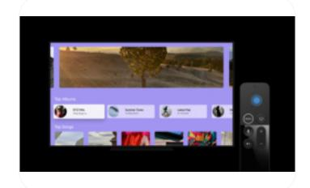

**[Design](https://developer.apple.com/design/)** [Overview](https://developer.apple.com/design/) [What's](https://developer.apple.com/design/whats-new/) New Get [Started](https://developer.apple.com/design/get-started/) [Guidelines](https://developer.apple.com/design/human-interface-guidelines) [Resources](https://developer.apple.com/design/resources/)

# **Designing for tvOS**

People enjoy the vibrant content, immersive experiences, and streamlined interactions that tvOS delivers in media and games, as well as in fitness, education, and home utility apps.

[Designing](#page-0-0) for tvOS Best [practices](#page-1-0) [Resources](#page-2-0) [Change](#page-2-1) log

As you begin designing your app or game for tvOS, start by understanding the following fundamental device characteristics and patterns that distinguish the tvOS experience. Using these characteristics and patterns to inform your design decisions can help you provide an app or game that tvOS users appreciate.

**Display.** A TV typically has a very large, high-resolution display.

**Ergonomics.** Although people generally remain many feet away from their stationary TV — often 8 feet or more — they sometimes continue to interact with content as they move around the room.

**Inputs.** People can use a [remote,](https://developer.apple.com/design/human-interface-guidelines/remotes) a game [controller](https://developer.apple.com/design/human-interface-guidelines/game-controls), their [voice,](https://developer.apple.com/design/human-interface-guidelines/siri) and apps running on their other devices to interact with Apple TV.

**App interactions.** People can get deeply immersed in a single experience — often lasting hours — but they also appreciate using a picture-in-picture view to simultaneously follow an alternative app or video.

**System features.** Apple TV users expect their apps and games to integrate well with the following system experiences.

- [Integrating](https://developer.apple.com/design/human-interface-guidelines/playing-video#Integrating-with-the-TV-app) with the TV app
- [SharePlay](https://developer.apple.com/design/human-interface-guidelines/shareplay)
- Top [Shelf](https://developer.apple.com/design/human-interface-guidelines/top-shelf)
- TV provider [accounts](https://developer.apple.com/design/human-interface-guidelines/managing-accounts#TV-provider-accounts)

## **Best [practices](#page-1-0)**

Great tvOS experiences integrate the platform and device capabilities that people value most. To help your experience feel at home in tvOS, prioritize the following ways to incorporate these features and capabilities.

- Support powerful, delightful interactions through the fluid, familiar gestures people make with the Siri Remote.
- Embrace the tvOS focus system, letting it gently highlight and expand onscreen items as people move among them, helping them know what to do and where they are at all times.
- Deliver beautiful, edge-to-edge artwork, subtle and fluid animations, and engaging audio, wrapping people in a rich, cinematic experience that's clear, legible, and captivating from across the room.
- Enhance multiuser support by making sign-in easy and infrequent, handling shared sign-in, and automatically switching profiles when people change the current viewer.

## **[Resources](#page-2-0)**

#### **[Related](#page-2-2)**

Apple Design [Resources](https://developer.apple.com/design/resources/#tvos-apps)

#### **Developer [documentation](#page-2-3)**

tvOS [Pathway](https://developer.apple.com/tvos/get-started/)

#### **[Videos](#page-2-4)**

**Build [SwiftUI](https://developer.apple.com/videos/play/wwdc2020/10042) apps for tvOS**

## **[Change](#page-2-1) log**

**Date Changes**

September 14, 2022 Refined best practices for multiuser support.