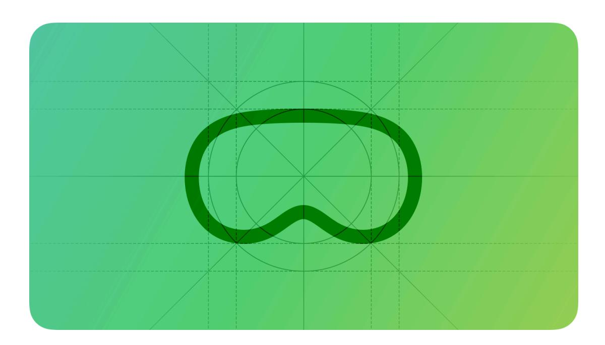
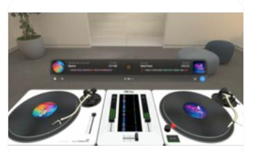

# **Designing for visionOS**

When people wear Apple Vision Pro, they enter an infinite 3D space where they can engage with your app or game while staying connected to their surroundings.

[Designing](#page-0-0) for visionOS Best [practices](#page-1-0) [Resources](#page-3-0) [Change](#page-3-1) log

As you begin designing your app or game for visionOS, start by understanding the fundamental device characteristics and patterns that distinguish the platform. Use these characteristics and patterns to inform your design decisions and help you create immersive and engaging experiences.

**Space.** Apple Vision Pro offers a limitless canvas where people can view virtual content like [windows,](https://developer.apple.com/design/human-interface-guidelines/windows) [volumes,](https://developer.apple.com/design/human-interface-guidelines/windows#visionOS-volumes) and 3D objects, and choose to enter deeply immersive experiences that can transport them to different places.

**Immersion.** In a visionOS app, people can fluidly transition between different levels of [immersion.](https://developer.apple.com/design/human-interface-guidelines/immersive-experiences) By default, an app launches in the *Shared Space* where multiple apps can run sideby-side and people can open, close, and relocate windows. People can also choose to transition an app to a *Full Space*, where it's the only app running. While in a Full Space app, people can view 3D content blended with their surroundings, open a portal to view another place, or enter a different world.

**Passthrough.** [Passthrough](https://developer.apple.com/design/human-interface-guidelines/immersive-experiences#Immersion-and-passthrough) provides live video from the device's external cameras, and helps people interact with virtual content while also seeing their actual surroundings. When people want to see more or less of their surroundings, they use the [Digital](https://developer.apple.com/design/human-interface-guidelines/digital-crown) Crown to control the amount of passthrough.

**Spatial Audio.** Apple Vision Pro combines acoustic and visual-sensing technologies to model the sonic characteristics of a person's surroundings, automatically making audio sound natural in their space. When an app receives a person's permission to access information about their surroundings, it can fine-tune [Spatial](https://developer.apple.com/design/human-interface-guidelines/playing-audio#visionOS) Audio to bring custom experiences to life.

**Eyes and hands.** In general, people perform most actions by using their [eyes](https://developer.apple.com/design/human-interface-guidelines/eyes) to look at a virtual object and making an *indirect* [gesture](https://developer.apple.com/design/human-interface-guidelines/gestures#visionOS), like a tap, to activate it. People can also interact with a virtual object by using a *direct* gesture, like touching it with a finger.

**Ergonomics.** While wearing Apple Vision Pro, people rely entirely on the device's cameras for everything they see, both real and virtual, so maintaining visual comfort is paramount. The system helps maintain comfort by automatically placing content so it's relative to the wearer's head, regardless of the person's height or whether they're sitting, standing, or lying down. Because visionOS brings content to people — instead of making people move to reach the content — people can remain at rest while engaging with apps and games.

**Accessibility.** Apple Vision Pro supports [accessibility](https://developer.apple.com/design/human-interface-guidelines/accessibility) technologies like VoiceOver, Switch Control, Dwell Control, Guided Access, Head Pointer, and many more, so people can use the interactions that work for them. In visionOS, as in all platforms, system-provided UI components build in accessibility support by default, while system frameworks give you ways to enhance the accessibility of your app or game.

#### **Important**

When building your app for Apple Vision Pro, be sure to consider the unique characteristics of the device and its spatial computing environment, and pay special attention to your user's safety; for more details about these characteristics, see Apple [Vision](https://support.apple.com/guide/apple-vision-pro) Pro User Guide. For example, Apple Vision Pro should not be used while operating a vehicle or heavy machinery. The device is also not designed to be used while moving around unsafe environments such as near balconies, streets, stairs, or other potential hazards. Note that Apple Vision Pro is designed to be fit and used only by individuals 13 years of age or older.

## **Best [practices](#page-1-0)**

Great visionOS apps and games are approachable and familiar, while offering extraordinary experiences that can surround people with beautiful content, expanded capabilities, and captivating adventures.

**Embrace the unique features of Apple Vision Pro.** Take advantage of space, Spatial Audio, and immersion to bring life to your experiences, while integrating passthrough and spatial input from eyes and hands in ways that feel at home on the device.

**Consider different types of immersion as you design ways to present your app's most distinctive moments.** You can present experiences in a windowed, UI-centric context, a fully immersive context, or something in between. For each key moment in your app, find the minimum level of immersion that suits it best — don't assume that every moment needs to be fully immersive.

**Use windows for contained, UI-centric experiences.** To help people perform standard tasks, prefer standard [windows](https://developer.apple.com/design/human-interface-guidelines/windows#visionOS) that appear as planes in space and contain familiar controls. In visionOS, people can relocate windows anywhere they want, and the system's [dynamic](https://developer.apple.com/design/human-interface-guidelines/spatial-layout#Scale) scaling helps keep window content legible whether it's near or far.

**Prioritize comfort.** To help people stay comfortable and physically relaxed as they interact with your app or game, keep the following fundamentals in mind.

- Display content within a person's [field](https://developer.apple.com/design/human-interface-guidelines/spatial-layout#Field-of-view) of view, positioning it relative to their head. Avoid placing content in places where people have to turn their head or change their position to interact with it.
- Avoid displaying [motion](https://developer.apple.com/design/human-interface-guidelines/motion#visionOS) that's overwhelming, jarring, too fast, or missing a stationary frame of reference.

- Support indirect [gestures](https://developer.apple.com/design/human-interface-guidelines/gestures#visionOS) that let people interact with apps while their hands rest in their lap or at their sides.
- If you support direct gestures, make sure the interactive content isn't too far away and that people don't need to interact with it for extended periods.
- Avoid encouraging people to move too much while they're in a fully immersive [experience.](https://developer.apple.com/design/human-interface-guidelines/immersive-experiences)

**Help people share activities with others.** When you use [SharePlay](https://developer.apple.com/design/human-interface-guidelines/shareplay#visionOS) to support shared activities, people can view the *spatial Personas* of other participants, making it feel like everyone is together in the same space.

## **[Resources](#page-3-0)**

#### **[Related](#page-3-2)**

Apple Design [Resources](https://developer.apple.com/design/resources/#visionos-apps)

#### **Developer [documentation](#page-3-3)**

[visionOS](https://developer.apple.com/visionos/get-started/) Pathway

Creating your first [visionOS](https://developer.apple.com/documentation/visionOS/creating-your-first-visionos-app) app

### **[Videos](#page-3-4)**

**Design great [visionOS](https://developer.apple.com/videos/play/wwdc2024/10086) apps [Principles](https://developer.apple.com/videos/play/wwdc2023/10072) of spatial design**

## **[Change](#page-3-1) log**

| Date               | Changes                                         |
|--------------------|-------------------------------------------------|
| February 2, 2024   | Included a link to Apple Vision Pro User Guide. |
| September 12, 2023 | Updated intro artwork.                          |
| June 21, 2023      | New page.                                       |