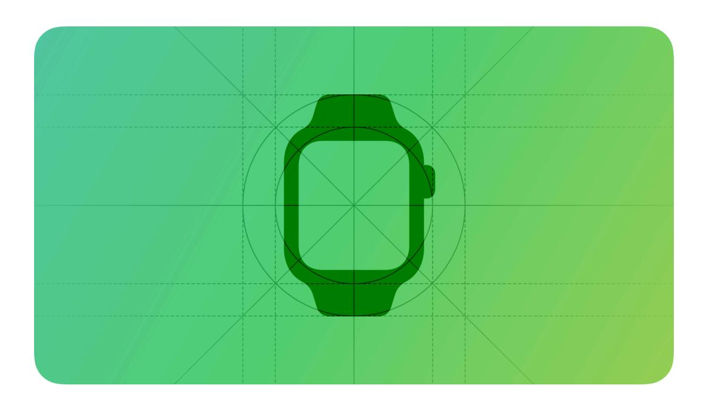

**[Design](https://developer.apple.com/design/)** [Overview](https://developer.apple.com/design/) [What's](https://developer.apple.com/design/whats-new/) New Get [Started](https://developer.apple.com/design/get-started/) [Guidelines](https://developer.apple.com/design/human-interface-guidelines) [Resources](https://developer.apple.com/design/resources/)

# **Designing for watchOS**

When people glance at their Apple Watch, they know they can access essential information and perform simple, timely tasks whether they're stationary or in motion.

[Designing](#page-0-0) for watchOS Best [practices](#page-1-0) [Resources](#page-2-0) [Change](#page-2-1) log

As you begin designing your app for Apple Watch, start by understanding the following fundamental device characteristics and patterns that distinguish the watchOS experience. Using these characteristics and patterns to inform your design decisions can help you provide an app that Apple Watch users appreciate.

**Display.** The small Apple Watch display fits on the wrist while delivering an easy-to-read, highresolution experience.

**Ergonomics.** Because people wear Apple Watch, they're usually no more than a foot away from the display as they raise their wrist to view it and use their opposite hand to interact with the device. In addition, the Always On display lets people view information on the watch face when they drop their wrist.

**Inputs.** People can navigate vertically or inspect data by turning the Digital [Crown,](https://developer.apple.com/design/human-interface-guidelines/digital-crown) which offers consistent control on the watch face, the Home Screen, and within apps. They can provide input even while they're in motion with standard [gestures](https://developer.apple.com/design/human-interface-guidelines/gestures) like tap, swipe, and drag. Pressing the Action [button](https://developer.apple.com/design/human-interface-guidelines/action-button) initiates an essential action without looking at the screen, and using [shortcuts](https://developer.apple.com/design/human-interface-guidelines/siri#Shortcuts-and-suggestions) helps people perform their routine tasks quickly and easily. People can also take advantage of data that device features provide, such as GPS, sensors for blood oxygen and heart function, and the altimeter, accelerometer, and gyroscope.

**App interactions.** People glance at the Always On display many times throughout the day, performing concise app interactions that can last for less than a minute each. People frequently use a watchOS app's related experiences — like complications, notifications, and Siri interactions — more than they use the app itself.

**System features.** watchOS provides several features that help people interact with the system and their apps in familiar, consistent ways.

- [Complications](https://developer.apple.com/design/human-interface-guidelines/complications)
- [Notifications](https://developer.apple.com/design/human-interface-guidelines/notifications)
- [Always](https://developer.apple.com/design/human-interface-guidelines/always-on) On
- [Watch](https://developer.apple.com/design/human-interface-guidelines/watch-faces) faces

## **Best [practices](#page-1-0)**

Great Apple Watch experiences are streamlined and specialized, and integrate the platform and device capabilities that people value most. To help your experience feel at home in watchOS, prioritize the following ways to incorporate these features and capabilities.

- Support quick, glanceable, single-screen interactions that deliver critical information succinctly and help people perform targeted actions with a simple gesture or two.
- Minimize the depth of hierarchy in your app's navigation, and use the Digital [Crown](https://developer.apple.com/design/human-interface-guidelines/digital-crown) to provide vertical navigation for scrolling or switching between screens.
- Personalize the experience by proactively anticipating people's needs and using on-device data to provide actionable content that's relevant in the moment or very soon.
- Use [complications](https://developer.apple.com/design/human-interface-guidelines/complications) to provide relevant, potentially dynamic data and graphics right on the watch face where people can view them on every wrist raise and tap them to dive straight into your app.
- Use [notifications](https://developer.apple.com/design/human-interface-guidelines/notifications) to deliver timely, high-value information and let people perform important actions without opening your app.
- Use background content such as [color](https://developer.apple.com/design/human-interface-guidelines/color) to convey useful supporting information, and use [materials](https://developer.apple.com/design/human-interface-guidelines/materials) to illustrate hierarchy and a sense of place.
- Design your app to function independently, complementing your notifications and complications by providing additional details and functionality.

## **[Resources](#page-2-0)**

#### **[Related](#page-2-2)**

Apple Design [Resources](https://developer.apple.com/design/resources/#watchos-apps)

#### **Developer [documentation](#page-2-3)**

[watchOS](https://developer.apple.com/watchos/get-started/) Pathway

#### **[Videos](#page-2-4)**

**What's new in [watchOS](https://developer.apple.com/videos/play/wwdc2025/334) 26**

## **[Change](#page-2-1) log**

**Date Changes**

June 5, 2023

Enhanced guidance for providing a glanceable, fo‐ cused app experience, and emphasized the impor‐ tance of the Digital Crown in navigation.