**[Design](https://developer.apple.com/design/)** [Overview](https://developer.apple.com/design/) [What's](https://developer.apple.com/design/whats-new/) New Get [Started](https://developer.apple.com/design/get-started/) [Guidelines](https://developer.apple.com/design/human-interface-guidelines) [Resources](https://developer.apple.com/design/resources/)

**December 16, 2025**

Updated guidance for all platforms, and added guidance for visionOS and CarPlay.

# **Widgets**

A widget provides quick access to essential information and focused interactions from your app or game in additional contexts.

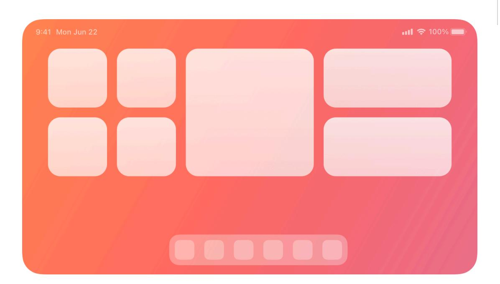

Widgets help people organize and personalize their devices by displaying timely, glanceable content and offering specific functionality. They appear in various contexts for a consistent experience across platforms. For example, a person might place a Weather widget:

- On the Home Screen and Lock Screen of their iPhone and iPad
- On the desktop and Notification Center of their Mac
- On a horizontal or vertical surface when they wear Apple Vision Pro
- At a fixed position in the Smart Stack of Apple Watch

# **[Anatomy](#page-0-0)**

Widgets come in different sizes, ranging from small accessory widgets on iPhone, iPad, and Apple Watch to system family widgets that include an extra large size on iPad, Mac, and Apple Vision Pro. Additionally, widgets adapt their appearance to the context in which they appear and respond to a person's device customization. Consider the following aspects when you design widgets:

#### **Supported platforms**

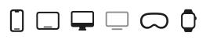

#### [Widgets](#page-0-1)

[Anatomy](#page-0-0) Best [practices](#page-4-0) [Rendering](#page-7-0) modes Previews and [placeholders](#page-8-0) Platform [considerations](#page-9-0) [Specifications](#page-13-0) [Resources](#page-16-0) [Change](#page-16-1) log

- The widget size to support
- The context devices and system experiences in which the widget may appear
- The rendering modes and color treatment that the widget receives based on the size and context

The WidgetKit framework provides default appearances and treatments for each widget size to fit the system experience or device where it appears. However, it's important to consider creating a custom widget design that can provide the best experience for your content in each specific context.

#### **System family [widgets](#page-1-0)**

System family widgets offer a broad range of sizes and may include one or more interactive elements.

Medium Large Extra large Extra large portrait Small

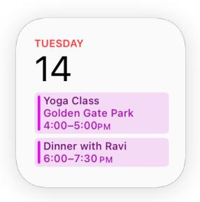

The following table shows supported contexts for each system family widget size:

| Widget size                    | iPhone                                                 | iPad                                           | Mac                                | Apple Vision Pro                      |
|--------------------------------|--------------------------------------------------------|------------------------------------------------|------------------------------------|---------------------------------------|
| System small                   | Home Screen, Today View, StandBy, and CarPlay | Home Screen, Today View, and Lock Screen | Desktop and Notification Center | Horizontal and ver‐ tical surfaces |
| System medium                  | Home Screen and Today View                          | Home Screen and Today View                  | Desktop and Notification Center | Horizontal and ver‐ tical surfaces |
| System large                   | Home Screen and Today View                          | Home Screen and Today View                  | Desktop and Notification Center | Horizontal and ver‐ tical surfaces |
| System extra large             | Not supported                                          | Home Screen and Today View                  | Desktop and Notification Center | Horizontal and ver‐ tical surfaces |
| System extra large portrait | Not supported                                          | Not supported                                  | Not supported                      | Horizontal and ver‐ tical surfaces |

#### **[Accessory](#page-1-1) widgets**

Accessory widgets display a very limited amount of information because of their size.

Accessory corner Accessory inline Accessory rectangular Accessory circular

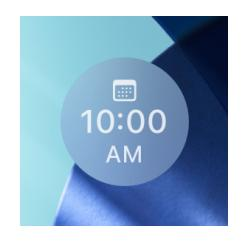

#### They appear on the following devices:

| Widget size           | iPhone        | iPad          | Apple Watch                                   |
|-----------------------|---------------|---------------|-----------------------------------------------|
| Accessory circular    | Lock Screen   | Lock Screen   | Watch complications and in the Smart Stack |
| Accessory corner      | Not supported | Not supported | Watch complications                           |
| Accessory inline      | Lock Screen   | Lock Screen   | Watch complications                           |
| Accessory rectangular | Lock Screen   | Lock Screen   | Watch complications and in the Smart Stack |

### **[Appearances](#page-2-0)**

A widget can appear in full-color, in monochrome with a tint color, or in a clear, translucent style. Depending on the location, device, and a person's customization, the system may apply a tinted or clear appearance to the widget and its included full-color images, symbols, and glyphs.

For example, a small system widget appears differently depending on the device and location:

On the Home Screen of iPhone and iPad, people choose from different appearances for widgets: light, dark, clear, and tinted. In light and dark appearances, widgets have a full-color design. In a clear appearance, the system desaturates the widget and adds translucency, highlights, and the Liquid Glass material. In a tinted appearance, the system desaturates the widget and its content, then applies a person's selected tint color.

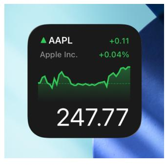

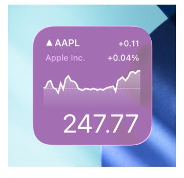

Full-color Clear Tinted

On Apple Vision Pro, the widget appears as a 3D object, surrounded by a frame. It takes on a full-color appearance with a glass- or paper-like coating layer that responds to lighting conditions. Additionally, people can choose a tinted appearance that applies a color from a set of system-provided color palettes.

On the Lock Screen of iPad, the widget takes on a monochromatic appearance without a tint color.

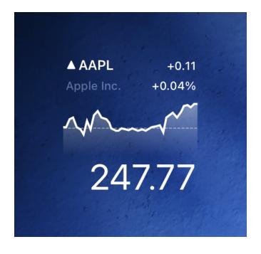

On the Lock Screen of iPhone in StandBy, the widget appears scaled up in size with the background removed. When the ambient light falls below a threshold, the system renders the widget with a monochromatic red tint.

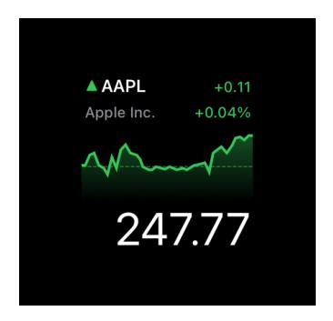

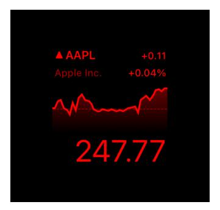

StandBy iPhone in StandBy during low-light conditions

Similarly, a rectangular accessory widget appears as follows:

- On the Lock Screen of iPhone and iPad, it takes on a monochromatic appearance without a tint color.
- On Apple Watch, the widget can appear as a watch complication in both full-color and tinted appearances, and it can also appear in the Smart Stack.

iPhone Lock Screen Watch complication Smart Stack on Apple Watch

Each appearance described above includes a [rendering](#page-7-0) mode that depends on the platform and a person's appearance settings:

The system uses the full [color](https://developer.apple.com/documentation/WidgetKit/WidgetRenderingMode/fullColor) rendering mode for system family widgets across all platforms to display your widget in full color. It doesn't change the color of your views.

- The system uses the [accented](https://developer.apple.com/documentation/WidgetKit/WidgetRenderingMode/accented) rendering mode for system family widgets across all platforms and for accessory widgets on Apple Watch. In the accented rendering mode, the system removes the background and replaces it with a tinted color effect for a tinted appearance and a Liquid Glass background for a clear appearance. Additionally, it divides the widget's views into an accent group and a primary group, and then applies a solid color to each group.
- The system uses the [vibrant](https://developer.apple.com/documentation/WidgetKit/WidgetRenderingMode/vibrant) rendering mode for widgets on the Lock Screen of iPhone and iPad, and on iPhone in StandBy in low-light conditions. It desaturates text, images, and gauges, and creates a vibrant effect by coloring your content appropriately for the Lock Screen background or a macOS desktop. Note that people can customize the Lock Screen with a tint color, and the system applies a red tint for widgets that appear on iPhone in StandBy in low-light conditions.

The following table lists the occurrences for each rendering mode per platform:

| Platform         | Full-color                                                                            | Accented                            | Vibrant                                         |
|------------------|---------------------------------------------------------------------------------------|-------------------------------------|-------------------------------------------------|
| iPhone           | Home Screen, Today view, StandBy and CarPlay (with the back‐ ground removed) | Home Screen and Today view       | Lock Screen, StandBy in low-light conditions |
| iPad             | Home Screen and Today view                                                         | Home Screen and Today view       | Lock Screen                                     |
| Apple Watch      | Smart Stack, complications                                                         | Smart Stack, complications       | Not supported                                   |
| Mac              | Desktop and Notification Center                                                    | Not supported                       | Desktop                                         |
| Apple Vision Pro | Horizontal and vertical surfaces                                                   | Horizontal and vertical surfaces | Not supported                                   |

For additional design guidance, see [Rendering](#page-7-0) modes. For developer guidance, see [Preparing](https://developer.apple.com/documentation/WidgetKit/Preparing-widgets-for-additional-contexts-and-appearances) widgets for additional platforms, contexts, and [appearances](https://developer.apple.com/documentation/WidgetKit/Preparing-widgets-for-additional-contexts-and-appearances) and *[WidgetRenderingMode](https://developer.apple.com/documentation/WidgetKit/WidgetRenderingMode)*.

# **Best [practices](#page-4-0)**

**Choose simple ideas that relate to your app's main purpose.** Include timely content and relevant functionality. For example, people who use the Weather app are often most interested in the current high and low temperatures and weather conditions, so the Weather widgets prioritize this information.

**Aim to create a widget that gives people quick access to the content they want.** People appreciate widgets that display meaningful content and offer useful actions and deep links to key areas of your app. Replicating an app icon offers little additional value, and people may be less likely to keep it on their screens.

**Prefer dynamic information that changes throughout the day.** If a widget's content never appears to change, people may not keep it in a prominent position. Although widgets don't update from minute to minute, it's important to find ways to keep their content fresh to invite frequent viewing.

**Look for opportunities to surprise and delight.** For example, you might design a unique visual treatment for your calendar widget to display on meaningful occasions, like birthdays or holidays.

**Offer widgets in multiple sizes when doing so adds value.** Small widgets use their limited space to typically show a single piece of information while larger sizes support additional layers of information and actions. Avoid expanding a smaller widget's content to simply fill a larger area. It's more important to create one widget in the size that best represents the content than providing the widget in all sizes.

**Balance information density.** Sparse layouts can make the widget seem unnecessary, while overly dense layouts are less glanceable. Create a layout that provides essential information at a glance and allows people to view additional details by taking a longer look. If your layout is too dense, consider improving its clarity by using a larger widget size or replacing text with graphics.

**Display only the information that's directly related to the widget's main purpose.** In larger widgets, you can display more data — or more detailed visualizations of the data — but you don't want to lose sight of the widget's primary purpose. For example, all Calendar widgets display a person's upcoming events. In each size, the widget remains centered on events while expanding the range of information as the size increases.

**Use brand elements thoughtfully.** Incorporate brand colors, typefaces, and stylized glyphs to make your widget recognizable but don't overpower useful information or make your widget look out of place. When you include brand elements, people seldom need your logo or app icon to help them recognize your widget. If your widget benefits from including a small logo — for example, if your widget displays content from multiple sources — a small logo in the top-right corner is sufficient.

**Choose between automatically displaying content and letting people customize displayed information.** In some cases, people need to configure a widget to ensure it displays the information that's most useful for them. For example, the Stocks widget lets people select the stocks they wish to track. In contrast, some widgets — like the Podcasts widget — automatically display recent content, so people don't need to customize them. For developer guidance, see Making a [configurable](https://developer.apple.com/documentation/WidgetKit/Making-a-Configurable-Widget) widget.

**Avoid mirroring your widget's appearance within your app.** Including an element in your app that looks like your widget but doesn't behave like it can confuse people. Additionally, people may be less likely to try other ways to interact with such an element in your app because they expect it to behave like a widget.

**Let people know when authentication adds value.** If your widget provides additional functionality when someone is signed in to your app, make sure people know that. For example, an app that shows upcoming reservations might include a message like "Sign in to view reservations" when people are signed out.

### **[Updating](#page-5-0) widget content**

To remain relevant and useful, widgets periodically refresh their information but don't support continuous, real-time updates, and the system may adjust the limits for updates depending on various factors.

**Keep your widget up to date.** Finding the appropriate update frequency for your widget depends on knowing how often the data changes and estimating when people need to see new data. For example, a widget that provides information about tidal conditions at a beach is useful if it updates on an hourly basis even though conditions change constantly. If people are likely to check your widget more frequently than you can update it, consider displaying text that describes when the data was last updated.

**Use system functionality to refresh dates and times in your widget.** Because widget update frequency is limited, let the system automatically refresh date and time information to preserve update opportunities. Determine the update frequency that fits with the data you display and show content quickly without hiding stale data behind placeholder content. For developer guidance about widget updates, see [Keeping](https://developer.apple.com/documentation/WidgetKit/Keeping-a-Widget-Up-To-Date) a widget up to date.

**Use animated transitions to bring attention to data updates.** By default, many SwiftUI views animate content updates. Additionally, use standard and custom animations with a duration of up to two seconds to let people know when new information is available or when content displays differently. For developer guidance, see [Animating](https://developer.apple.com/documentation/WidgetKit/Animating-data-updates-in-widgets-and-live-activities) data updates in widgets and Live [Activities](https://developer.apple.com/documentation/WidgetKit/Animating-data-updates-in-widgets-and-live-activities).

#### **Adding [interactivity](#page-6-0)**

People tap or click a widget to launch its corresponding app. It can also include buttons and toggles to offer additional functionality without launching the app. For example, the Reminders widget includes toggles to mark a task as completed. When people interact with your widget in areas that aren't buttons or toggles, the interaction launches your app.

Incomplete tasks Completed tasks

**Offer simple, relevant functionality and reserve complexity for your app.** Useful widgets offer an easy way to complete a task or action that's directly related to its content.

**Ensure that a widget interaction opens your app at the right location.** Deep link to details and actions that directly relate to the widget's content, and don't make people navigate to the relevant area in the app. For example, when people click or tap a medium Stocks widget, the Stocks app opens to a page that displays information about the symbol.

**Offer interactivity while remaining glanceable and uncluttered.** Multiple interaction targets — SwiftUI links, buttons, and toggles — might make sense for your content, but avoid creating applike layouts in your widgets. Pay attention to the size of targets and make sure people can tap or click them with confidence and without accidentally performing unintended interactions. Note that inline accessory widgets offer only one tap target.

#### **[Choosing](#page-6-1) margins and padding**

Widgets scale to adapt to the screen sizes of different devices and onscreen areas. Supply content at appropriate sizes to make sure that your widget looks great on every device and let the system resize or scale it as necessary. In iOS, the system ensures that your widget looks good on small devices by resizing the content you design for large devices. In iPadOS, the system renders your widget at a large size before scaling it down for display on the Home Screen.

As you design for various devices and scale factors, use the values listed in [Specifications](#page-13-0) and the Apple Design [Resources](https://developer.apple.com/design/resources/) for guidance; for your production widget, use [SwiftUI](https://developer.apple.com/documentation/SwiftUI) to ensure flexibility.

**In general, use standard margins to ensure legibility.** Use the standard margin width for widgets — 16 points for most widgets — to avoid crowding their edges and creating a cluttered appearance. If you need to use tighter margins — for example, to create content groupings for graphics, buttons, or background shapes — setting margins of 11 points can work well. Additionally, note that widgets use smaller margins on the desktop on Mac and on the Lock Screen, including in StandBy. For developer guidance, see *[padding\(\\_:\\_:\)](https://developer.apple.com/documentation/SwiftUI/View/padding(_:_:))*.

**Coordinate the corner radius of your content with the corner radius of the widget.** To ensure that your content looks good within a widget's rounded corners, use a SwiftUI container to apply the correct corner radius. For developer guidance, see *[ContainerRelativeShape](https://developer.apple.com/documentation/SwiftUI/ContainerRelativeShape)*.

#### **[Displaying](#page-7-1) text in widgets**

**Prefer using the system font, text styles, and SF Symbols.** Using the system font helps your widget look at home on any platform, while making it easier for you to display great-looking text in a variety of weights, styles, and sizes. Use SF Symbols to align and scale symbols with text that uses the system font. If you use a custom font, do so sparingly, and be sure it's easy for people to read at a glance. It often works well to use a custom font for the large text in a widget and SF Pro for the smaller text. For guidance, see [Typography](https://developer.apple.com/design/human-interface-guidelines/typography) and SF [Symbols.](https://developer.apple.com/design/human-interface-guidelines/sf-symbols)

**Avoid very small font sizes.** In general, display text using fonts at 11 points or larger. Text in a font that's smaller than 11 points can be too hard for many people to read.

**Avoid rasterizing text.** Always use text elements and styles to ensure that your text scales well and to allow VoiceOver to speak your content.

**Note**

In iOS, iPadOS, and visionOS, widgets support Dynamic Type sizes from Large to AX5 when you use *[Font](https://developer.apple.com/documentation/SwiftUI/Font)* to choose a system font or *[custom\(\\_:size:\)](https://developer.apple.com/documentation/SwiftUI/Font/custom(_:size:))* to choose a custom font. For more information about Dynamic Type sizes, see [Supporting](https://developer.apple.com/design/human-interface-guidelines/typography#Supporting-Dynamic-Type) Dynamic Type.

#### **[Using](#page-7-2) color**

**Use color to enhance a widget's appearance without competing with its content.** Beautiful colors draw the eye, but they're best when they don't prevent people from absorbing a widget's information at a glance. In your asset catalog, you can also specify the colors you want the system to use as it generates your widget's editing-mode user interface.

**Convey meaning without relying on specific colors to represent information.** Widgets can appear monochromatic (with or without a custom tint color), and in watchOS, the system may invert colors depending on the watch face a person chooses. Use text and iconography in addition to color to express meaning.

**Use full-color images judiciously.** When a person chooses a tinted or clear appearance for their widgets, the system by default desaturates full-color images. You can choose to render images in full-color, even when a person chooses a tinted or clear widget appearance. However, fullcolor images in these appearances draw special attention to the widget, which might make it feel as if the widget doesn't belong to the platform. For example, a full-color image in a widget might appear out of place when a person chooses a clear widget appearance. Consider reserving fullcolor images to represent media content, such as album art for a music app's widget, and use full-color images with smaller dimensions than the size of the widget.

# **[Rendering](#page-7-0) modes**

#### **[Full-color](#page-7-3)**

**Support light and dark appearances.** Prefer light backgrounds for the light appearance and dark backgrounds for the dark appearance, and consider using the semantic system colors for text and backgrounds to let the colors dynamically adapt to the current appearance. You can also support different appearances by putting color variants in your asset catalog. For guidance, see Dark [Mode;](https://developer.apple.com/design/human-interface-guidelines/dark-mode) for developer guidance, see Asset [management](https://developer.apple.com/documentation/Xcode/asset-management) and [Supporting](https://developer.apple.com/documentation/UIKit/supporting-dark-mode-in-your-interface) Dark Mode in your [interface](https://developer.apple.com/documentation/UIKit/supporting-dark-mode-in-your-interface).

#### **[Accented](#page-8-1)**

**Group widget components into an accented and a primary group.** The accented rendering mode divides the widget's view hierarchy into an accent group and a primary group. On iPhone, iPad, and Mac, the system tints primary and accented content white. On Apple Watch, the system tints primary content white and accented content in the color of the watch face.

For developer guidance, see *[widgetAccentable\(\\_:\)](https://developer.apple.com/documentation/SwiftUI/View/widgetAccentable(_:))* and [Optimizing](https://developer.apple.com/documentation/WidgetKit/optimizing-your-widget-for-accented-rendering-mode-and-liquid-glass) your widget for accented [rendering](https://developer.apple.com/documentation/WidgetKit/optimizing-your-widget-for-accented-rendering-mode-and-liquid-glass) mode and Liquid Glass.

#### **[Vibrant](#page-8-2)**

**Offer enough contrast to ensure legibility.** In the vibrant rendering mode, the opacity of pixels within an image determines the strength of the blurred background material effect. Fully transparent pixels let the background material pass through as is. The brightness of pixels determines how vibrant they appear on the Lock Screen. Brighter gray values provide more contrast, and darker values provide less contrast.

**Create optimized assets for the best vibrant effect.** Render content like images, numbers, and text at full opacity. Use white or light gray for the most prominent content and darker grayscale values for secondary elements to establish hierarchy. Confirm that image content has sufficient contrast in grayscale, and use opaque grayscale values, rather than opacities of white, to achieve the best vibrant material effect.

# **Previews and [placeholders](#page-8-0)**

**Design a realistic preview to display in the widget gallery.** Highlighting your widget's capabilities — and clearly representing the experiences each widget type or size can provide helps people make an informed decision. You can display real data in your widget preview, but if the data takes too long to generate or load, display realistic simulated data instead.

**Design placeholder content that helps people recognize your widget.** An installed widget displays placeholder content while its data loads. Create an effective placeholder appearance by combining static interface components with semi-opaque shapes that stand in for dynamic content. For example, use rectangles of different widths to suggest lines of text, and circles or squares in place of glyphs and images.

**Write a succinct widget description.** The widget gallery displays descriptions that help people understand what each widget does. Begin a description with an action verb — for example, "See the current weather conditions and forecast for a location" or "Keep track of your upcoming events and meetings." Avoid including unnecessary phrases that reference the widget itself, like "This widget shows…," "Use this widget to…," or "Add this widget." Use approachable language and [sentence-style](https://support.apple.com/guide/applestyleguide/c-apsgb744e4a3/web#apdca93e113f1d64) capitalization.

**Group your widget's sizes together, and provide a single description.** If your widget is available in multiple sizes, group them together so people don't think each size is a different widget. Provide a single description of your widget — regardless of how many sizes you offer to avoid repetition and to help people understand how each size provides a slightly different perspective on the same content and functionality.

**Consider coloring the Add button.** After people choose your app in the widget gallery, an Add button appears below the group of widgets you offer. You can specify a color for this button to help remind people of your brand.

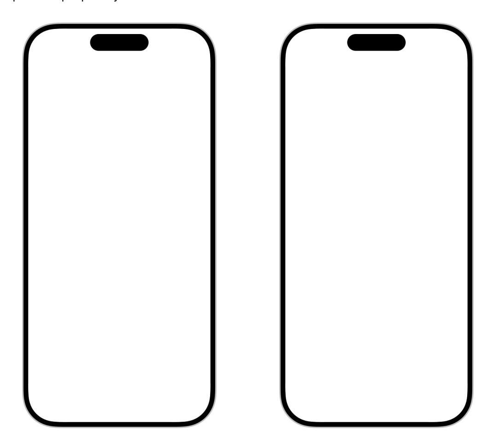

# **Platform [considerations](#page-9-0)**

*No additional considerations for macOS. Not supported in tvOS.*

### **iOS, [iPadOS](#page-9-1)**

Widgets on the Lock Screen are functionally similar to watch complications and follow design principles for [Complications](https://developer.apple.com/design/human-interface-guidelines/complications) in addition to design principles for widgets. Provide useful information in your Lock Screen widget, and don't treat it only as an additional way for people to launch into your app. In many cases, a design for complications also works well for widgets on the Lock Screen (and vice versa), so consider creating them in tandem.

Your app can offer widgets on the Lock Screen in three different shapes: as inline text that appears above the clock, and as circular and rectangular shapes that appear below the clock.

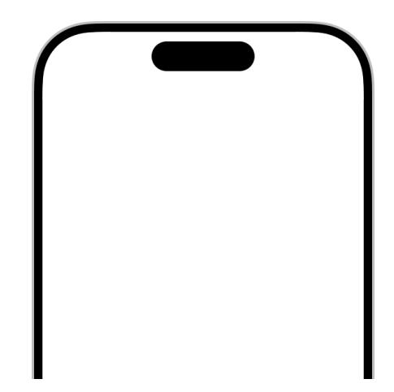

**Support the Always-On display on iPhone.** Devices with the Always-On display render widgets on the Lock Screen with reduced luminance. Use levels of gray that provide enough contrast in the Always-On display, and make sure your content remains legible.

For developer guidance, see Creating accessory widgets and watch [complications](https://developer.apple.com/documentation/WidgetKit/Creating-accessory-widgets-and-watch-complications).

**Offer Live Activities to show real-time updates.** Widgets don't show real-time information. If your app allows people to track the progress of a task or event for a limited amount of time with frequent updates, consider offering Live Activities. Widgets and Live Activities use the same underlying frameworks and share design similarities. As a result, it can be a good idea to develop widgets and Live Activities in tandem and reuse code and design components for both features. For design guidance on Live Activities, see Live [Activities](https://developer.apple.com/design/human-interface-guidelines/live-activities); for developer guidance, see [ActivityKit](https://developer.apple.com/documentation/ActivityKit).

#### **[StandBy](#page-10-0) and CarPlay**

On iPhone in StandBy, the system displays two small system family widgets side-by-side, scaled up so they fill the Lock Screen. By supporting StandBy, you also ensure your widgets work well in CarPlay. CarPlay and StandBy widgets both use the small system family widget with the background removed and scaled up to best fit the grid on the Widgets screen. Glanceable information and large text are especially important in CarPlay to make your widget easy to read on a car's display.

**Limit usage of rich images or color to convey meaning in StandBy.** Instead, make use of the additional space by scaling up and rearranging text so people can glance at the widget content from a greater distance. To seamlessly blend with the black background, don't use background colors for your widget when it appears in StandBy.

Correct usage Incorrect usage

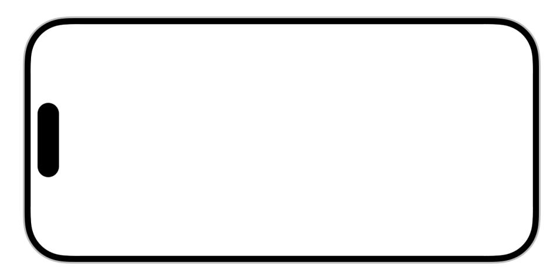

For developer guidance, see Displaying the right widget [background](https://developer.apple.com/documentation/WidgetKit/Displaying-the-right-widget-background).

On iPhone in StandBy in low-light conditions, the system renders widgets in a monochromatic look with a red tint.

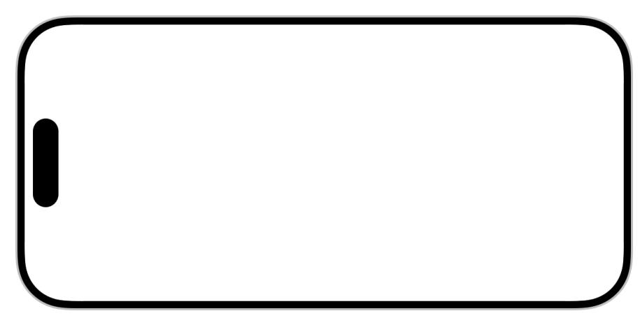

iPhone in low-light conditions

#### **[visionOS](#page-11-0)**

Widgets in visionOS are 3D objects that people place on a horizontal or vertical surface. When a person places a widget on a surface, the widget persists in that location even when the person turns Apple Vision Pro off and back on. Widgets have a consistent, real-world scale. Their size, *mounting style*, and *treatment style* impact how a person perceives them.

visionOS widgets appear in full-color by default, but they appear in the accented rendering mode when people personalize them with tint colors using a range of system-provided color palettes. Additionally, people can customize the frame width of widgets that use the elevated mounting style, and custom options that are unique to the widget. For example, visionOS doesn't provide systemwide light or dark appearances. However, the Music poster widget offers its own customization option that lets people choose between a light and a dark theme that the app generates from the displayed album art.

For developer guidance, see [Updating](https://developer.apple.com/documentation/WidgetKit/Updating-your-widgets-for-visionOS) your widgets for visionOS.

**Adapt your design and content for the spatial experience Apple Vision Pro provides.** In visionOS, widgets don't float in isolation but are part of living rooms, kitchens, offices, and more. Consider this context early and think of widgets as part of someone's surroundings when you bring your existing widgets to visionOS or design them from scratch. For example, the Music widget adapts to a poster-like appearance that's glanceable across the room with large typography and a high-resolution image, and a productivity app might offer a small widget that easily fits on a desk.

**Test your widgets across the full range of system color palettes and in different lighting conditions.** Make sure your widget's tone, contrast, and legibility remain consistent and intentional. If you choose to exclude UI elements from tinting, test your widget in every provided tint color palette to make sure the untinted elements remain legible when a person customizes their widgets with tint colors.

#### **[Thresholds](#page-11-1) and sizes**

Widgets on Apple Vision Pro can adapt based on a person's proximity, and visionOS provides widgets with two key thresholds to design for: the *[simplified](https://developer.apple.com/documentation/WidgetKit/LevelOfDetail/simplified)* threshold for when a person views a widget at a distance, and the *[default](https://developer.apple.com/documentation/WidgetKit/LevelOfDetail/default)* threshold when a person views it nearby.

Because widgets can appear throughout a person's environment, it's also important to match a widget's size to the type of content it contains, and to be aware of how it appears at a variety of distances.

**Design a responsive layout that shows the right level of detail for each of the two thresholds.**

When a person views the widget at a distance, display a simplified version of your widget that shows fewer details and has a larger type size, and remove interactive elements like buttons or toggles. When a person views the widget from nearby, show more details and use a smaller type size. To create a smooth and consistent experience and help your layout feel continuous, maintain shared elements across both distance thresholds.

**Offer widget family sizes that fit a person's surroundings well.** Widgets map to real-world dimensions and have a permanent presence in a person's spatial environment. Think about where people might place your widget — mounted to a wall, placed on a sideboard, or sitting next to a workplace — and choose a widget family size that's right for that context. For example, offer a small system widget with content that people might place on a desk or an extra large widget to let people decorate their surroundings with something visually rich, like artwork or photography.

**Display content in a way that remains legible from a range of distances.** To make a widget feel intentional and proportionate to where they place it, people can scale a widget from 75 to 125 percent in size. Use print design principles like clear hierarchy, strong typography, and scale to make sure your content remains glanceable. Include high-resolution assets that look good scaled up to every size.

#### **[Mounting](#page-12-0) styles**

The way a widget appears on a surface plays a big role in how a person perceives it. To make it feel intentional and integrated into their surroundings, people place a widget on surfaces in distinct mounting styles.

- **[Elevated](https://developer.apple.com/documentation/WidgetKit/WidgetMountingStyle/elevated) style**. On horizontal surfaces — for example, on a desk — the widget always appears elevated and gently tilts backward, providing a subtle angle that improves readability, and casts a soft shadow that helps it feel grounded on the surface. On vertical surfaces — for example, on a wall — the widget either appears elevated, sitting flush on the surface and similar to how you mount a picture frame.
- **[Recessed](https://developer.apple.com/documentation/WidgetKit/WidgetMountingStyle/recessed) style**. On vertical surfaces for example, on a wall the widget can appear recessed, with content set back into the surface, creating a depth effect that gives the illusion of a cutout in the surface. Horizontal surfaces don't use the recessed mounting style.

By default, widgets use the elevated mounting style, because it works for horizontal and vertical surfaces.

**Choose the mounting style that fits your content and the experience you want to create.** By default, visionOS widgets use the elevated mounting style, which is ideal for content that you want to stand out and feel present, like reminders, media, or glanceable data. Recessed widgets are ideal for immersive or ambient content, like weather or editorial content, and people can only place them on a vertical surface. If a style doesn't suit your widget, you can opt out of it for each widget. If you choose to only support the recessed mounting style, people can't place the widget on a horizontal surface. For example, a weather app might only support the recessed mounting style to give the illusion of looking out of a window for its large and extra-large system family widgets, and only support the elevated style for its small system family widget.

#### **Developer note**

Use the *[supportedMountingStyles\(\\_:\)](https://developer.apple.com/documentation/SwiftUI/WidgetConfiguration/supportedMountingStyles(_:))* property of your *[WidgetConfiguration](https://developer.apple.com/documentation/SwiftUI/WidgetConfiguration)* to declare supported mounting styles — elevated, recessed, or both — for all widgets included in the configuration. To offer a widget that only supports one mounting style and other widgets that support both mounting styles, create separate widget configurations. For example, create one widget configuration for the widget that only supports the recessed mounting style, and a second configuration for the widgets that support both mounting styles.

**Test your elevated widget designs with each system-provided frame width.** People can choose from different system-defined frame widths for widgets that use the elevated mounting style. You can't change your layout based on the frame width a person chooses, so make sure your widget layout stays visually balanced for each frame width.

#### **[Treatment](#page-13-1) styles**

In addition to size and mounting style, the system applies one of two treatment styles to visionOS widgets. Choosing the right treatment for your widget helps reinforce the experience you want to create.

- The *[paper](https://developer.apple.com/documentation/WidgetKit/WidgetTexture/paper)* style creates a more grounded, print-like style that feels solid and makes the widget feel like part of its surroundings. When lighting conditions change, widgets in the paper style become darker or lighter in response.
- The *[glass](https://developer.apple.com/documentation/WidgetKit/WidgetTexture/glass)* style creates a lighter, layered look that adds depth and visual separation between foreground and background elements to emphasize clarity and contrast. The foreground elements always stay bright and legible, and don't dim or brighten, even as ambient light changes.

**Choose the paper style for a print-like look that feels more like a real object in the room.** The entire widget responds to the ambient lighting and blends naturally into its surroundings. For example, the Music poster widget uses the paper style to display albums and playlists like framed artwork on a wall.

**Choose the glass style for information-rich widgets.** Glass visually separates foreground and background elements, allowing you to decide which parts of your interface adapt to the surroundings and which stay visually consistent. Foreground elements appear in full color, unaffected by ambient lighting, to make sure important content stays sharp and legible. For example, a News widget appears with editorial images in the background with a soft, print-like look. Its headlines stay in the foreground, crisp and easy to read.

#### **[watchOS](#page-13-2)**

**Provide a colorful background that conveys meaning.** By default, widgets in the Smart Stack use a black background. Consider using a custom background color that provides additional meaning. For example, the Stocks app uses a red background for falling stock values and a green background if a stock's value rises.

**Encourage the system to display or elevate the position of your watchOS widget in the Smart Stack.** Relevancy information helps the system show your widget when people need it most. Relevance can be location-based or specific to ongoing system actions, like a workout. For developer guidance, see [RelevanceKit](https://developer.apple.com/documentation/RelevanceKit).

# **[Specifications](#page-13-0)**

#### **iOS [dimensions](#page-14-0)**

| Screen size (portrait, pt) | Small (pt) | Medium (pt) | Large (pt) | Circular (pt) | Rectangular (pt) | In |
|-------------------------------|------------|-------------|------------|---------------|---------------------|----|
| 430×932                       | 170x170    | 364x170     | 364x382    | 76x76         | 172x76              | 2  |
| 428x926                       | 170x170    | 364x170     | 364x382    | 76x76         | 172x76              | 2  |
| 414x896                       | 169x169    | 360x169     | 360x379    | 76x76         | 160x72              | 24 |
| 414x736                       | 159x159    | 348x157     | 348x357    | 76x76         | 170x76              | 24 |
| 393x852                       | 158x158    | 338x158     | 338x354    | 72x72         | 160x72              | 2  |
| 390x844                       | 158x158    | 338x158     | 338x354    | 72x72         | 160x72              | 2  |
| 375x812                       | 155x155    | 329x155     | 329x345    | 72x72         | 157x72              | 2  |
| 375x667                       | 148x148    | 321x148     | 321x324    | 68x68         | 153x68              | 2  |
| 360x780                       | 155x155    | 329x155     | 329x345    | 72x72         | 157x72              | 2  |
| 320x568                       | 141x141    | 292x141     | 292x311    | N/A           | N/A                 | N  |

#### **iPadOS [dimensions](#page-14-1)**

| Screen size (portrait, pt) | Target | Small (pt) | Medium (pt) | Large (pt)  | Extra large (pt) |
|-------------------------------|--------|------------|-------------|-------------|------------------|
| 768x1024                      | Canvas | 141x141    | 305.5x141   | 305.5x305.5 | 634.5x305.5      |
|                               | Device | 120x120    | 260x120     | 260x260     | 540x260          |
|                               | Canvas | 141x141    | 305.5x141   | 305.5x305.5 | 634.5x305.5      |
| 744x1133                      | Device | 120x120    | 260x120     | 260x260     | 540x260          |
|                               | Canvas | 146x146    | 320.5x146   | 320.5x320.5 | 669x320.5        |
| 810x1080                      | Device | 124x124    | 272x124     | 272x272     | 568x272          |
|                               | Canvas | 155x155    | 342x155     | 342x342     | 715.5x342        |
| 820x1180                      | Device | 136x136    | 300x136     | 300x300     | 628x300          |
| 834x1112                      | Canvas | 150x150    | 327.5x150   | 327.5x327.5 | 682x327.5        |
|                               | Device | 132x132    | 288x132     | 288x288     | 600x288          |
| 834x1194                      | Canvas | 155x155    | 342x155     | 342x342     | 715.5x342        |
|                               | Device | 136x136    | 300x136     | 300x300     | 628x300          |
| 954x1373 *                    | Canvas | 162x162    | 350x162     | 350x350     | 726x350          |
|                               | Device | 162x162    | 350x162     | 350x350     | 726x350          |
| 970x1389 *                    | Canvas | 162x162    | 350x162     | 350x350     | 726x350          |
|                               | Device | 162x162    | 350x162     | 350x350     | 726x350          |
|                               |        |            |             |             |                  |

| Screen size (portrait, pt) | Target | Small (pt) | Medium (pt) | Large (pt)  | Extra large (pt) |
|-------------------------------|--------|------------|-------------|-------------|------------------|
| 1024x1366                     | Canvas | 170x170    | 378.5x170   | 378.5x378.5 | 795x378.5        |
|                               | Device | 160x160    | 356x160     | 356x356     | 748x356          |
| 1192x1590 *                   | Canvas | 188x188    | 412x188     | 412x412     | 860x412          |
|                               | Device | 188x188    | 412x188     | 412x412     | 860x412          |

\* When Display Zoom is set to More Space.

#### **visionOS [dimensions](#page-15-0)**

| Widget               | Size in pt | Size in mm (scaled to 100%) |
|----------------------|------------|-----------------------------|
| Small                | 158x158    | 268x268                     |
| Medium               | 338x158    | 574x268                     |
| Large                | 338x354    | 574x600                     |
| Extra large          | 450x338    | 763x574                     |
| Extra large portrait | 338x450    | 574x763                     |

#### **watchOS [dimensions](#page-15-1)**

| Apple Watch size | Size of a widget in the Smart Stack (pt) |
|------------------|------------------------------------------|
| 40mm             | 152x69.5                                 |
| 41mm             | 165x72.5                                 |
| 44mm             | 173x76.5                                 |
| 45mm             | 184x80.5                                 |
| 49mm             | 191x81.5                                 |

# **[Resources](#page-16-0)**

#### **[Related](#page-16-2)**

[Layout](https://developer.apple.com/design/human-interface-guidelines/layout)

#### **Developer [documentation](#page-16-3)**

[WidgetKit](https://developer.apple.com/documentation/WidgetKit)

[Developing](https://developer.apple.com/documentation/WidgetKit/Developing-a-WidgetKit-strategy) a WidgetKit strategy — WidgetKit

#### **[Videos](#page-16-4)**

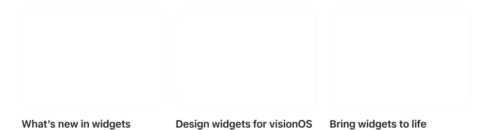

# **[Change](#page-16-1) log**

| Date              | Changes                                                                                                                                           |
|-------------------|---------------------------------------------------------------------------------------------------------------------------------------------------|
| December 16, 2025 | Updated guidance for all platforms, and added guid‐ ance for visionOS and CarPlay.                                                             |
| January 17, 2025  | Corrected watchOS widget dimensions.                                                                                                              |
| June 10, 2024     | Updated to include guidance for accented widgets in iOS 18 and iPadOS 18.                                                                      |
| June 5, 2023      | Updated guidance to include widgets in watchOS, widgets on the iPad Lock Screen, and updates for iOS 17, iPadOS 17, and macOS 14.           |
| November 3, 2022  | Added guidance for widgets on the iPhone Lock Screen and updated design comprehensives for iPhone 14, iPhone 14 Pro, and iPhone 14 Pro Max. |