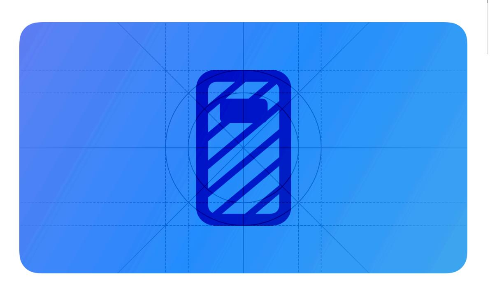
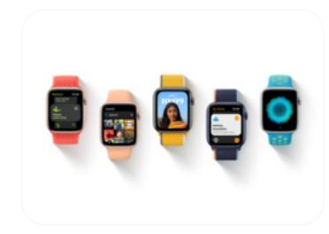

# **Always On**

On devices that include the Always On display, the system can continue to display an app's interface when people suspend their interactions with the device.

**Supported platforms**

[Always](#page-0-1) On Best [practices](#page-0-0) Platform [considerations](#page-1-0) [Resources](#page-2-0) [Change](#page-2-1) log

In the Always On state, a device can continue to give people useful, glanceable information in a low-power, privacy-preserving way by dimming the display and minimizing onscreen motion. The system can display different items depending on the device.

- On iPhone 14 Pro and iPhone 14 Pro Max, the system displays Lock Screen items like [Widgets](https://developer.apple.com/design/human-interface-guidelines/widgets) and Live [Activities](https://developer.apple.com/design/human-interface-guidelines/live-activities) when people set aside their device face up and stop interacting with it.
- When people drop their wrist while wearing Apple Watch, the system dims the watch face, continuing to display the interface of the app as long as it's either frontmost or running a background session.

On both devices, the system displays notifications while in Always On, and people can tap the display to exit Always On and resume interactions.

# **Best [practices](#page-0-0)**

**Hide sensitive information.** It's crucial to redact personal information that people wouldn't want casual observers to view, like bank balances or health data. You also need to hide personal information that might be visible in a notification; for guidance, see [Notifications](https://developer.apple.com/design/human-interface-guidelines/notifications).

**Keep other types of personal information glanceable when it makes sense.** On Apple Watch, for example, people typically appreciate getting pace and heart rate updates while they're working out; on iPhone, people appreciate getting a glanceable update on a flight arrival or a

notification when a ride-sharing service arrives. If people don't want any information to be visible, they can turn off Always On.

**Keep important content legible and dim nonessential content.** You can increase dimming on secondary text, images, and color fills to give more prominence to the information that's important to people. For example, a to-do list app might remove row backgrounds and dim each item's additional details to highlight its title. Also, if you display rich images or large areas of color, consider removing the images and using dimmed colors.

**Maintain a consistent layout.** Avoid making distracting interface changes when Always On begins or ends and throughout the Always On experience. For example, when Always On begins, prefer transitioning an interactive component to an unavailable appearance — don't just remove it. Within the Always On context, aim to make infrequent, subtle updates to the interface. For example, a sports app might pause granular play-by-play updates while in Always On, only updating the score when it changes. Note that unnecessary changes during Always On can be especially distracting on iPhone, because people often put their device face up on a surface, making motion on the screen visible even when they're not looking directly at it.

**Gracefully transition motion to a resting state; don't stop it instantly.** Smoothly finishing the current motion helps communicate the transition and avoids making people think that something went wrong.

# **Platform [considerations](#page-1-0)**

*No additional considerations for iOS or watchOS. Not supported in iPadOS, macOS, tvOS, or visionOS.*

# **[Resources](#page-2-0)**

#### **[Related](#page-2-2)**

[Designing](https://developer.apple.com/design/human-interface-guidelines/designing-for-watchos) for watchOS

#### **Developer [documentation](#page-2-3)**

[Designing](https://developer.apple.com/documentation/watchOS-Apps/designing-your-app-for-the-always-on-state) your app for the Always On state — watchOS apps

#### **[Videos](#page-2-4)**

**What's new in [watchOS](https://developer.apple.com/videos/play/wwdc2021/10002) 8 Build a [workout](https://developer.apple.com/videos/play/wwdc2021/10009) app for Apple Watch**

**What's new in [SwiftUI](https://developer.apple.com/videos/play/wwdc2021/10018)**

# **[Change](#page-2-1) log**

| Date               | Changes                                                                                     |
|--------------------|---------------------------------------------------------------------------------------------|
| September 12, 2023 | Updated intro image artwork.                                                                |
| September 23, 2022 | Expanded guidance to cover the Always On display on iPhone 14 Pro and iPhone 14 Pro Max. |