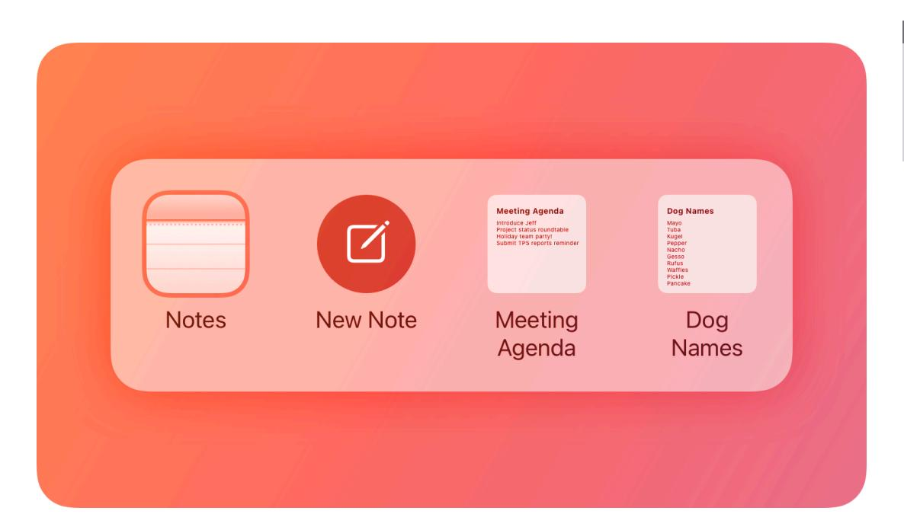
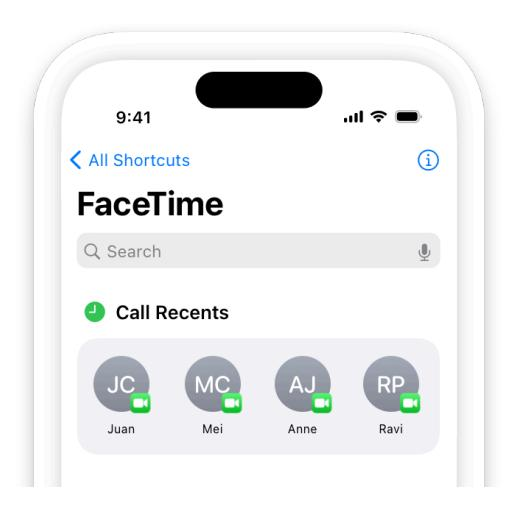
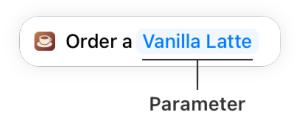
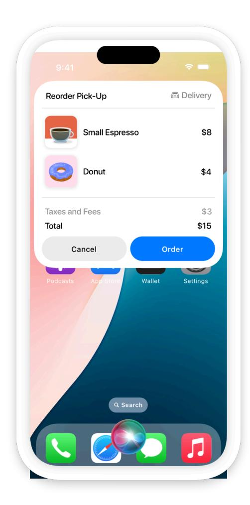
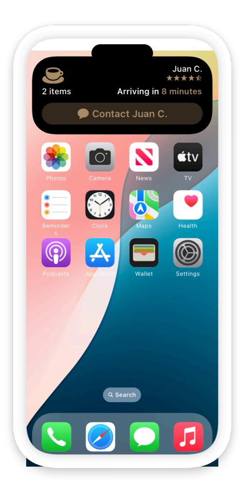
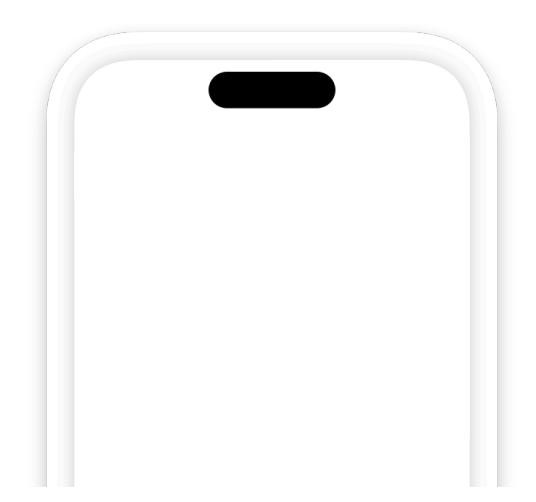
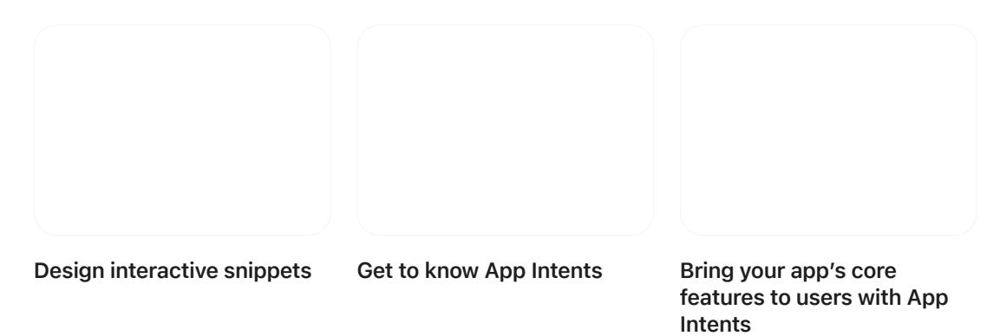

**[Design](https://developer.apple.com/design/)** [Overview](https://developer.apple.com/design/) [What's](https://developer.apple.com/design/whats-new/) New Get [Started](https://developer.apple.com/design/get-started/) [Guidelines](https://developer.apple.com/design/human-interface-guidelines) [Resources](https://developer.apple.com/design/resources/)

# **App Shortcuts**

An App Shortcut gives people access to your app's key functions or content throughout the system.

**Supported platforms**

App [Shortcuts](#page-0-0) Best [practices](#page-1-0) Editorial [guidelines](#page-2-0) Platform [considerations](#page-3-0) [Resources](#page-4-0) [Change](#page-4-1) log

People can initiate App Shortcuts using features like [Siri,](https://developer.apple.com/design/human-interface-guidelines/siri) Spotlight, and the Shortcuts app; using hardware features like the Action [button](https://developer.apple.com/design/human-interface-guidelines/action-button) on iPhone or Apple Watch; or by [squeezing](https://developer.apple.com/design/human-interface-guidelines/apple-pencil-and-scribble#Squeeze) Apple Pencil.

Because App Shortcuts are part of your app, they are available immediately when installation finishes. For example, a journaling app could offer an App Shortcut for making a new journal entry that's available before a person opens the app for the first time. Once someone starts using your app, its App Shortcuts can reflect their choices, like those from FaceTime for calling recent contacts.

App Shortcuts use App [Intents](https://developer.apple.com/documentation/AppIntents) to define actions within your app to make available to the system. Each App Shortcut includes one or more actions that represent a set of steps people might want to perform to accomplish a task. For example, a home security app might combine the two common actions of turning off the lights and locking exterior doors when a person goes to sleep at night into a single App Shortcut. Each app can include up to 10 App Shortcuts.

#### **Note**

When you use App Intents to make your app's actions available to the system, in addition to the App Shortcuts that your app provides, people can also make their own custom shortcuts by combining actions in the Shortcuts app. Custom shortcuts give people flexibility to configure the behavior of actions, and enable workflows that perform tasks across multiple apps. For additional guidance, see the [Shortcuts](https://support.apple.com/guide/shortcuts/welcome/ios) User Guide.

# **Best [practices](#page-1-0)**

**Offer App Shortcuts for your app's most common and important tasks.** Straightforward tasks that people can complete without leaving their current context work best, but you can also open your app if it helps people complete multistep tasks more easily.

**Add flexibility by letting people choose from a set of options.** An App Shortcut can include a single optional value, or parameter, if it makes sense. For example, a meditation app could offer an App Shortcut that lets someone begin a specific type of meditation: "Start [morning, daily, sleep] meditation." Include predictable and familiar values as options, because people won't have the list in front of them for reference. For developer guidance, see Adding [parameters](https://developer.apple.com/documentation/AppIntents/Adding-parameters-to-an-app-intent) to an app [intent](https://developer.apple.com/documentation/AppIntents/Adding-parameters-to-an-app-intent).

**Ask for clarification in response to a request that's missing optional information.** For example, someone might say "Start meditation" without specifying the type (morning, daily, or sleep); you could follow up by suggesting the one they used most recently, or one based on the current time of day. If one option is most likely, consider presenting it as the default, and provide a short list of alternatives to choose from if a person doesn't want the default choice.

**Keep voice interactions simple.** If your phrase feels too complicated when you say it aloud, it's probably too difficult to remember or say correctly. For example, "Start [sleep] meditation with nature sounds" appears to have two possible parameters: the meditation type, and the accompanying sound. If additional information is absolutely required, ask for it in a subsequent step. For additional guidance on writing dialogue text for voice interactions, see [Siri.](https://developer.apple.com/design/human-interface-guidelines/siri)

**Make App Shortcuts discoverable in your app.** People are most likely to remember and use App Shortcuts for tasks they do often, once they know the shortcut is available. Consider showing occasional tips in your app when people perform common actions to let them know an App Shortcut exists. For developer guidance, see *[SiriTipUIView](https://developer.apple.com/documentation/AppIntents/SiriTipUIView)*.

## **[Responding](#page-1-1) to App Shortcuts**

As a person engages with an App Shortcut, your app can respond in a variety of ways, including with dialogue that Siri speaks aloud and custom visuals like snippets and Live Activities.

Snippets are great for custom views that display static information or dialog options, like showing the weather at a person's location or confirming an order. For developer guidance, see *[ShowsSnippetView](https://developer.apple.com/documentation/AppIntents/ShowsSnippetView)*.

Live [Activities](https://developer.apple.com/design/human-interface-guidelines/live-activities) offer continuous access to information that's likely to remain relevant and change over a period of time, and are great for timers and countdowns that appear until an event is complete. For developer guidance, see *[LiveActivityIntent](https://developer.apple.com/documentation/AppIntents/LiveActivityIntent)*.

**Provide enough detail for interaction on audio-only devices.** People can receive responses on audio-only devices such as AirPods and HomePod too, and may not always be able to see content onscreen. Include all critical information in the full dialogue text of your App Shortcuts. For developer guidance, see *[init\(full:supporting:systemImageName:\)](https://developer.apple.com/documentation/AppIntents/IntentDialog/init(full:supporting:systemImageName:))*.

# **Editorial [guidelines](#page-2-0)**

**Provide brief, memorable activation phrases and natural variants.** Because an App Shortcut phrase (or a variant you define) is what people say to run an App Shortcut with Siri, it's important to keep it brief to make it easier to remember. You have to include your app name, but you can be creative with it. For example, Keynote accepts both "Create a Keynote" and "Add a new presentation in Keynote" as App Shortcut phrases for creating a new document. For developer guidance, see *[AppShortcutPhrase](https://developer.apple.com/documentation/AppIntents/AppShortcutPhrase)*.

**When referring to App Shortcuts or the Shortcuts app, always use title case and make sure that** *Shortcuts* **is plural.** For example, *MyApp integrates with Shortcuts to provide a quick way to get things done with just a tap or by asking Siri, and offers App Shortcuts you can place on the Action button.*

**When referring to individual shortcuts (not App Shortcuts or the Shortcuts app), use lowercase.** For example, *Run a shortcut by asking Siri or tapping a suggestion on the Lock Screen.*

# **Platform [considerations](#page-3-0)**

*No additional considerations for visionOS or watchOS. Not supported in tvOS.*

### **iOS, [iPadOS](#page-3-1)**

App Shortcuts can appear in the Top Hit area of Spotlight when people search for your app, or in the Shortcuts area below. Each App Shortcut includes a symbol from SF [Symbols](https://developer.apple.com/design/human-interface-guidelines/sf-symbols) that you choose to represent its functionality, or a preview image of an item that the shortcut links to directly.

**Order shortcuts based on importance.** The order you choose determines how App Shortcuts initially appear in both Spotlight and the Shortcuts app, so it's helpful to include the most generally useful ones first. Once people start using your App Shortcuts, the system updates to prioritize the ones they use most frequently.

**Offer an App Shortcut that starts a Live Activity.** Live Activities allow people to track an event or the progress of a task in glanceable locations across their devices. For example, a cooking app could offer a Live Activity to show the time left until a dish is ready to take out of the oven. To make it easy for people to start a cooking timer, the app offers an App Shortcut that people can place on the Action button. For more information about Live Activities, see Live [Activities.](https://developer.apple.com/design/human-interface-guidelines/live-activities)

### **[macOS](#page-3-2)**

App Shortcuts aren't supported in macOS. However, actions you create for your app using App Intents are supported, and people can build custom shortcuts using them with the Shortcuts app on Mac.

# **[Resources](#page-4-0)**

#### **[Related](#page-4-2)**

[Siri](https://developer.apple.com/design/human-interface-guidelines/siri)

Siri Style [Guide](https://developer.apple.com/siri/style-guide/)

[Shortcuts](https://support.apple.com/guide/shortcuts/welcome/ios) User Guide

#### **Developer [documentation](#page-4-3)**

App [Intents](https://developer.apple.com/documentation/AppIntents)

[SiriKit](https://developer.apple.com/documentation/SiriKit)

Making actions and content [discoverable](https://developer.apple.com/documentation/AppIntents/Making-actions-and-content-discoverable-and-widely-available) and widely available — App Intents

[Integrating](https://developer.apple.com/documentation/AppIntents/Integrating-custom-types-into-your-intents) custom data types into your intents — App Intents

#### **[Videos](#page-4-4)**

# **[Change](#page-4-1) log**

| Date             | Changes                           |
|------------------|-----------------------------------|
| January 17, 2025 | Updated and streamlined guidance. |
| June 5, 2023     | New page.                         |