**[Design](https://developer.apple.com/design/)** [Overview](https://developer.apple.com/design/) [What's](https://developer.apple.com/design/whats-new/) New Get [Started](https://developer.apple.com/design/get-started/) [Guidelines](https://developer.apple.com/design/human-interface-guidelines) [Resources](https://developer.apple.com/design/resources/)

# **Camera Control**

The Camera Control provides direct access to your app's camera experience.

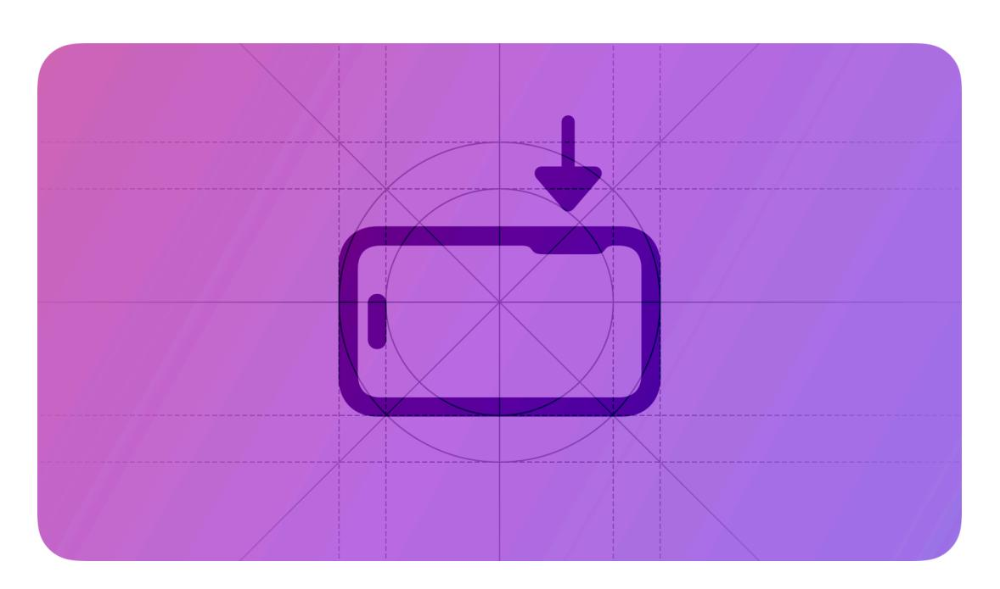

**Supported platforms**

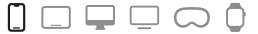

[Camera](#page-0-0) Control [Anatomy](#page-1-0) Best [practices](#page-1-1) Platform [considerations](#page-3-0) [Resources](#page-4-0) [Change](#page-4-1) log

On iPhone 16 and iPhone 16 Pro models, the Camera Control quickly opens your app's camera experience to capture moments as they happen. When a person lightly presses the Camera Control, the system displays an overlay that extends from the device bezel.

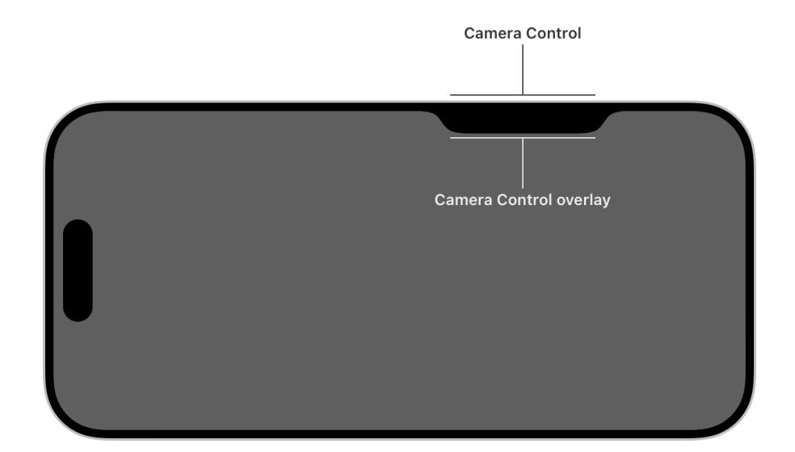

The overlay allows people to quickly adjust controls. A person can view the available controls by lightly double-pressing the Camera Control. After selecting a control, they can slide their finger on the Camera Control to adjust a value to capture their content as they want.

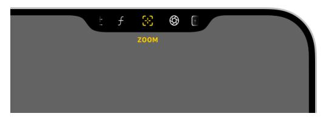

Controls in the overlay

## **[Anatomy](#page-1-0)**

The Camera Control offers two types of controls for adjusting values or changing between options:

- A *slider* provides a range of values to choose from, such as how much contrast to apply to the content.
- A *picker* offers discrete options, such as turning a grid on and off in the viewfinder.

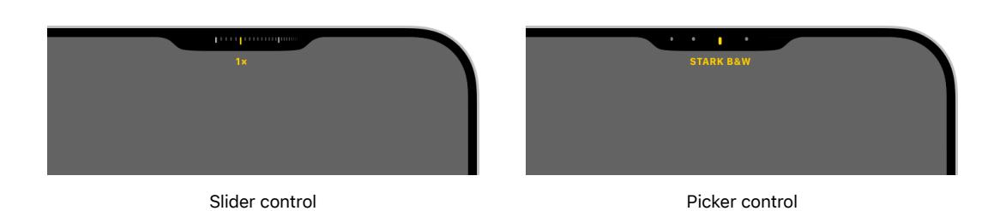

In addition to custom controls that you create, the system provides a set of standard controls that you can optionally include in the overlay to allow someone to adjust their camera's zoom and exposure.

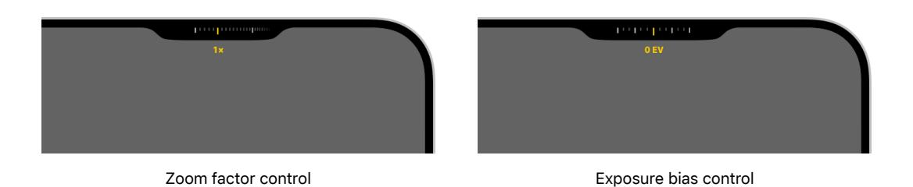

## **Best [practices](#page-1-1)**

**Use SF Symbols to represent control functionality.** The system doesn't support custom symbols; instead, pick a symbol from SF Symbols that clearly denotes a control's behavior. iOS offers thousands of symbols you can use to represent the controls your app shows in the overlay. Symbols for controls don't represent their current state. To view available symbols, see the Camera & Photos section in the SF [Symbols](https://developer.apple.com/sf-symbols/) app.

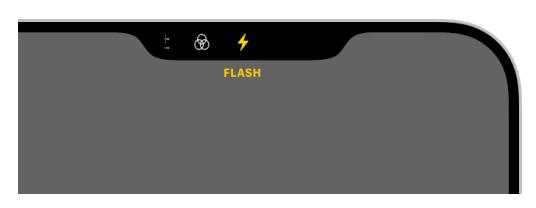

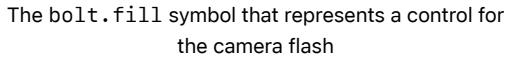

The *camera.filters* symbol that represents a control for filters

**Keep names of controls short.** Control labels adhere to Dynamic Type sizes, and longer names may obfuscate the camera's viewfinder.

**Include units or symbols with slider control values to provide context.** Providing descriptive information in the overlay, such as EV, %, or a custom string, helps people understand what the slider controls. For developer guidance, see *[localizedValueFormat](https://developer.apple.com/documentation/AVFoundation/AVCaptureSlider/localizedValueFormat)*.

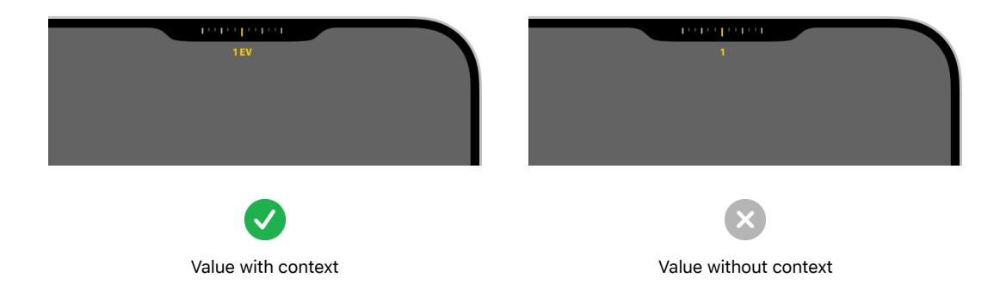

**Define prominent values for a slider control.** Prominent values are ones people choose most frequently, or values that are evenly spaced, like the major increments of zoom factor. When a person slides on the Camera Control to adjust a slider control, the system more easily lands on prominent values you define. For developer guidance, see *[prominentValues](https://developer.apple.com/documentation/AVFoundation/AVCaptureSlider/prominentValues-199dz)*.

**Make space for the overlay in the viewfinder.** The overlay and control labels occupy the screen area adjacent to the Camera Control in both portrait and landscape orientations. To avoid overlapping the interface elements of your camera capture experience, place your UI outside of the overlay areas. Maximize the height and width of the viewfinder and allow the overlay to appear and disappear over it.

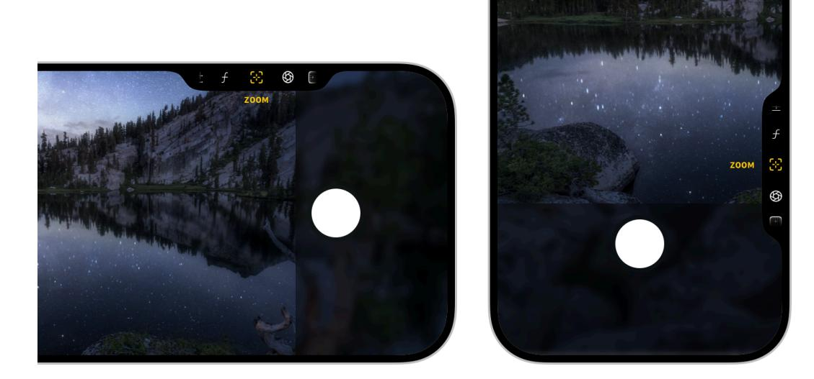

**Minimize distractions in the viewfinder.** When capturing a photo or video, people appreciate a large preview image with as few visual distractions as possible. Avoid duplicating controls, like sliders and toggles, in your UI and the overlay when the system displays the overlay.

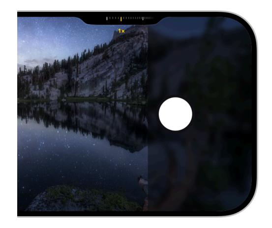

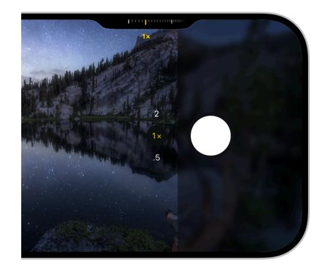

Keep UI minimal. Avoid showing controls in the viewfinder that people access in the overlay.

**Enable or disable controls depending on the camera mode.** For example, disable video controls when taking photos. The overlay supports multiple controls, but you can't remove or add controls at runtime.

**Consider how to arrange your controls.** Order commonly used controls toward the middle to allow quick access, and include lesser used controls on either side. When a person lightly presses the Camera Control to open the overlay again, the system remembers the last control they used in your app.

**Allow people to use the Camera Control to launch your experience from anywhere.** Create a locked camera capture extension that lets people configure the Camera Control to launch your app's camera experience from their locked device, the Home Screen, or from within other apps. For guidance, see Camera [experiences](https://developer.apple.com/design/human-interface-guidelines/controls#Camera-experiences-on-a-locked-device) on a locked device.

## **Platform [considerations](#page-3-0)**

*Not supported in iPadOS, macOS, watchOS, tvOS, or visionOS.*

## **[Resources](#page-4-0)**

#### **[Related](#page-4-2)**

SF [Symbols](https://developer.apple.com/design/human-interface-guidelines/sf-symbols)

[Controls](https://developer.apple.com/design/human-interface-guidelines/controls)

#### **Developer [documentation](#page-4-3)**

Enhancing your app [experience](https://developer.apple.com/documentation/AVFoundation/enhancing-your-app-experience-with-the-camera-control) with the Camera Control — AVFoundation

*[AVCaptureControl](https://developer.apple.com/documentation/AVFoundation/AVCaptureControl)* — AVFoundation

[LockedCameraCapture](https://developer.apple.com/documentation/LockedCameraCapture)

## **[Change](#page-4-1) log**

| Date | Changes |
|------|---------|
|      |         |

September 9, 2024 New page.