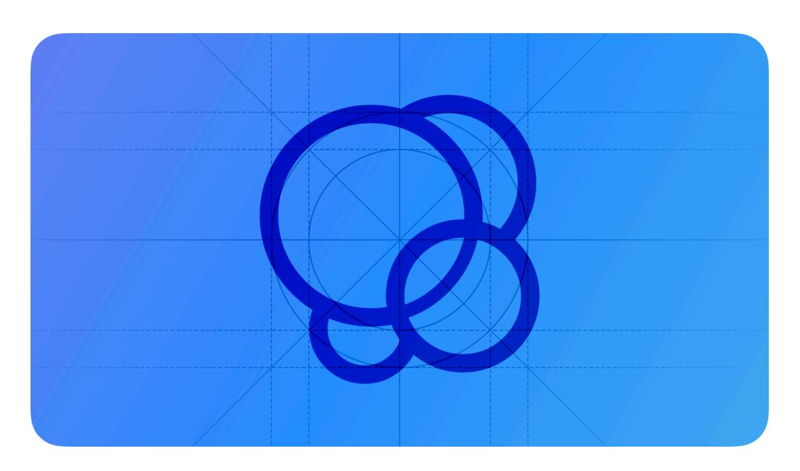
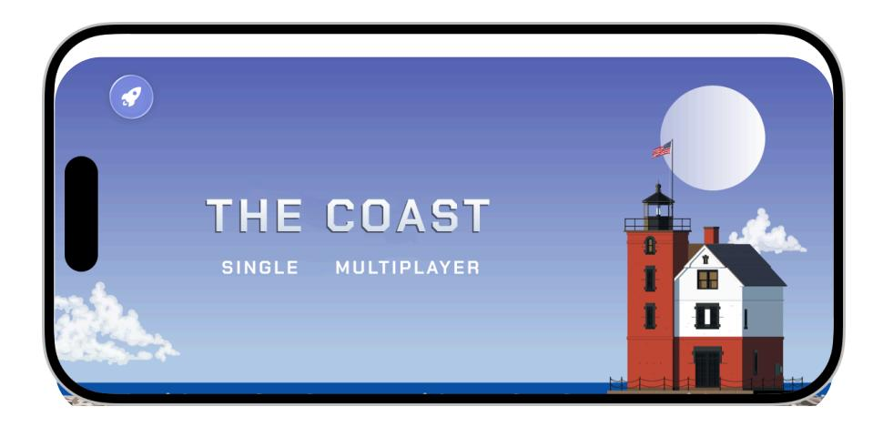
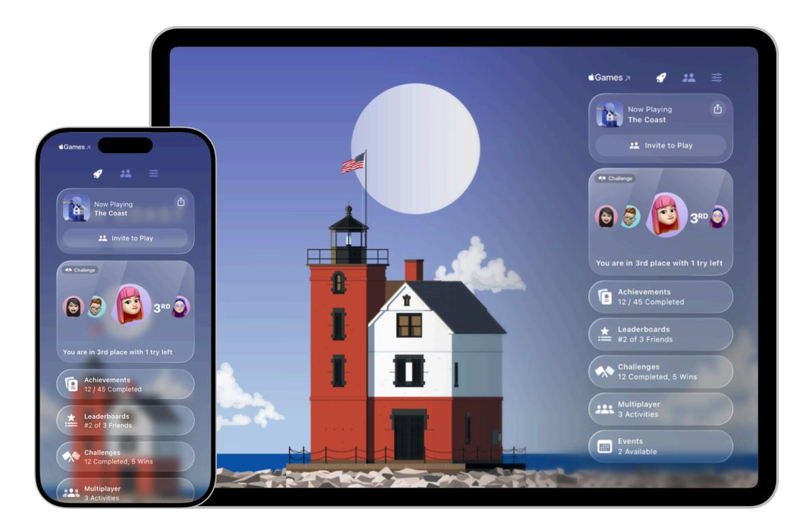
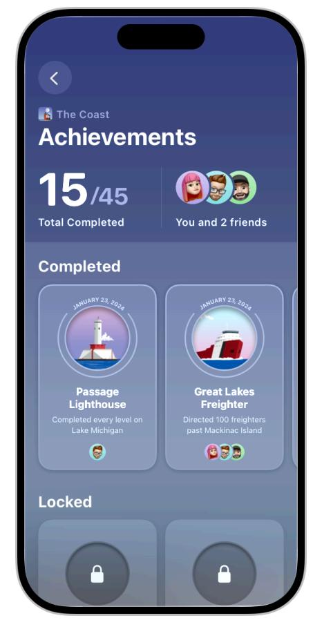
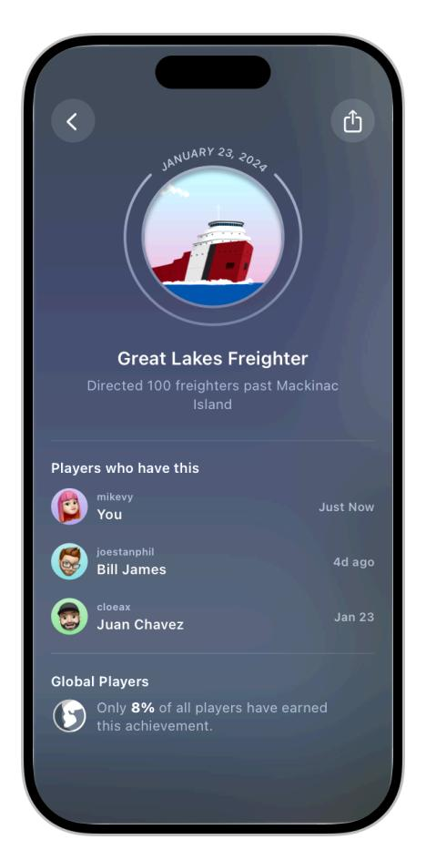
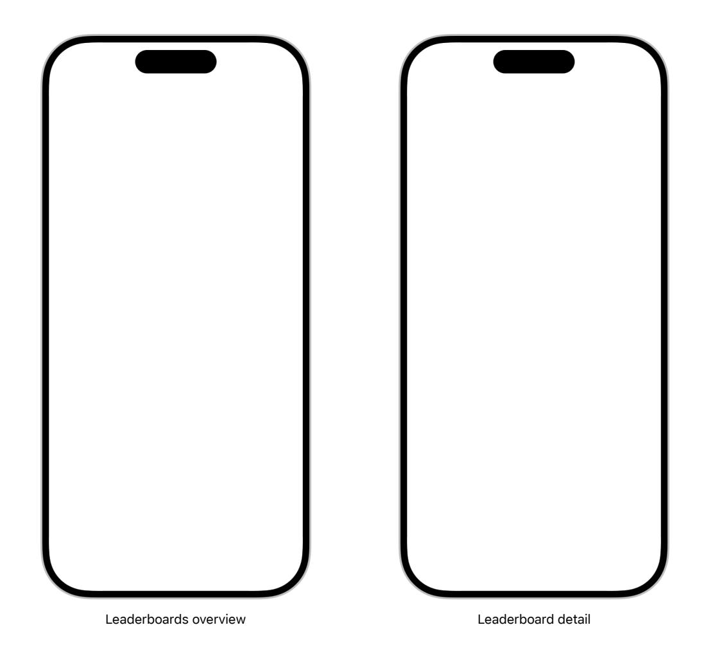
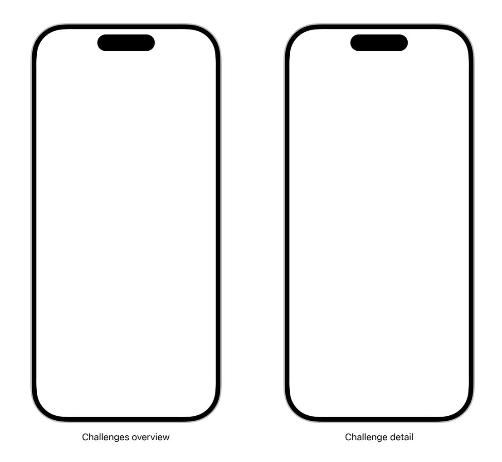
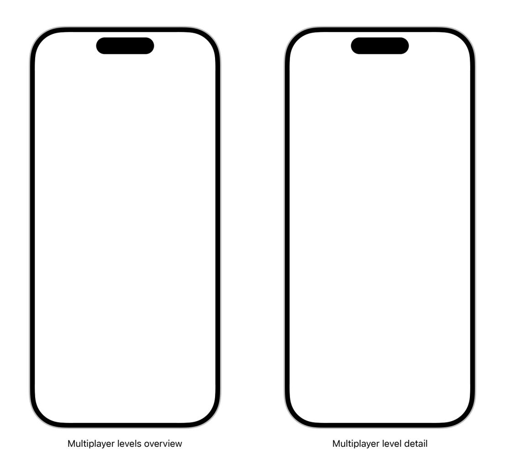
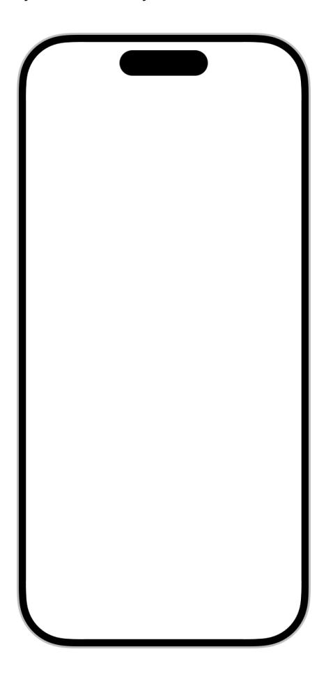
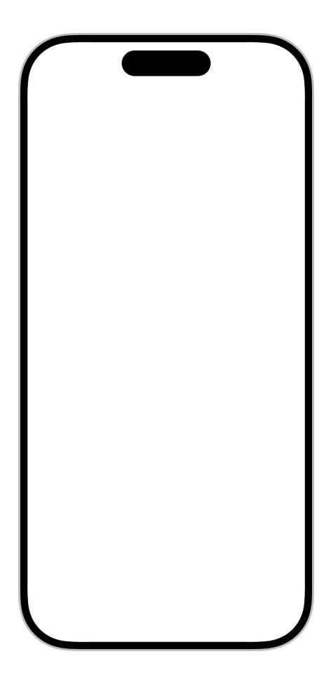

# **Game Center**

Game Center is Apple's social gaming network, which lets players track their progress and connect with friends across Apple platforms, and boosts the discovery of your game across players' devices.

**Supported platforms**

#### Game [Center](#page-0-1)

[Accessing](#page-0-0) Game Center [Achievements](#page-2-0) [Leaderboards](#page-4-0) [Challenges](#page-6-0) [Multiplayer](#page-8-0) activities Platform [considerations](#page-10-0) [Resources](#page-12-0) [Change](#page-12-1) log

Supporting Game Center in your game allows players to:

- Discover new games their friends are playing.
- Seamlessly invite friends to play.
- See the latest activity from their games across the system, in the Apple Games app, the App Store, notifications, and more.

By enabling the player activities listed above, supporting Game Center also helps surface your game to more players across Apple platforms.

You can add Game Center into your game using the GameKit framework, which provides a fullfeatured UI that makes it easy for players to access and view their Game Center data within your game. Alternatively, you can also use GameKit to present this data within your own custom UI. For developer guidance, see [GameKit](https://developer.apple.com/documentation/GameKit).

# **[Accessing](#page-0-0) Game Center**

To provide the best Game Center experience for your players, begin by determining whether the player is signed in to their Game Center account on the system when they launch your game. If they aren't, initialize the player with Game Center at that time. This provides the most seamless user experience, and maximizes discovery opportunities for your game, such as in the Top Played chart and in social recommendations through players' friends.

#### **[Integrating](#page-1-0) the access point**

The Game Center *access point* is an Apple-designed UI element that lets players view their Game Center profile and information without leaving your game. For developer guidance, see [Adding](https://developer.apple.com/documentation/GameKit/adding-an-access-point-to-your-game) an access point to your game.

In iOS, iPadOS, and macOS the access point leads players to the Game Overlay, a system overlay that allows players to view their progress and start game activities.

In visionOS and tvOS, the access point leads players to the in-game dashboard, a full-screen view of a player's Game Center activity that appears on top of your game.

**Display the access point in menu screens.** Consider adding the access point to the main menu or the settings area of your game. Avoid displaying the access point during active gameplay or in temporary splash screens, cinematic flows, or tutorials that might precede your game's main menu screen.

**Avoid placing controls near the access point.** You can choose to present the access point at any of the four corners of the screen in a fixed position. Remember that the access point has both a collapsed and expanded version, so check whether the access point overlaps any important UI and controls and adjust your layout accordingly.

#### **Note**

In visionOS, the locations of the access point vary based on game type, such as immersive or volume-based. For developer guidance, see [Adding](https://developer.apple.com/documentation/GameKit/adding-an-access-point-to-your-game#Configure-the-access-point-on-visionOS) an access point to your game.

**Consider pausing your game while the Game Overlay or dashboard is present.** Pausing your game can help players view their Game Center information without feeling like the game is continuing without them.

### **Using [custom](#page-2-1) UI**

Your game can include custom links into the Game Overlay (in iOS, iPadOS, macOS) or the dashboard (in visionOS and tvOS). Your custom UI can deep-link into specific areas within both such as leaderboards or a player's Game Center profile.

**Use the artwork Game Center provides in custom links.** When referencing Game Center features in custom UI, use the official artwork from Apple Design [Resources.](https://developer.apple.com/design/resources/#technologies) Preserve the appearance of this artwork and don't adjust the dimensions or visual effects.

**Use the correct terminology in custom links.** The following table describes how to use Game Center terminology correctly so that you can avoid confusing players in custom UI.

| Term                | Incorrect terms                     | Localization                                                                    |
|---------------------|-------------------------------------|---------------------------------------------------------------------------------|
| Game Center         | GameKit, GameCenter, game center | Use the system-provided transla‐ tion of Game Center                         |
| Game Center Profile | Profile, Account, Player Info       | Use the system-provided transla‐ tion of Game Center and localize Profile |
| Achievements        | Awards, Trophies, Medals            |                                                                                 |
| Leaderboards        | Rankings, Scores, Leaders           |                                                                                 |
| Challenges          | Competitions                        |                                                                                 |
| Add Friends         | Add, Add Profiles, Include Friends  |                                                                                 |

## **[Achievements](#page-2-0)**

Achievements give players an added incentive to stay engaged with your game. Game Center achievements appear in a collectible card format that highlights the player's progress and showcases your artwork. For developer guidance, see Rewarding players with [achievements.](https://developer.apple.com/documentation/GameKit/rewarding-players-with-achievements)

#### **Integrating [achievements](#page-3-0) into your game**

**Align with Game Center achievement states.** Game Center defines four achievement states: locked, in-progress, hidden, and completed. The system groups achievements by completion status, displaying completed achievements in the Completed group and all other achievements in the Locked group. When you map your achievements to the four Game Center achievement states, you give players a consistent experience and you help them see at a glance the types of achievements your game offers.

**Determine a display order.** The order in which you upload achievements is the order in which they appear, so consider the order you want before uploading files. For example, you might want your achievements to appear in an order that corresponds to the most common path through your game.

**Be succinct when describing achievements.** The achievement card limits the title and description to two lines each. If your title or description wraps beyond two lines, the card truncates the text. Use title-style capitalization for the achievement title and sentence-style capitalization for the description.

**Give players a sense of progress.** When you use progressive achievements, the system displays player progress and provides encouraging messages like "You're more than halfway to completing Great Lakes Freighter in The Coast. Keep going!" to help motivate players to complete them.

### **Creating [achievement](#page-3-1) images**

**Design rich, high-quality images that help players feel rewarded.** Achievements are a prominent feature in Game Center UI, so it's essential to design high-quality assets that catch the eye and encourage players to return to your game. Avoid reusing the same asset to represent more than one achievement. If you don't provide an asset for an achievement, the card shows a placeholder image instead.

**Create artwork in the appropriate size and format.** The system applies a circular mask to your achievement image, so be sure to keep content centered. Use the following specifications to create images.

tvOS iOS, iPadOS, macOS, visionOS

| Attribute     | Value                         |
|---------------|-------------------------------|
| Format        | PNG, TIF, or JPG              |
| Color space   | sRGB or P3                    |
| Resolution    | 72 DPI (minimum)              |
| Image size    | 512x512 pt (1024x1024 px @2x) |
| Mask diameter | 512 pt (1024 px @2x)          |

# **[Leaderboards](#page-4-0)**

Leaderboards are a great way to encourage friendly competition within your game. When you adopt Game Center, players can easily check their ranking against friends and global players as well as receive notifications when their friends challenge them or pass their score on a leaderboard. You can take advantage of the system-designed UI or present leaderboard information within custom UI. For developer guidance, see Encourage progress and [competition](https://developer.apple.com/documentation/GameKit/encourage-progress-and-competition-with-leaderboards) with [leaderboards](https://developer.apple.com/documentation/GameKit/encourage-progress-and-competition-with-leaderboards).

**Choose a leaderboard type.** Game Center supports two types of leaderboards: *classic* and *recurring*.

- A *classic leaderboard* tracks a player's best all-time score. Classic leaderboards are always active with no ending. The following are examples of goals you might include in a classic leaderboard:
  - Strive for the most perfect score in a rhythm game.
  - Collect the most coins in a single dungeon run.
  - Achieve the longest continuous time in an endless runner.
- A *recurring leaderboard* resets based on a time interval you define, such as every week or every day. Recurring leaderboards can increase engagement by giving players more chances to take the lead. The following are examples of features that work well with recurring leaderboards:
  - Daily rotating puzzles
  - Seasonal or holiday-themed events
  - Weekly leaderboards for different battle modes

**Take advantage of leaderboard sets for multiple leaderboards.** Leaderboard sets are an organization system that can make it easier for players to find the board they're looking for. Consider grouping leaderboard sets by themes or gameplay experiences, such as:

- Difficulty modes (Easy, Standard, Hard)
- Activity types (Combat, Crafting, Farming)
- Genres and themes (Disco, Pop, Rock)

**Add leaderboard images.** Leaderboard artwork gives you another opportunity to reinforce your game's visual aesthetic. Aim to create a unique image for each leaderboard in your game that reflects and showcases the gameplay involved in leaderboard ranking. Leaderboards appear across the system, promoting ways for players to engage and compete with friends, and having compelling images helps attract players and gives them a sense of the experience.

For games that run in iOS, iPadOS, and macOS, use a single image for your leaderboard image. For games that run in tvOS, provide a set of images that animate when the artwork is in focus. To learn more about focus effects, see Focus and [selection](https://developer.apple.com/design/human-interface-guidelines/focus-and-selection). For help creating focusable images, download the tvOS template from Apple Design [Resources.](https://developer.apple.com/design/resources/#tvos-apps) Use the following specifications to create leaderboard artwork.

tvOS iOS, iPadOS, macOS

| Attribute    | Value                         |
|--------------|-------------------------------|
| Format       | JPEG, JPG, or PNG             |
| Color space  | sRGB or P3                    |
| Resolution   | 72 DPI (minimum)              |
| Image size   | 512x512 pt (1024x1024 px @2x) |
| Cropped area | 512x312 pt (1024x624 px @2x)  |

#### **Note**

Be mindful of how cropping might affect your leaderboard artwork. In iOS, iPadOS, and macOS, the system crops artwork for leaderboards that are part of a leaderboard set. In tvOS, the focus effect on leaderboard artwork may crop your images at the edges of some layers. Make sure your primary content stays comfortably visible in both these scenarios.

## **[Challenges](#page-6-0)**

Challenges turn single player activities into multiplayer experiences with friends. Challenges are built on top of leaderboards and allow players to connect with their friends and participate in competitions with time limits. For developer documentation, see Creating engaging [challenges](https://developer.apple.com/documentation/GameKit/creating-engaging-challenges-from-leaderboards) from [leaderboards.](https://developer.apple.com/documentation/GameKit/creating-engaging-challenges-from-leaderboards)

**Create engaging challenges.** Challenges are great for short, skill-based gameplay activities that have a clear way of gauging players' accomplishments. Create challenges that take 1-5 minutes to play, with gameplay that players can complete individually. Examples of compelling challenges are:

- Complete the fastest lap in a racing level.
- Defeat the most enemies in a single round.
- Solve a daily puzzle with the fewest mistakes.

**Avoid creating challenges that track overall progress or personal best scores.** These can give regular players an unfair advantage. Instead, track players' most recent score after each attempt at your challenge. This helps keep your challenge motivating by placing all players on a level playing field.

**Make it easy to jump into your challenge.** Players can access challenges through invitation links, the Game Overlay, or in the Games app in iOS, iPadOS, and macOS. Always deep-link to the exact mode or level where your challenge begins, and help first-time players complete any initial onboarding before beginning the challenge. For example, if your game requires a tutorial level to understand basic controls, launch the player into the tutorial first and present UI that lets them know your game automatically jumps into the challenge afterward.

**Create high-quality artwork that encourages players to engage with your challenges.** The system shows your challenge's artwork in the Game Overlay, Games app, and in the preview of an invitation link. Avoid placing the primary content of your artwork in an area where the challenge's title and description might cover it. If you need to use text in your challenge image, provide the appropriate localized versions through App Store Connect or Xcode. Use the following specifications to create challenge artwork.

| Attribute    | Value                           |
|--------------|---------------------------------|
| Format       | JPEG, JPG, or PNG               |
| Color space  | sRGB or P3                      |
| Resolution   | 72 DPI (minimum)                |
| Image size   | 1920x1080 pt (3840x2160 px @2x) |
| Cropped area | 1465x767 pt (2930x1534 px @2x)  |

# **[Multiplayer](#page-8-0) activities**

Game Center supports both real-time and turn-based multiplayer activities that make it easy to connect players with friends or other players. Players can access multiplayer gameplay through party codes, the Game Overlay, the dashboard, or in the Games app. For developer documentation, see Creating [activities](https://developer.apple.com/documentation/GameKit/creating-activities-for-your-game) for your game.

**Use party codes to invite players to multiplayer activities.** Game Center party codes are a great way to coordinate real-time multiplayer sessions whether you use Game Center matchmaking and networking facilities or provide your own. Game Center generates alphanumeric party codes that are typically eight characters long, such as "2MP4-9CMF." When integrating party codes into your multiplayer games, consider the following guidelines for the best player experience:

- Allow players to join gameplay late, leave early, and return later.
- Provide a way for players to view the current party code in your game.

Allow players to enter a party code manually.

**Support multiplayer activities through in-game UI.** The Game Overlay and Game Center dashboard help players find other people for a multiplayer match without leaving your game. Game Center's default multiplayer interface lets a player invite nearby or recent players, Game Center friends, and contacts. You can also choose to present multiplayer functionality within your custom UI. For developer guidance, see Finding [multiple](https://developer.apple.com/documentation/GameKit/finding-multiple-players-for-a-game) players for a game.

**Provide engaging activity artwork.** Players see the preview image for a multiplayer activity throughout the system, such as in a party code, the Games app, or in-game UI. Use the following specifications to create your artwork.

| Attribute    | Value                           |
|--------------|---------------------------------|
| Format       | JPEG, JPG, or PNG               |
| Color space  | sRGB or P3                      |
| Resolution   | 72 DPI (minimum)                |
| Image size   | 1920x1080 pt (3840x2160 px @2x) |
| Cropped area | 1465x767 pt (2930x1534 px @2x)  |

# **Platform [considerations](#page-10-0)**

*No additional considerations for iOS, iPadOS, macOS, or visionOS.*

#### **[tvOS](#page-10-1)**

**Display an optional image at the top of the dashboard.** In tvOS, you can add an additional piece of artwork to the dashboard to highlight your game's aesthetic. Use a simple, easily recognizable image that looks great at a distance. Consider using your game's logo or word mark; however, don't use your app icon for this image. Use the following specifications to create a dashboard image.

| Attribute   | Value                        |
|-------------|------------------------------|
| Image size  | 600x180 pt (1200x360 px @2x) |
| Format      | PNG, TIF, or JPG             |
| Color space | sRGB or P3                   |
| Resolution  | 72 DPI (minimum)             |

#### **[watchOS](#page-11-0)**

**Be aware of Game Center support on watchOS.** While GameKit features and API are available for watchOS games, keep in mind that there's no system-supported Game Center UI that you can invoke on watchOS. Instead, Game Center content for watchOS games appears on a connected iPhone.

## **[Resources](#page-12-0)**

#### **[Related](#page-12-2)**

[Designing](https://developer.apple.com/design/human-interface-guidelines/designing-for-games) for games

Game [controls](https://developer.apple.com/design/human-interface-guidelines/game-controls)

Apple Design [Resources](https://developer.apple.com/design/resources/#technologies)

#### **Developer [documentation](#page-12-3)**

[GameKit](https://developer.apple.com/documentation/GameKit)

Creating [activities](https://developer.apple.com/documentation/GameKit/creating-activities-for-your-game) for your game

Creating engaging challenges from [leaderboards](https://developer.apple.com/documentation/GameKit/creating-engaging-challenges-from-leaderboards)

Create games for Apple [platforms](https://developer.apple.com/games/)

Game [Porting](https://developer.apple.com/games/game-porting-toolkit/) Toolkit

#### **[Videos](#page-12-4)**

**Get [started](https://developer.apple.com/videos/play/wwdc2025/214) with Game Center**

**[Engage](https://developer.apple.com/videos/play/wwdc2025/215) players with the Apple Games app**

# **[Change](#page-12-1) log**

| Date               | Changes                                                                                                                                                                                                |
|--------------------|--------------------------------------------------------------------------------------------------------------------------------------------------------------------------------------------------------|
| June 9, 2025       | Added guidance for new challenges and multiplayer activities, and considerations for the Apple Games app and Game Overlay. Updated guidance and specifica‐ tions for activity preview images. |
| February 2, 2024   | Added links to developer guidance on using the ac‐ cess point and dashboard in a visionOS game.                                                                                                     |
| September 12, 2023 | Added artwork for the iOS achievement layout.                                                                                                                                                          |
| May 2, 2023        | Consolidated guidance into one page.                                                                                                                                                                   |