**[Design](https://developer.apple.com/design/)** [Overview](https://developer.apple.com/design/) [What's](https://developer.apple.com/design/whats-new/) New Get [Started](https://developer.apple.com/design/get-started/) [Guidelines](https://developer.apple.com/design/human-interface-guidelines) [Resources](https://developer.apple.com/design/resources/)

# **In-app purchase**

People can use in-app purchase to pay for virtual goods — like premium content, digital goods, and subscriptions — securely within your app.

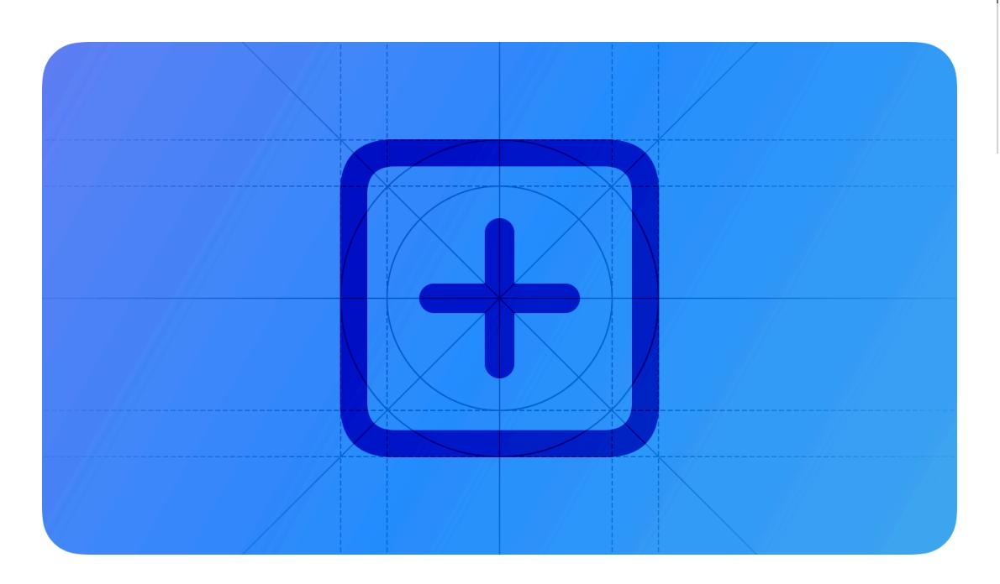

**Supported platforms**

In-app [purchase](#page-0-0) Best [practices](#page-1-0) [Auto-renewable](#page-4-0) subscriptions Platform [considerations](#page-12-0) [Resources](#page-14-0) [Change](#page-14-1) log

You can also promote and offer in-app purchases directly through the App Store. For developer guidance, see In-App [Purchase.](https://developer.apple.com/documentation/StoreKit/in-app-purchase)

#### **Tip**

In-app purchase and [Apple](https://developer.apple.com/design/human-interface-guidelines/apple-pay) Pay are different technologies that support different use cases. Use in-app purchase to sell virtual goods in your app, such as premium content for your app and subscriptions for digital content. Use Apple Pay in your app to sell physical goods like groceries, clothing, and appliances; for services such as club memberships, hotel reservations, and event tickets; and for donations.

Using in-app purchase, there are four types of content you can offer:

- *Consumable* content like lives or gems in a game. After purchase, consumable content depletes as people use it, and people can purchase it again.
- *Non-consumable* content like premium features in an app. Purchased non-consumable content doesn't expire.
- *Auto-renewable subscriptions* to virtual content, services, and premium features in your app on an ongoing basis. An auto-renewable subscription continues to automatically renew at the end of each subscription period until people choose to cancel it.
- *Non-renewing subscriptions* to a service or content that lasts for a limited time, like access to an in-game battle pass. People purchase a non-renewing subscription each time they want to

extend their access to the service or content.

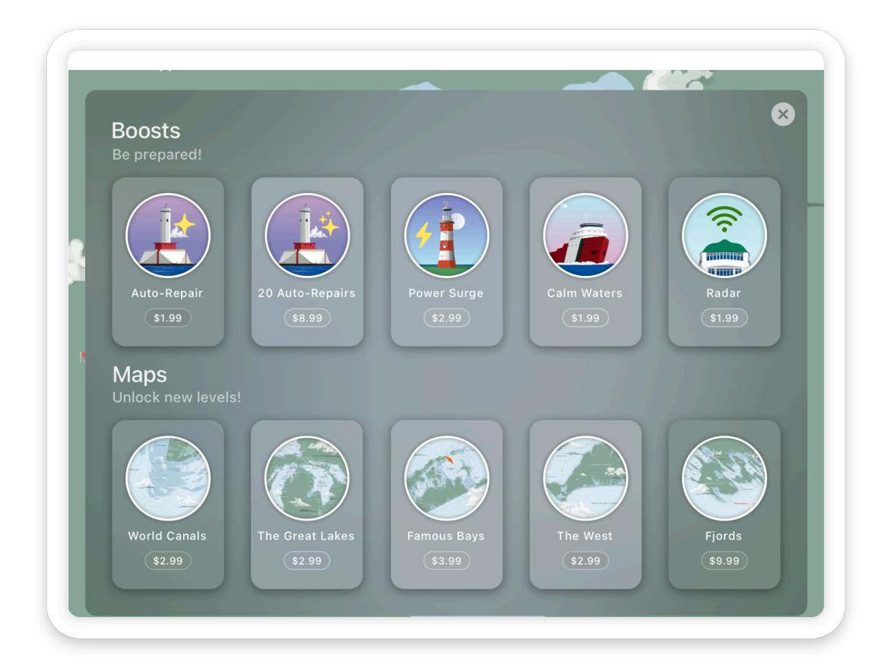

For marketing and business guidance, see In-app [purchase](https://developer.apple.com/in-app-purchase/) and [Auto-renewable](https://developer.apple.com/app-store/subscriptions/) subscriptions. For information about what you can and can't sell in your app, including in-app purchase usage requirements and restrictions, see App Review [Guidelines.](https://developer.apple.com/app-store/review/guidelines/)

#### **Note**

For apps with exceptionally large, frequently updated catalogs of one-time purchases or subscription content from multiple creators, or apps that provide subscriptions with optional add-on content as a single purchase within the app, the Advanced Commerce API allows you to manage your In-App Purchase catalog directly. See the Advanced Commerce API App Store [support](https://developer.apple.com/in-app-purchase/advanced-commerce-api/) page for an overview, and see Advanced [Commerce](https://developer.apple.com/documentation/AdvancedCommerceAPI) API for developer guidance.

# **Best [practices](#page-1-0)**

**Let people experience your app before making a purchase.** People may be more inclined to invest in paid items or features after they've enjoyed your app and discovered its value. If you offer auto-renewable subscriptions, consider supporting limited free access to your content; for guidance, see [Auto-renewable](#page-4-0) subscriptions.

**Design an integrated shopping experience.** You don't want people to think they've entered a different app when they browse and purchase your digital products. Present products and handle transactions in ways that mirror the style of your app.

**Use simple, succinct product names and descriptions.** Titles that don't truncate or wrap and plain, direct language can help people find products quickly.

**Display the total billing price for each in-app purchase you offer, regardless of type.** People need to know the total billing amount for every purchase they consider.

**Display your store only when people can make payments.** If someone can't make payments for example, because of parental restrictions — consider hiding your store or displaying UI that explains why the store isn't available. For developer guidance, see *[canMakePayments](https://developer.apple.com/documentation/StoreKit/AppStore/canMakePayments)*.

**Use the default confirmation sheet.** When someone initiates an in-app purchase, the system displays a confirmation sheet to help prevent accidental purchases. Don't modify or replicate this sheet.

### **[Supporting](#page-2-0) Family Sharing**

People can use Family Sharing to share access to their purchased content — such as autorenewable subscriptions and non-consumable in-app purchases — with up to five additional family members, across all their Apple devices. To encourage people to take advantage of the Family Sharing support you offer, consider the following guidelines.

**Prominently mention Family Sharing in places where people learn about the content you offer.** For example, including "Family" or "Shareable" in a subscription or item name and referring to Family Sharing in your sign-up screen can highlight the feature and help people make an informed choice.

**Help people understand the benefits of Family Sharing and how to participate.** When you turn on Family Sharing, people can receive notifications about the change, depending on their current settings. For example, an existing subscriber whose sharing setting is turned off (the default) receives a notice from Apple that invites them to share their subscription with family members. Similarly, a family member can get a notification about content that's being shared with them. (To learn more about the types of notifications people can receive, see [Auto](https://developer.apple.com/app-store/subscriptions/)renewable [subscriptions](https://developer.apple.com/app-store/subscriptions/).)

**Aim to customize your in-app messaging so that it makes sense to both purchasers and family members.** For example, when a family member views shared content for the first time, you might welcome them with wording like "Your family subscription includes…".

### **Providing help with in-app [purchases](#page-2-1)**

Sometimes, people need help with a purchase or want to request a refund. To help make this experience convenient, you can present custom UI within your app that provides assistance, offers alternative solutions, and helps people initiate the system-provided refund flow. For developer guidance, see *[beginRefundRequest\(for:in:\)](https://developer.apple.com/documentation/StoreKit/Transaction/beginRefundRequest(for:in:)-65tph)*; for related guidance specific to auto-renewable subscriptions, see Helping people manage their [subscriptions](#page-9-0).

**Provide help that customers can view before they request a refund.** In addition to including a link to the system-provided refund flow, your custom purchase-help screen can provide assistance you tailor to your app. For example, your custom screen might help people resolve problems with missing purchases, answer frequently asked questions about the in-app purchases you offer, and give people ways to submit feedback or contact you directly for support.

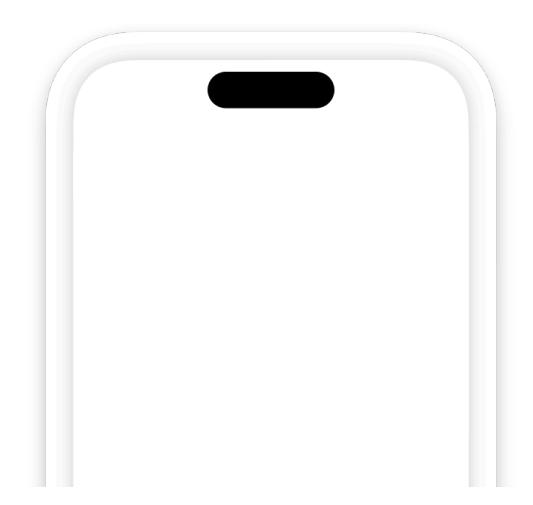

**Use a simple title for the refund action, like "Refund" or "Request a Refund".** The systemprovided refund flow makes it clear that people request a refund from Apple, so there's no need to reiterate this information.

**Help people find the problematic purchase.** For each recent purchase you display, include contextual information that helps people identify the one they want. For example, you might display an image of the product — along with its name and description — and list the original purchase date.

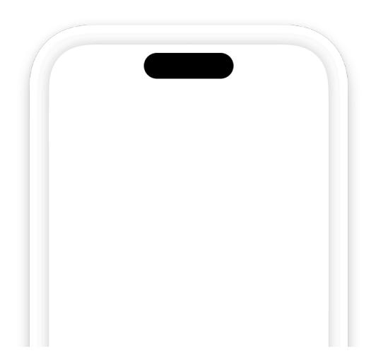

**Consider offering alternative solutions.** For example, if the customer didn't receive the item they purchased, you might offer immediate fulfillment or a conciliatory item. Regardless of the alternatives you offer, make it clear that people can still request a refund.

**Make it easy for people to request a refund.** Although your purchase-help screen can offer useful information and alternative solutions, make sure this content doesn't create a barrier to requesting a refund. For example, avoid making people scroll or open another screen to reveal your refund-request button. When people choose your refund-request item, they automatically enter the system-provided refund flow shown below.

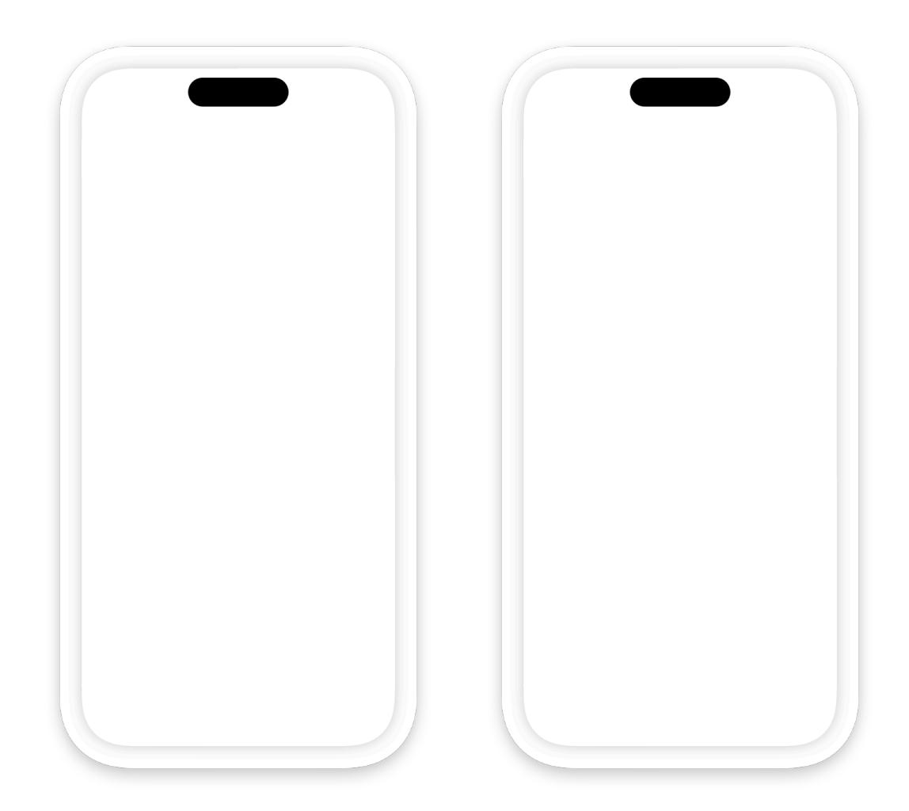

**Avoid characterizing or providing guidance on Apple's refund policies.** For example, don't speculate about whether customers will receive the refund they request. To help people understand the refund-request process, you can provide a link to [Request](https://support.apple.com/en-us/HT204084) a refund for apps or [content](https://support.apple.com/en-us/HT204084) that you bought from Apple.

# **[Auto-renewable](#page-4-0) subscriptions**

**Call attention to subscription benefits during onboarding.** By showing the value of your subscription when people first launch your app, you can educate them on how the app works and help them understand what they'll gain by subscribing. Include a strong call to action and a clear summary of subscription terms (see Making signup [effortless\)](#page-6-0). For related guidance, see [Onboarding](https://developer.apple.com/design/human-interface-guidelines/onboarding).

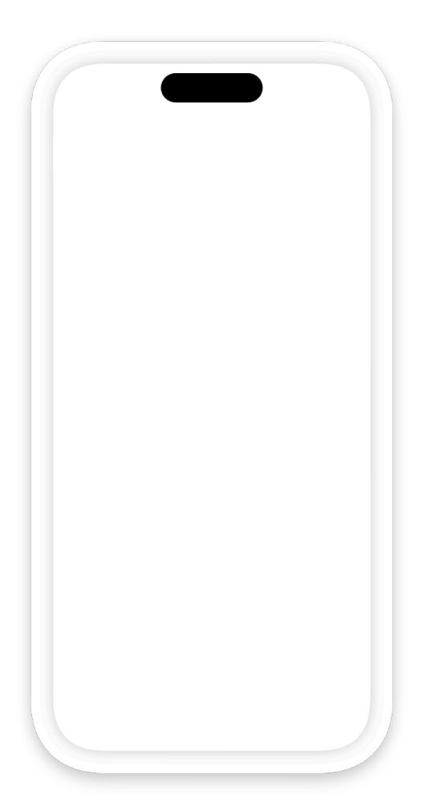

**Offer a range of content choices, service levels, and durations.** People appreciate the flexibility to choose the subscription that best meets their needs.

**Consider letting people try your content for free before signing up.** Limited free access gives people the opportunity to sample your content and encourages people who already engaged with your content to sign up. For example, you might offer a freemium app, a metered paywall, or a free trial.

Freemium app Metered paywall Free trial

**Prompt people to subscribe at relevant times, like when they near their monthly limit of free content.** Additionally, consider making it easy for people to subscribe at any time by including prompts at relevant points throughout your app.

**Encourage a new subscription only when someone isn't already a subscriber.** Otherwise, people may believe their existing subscription has lapsed when that's not actually the case. If you offer the same subscription options in multiple apps or through your website, provide a signin option so people don't think they have to pay multiple times for the same service.

### **Making signup [effortless](#page-6-0)**

A simple and informative sign-up experience makes it easy for people to act on their interest in your content, whether they're in your app or viewing your App Store product page.

**Provide clear, distinguishable subscription options.** Use short, self-explanatory names that differentiate subscription options from one another, and specify the price and duration for each option. If you offer an introductory price, be sure to list the introductory price, the duration of the offer, and the standard price the customer pays after the offer ends.

**Simplify initial signup by asking only for necessary information.** A lengthy sign-up process may lower your subscription conversion rate. Defer asking for additional information until after people have signed up.

**In your tvOS app, help people sign up or authenticate using another device.** Instead of asking people to input information in your tvOS app, send a code to another device where they can enter the information you need.

**Give people more information in your app's sign-up screen.** In addition to including links to your Terms of Service and Privacy Policy in your app and App Store metadata, the in-app signup screen needs to include:

- The subscription name, duration, and the content or services provided during each subscription period
- The billing amount, correctly localized for the territories and currencies where the subscription is available for purchase
- A way for existing subscribers to sign in or restore purchases

For example, the Forest Explorer sign-up screen displays billing totals for monthly, biannual, and annual subscriptions in the most prominent positions. In subordinate positions, it shows breakdowns of the biannual and annual prices, so that people can compare the values and make an informed choice. The sign-up screen also contains a button that existing subscribers can use to restore their purchases.

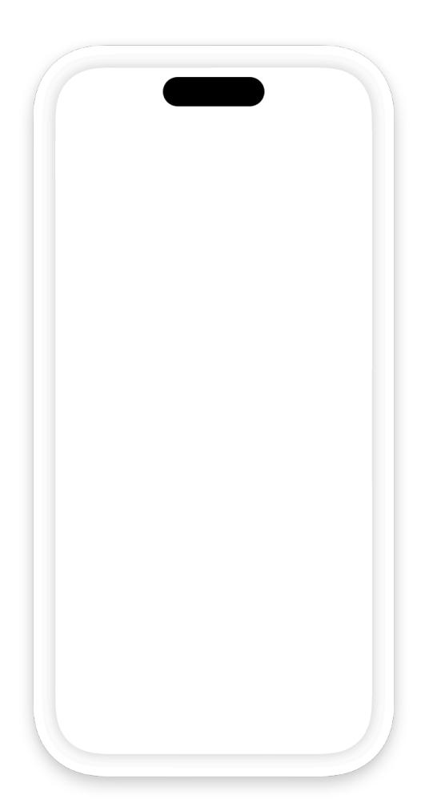

**Clearly describe how a free trial works.** It's particularly important to make sure people know that when the free trial is over, a payment will be automatically initiated for the next subscription period. For example, the Ocean Journal sign-up screen explicitly states both the duration of the free trial and the amount that's billed when it ends.

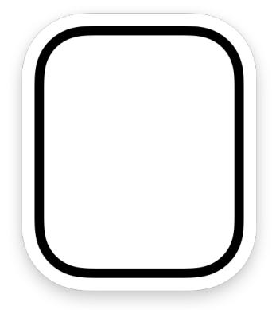

**Include a sign-up opportunity in your app's settings.** App and account settings are common places for people to look for a way to subscribe.

### **[Supporting](#page-8-0) offer codes**

In iOS and iPadOS, subscription offer codes let you use both online and offline channels to give new, existing, and lapsed subscribers free or discounted access to your subscription content. For example, you might provide offer codes through email, give them out at a store or event, or print one on a physical product.

There are two types of offer codes you can support:

- A *one-time use code* is a unique code you generate in App Store Connect. People can redeem a one-time use code through a [redemption](https://developer.apple.com/help/app-store-connect/manage-subscriptions/set-up-offer-codes/#distribute-offer-codes) URL (a shareable link), within your app (when you support redemption), or by entering it in the App Store, where they're prompted to install your app if they haven't already. Consider using one-time use codes when your distribution is small or when you need to restrict access to a code.
- A *custom code* is a code you create, such as NEWYEAR or SPRINGSALE. People can redeem a custom code through a redemption URL or within your app (when you support redemption). Consider using a custom code when you want to support a large campaign that requires a mass distribution of codes.

For developer guidance on implementing offer codes, see Offer [codes](https://developer.apple.com/documentation/storekit/implementing-offer-codes-in-your-app) and Set up offer [codes](https://developer.apple.com/help/app-store-connect/manage-subscriptions/set-up-offer-codes). For guidance on other types of offers, see Providing [subscription](https://developer.apple.com/app-store/subscriptions/#providing-subscription-offers) offers.

**Clearly explain offer details.** To help people make an informed decision, provide a straightforward and succinct description of your offer in your marketing materials.

**Follow guidelines for creating a custom code.** A custom code can contain only alphanumeric ASCII characters. Don't use special characters, including Chinese and Arabic characters.

**Tell people how to redeem a custom code.** Because people can't redeem a custom code by entering it in their App Store account settings, it's important to let them know that they can redeem it through a redemption URL or within your app.

**Consider supporting offer redemption within your app.** The system automatically provides screens that present the offer-redemption flow, whether people redeem the offer in your app or in the App Store. When you use StoreKit API to let people redeem offer codes within your app, the only custom UI you need to create is one that initiates the system-provided flow. For developer guidance, see *[presentOfferCodeRedeemSheet\(in:\)](https://developer.apple.com/documentation/StoreKit/AppStore/presentOfferCodeRedeemSheet(in:))* and *[offerCode](https://developer.apple.com/documentation/SwiftUI/View/offerCodeRedemption(isPresented:onCompletion:)) [Redemption\(isPresented:onCompletion:\)](https://developer.apple.com/documentation/SwiftUI/View/offerCodeRedemption(isPresented:onCompletion:))*. There are several natural places to provide this custom UI. For example, you could add a "Redeem Code" button to your paywall, onboarding screens, or your app's settings screen.

After people tap your custom redeem button, the system automatically provides a series of code-redemption screens like the ones shown below.

**Supply an engaging and informative promotional image.** Creating this optional image can help people understand the value of your content. If you don't supply a promotional image, the code redemption screens use your app icon by default. To learn more, see [Promoting](https://developer.apple.com/app-store/promoting-in-app-purchases/) your in-app [purchases.](https://developer.apple.com/app-store/promoting-in-app-purchases/)

#### **Help people benefit from unlocked content as soon as they complete the redemption flow.**

Think about ways to align the post-redemption experience in your app with the subscriber's new status. For example, you might provide a welcome experience for new subscribers or a brief tour of new features for an existing subscriber who's unlocked additional functionality. In particular, be prepared to welcome people who subscribe before they open your app for the first time. For example, if you require people to create an account or sign in before they can use your app, make this process as smooth as possible for new subscribers who haven't experienced it before.

### **Helping people manage their [subscriptions](#page-9-0)**

Supporting subscription management means people can upgrade, downgrade, or cancel a subscription without leaving your app. Offering subscription management within your app also gives you a natural place to provide help for common subscriber issues and present alternative offers for people to consider.

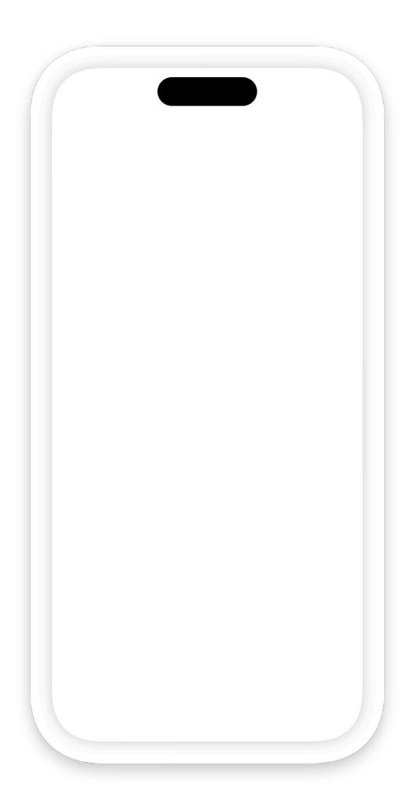

**Provide summaries of the customer's subscriptions.** In particular, people appreciate viewing the upcoming renewal date without having to search for it. Consider displaying this information in a settings or account screen, near the subscription-management option. For developer guidance, see *[Product.SubscriptionInfo](https://developer.apple.com/documentation/StoreKit/Product/SubscriptionInfo)*.

**Consider using the system-provided subscription-management UI.** Using StoreKit APIs lets you present a consistent experience that helps people manage or cancel their subscriptions without leaving your app. For developer guidance, see *[showManageSubscriptions\(in:\)](https://developer.apple.com/documentation/StoreKit/AppStore/showManageSubscriptions(in:))*.

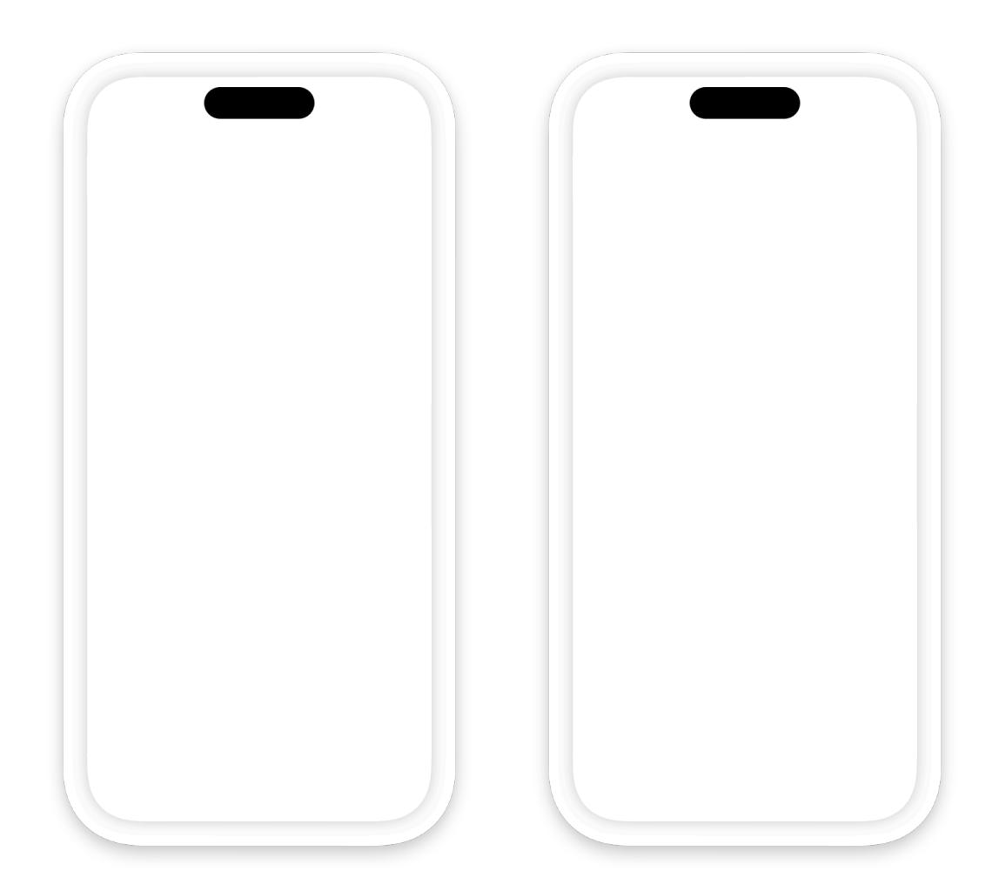

#### **Consider ways to encourage a subscriber to keep their subscription or resubscribe later.** When you use StoreKit APIs, your app is notified when someone chooses to cancel their subscription. In this scenario, you might want to extend a personalized offer as an alternative to cancellation or invite people to describe their reasons for canceling in an exit survey. In addition to giving you insights into various customer problems, survey feedback can also help inform messaging for retention and win-back strategies.

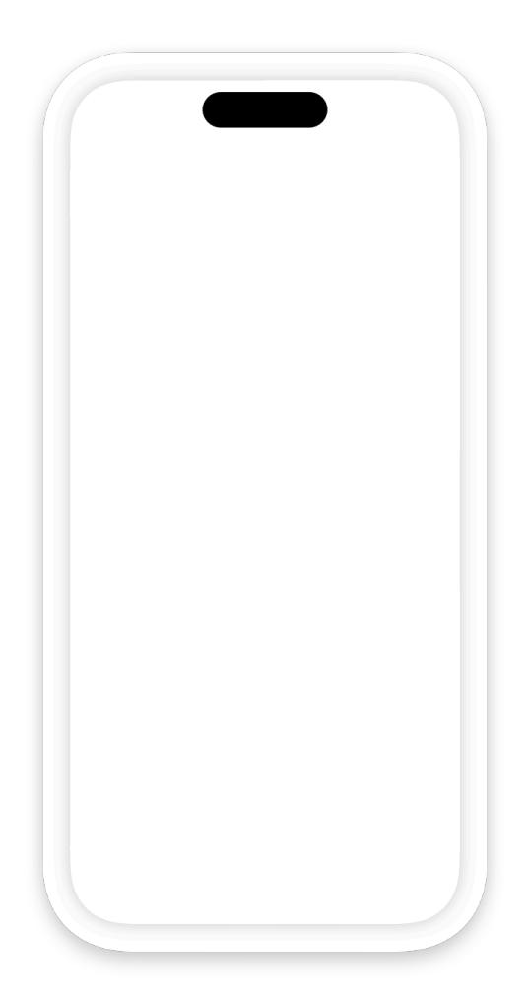

**Always make it easy for customers to cancel an auto-renewable subscription.** If the manage subscription action is deep within an app — or hard to recognize — subscribers can feel they're being discouraged or prevented from canceling.

**Consider creating a branded, contextual experience to complement the system-provided management UI.** Within your custom UI, you might offer a popular premium tier or provide personalized suggestions for alternative plans based on what you know about the customer's preferences or how they use your app. For example, you can create a promotional offer that provides a discounted price for a specific period of time. You might also consider subscription offer [codes](#page-8-0) to help you win back lapsed subscribers and encourage existing subscribers to upgrade.

# **Platform [considerations](#page-12-0)**

*No additional considerations for iOS, iPadOS, macOS, tvOS, or visionOS.*

### **[watchOS](#page-12-1)**

The sign-up screen in your watchOS app needs to display the same set of information about your subscription options that you display in other versions of your app. For the complete list of required items, see Making signup [effortless.](#page-6-0) The following guidelines can help you design a sign-up screen that feels at home on Apple Watch.

**Clearly describe the differences between versions of your app that run on different devices.** If your watchOS app supports different functionality or provides a subset of the content that's available on other devices, be sure to clarify these differences in your description. Be straightforward about the advantages of accessing subscription content through your watchOS app without implying that the experience is identical to the ones in other versions of your app.

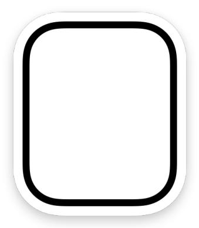

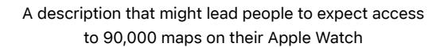

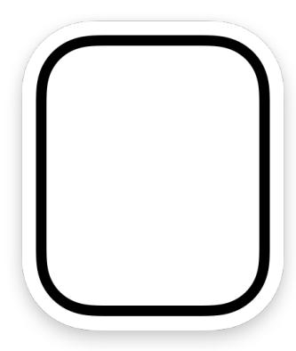

A description that clarifies how the subscription works on Apple Watch in contrast with other devices

**Consider using a modal sheet to display the required information.** After people respond to your call to action to learn more about your subscription offers, you can use a modal sheet to present all required items in a single view. Even though people must scroll the view to access all the information, displaying it in a modal sheet helps your app UI remain streamlined and concise. Also, a modal sheet's default Close button makes it easy for people to return to your free content with one tap. If you create a custom sign-up view instead of using a modal sheet, design a complete, efficient flow and include a Close or Cancel button that lets people return to your free content.

**Make subscription options easy to compare on a small screen.** People need to understand the terms of each subscription option before they can choose one. Aim to display the duration and discount information for each option in a compact way that's easy to scan and compare. Here are two ways you might present subscription options in your watchOS app:

- Display each option in a separate button. Using one button per payment option lets people start the signup process with one tap. In this design, it's important to lock up each button with its description so that people can see how these elements are related, especially while scrolling.
- Display a list of options, followed by a button people tap to start the signup process. Using a list to display one option per row gives you a compact design that minimizes scrolling while making subscription choices easy to scan and understand. In this design, the button's title can update to reflect the chosen option.

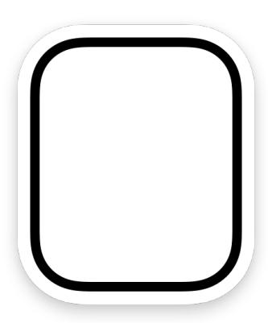

One payment option per button One payment option per list row, followed by a button that updates to display the chosen option

## **[Resources](#page-14-0)**

#### **[Related](#page-14-2)**

In-App [Purchase](https://developer.apple.com/in-app-purchase/)

Offering [Subscriptions](https://developer.apple.com/app-store/subscriptions/)

App Review [Guidelines](https://developer.apple.com/app-store/review/guidelines/)

#### **Developer [documentation](#page-14-3)**

In-App [Purchase](https://developer.apple.com/documentation/StoreKit/in-app-purchase) — StoreKit

#### **[Videos](#page-14-4)**

**What's new in StoreKit and In-App [Purchase](https://developer.apple.com/videos/play/wwdc2024/10061)**

# **[Change](#page-14-1) log**

| Date               | Changes                                                                                                                                  |
|--------------------|------------------------------------------------------------------------------------------------------------------------------------------|
| September 12, 2023 | Updated artwork and guidance for redeeming offer codes.                                                                               |
| November 3, 2022   | Added a guideline for displaying the total billing price for every in-app purchase item and consolidated guid‐ ance into one page. |