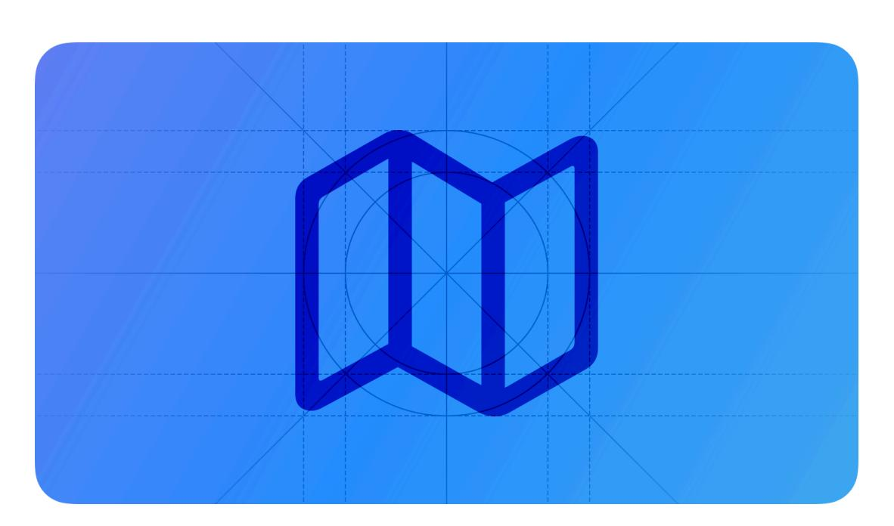
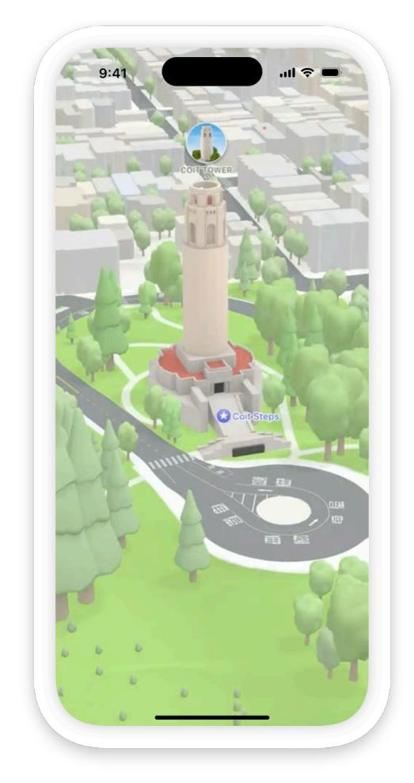
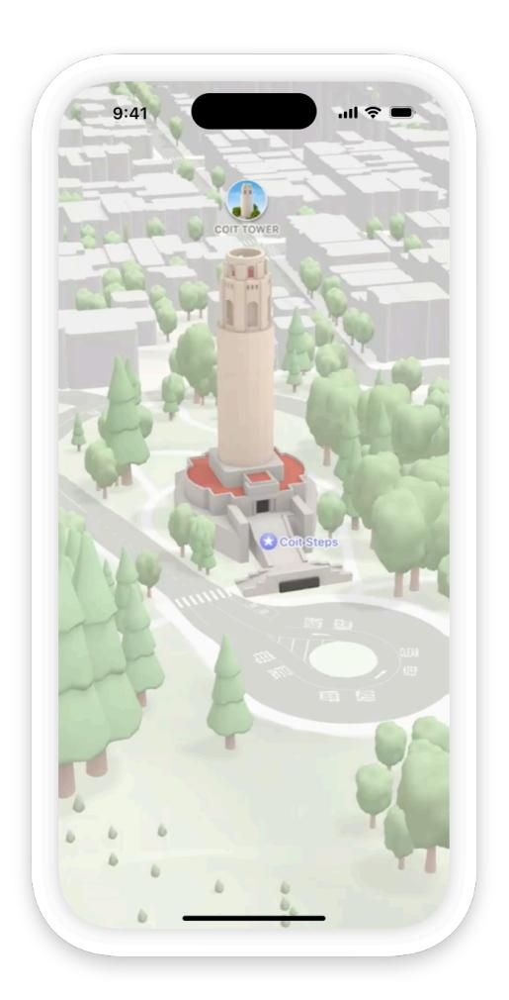
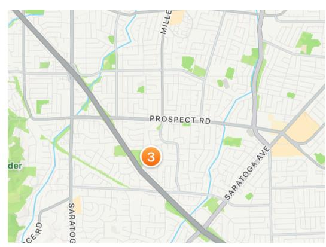
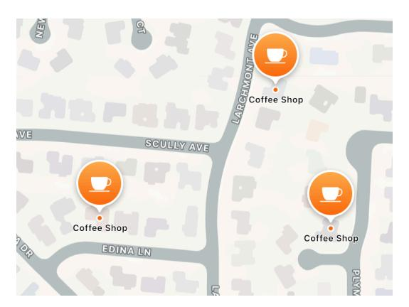
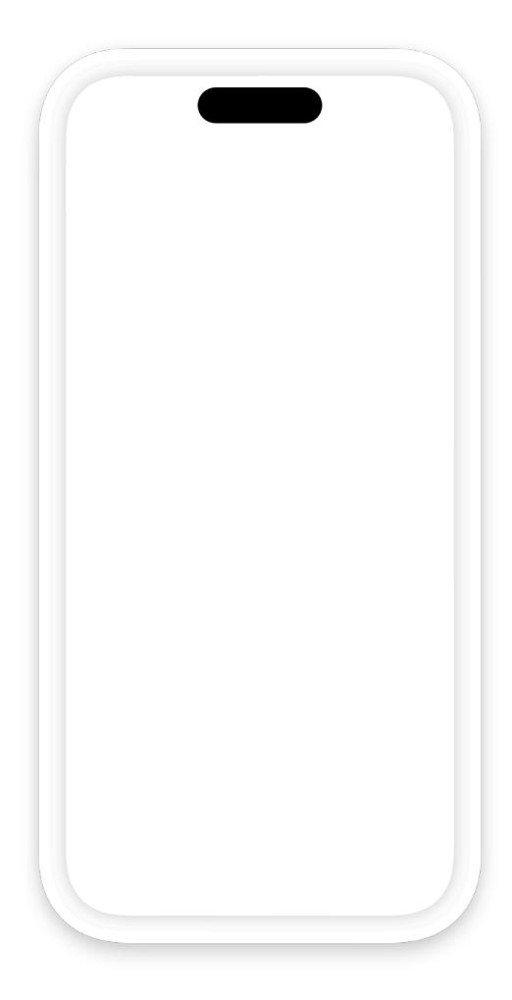
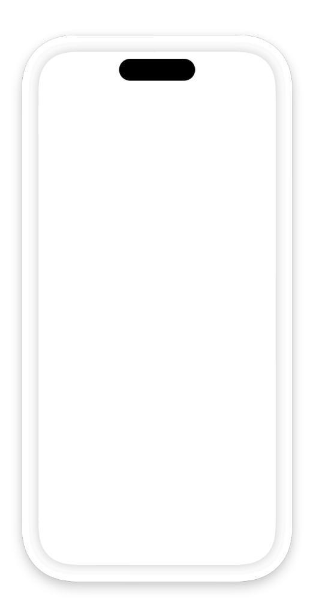
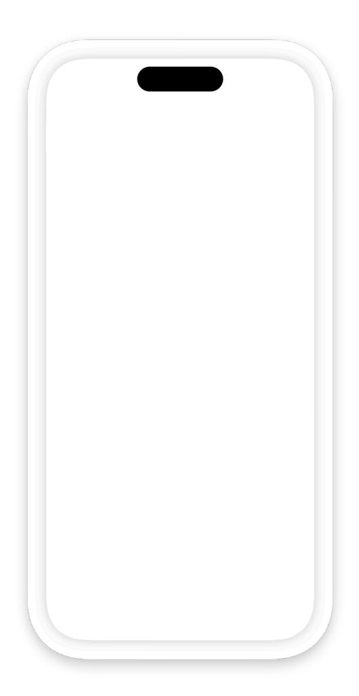
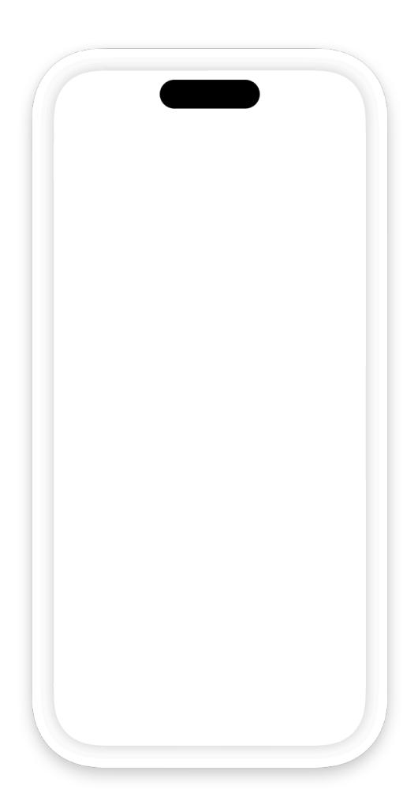
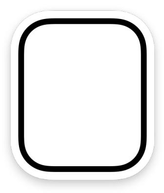

**[Design](https://developer.apple.com/design/)** [Overview](https://developer.apple.com/design/) [What's](https://developer.apple.com/design/whats-new/) New Get [Started](https://developer.apple.com/design/get-started/) [Guidelines](https://developer.apple.com/design/human-interface-guidelines) [Resources](https://developer.apple.com/design/resources/)

# **Maps**

A map displays outdoor or indoor geographical data in your app or on your website.

**Supported platforms**

#### [Maps](#page-0-1)

Best [practices](#page-0-0) Custom [information](#page-2-0) Place [cards](#page-2-1) [Indoor](#page-5-0) maps Platform [considerations](#page-9-0) [Resources](#page-11-0)

[Change](#page-11-1) log

A map uses a familiar interface that supports much of the same functionality as the systemprovided Maps app, such as zooming, panning, and rotation. A map can also include annotations and overlays and show routing information, and you can configure it to use a standard graphical view, a satellite image-based view, or a view that's a hybrid of both.

### **Best [practices](#page-0-0)**

**In general, make your map interactive.** People expect to be able to zoom, pan, and otherwise interact with maps in familiar ways. Noninteractive elements that obscure the map can interfere with people's expectations for how maps behave.

**Pick a map emphasis style that suits the needs of your app.** There are two emphasis styles to choose from:

- The *default* style presents a version of the map with fully saturated colors, and is a good option for most standard map applications without a lot of custom elements. This style is also useful for keeping visual alignment between your map and the Maps app, in situations when people might switch between them.
- The *muted* style, by contrast, presents a desaturated version of the map. This style is great if you have a lot of information-rich content that you want to stand out against the map.

Default style Muted style

For developer guidance, see *[MKStandardMapConfiguration.EmphasisStyle](https://developer.apple.com/documentation/MapKit/MKStandardMapConfiguration/EmphasisStyle-swift.enum)*.

**Help people find places in your map.** Consider offering a search feature combined with a way to filter locations by category. The search field for a shopping mall map, for example, might include filters that make it easy to find common store types, like clothing, housewares, electronics, jewelry, and toys.

**Clearly identify elements that people select.** When someone selects a specific area or other element on the map, use distinct styling like an outline and color variation to call attention to the selection.

**Cluster overlapping points of interest to improve map legibility.** A *cluster* uses a single pin to represent multiple points of interest within close proximity. As people zoom in on a map, clusters expand to progressively reveal individual points of interest.

Points of interest in a cluster Individual points of interest when zoomed in

**Help people see the Apple logo and legal link.** It's fine when parts of your interface temporarily cover the logo and link, but don't cover these elements all the time. Follow these guidelines to help keep the Apple logo and legal link visible:

- Use adequate padding to separate the logo and link from the map boundaries and your custom controls. For example, it works well to use 7 points of padding on the sides of the elements and 10 points above and below them.
- Avoid causing the logo and link to move with your interface. It's best when the Apple logo and legal link appear to be fixed to the map.
- If your custom interface can move relative to the map, use the lowest position of the custom element to determine the placement of the logo and link. For example, if your app lets people pull up a custom card from the bottom of the screen, place the Apple logo and legal link 10 points above the lowest resting position of the card.

**Note**

The Apple logo and legal link aren't shown on maps that are smaller than 200x100 pixels.

# **Custom [information](#page-2-0)**

**Use annotations that match the visual style of your app.** Annotations identify custom points of interest on your map. The default annotation marker has a red tint and a white pin icon. You can change the tint to match the color scheme of your app. You can also change the icon to a string or image, like a logo. An icon string can contain any characters, including Unicode characters, but keep it to two to three characters in length for readability. For developer guidance, see *[MKAnnotationView](https://developer.apple.com/documentation/MapKit/MKAnnotationView)*.

**If you want to display custom information that's related to standard map features, consider making them independently selectable.** When you support selectable map features, the system treats Apple-provided features (including points of interest, territories, and physical features) independently from other annotations that you add. You can configure custom appearances and information to represent these features when people select them. For developer guidance, see *[MKMapFeatureOptions](https://developer.apple.com/documentation/MapKit/MKMapFeatureOptions)*.

**Use overlays to define map areas with a specific relationship to your content.**

- *Above roads*, the default level, places the overlay above roads but below buildings, trees, and other features. This is great for situations where you want people to have an idea of what's below the overlay, while still clearly understanding that it's a defined space.
- *Above labels* places the overlay above both roads and labels, hiding everything beneath it. This is useful for content that you want to be fully abstracted from the features of the map, or when you want to hide areas of the map that aren't relevant.

For developer guidance, see [Displaying](https://developer.apple.com/documentation/MapKit/displaying-overlays-on-a-map) overlays on a map and *[MKOverlayLevel](https://developer.apple.com/documentation/MapKit/MKOverlayLevel)*.

**Make sure there's enough contrast between custom controls and the map.** Insufficient contrast makes controls hard to see and can cause them to blend in with the map. Consider using a thin stroke or light drop shadow to help a custom control stand out, or applying blend modes to the map area to increase its contrast with the controls atop it.

## **Place [cards](#page-2-1)**

Place cards display rich place information in your app or website, such as operating hours, phone numbers, addresses, and more. This enables you to provide structured and up-to-date information for places that you specify, and add depth to search results.

### **[Displaying](#page-3-0) place cards in a map**

You can present a place card that appears directly in your map anytime someone selects a place. This is a great way to provide place information in a map with multiple places that you specify, like a map of bookstores that an author plans to visit on their book signing tour. For developer guidance, see *[mapItemDetailSelectionAccessory\(\\_:\)](https://developer.apple.com/documentation/MapKit/MapContent/mapItemDetailSelectionAccessory(_:))*, *[mapView\(\\_:](https://developer.apple.com/documentation/MapKit/MKMapViewDelegate/mapView(_:selectionAccessoryFor:)) [selectionAccessoryFor:\)](https://developer.apple.com/documentation/MapKit/MKMapViewDelegate/mapView(_:selectionAccessoryFor:))*, and *[selectionAccessory](https://developer.apple.com/documentation/MapKitJS/Annotation/selectionAccessory)*.

You can also display place cards for other places on a map, such as points of interest, territories, and physical features, to provide valuable context to people about nearby places. For developer guidance, see *[mapFeatureSelectionAccessory\(\\_:\)](https://developer.apple.com/documentation/SwiftUI/View/mapFeatureSelectionAccessory(_:))*, *[mapView\(\\_:selection](https://developer.apple.com/documentation/MapKit/MKMapViewDelegate/mapView(_:selectionAccessoryFor:)) [AccessoryFor:\)](https://developer.apple.com/documentation/MapKit/MKMapViewDelegate/mapView(_:selectionAccessoryFor:))*, and *[selectableMapFeatureSelectionAccessory](https://developer.apple.com/documentation/MapKitJS/Map/selectableMapFeatureSelectionAccessory)*.

#### **Developer note**

In websites, you can embed a custom map that displays a place card by default for a single place that you specify. For developer guidance, see Displaying place [information](https://developer.apple.com/documentation/MapKitJS/displaying-place-information-using-the-maps-embed-api) using the Maps [Embed](https://developer.apple.com/documentation/MapKitJS/displaying-place-information-using-the-maps-embed-api) API.

The system defines several place card styles, which specify the size, appearance, and information included in a place card.

- The *automatic* style lets the system determine the place card style based on the size of your map view.
- The *callout* style displays a place card in a popover style next to the selected place. You can further specify the style of a callout — the *full* callout style displays a large, detailed place card, and the *compact* callout style displays a space-saving, more concise place card. If you don't specify a callout style, the system defaults to the *automatic* callout style, which determines the callout style based on your map's view size.
- The *caption* style displays an "Open in Apple Maps" link.
- The *sheet* style displays a place card in a [sheet.](https://developer.apple.com/design/human-interface-guidelines/sheets)

For developer guidance, see *[MapItemDetailSelectionAccessoryStyle](https://developer.apple.com/documentation/MapKit/MapItemDetailSelectionAccessoryStyle)*, *[MKSelection](https://developer.apple.com/documentation/MapKit/MKSelectionAccessory/MapItemDetailPresentationStyle) [Accessory.MapItemDetailPresentationStyle](https://developer.apple.com/documentation/MapKit/MKSelectionAccessory/MapItemDetailPresentationStyle)*, and *[PlaceSelectionAccessory](https://developer.apple.com/documentation/MapKitJS/PlaceSelectionAccessoryStyle) [Style](https://developer.apple.com/documentation/MapKitJS/PlaceSelectionAccessoryStyle)*.

Full callout Compact callout Caption Sheet

Full callout style place cards appear differently depending on a person's device. The system presents the full callout style place card in a popover style in iPadOS and macOS, and as a [sheet](https://developer.apple.com/design/human-interface-guidelines/sheets) in iOS.

**Consider your map presentation when choosing a style.** The full callout style place card offers people the richest experience, presenting them with the most information about a place directly

in your map. However, be sure to choose a place card style that fits in the context of your map. For example, if your app displays a small map with many annotations, consider using the compact callout style for a space-saving presentation that shows place information while maintaining the context of the other places that you specify in your map.

**Make sure your place card looks great on different devices and window sizes.** If you choose to specify a style, ensure that the content in your place card remains viewable on different devices and as window sizes change. For full callout style place cards, you can set a minimum width to prevent text from overflowing on smaller devices.

**Avoid duplicating information.** Consider what information you already display in your app or website when you choose a place card style. For example, the full callout style place card might display information that your app already shows. In this case, the compact callout or caption style might be a better complement.

**Keep the location on your map visible when displaying a place card.** This helps people maintain a sense of where the location is on your map while getting detailed place information. You can set an offset distance for your place card and point it to the selected location. For developer guidance, see *[offset\(\\_:\)](https://developer.apple.com/documentation/SwiftUI/View/offset(_:))*, *[accessoryOffset](https://developer.apple.com/documentation/MapKit/MKAnnotationView/accessoryOffset)*, and *[selectionAccessory](https://developer.apple.com/documentation/MapKitJS/Annotation/selectionAccessoryOffset) [Offset](https://developer.apple.com/documentation/MapKitJS/Annotation/selectionAccessoryOffset)*.

### **Adding place cards [outside](#page-5-1) of a map**

You can also display place information outside of a map in your app or website. For example, you might want to display a list of places rather than a map, like in search results or a store locator, and present a place card when people select one. For developer guidance, see *[mapItem](https://developer.apple.com/documentation/MapKit/MapContent/mapItemDetailSelectionAccessory(_:)) [DetailSelectionAccessory\(\\_:\)](https://developer.apple.com/documentation/MapKit/MapContent/mapItemDetailSelectionAccessory(_:))*, *[mapItemDetail\(\\_:\)](https://developer.apple.com/documentation/MapKit/MKSelectionAccessory/mapItemDetail(_:))*, and *[PlaceDetail](https://developer.apple.com/documentation/MapKitJS/PlaceDetail)*.

#### **Important**

If you don't display a place card directly within a map view, you must include a map in the place card. For developer guidance, see *[mapItemDetailSheet\(item:displaysMap:\)](https://developer.apple.com/documentation/SwiftUI/View/mapItemDetailSheet(item:displaysMap:))* and *[init\(mapItem:displaysMap:\)](https://developer.apple.com/documentation/MapKit/MKMapItemDetailViewController/init(mapItem:displaysMap:))*.

**Use location-related cues in surrounding content to help communicate that people can open a place card.** For example, you can display place names and addresses alongside a button for more details to help indicate that people can interact with it to get place information. For a space-efficient design, you can include a map pin icon with a place name to help communicate that people can open a place card.

# **[Indoor](#page-5-0) maps**

Apps connected with specific venues like shopping malls and stadiums can design custom interactive maps that help people locate and navigate to indoor points of interest. Indoor maps can include overlays that highlight specific areas, such as rooms, kiosks, and other locations. They can also include text labels, icons, and routes.

Example 1 Example 2 Example 3

**Adjust map detail based on the zoom level.** Too much detail can cause a map to appear cluttered. Show large areas like rooms and buildings at all zoom levels. Then, progressively add more detailed features and labels as the map is zoomed in. An airport map might show only terminals and gates when zoomed out, but reveal individual stores and restrooms when zoomed in.

**Use distinctive styling to differentiate the features of your map.** Using color along with icons can help distinguish different types of areas, stores, and services, and make it easy for people to quickly find what they're looking for.

**Offer a floor picker if your venue includes multiple levels.** A floor picker lets people quickly jump between floors. If you implement this feature, keep floor numbers concise for simplicity. In most cases, a list of floor numbers — rather than floor names — is sufficient.

**Include surrounding areas to provide context.** Adjacent streets, playgrounds, and other nearby locations can all help orient people when they use your map. If these areas are noninteractive, use dimming and a distinct color to make them appear supplemental.

**Consider supporting navigation between your venue and nearby transit points.** Make it easy to enter and exit your venue by offering routing to and from nearby bus stops, train stations, parking lots, garages, and other transit locations. You might also offer a way for people to quickly switch over to Apple Maps for additional navigation options.

**Limit scrolling outside of your venue.** This can help people avoid getting lost when they swipe too hard on your map. When possible, keep at least part of your indoor map visible onscreen at all times. To help people stay oriented, you may need to adjust the amount of scrolling you permit based on the zoom level.

**Design an indoor map that feels like a natural extension of your app.** Don't try to replicate the appearance of Apple Maps. Instead, make sure area overlays, icons, and text match the visual style of your app. For guidance, see Indoor [Mapping](https://register.apple.com/resources/imdf/) Data Format.

# **Platform [considerations](#page-9-0)**

*No additional considerations for iOS, iPadOS, macOS, tvOS, or visionOS.*

### **[watchOS](#page-9-1)**

On Apple Watch, maps are static snapshots of geographic locations. Place a map in your interface at design time and show the appropriate region at runtime. The displayed region isn't interactive; tapping it opens the Maps app on Apple Watch. You can add up to five annotations to a map to highlight points of interest or other relevant information. For developer guidance, see *[WKInterfaceMap](https://developer.apple.com/documentation/WatchKit/WKInterfaceMap)*.

**Fit the map interface element to the screen.** The entire element needs to be visible on the Apple Watch display without requiring scrolling.

**Show the smallest region that encompasses the points of interest.** The content within a map interface element doesn't scroll, so all key content must be visible within the displayed region.

For developer guidance, see *[WKInterfaceMap](https://developer.apple.com/documentation/WatchKit/WKInterfaceMap)*.

### **[Resources](#page-11-0)**

#### **Developer [documentation](#page-11-2)**

[MapKit](https://developer.apple.com/documentation/MapKit)

[MapKit](https://developer.apple.com/documentation/MapKitJS) JS

Indoor [Mapping](https://register.apple.com/resources/imdf/) Data Format

#### **[Videos](#page-11-3)**

**Go further with [MapKit](https://developer.apple.com/videos/play/wwdc2025/204) Unlock the power of places with [MapKit](https://developer.apple.com/videos/play/wwdc2024/10097)**

### **[Change](#page-11-1) log**

| Date               | Changes                                                                                                                    |
|--------------------|----------------------------------------------------------------------------------------------------------------------------|
| December 18, 2024  | Added guidance for place cards and included addi‐ tional artwork.                                                       |
| September 12, 2023 | Added artwork.                                                                                                             |
| September 23, 2022 | Added guidelines for presenting custom information, refined best practices, and consolidated guidance into one page. |