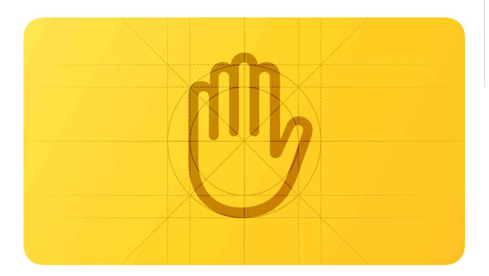
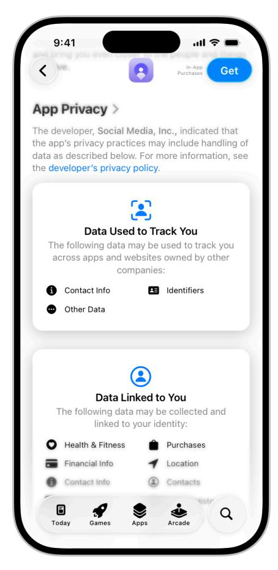
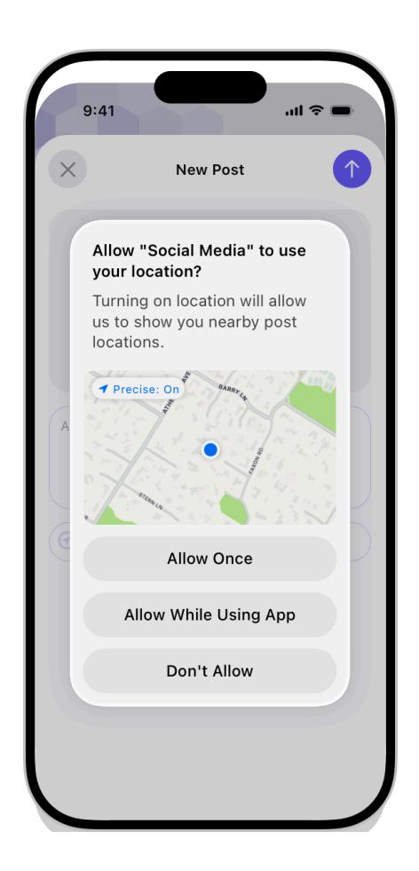
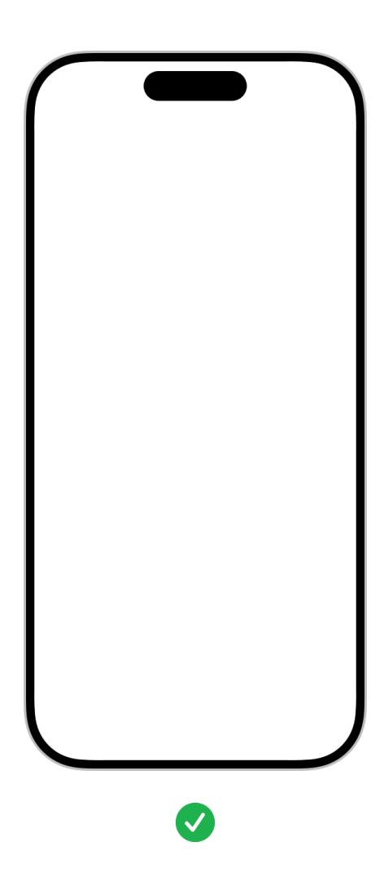
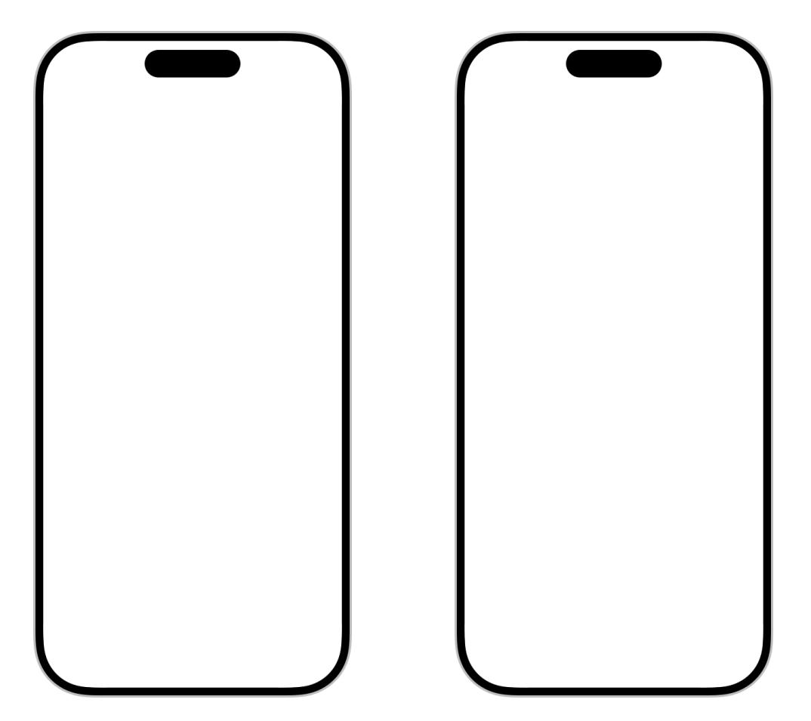
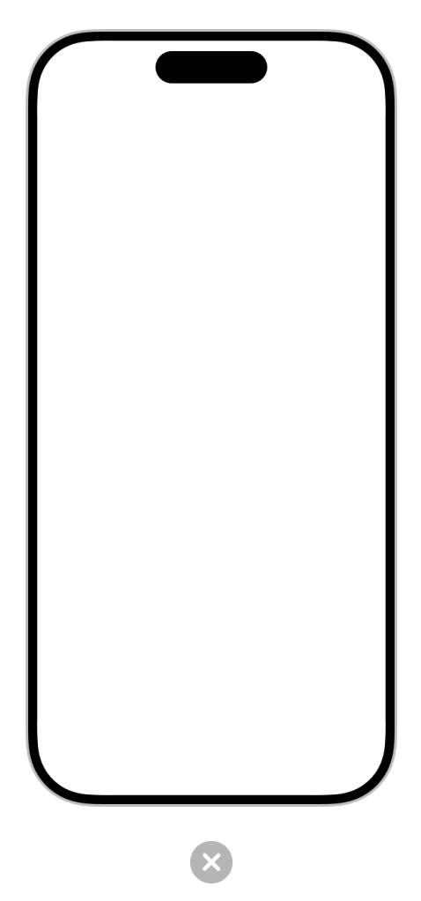
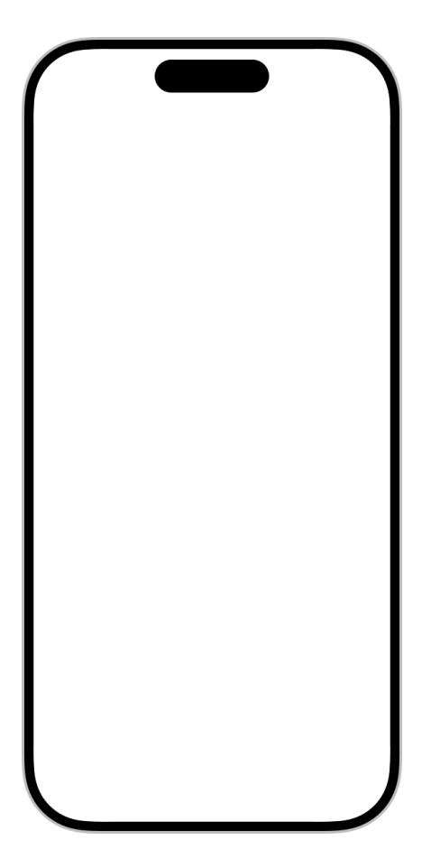
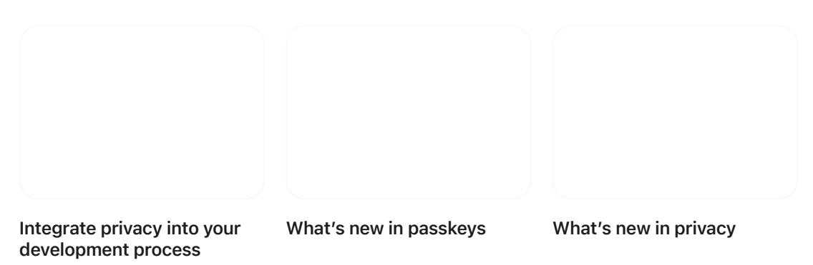

**[Design](https://developer.apple.com/design/)** [Overview](https://developer.apple.com/design/) [What's](https://developer.apple.com/design/whats-new/) New Get [Started](https://developer.apple.com/design/get-started/) [Guidelines](https://developer.apple.com/design/human-interface-guidelines) [Resources](https://developer.apple.com/design/resources/)

# **Privacy**

Privacy is paramount: it's critical to be transparent about the privacy-related data and resources you require and essential to protect the data people allow you to access.

**Supported platforms**

[Privacy](#page-0-0) Best [practices](#page-1-0) [Requesting](#page-1-1) permission [Location](#page-5-0) button [Protecting](#page-7-0) data Platform [considerations](#page-7-1) [Resources](#page-9-0) [Change](#page-9-1) log

People use their devices in very personal ways and they expect apps to help them preserve their privacy.

When you submit a new or updated app, you must provide details about your privacy practices and the privacy-relevant data you collect so the App Store can display the information on your product page. (You can manage this information at any time in App Store [Connect.](https://help.apple.com/app-store-connect/#/dev1b4647c5b)) People use the privacy details on your product page to make an informed decision before they download your app. To learn more, see App [privacy](https://developer.apple.com/app-store/app-privacy-details/) details on the App Store.

An app's App Store product page helps people understand the app's privacy practices before they download it.

# **Best [practices](#page-1-0)**

**Request access only to data that you actually need.** Asking for more data than a feature needs — or asking for data before a person shows interest in the feature — can make it hard for people to trust your app. Give people precise control over their data by making your permission requests as specific as possible.

**Be transparent about how your app collects and uses people's data.** People are less likely to be comfortable sharing data with your app if they don't understand exactly how you plan to use it. Always respect people's choices to use system features like Hide My Email and Mail Privacy Protection, and be sure you understand your obligations with regard to app tracking. To learn more about Apple privacy features, see [Privacy](https://www.apple.com/privacy/); for developer guidance, see User [privacy](https://developer.apple.com/app-store/user-privacy-and-data-use/) and [data](https://developer.apple.com/app-store/user-privacy-and-data-use/) use.

**Process data on the device where possible.** In iOS, for example, you can take advantage of the Apple Neural Engine and custom CreateML models to process the data right on the device, helping you avoid lengthy and potentially risky round trips to a remote server.

**Adopt system-defined privacy protections and follow security best practices.** For example, in iOS 15 and later, you can rely on CloudKit to provide encryption and key management for additional data types, like strings, numbers, and dates.

# **[Requesting](#page-1-1) permission**

Here are several examples of the things you must request permission to access:

Personal data, including location, health, financial, contact, and other personally identifying information

- User-generated content like emails, messages, calendar data, contacts, gameplay information, Apple Music activity, HomeKit data, and audio, video, and photo content
- Protected resources like Bluetooth peripherals, home automation features, Wi-Fi connections, and local networks
- Device capabilities like camera and microphone
- In a visionOS app running in a Full Space, ARKit data, such as hand tracking, plane estimation, image anchoring, and world tracking
- The device's advertising identifier, which supports app tracking

The system provides a standard alert that lets people view each request you make. You supply copy that describes why your app needs access, and the system displays your description in the alert. People can also view the description — and update their choice — in Settings > Privacy.

**Request permission only when your app clearly needs access to the data or resource.** It's natural for people to be suspicious of a request for personal information or access to a device capability, especially if there's no obvious need for it. Ideally, wait to request permission until people actually use an app feature that requires access. For example, you can use the [location](#page-5-0) [button](#page-5-0) to give people a way to share their location after they indicate interest in a feature that needs that information.

**Avoid requesting permission at launch unless the data or resource is required for your app to function.** People are less likely to be bothered by a launch-time request when it's obvious why you're making it. For example, people understand that a navigation app needs access to their location before they can benefit from it. Similarly, before people can play a visionOS game that lets them bounce virtual objects off walls in their surroundings, they need to permit the game to access information about their surroundings.

**Write copy that clearly describes how your app uses the ability, data, or resource you're requesting.** The standard alert displays your copy (called a *purpose string* or *usage description string*) after your app name and before the buttons people use to grant or deny their permission. Aim for a brief, complete sentence that's straightforward, specific, and easy to understand. Use sentence case, avoid passive voice, and include a period at the end. For developer guidance, see [Requesting](https://developer.apple.com/documentation/UIKit/requesting-access-to-protected-resources) access to protected resources and App Tracking [Transparency](https://developer.apple.com/documentation/AppTrackingTransparency).

| Example purpose string                                        | Notes                                                                                      |
|---------------------------------------------------------------|--------------------------------------------------------------------------------------------|
| The app records during the night to detect snoring sounds. | An active sentence that clearly de‐ scribes how and why the app col‐ lects the data. |
| Microphone access is needed for a better experience.       | A passive sentence that provides a vague, undefined justification.                      |
| Turn on microphone access.                                    | An imperative sentence that doesn't provide any justification.                          |

Here are several examples of the standard system alert:

| Example 1 | Example 2 | Example 3 |
|-----------|-----------|-----------|
|           |           |           |

### **Pre-alert screens, [windows,](#page-3-0) or views**

Ideally, the current context helps people understand why you're requesting their permission. If it's essential to provide additional details, you can display a custom screen or window before the system alert appears. The following guidelines apply to custom views that display before system alerts that request permission to access protected data and resources, including camera, microphone, location, contact, calendar, and tracking.

**Include only one button and make it clear that it opens the system alert.** People can feel manipulated when a custom screen or window also includes a button that doesn't open the alert because the experience diverts them from making their choice. Another type of manipulation is using a term like "Allow" to title the custom screen's button. If the custom button seems similar in meaning and visual weight to the allow button in the alert, people can be more likely to choose the alert's allow button without meaning to. Use a term like "Continue" or "Next" to title the single button in your custom screen or window, clarifying that its action is to open the system alert.

**Don't include additional actions in your custom screen or window.** For example, don't provide a way for people to leave the screen or window without viewing the system alert — like offering an option to close or cancel.

#### **Tracking [requests](#page-5-1)**

App tracking is a sensitive issue. In some cases, it might make sense to display a custom screen or window that describes the benefits of tracking. If you want to perform app tracking as soon as people launch your app, you must display the system-provided alert before you collect any tracking data.

**Never precede the system-provided alert with a custom screen or window that could confuse or mislead people.** People sometimes tap quickly to dismiss alerts without reading them. A custom messaging screen, window, or view that takes advantage of such behaviors to influence choices will lead to rejection by App Store review.

There are several prohibited custom-screen designs that will cause rejection. Some examples are offering incentives, displaying a screen or window that looks like a request, displaying an image of the alert, and annotating the screen behind the alert (as shown below). To learn more, see App Review [Guidelines:](https://developer.apple.com/app-store/review/guidelines/#data-collection-and-storage) 5.1.1 (iv).

Imitation request Alert image Alert annotation Incentive

Don't offer incentives for granting the request. You can't offer people compensation for granting their permission, and you can't withhold functionality or content or make your app unusable until people allow you to track them.

In iOS, iPadOS, and watchOS, Core Location provides a button so people can grant your app temporary authorization to access their location at the moment a task needs it. A location button's appearance can vary to match your app's UI and it always communicates the action of location sharing in a way that's instantly recognizable.

The first time people open your app and tap a location button, the system displays a standard alert. The alert helps people understand how using the button limits your app's access to their location, and reminds them of the location indicator that appears when sharing starts.

After people confirm their understanding of the button's action, simply tapping the location button gives your app one-time permission to access their location. Although each one-time authorization expires when people stop using your app, they don't need to reconfirm their understanding of the button's behavior.

#### **Note**

If your app has no authorization status, tapping the location button has the same effect as when a person chooses *Allow Once* in the standard alert. If people previously chose *While Using the App*, tapping the location button doesn't change your app's status. For developer guidance, see *[LocationButton](https://developer.apple.com/documentation/CoreLocationUI/LocationButton)* (SwiftUI) and *[CLLocationButton](https://developer.apple.com/documentation/CoreLocationUI/CLLocationButton)* (Swift).

**Consider using the location button to give people a lightweight way to share their location for specific app features.** For example, your app might help people attach their location to a message or post, find a store, or identify a building, plant, or animal they've encountered in their location. If you know that people often grant your app *Allow Once* permission, consider using the location button to help them benefit from sharing their location without having to repeatedly interact with the alert.

**Consider customizing the location button to harmonize with your UI.** Specifically, you can:

- Choose the system-provided title that works best with your feature, such as "Current Location" or "Share My Current Location."
- Choose the filled or outlined location glyph.
- Select a background color and a color for the title and glyph.
- Adjust the button's corner radius.

To help people recognize and trust location buttons, you can't customize the button's other visual attributes. The system also ensures a location button remains legible by warning you about problems like low-contrast color combinations or too much translucency. In addition to fixing such problems, you're responsible for making sure the text fits in the button — for example, button text needs to fit without truncation at all accessibility text sizes and when translated into other languages.

#### **Important**

If the system identifies consistent problems with your customized location button, it won't give your app access to the device location when people tap it. Although such a button can perform other app-specific actions, people may lose trust in your app if your location button doesn't work as they expect.

# **[Protecting](#page-7-0) data**

Protecting people's information is paramount. Give people confidence in your app's security and help preserve their privacy by taking advantage of system-provided security technologies when you need to store information locally, authorize people for specific operations, and transport information across a network.

Here are some high-level guidelines.

**Avoid relying solely on passwords for authentication.** Where possible, use [passkeys](https://developer.apple.com/documentation/authenticationservices/public-private_key_authentication/supporting_passkeys/) to replace passwords. If you need to continue using passwords for authentication, augment security by requiring two-factor authentication (for developer guidance, see [Securing](https://developer.apple.com/documentation/AuthenticationServices/securing-logins-with-icloud-keychain-verification-codes) Logins with iCloud Keychain [Verification](https://developer.apple.com/documentation/AuthenticationServices/securing-logins-with-icloud-keychain-verification-codes) Codes). To further protect access to apps that people keep logged in on their device, use biometric identification like Face ID, Optic ID, or Touch ID. For developer guidance, see Local [Authentication](https://developer.apple.com/documentation/LocalAuthentication).

**Store sensitive information in a keychain.** A keychain provides a secure, predictable user experience when handling someone's private information. For developer guidance, see [Keychain](https://developer.apple.com/documentation/Security/keychain-services) [services.](https://developer.apple.com/documentation/Security/keychain-services)

**Never store passwords or other secure content in plain-text files.** Even if you restrict access using file permissions, sensitive information is much safer in an encrypted keychain.

**Avoid inventing custom authentication schemes.** If your app requires authentication, prefer system-provided features like [passkeys](https://developer.apple.com/documentation/authenticationservices/public-private_key_authentication/supporting_passkeys/), Sign in with [Apple](https://developer.apple.com/design/human-interface-guidelines/sign-in-with-apple) or [Password](https://developer.apple.com/documentation/Security/password-autofill) AutoFill. For related guidance, see [Managing](https://developer.apple.com/design/human-interface-guidelines/managing-accounts) accounts.

# **Platform [considerations](#page-7-1)**

*No additional considerations for iOS, iPadOS, tvOS, or watchOS.*

**Sign your app with a valid Developer ID.** If you choose to distribute your app outside the store, signing your app with Developer ID identifies you as an Apple developer and confirms that your app is safe to use. For developer guidance, see [Xcode](https://developer.apple.com/go/?id=ios-app-distribution-guide) Help.

**Protect people's data with app sandboxing.** Sandboxing provides your app with access to system resources and user data while protecting it from malware. All apps submitted to the Mac App Store require sandboxing. For developer guidance, see [Configuring](https://developer.apple.com/documentation/Xcode/configuring-the-macos-app-sandbox) the macOS App [Sandbox.](https://developer.apple.com/documentation/Xcode/configuring-the-macos-app-sandbox)

**Avoid making assumptions about who is signed in.** Because of fast user switching, multiple people may be active on the same system.

### **[visionOS](#page-8-0)**

By default, visionOS uses ARKit algorithms to handle features like persistence, world mapping, segmentation, matting, and environment lighting. These algorithms are always running, allowing apps and games to automatically benefit from ARKit while in the Shared Space.

ARKit doesn't send data to apps in the Shared Space; to access ARKit APIs, your app must open a Full Space. Additionally, features like Plane Estimation, Scene Reconstruction, Image Anchoring, and Hand Tracking require people's permission to access any information. For developer guidance, see [Setting](https://developer.apple.com/documentation/visionOS/setting-up-access-to-arkit-data) up access to ARKit data.

In visionOS, user input is private by design. The system automatically displays hover effects when people look at interactive components you create using SwiftUI or RealityKit, giving people the visual feedback they need without exposing where they're looking before they tap. For guidance, see [Eyes](https://developer.apple.com/design/human-interface-guidelines/eyes) and [Gestures](https://developer.apple.com/design/human-interface-guidelines/gestures#visionOS) > visionOS.

Developer access to device cameras works differently in visionOS than it does in other platforms. Specifically, the back camera provides blank input and is only available as a compatibility convenience; the front camera provides input for spatial [Personas](https://developer.apple.com/design/human-interface-guidelines/shareplay#visionOS), but only after people grant their permission. If the iOS or iPadOS app you're bringing to visionOS includes a feature that needs camera access, remove it or replace it with an option for people to import content instead. For developer guidance, see Making your existing app [compatible](https://developer.apple.com/documentation/visionOS/making-your-app-compatible-with-visionos) with [visionOS](https://developer.apple.com/documentation/visionOS/making-your-app-compatible-with-visionos).

# **[Resources](#page-9-0)**

[Entering](https://developer.apple.com/design/human-interface-guidelines/entering-data) data

[Onboarding](https://developer.apple.com/design/human-interface-guidelines/onboarding)

#### **Developer [documentation](#page-9-3)**

[Requesting](https://developer.apple.com/documentation/UIKit/requesting-access-to-protected-resources) access to protected resources — UIKit

[Security](https://developer.apple.com/documentation/Security)

Requesting [authorization](https://developer.apple.com/documentation/CoreLocation/requesting-authorization-to-use-location-services) to use location services — CoreLocation

App Tracking [Transparency](https://developer.apple.com/documentation/AppTrackingTransparency)

#### **[Videos](#page-9-4)**

# **[Change](#page-9-1) log**

| Date          | Changes                                             |
|---------------|-----------------------------------------------------|
| June 21, 2023 | Consolidated guidance into new page and updated for |
|               |                                                     |

visionOS.