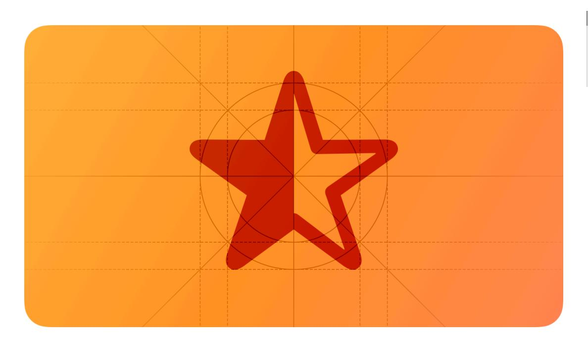
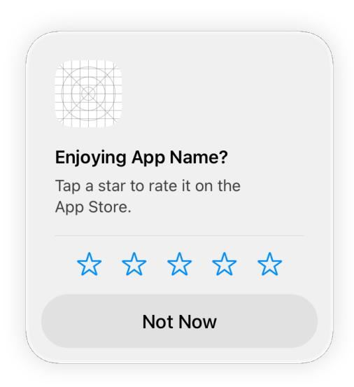

# **Ratings and reviews**

People often view the ratings and reviews for an app or game before they download it.

**Supported platforms**

Ratings and [reviews](#page-0-1) Best [practices](#page-0-0) Platform [considerations](#page-1-0) [Resources](#page-2-0) [Change](#page-2-1) log

Delivering a great overall experience is the best way to encourage positive ratings and reviews, but it's also crucial to choose the right time to ask people for feedback. Although every app is different, some possible ways to do this involve looking at how many times or how frequently people launch your app, the number of features someone explores, or the number of tasks they complete.

People can always rate your app within the App Store.

## **Best [practices](#page-0-0)**

**Ask for a rating only after people have demonstrated engagement with your app or game.**

For example, you might prompt people when they complete a game level or a significant task. Avoid asking for a rating on first launch or during onboarding, because people haven't had enough time to gain a clear understanding of your app's value or form an opinion. People may even be more likely to leave negative feedback if they feel an app is asking for a rating before they get a chance to use it.

**Avoid interrupting people while they're performing a task or playing a game.** Asking for feedback can disrupt the user experience and feel like a burden. Look for natural breaks or stopping points in your app or game where a rating request is less likely to be bothersome.

**Avoid pestering people.** Repeated rating requests can be irritating, and may even negatively influence people's opinion of your app. Consider allowing at least a week or two between requests, prompting again after people demonstrate additional engagement with your experience.

**Prefer the system-provided prompt.** iOS, iPadOS, and macOS offer a consistent, nonintrusive way for apps and games to request ratings and reviews. When you identify places in your experience where it makes sense to ask for feedback, the system checks for previous feedback and — if there isn't any — displays an in-app prompt that asks for a rating and an optional written review. People can supply feedback or dismiss the prompt with a single tap or click; they can also opt out of receiving these prompts for all apps they have installed. The system automatically limits the display of the prompt to three occurrences per app within a 365-day period. For developer guidance, see *[RequestReviewAction](https://developer.apple.com/documentation/StoreKit/RequestReviewAction)*.

**Weigh the benefits of resetting your summary rating against the potential disadvantage of showing fewer ratings.** When you release a new version of your app or game, you can reset the summary of individual ratings you received since the last reset. Although resetting means that the ratings reflect the current version, it also tends to result in having fewer ratings overall, which can discourage some people from downloading your app. For developer guidance, see Reset app [summary](https://help.apple.com/app-store-connect/#/devfb7e87af8) rating.

# **Platform [considerations](#page-1-0)**

*No additional considerations for iOS, iPadOS, macOS, tvOS, visionOS, or watchOS.*

### **[Resources](#page-2-0)**

#### **[Related](#page-2-2)**

Ratings, reviews, and [responses](https://developer.apple.com/app-store/ratings-and-reviews/)

#### **Developer [documentation](#page-2-3)**

*[RequestReviewAction](https://developer.apple.com/documentation/StoreKit/RequestReviewAction)* — StoreKit

## **[Change](#page-2-1) log**

| Date | Changes |
|------|---------|
|      |         |

September 12, 2023 Added artwork.