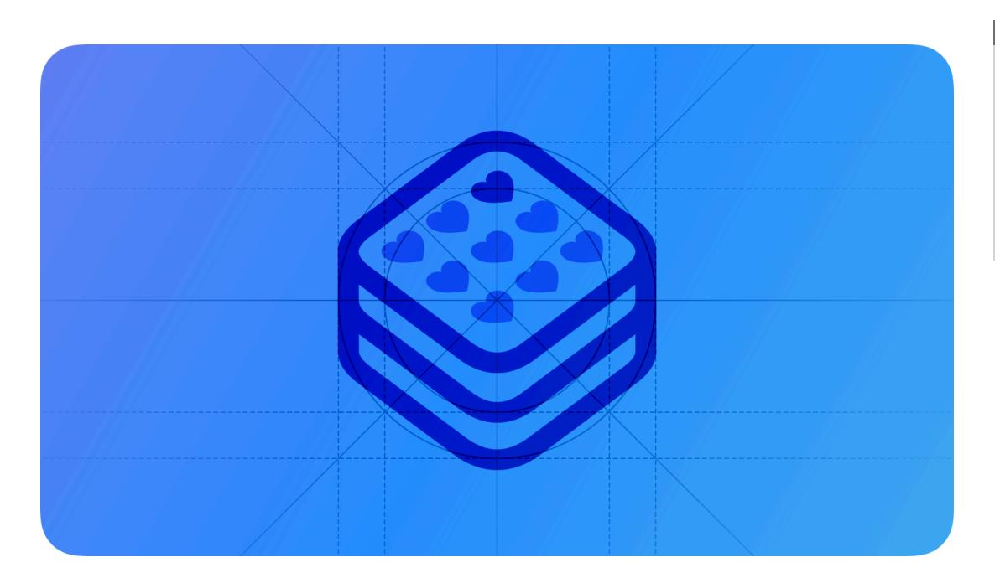
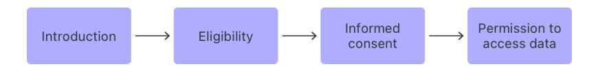
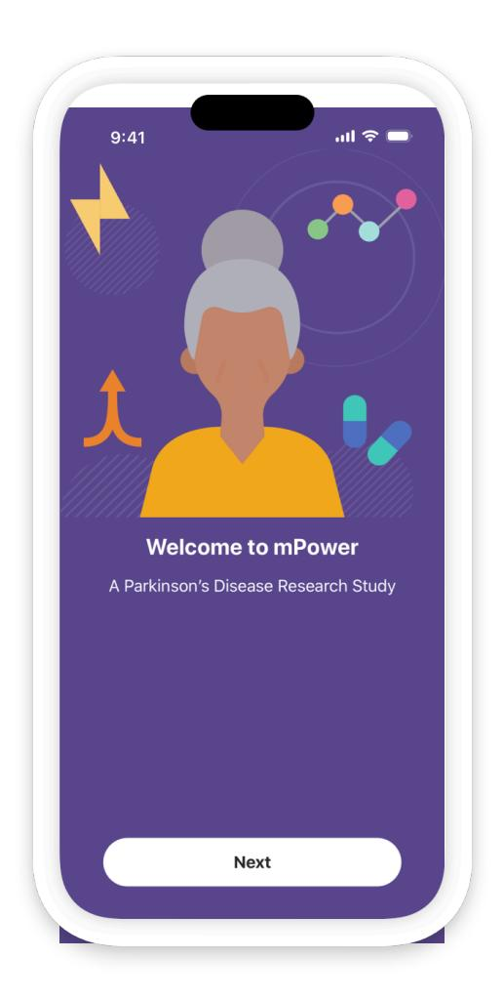
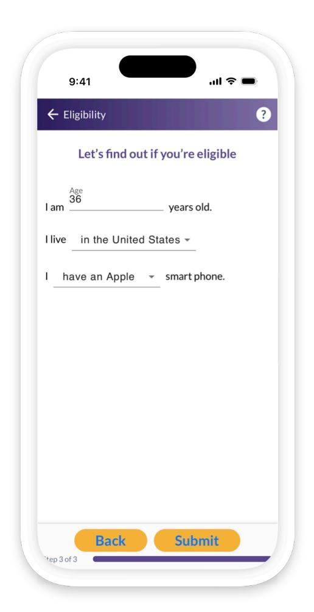
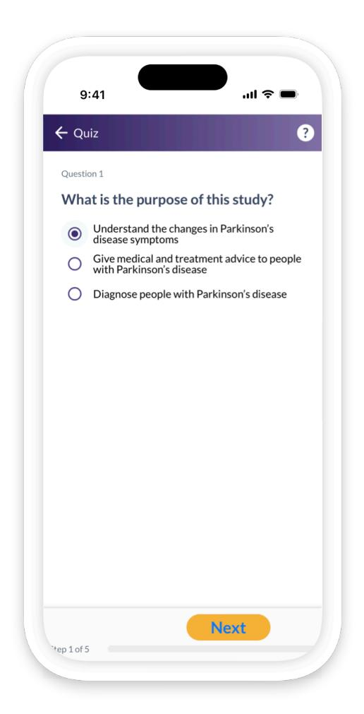
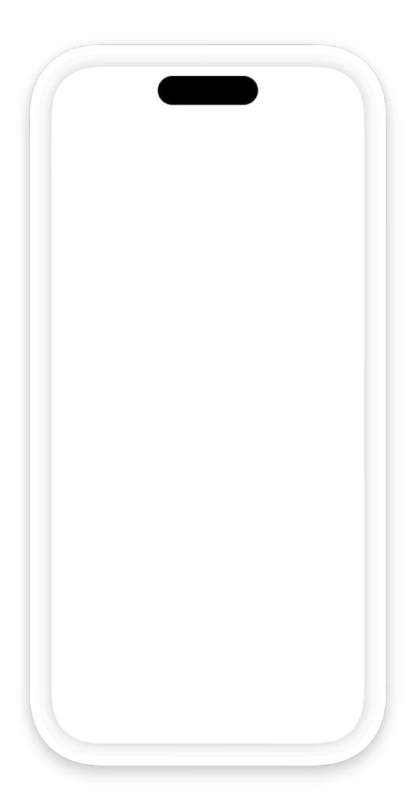
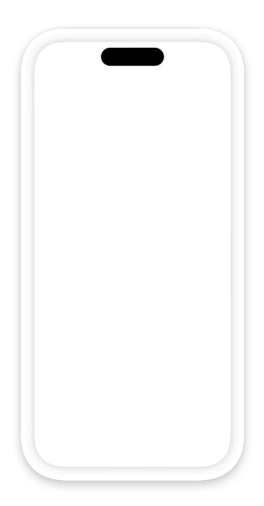
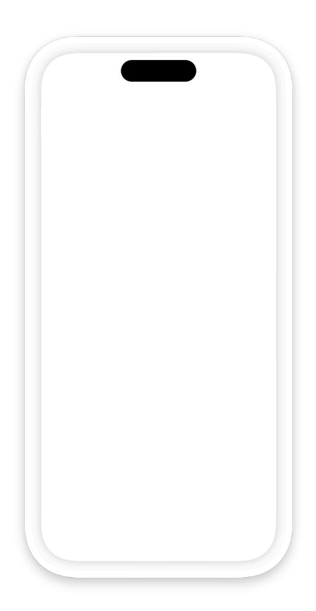
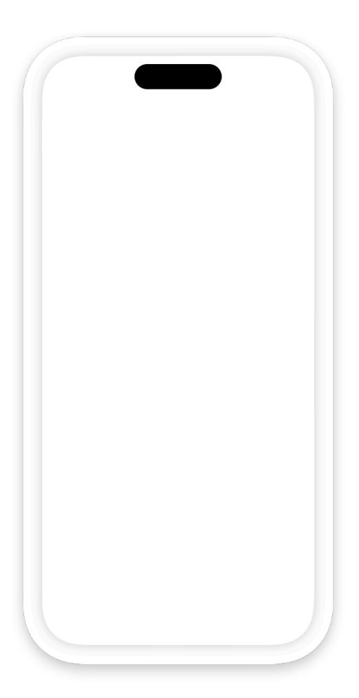
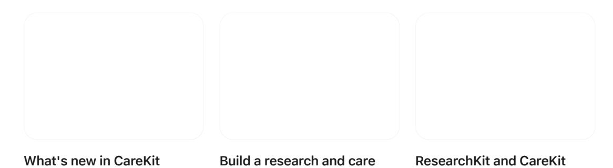

**[Design](https://developer.apple.com/design/)** [Overview](https://developer.apple.com/design/) [What's](https://developer.apple.com/design/whats-new/) New Get [Started](https://developer.apple.com/design/get-started/) [Guidelines](https://developer.apple.com/design/human-interface-guidelines) [Resources](https://developer.apple.com/design/resources/)

# **ResearchKit**

A research app lets people everywhere participate in important medical research studies.

**Supported platforms**

#### [ResearchKit](#page-0-2)

Creating the [onboarding](#page-0-0) experience [Conducting](#page-5-0) research Managing personal information and providing [encouragement](#page-7-0) Platform [considerations](#page-9-0) [Resources](#page-10-0) [Change](#page-10-1) log

The ResearchKit framework provides predesigned screens and transitions that make it easy to design and build an engaging custom research app. For developer guidance, see [Research](https://www.researchandcare.org/researchkit/) & Care > [ResearchKit.](https://www.researchandcare.org/researchkit/)

These guidelines are for informational purposes only and don't constitute legal advice. Contact an attorney to obtain advice with respect to the development of a research app and any applicable laws.

### **Creating the [onboarding](#page-0-0) experience**

When opening a research app for the first time, people encounter a series of screens that introduce them to the study, determine their eligibility to participate, request permission to proceed with the study, and, when appropriate, grant access to personal data. These screens aren't typically revisited once they've been completed, so clarity is essential.

**Always display the onboarding screens in the correct order.**

#### **1. [Introduction](#page-0-1)**

**Provide an introduction that informs and provides a call to action.** Clearly describe the subject and purpose of your study. Also allow existing participants to quickly log in and continue an in-

### **[2.Determine](#page-1-0) eligibility**

**Determine eligibility as soon as possible.** People don't need to move on to the consent section if they're not eligible for the study. Only present eligibility requirements that are necessary for your study. Use simple, straightforward language that describes the requirements, and make it easy to enter information.

### **3. Get [informed](#page-2-0) consent**

**Make sure participants understand your study before you get their consent.** ResearchKit helps you make the consent process concise and friendly, while still allowing you to incorporate into the consent any legal requirements or requirements set by an institutional review board or ethics review board. Make sure that your app complies with the applicable App Store Guidelines, including the consent requirements. Typically, the consent section explains how the study works, ensures that participants understand the study and their responsibilities, and gets the participant's consent.

**Break a long consent form into easily digestible sections.** Each section can cover one aspect of the study, such as data gathering, data use, potential benefits, possible risks, time commitment, how to withdraw, and so on. For each section, use simple, straightforward language to provide a high-level overview. If necessary, provide a more detailed explanation of the section that participants can read by tapping a Learn More button. Participants need to be able to view the entire consent form before they agree to participate.

**If it makes sense, provide a quiz that tests the participant's understanding.** You might do this for questions the participant would otherwise be asked when obtaining consent in person.

**Get the participant's consent and, if appropriate, some contact information.** After agreeing to join the study, participants receive a confirmation dialog, followed by screens in which they provide their signature and contact details. Most research apps email participants a PDF version of the consent form for their records.

#### **4. Request [permission](#page-4-0) to access data**

**Get permission to access the participant's device or data, and to send notifications.** Clearly explain why your research app needs access to location, Health, or other data, and don't request access to data that isn't critical to your study. If your app requires it, also ask for permission to send notifications to the participant's device.

### **[Conducting](#page-5-0) research**

To get input from participants, your study might use surveys, active tasks, or a combination of both. Depending on the architecture of your study, participants may interact with each section multiple times or only once.

**Create surveys that keep participants engaged.** ResearchKit provides many customizable screens you can use in your surveys, and makes it easy to present questions that require different types of answers, such as true or false, multiple choice, dates and times, sliding scales, and open-ended text entry. As you use ResearchKit screens to design a survey, follow these guidelines to provide a great experience:

- Tell participants how many questions there are and about how long the survey will take.
- Use one screen per question.
- Show participants their progress in the survey.
- Keep the survey as short as possible. Several short surveys tend to work better than one long survey.
- For questions that require some additional explanation, use the standard font for the question and a slightly smaller font for the explanatory text.
- Tell participants when the survey is complete.

**Make active tasks easy to understand.** An active task requires the participant to engage in an activity, such as speaking into the microphone, tapping fingers on the screen, walking, or performing a memory test. Follow these guidelines to encourage participants to perform an active task and give them the best chance of success:

- Describe how to perform the task using clear, simple language.
- Explain any requirements, such as if the task must be performed at a particular time or under specific circumstances.
- Make sure participants can tell when the task is complete.

### **Managing personal information and providing [encouragement](#page-7-0)**

ResearchKit offers a profile screen you can use to let participants manage personal information while they're in your research app. It's also a good idea to design a custom screen that motivates people and gives them a way to track progress in the study. Ideally, both screens are accessible at all times in your app.

**Use a profile to help participants manage personal data related to your study.** A profile screen can let people edit data that might change during the course of the study — such as weight or sleep habits — and remind them of upcoming activities. A profile screen can also provide an easy way to leave a study and view important information, such as the consent document and privacy policy.

**Use a dashboard to show progress and motivate participants to continue.** If appropriate for your study, use a dashboard to provide encouraging feedback, such as daily progress, weekly assessments, results from specific activities, and even results that compare the participant's results with aggregated results from others in the study.

### **Platform [considerations](#page-9-0)**

*No additional considerations for iOS or iPadOS. Not supported in macOS, tvOS, visionOS, or watchOS.*

### **[Resources](#page-10-0)**

#### **[Related](#page-10-2)**

Research & Care > [ResearchKit](https://www.researchandcare.org/researchkit/)

#### **Developer [documentation](#page-10-3)**

Research & Care > [Developers](https://www.researchandcare.org/developers/)

[Protecting](https://developer.apple.com/documentation/HealthKit/protecting-user-privacy) user privacy — HealthKit

[ResearchKit](https://github.com/ResearchKit/ResearchKit) GitHub project

#### **[Videos](#page-10-4)**

**app, part 1: Setup [onboarding](https://developer.apple.com/videos/play/wwdc2021/10068)**

## **[Change](#page-10-1) log**

**Date Changes**

September 12, 2023 Updated artwork.

**Reimagined**